### ip数据报格式

## IP地址

给网络中的主机的标识符;方便寻址与数据通信,数据共享

### 分类的IP地址

IP地址:全世界唯一的32位/4字节表示符,标识路由器主机的接口

IP地址:: = {<网络号>,<主机号>}

为什么分类? 各种网络差异比较大,不同的网络主机数量不同,分类可以满足不同用户的要求

网络号全0表示本网络下的主机  

如果网络号和主机号全0表示自己, 只能作为IP地址的源地址,不能作为IP分组的目的地址

网络号和主机号全1 : 255.255.255.255 表示本网络广播地址 如果向全一发送一段数据报,就相当于发送给本网络所有主机一段数据报

网络号是特定值,主机号是全0, 表示的是一个网络

网络号是特定值, 主机号是全1 表示直接广播地址对特定网络上的所有主机进行广播,可与作为IP分组的目的地址,不能作为IP分组的源地址

网络号 127 主机号任何数(非全0/1) 有哦那个与本地软件环回测试, 称为环回地址

**私有IP地址**  

### 网络地址转换 NAT

私有IP地址(用于本地网络,专用网络中,在互联网中无法识别)

路由器对目的地址是私有IP地址的数据报一律不进行转发

网络地址转换NAT(Network Address Translation): 在 专用网 连接到 因特网 的路由上安装NAT软件, 安装了NAT软件的路由叫NAT路由题,它至少有一个有效的外部全球IP地址

### 子网划分

**分类的IP地址的弱点:**
1. IP地址控件的利用率有时很低
2. 两级IP地址不够灵活,

思想:  

### 子网掩码

子网掩码与IP地址逐位相与,就得到子网网络地址

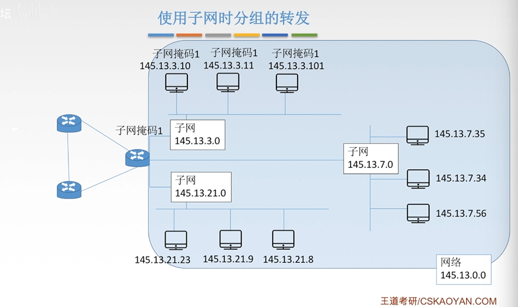

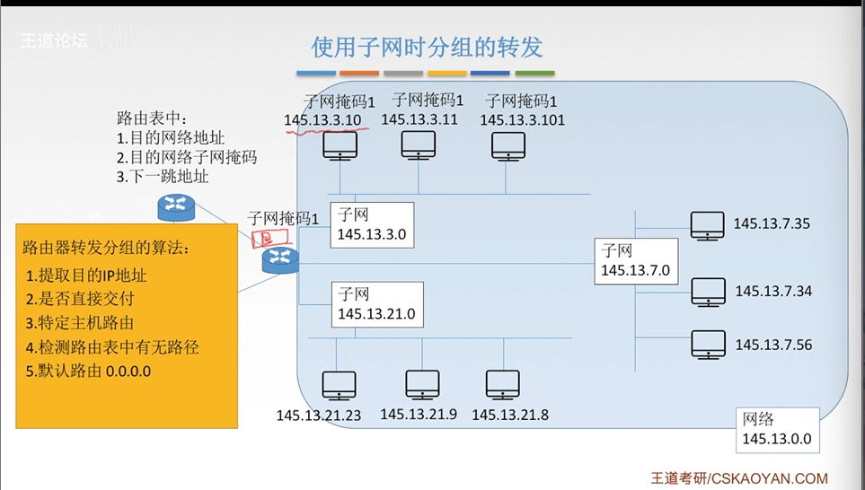

### 无分类编制 CIDR

无分类域间路由选择CIDR: 
1. 消除了传统的A,B,C类地址以及划分子网的概念
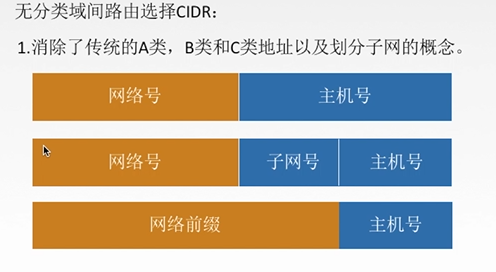
   
CIDR记法: IP地址后加上:"/",然后写上网络前缀(可以任意长度)的位数

e.g. 128.14.32.0/20

2. 融合子网地址与子网掩码,方便子网划分,CIRD把网络前缀都相同的连续的IP地址组成"CIDR地址块"

128..14.35.7/20是某个CIDR地址中的一个地址  

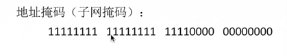

**构成超网**   
将多个子网举和成一个较大的子网,叫走构成超网,或路由聚合  

方法: 将网络前缀缩短

**最长前缀匹配**  

使用CIDR时,查找路由表可能得到几个匹配结果,应选择具有最长网络前缀的路由,前缀越长,地址块越小,路由越具体

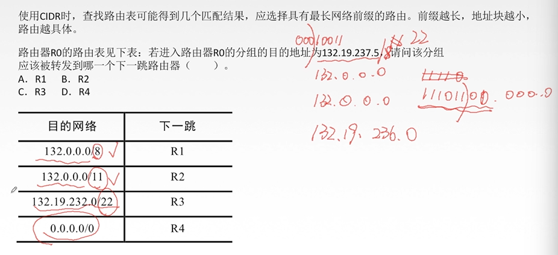

## ARP协议

### 发送数据的过程

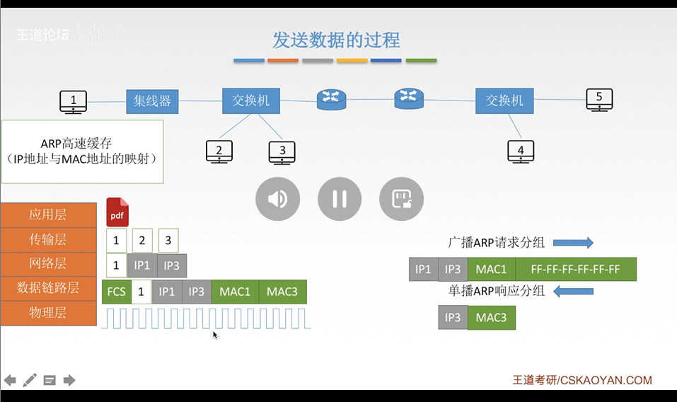

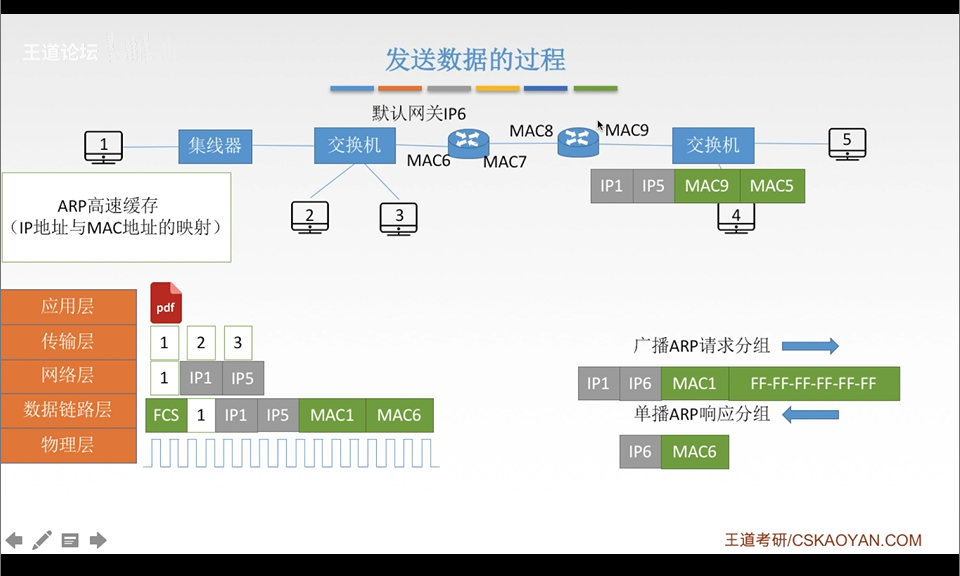

由于在实际网络的链路上传送数据帧时,最终必须使用MAC地址

ARP协议: 完成主机或者路由器IP地址到MAC地址的映射, `接剧吓一跳走哪的问题`

ARP协议使用过程:  
检查ARP告诉缓存,对应表项则写入MAC帧,没有则用目的MAC地址未FF-FF-FF-FF-FF-FF的帧封装并`广播ARP请求分组`**同一局域网中**所有主机都能收到
该请求,目的主机收到请求后会向源主机`单播一个ARP响应分组`源主机收到后将此映射写入**ARP缓存**(10-2-min更新一次)

ARP协议4中典型情况:
1. 主机A发给本网络上的主机B,用ARP找到主机B的硬件地址
2. 主机A发给另一个网络上的主机B:用ARP找到本网络上一个路由器(网关)的硬件地址
3. 路由器发个**本网络**的主机A,用ARP找到主机A的硬件地址
4. 路由器发个**另一个网络**的主机B: 用ARP找到本网络上的一个路由器的硬件地址

## DHCP协议  

**主机如何获得IP地址**

静态配置: IP地址,子网掩码,默认网关

动态配置:  

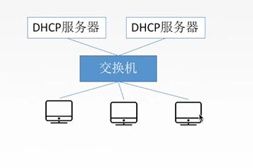

### DHCP协议

动态主机配置协议DHCP是应用层协议, 使用 客户/服务器 方式, 客户端和服务端通过**广播**的方式进行交互,基于UDP

DHCP提供即插即用联网的机制,主机可以从服务器动态获取IP地址,子网掩码,默认网关,DNS服务名称与IP地址,
允许地址重用,支持移动用户加入网络,支持在用地址续租

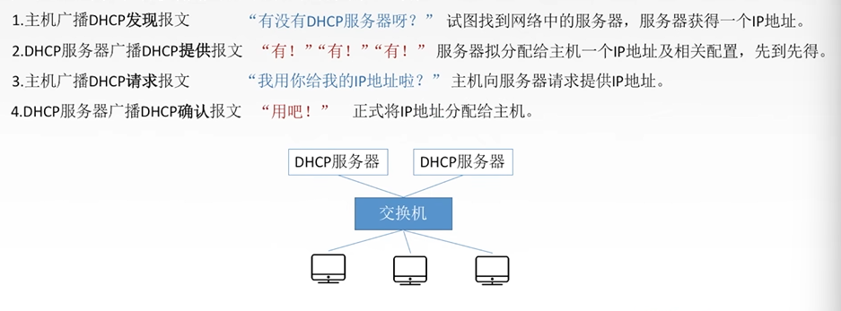

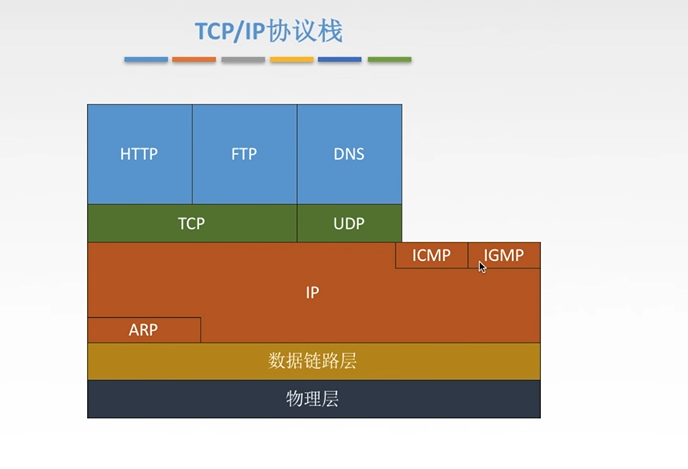

### ICMP协议

**网络控制报文协议ICMP**

ICMP协议支持主机或路由器:
    差错(或异常)报告  
    网络探询问

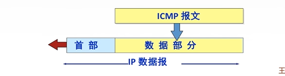

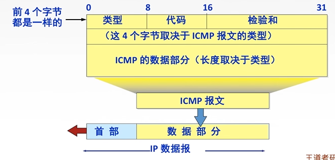

**ICMP差错报告报文(5种)**  

1. 终点不可达: 当路由器或主机不能交付数据报的时候就向源点发送终点不可达报文
   (无法交付)
2. 源点抑制: 当路由器或主机由于拥塞而丢弃数据报时,就向源点发送源点抑制报文,使源点知道应当把数据报的发送速率放慢,
   (拥塞丢失数据)

3. 时间超过: 当路由器收到生存时间TTL=0的数据报时,除丢弃该数据报外,还要向源点发送时间超过报文,当终点再预先规定的时间内不能收到一个数据报的全部
数据报片时,就把已收到的数据报片都丢弃,并向源点发送时间超过报文  
   

4. 参数问题: 当路由器或目的主机收到的数据报首部字段的值不正确时,就丢弃该数据报,并向源点发送参数问题报文,(首部字段有问题)

5. 改变路由(重定向): 路由器把改变路由报文发送给主机,让主机知道下次应该将数据报发送给另外的路由器(可通过更好的路由)

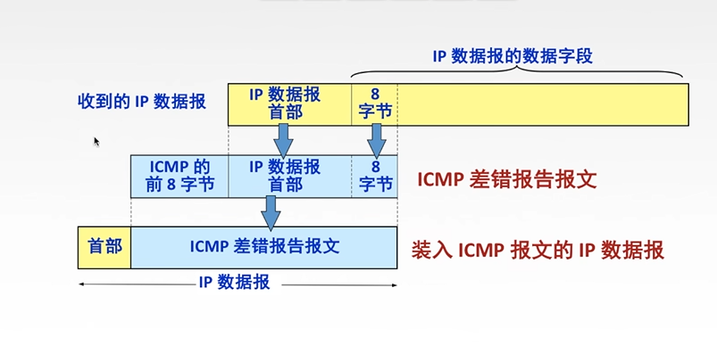

**不应该发送ICMP差错报文的情况**  
1. 对ICMP差错报告报文不再发送ICMP差错报告报文
2. 对第一个分片的数据报片所有后续数据报片都不发送ICMP差错报告报文
3. 对具有组播地址的数据保都不发送ICMP差错报告报文
4. 对具有特殊地址的数据报不发送ICMP差错报文

#### ICMP询问保卫呢

1. 回送请求和回答报文: 主机或路由器向特定的目的主机发送的询问,收到此报文的主机必须给源主机或路由器发送ICMP回送回答报文
   (测试目的栈是否可达以及了解其相关状态)
2. 时间戳请求和回到报文: 请求某个主机或路由器回答当前的日期和时间, 用来进行时钟同步和测量时间

3. 掩码地址请求和回答报文

4. 路由器询问和通告报文

#### ICMP的应用

Ping : 测试两个主机之间的连通性,使用了ICMP的回送请求和回答报文

Traceroute 跟踪一个分组从源点到终点的路径,使用了ICMP时间超过差错报告报文

## IPv6

### IPv6数据报格式

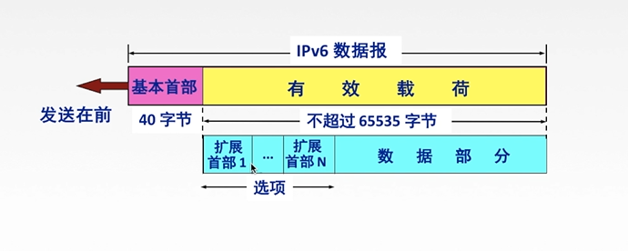

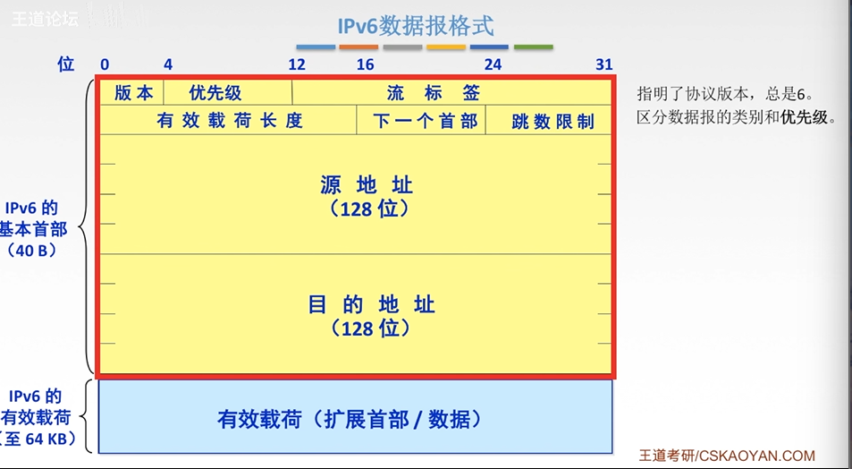

**IPv6和IPv4的区别**
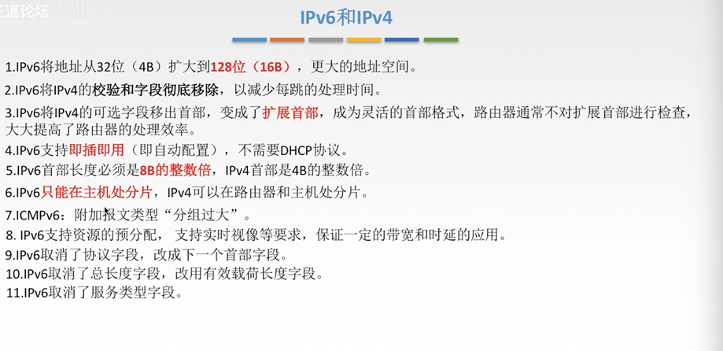

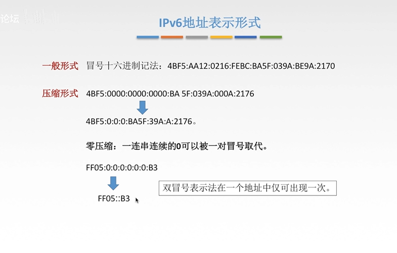

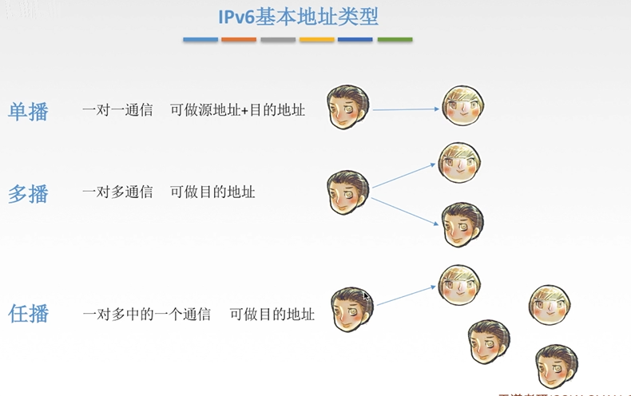

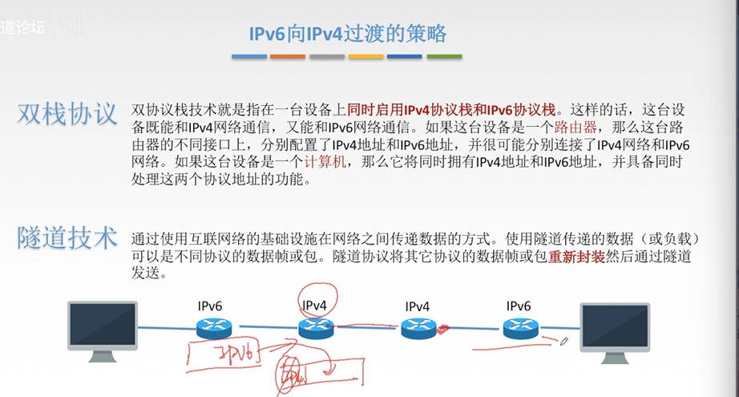

## 传输层

只有主机才有的层次

传输层的功能:
1. 传输层体哦国内进程和进程之间的逻辑通信
2. 复用和分用, 
3. 传输层对收到的报文进行差错检测
4. 传输层的两种协议

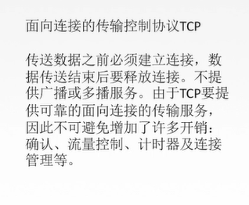

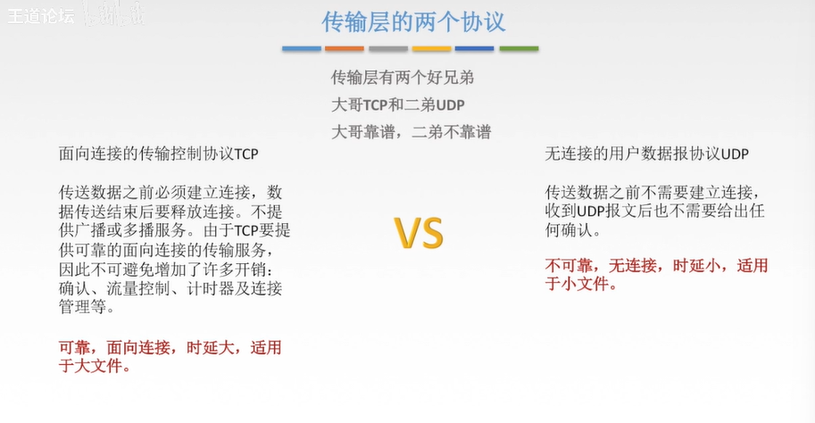

**传输层的寻址与端口**

复用: 应用层所有的应用进程可以通过传输层再传输到网络层  

分用:传输层从网络层收到数据后交付指明的应用进程

端口时传输层的SAP,标识主机中的应用进程 (逻辑端口/软件端口)  
端口号只有本地意义,再因特网中不同计算机的相同端口是没有联系的

端口号长度未16bit, 能表示65536个不同的端口号

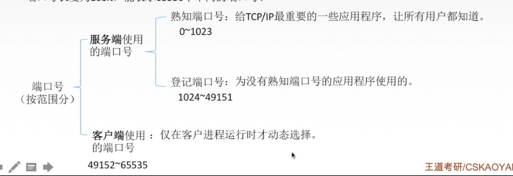

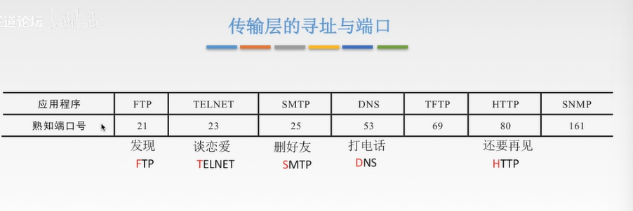

再网络中采用发送方和接收方的套接字组合来识别端点, 套接字唯一标识了网络中的一个主机和它上上面的一个进程

套接字Socket = (主机IP地址,端口号)

### UDP协议 

UDP只是再IP数据报服务之上增加了很少功能,即复用分用和差错检测功能

UDP的主要特点: 
1. UDP是无连接的,减少开销和发送数据之间的时延,
2. UDP使用最大努力交付,即不保证可靠交付
3. UDP是面向报文的,适合一次性传输少量数据的网络应用
4. UDP无拥塞控制,适合很多实时应用
5 .UDP首部开销小, 8B, TCP 208
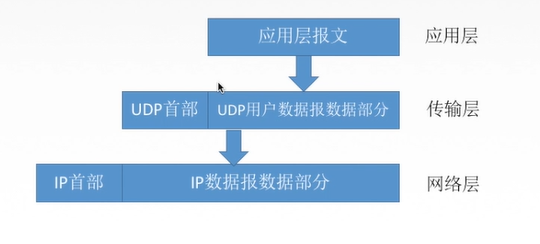

应用层给UDP多长报文,UDP就按照发送,即一次发一个完整报文

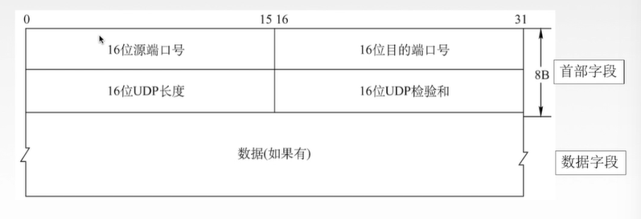

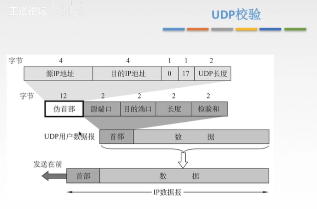

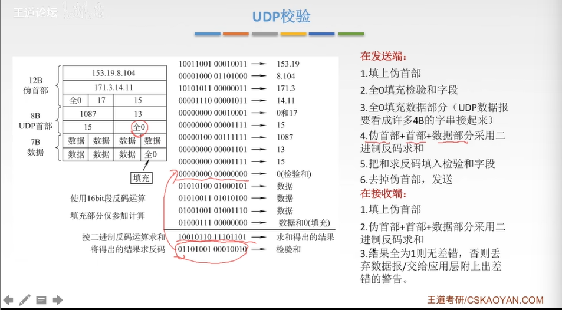

