### ip数据报格式
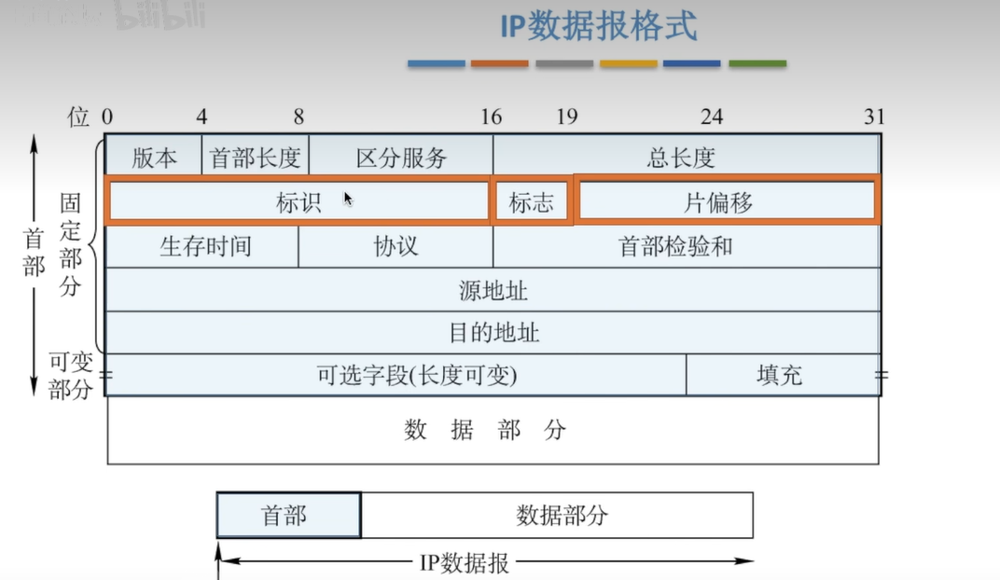

## IP地址

给网络中的主机的标识符;方便寻址与数据通信,数据共享

### 分类的IP地址

IP地址:全世界唯一的32位/4字节表示符,标识路由器主机的接口

IP地址:: = {<网络号>,<主机号>}
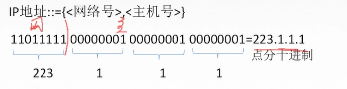

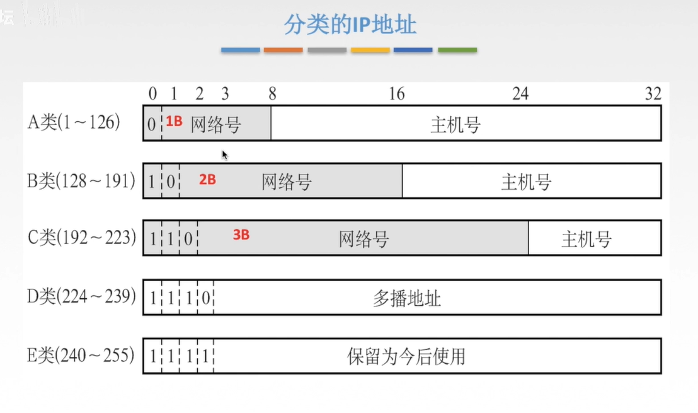

为什么分类? 各种网络差异比较大,不同的网络主机数量不同,分类可以满足不同用户的要求

网络号全0表示本网络下的主机  

如果网络号和主机号全0表示自己, 只能作为IP地址的源地址,不能作为IP分组的目的地址

网络号和主机号全1 : 255.255.255.255 表示本网络广播地址 如果向全一发送一段数据报,就相当于发送给本网络所有主机一段数据报

网络号是特定值,主机号是全0, 表示的是一个网络

网络号是特定值, 主机号是全1 表示直接广播地址对特定网络上的所有主机进行广播,可与作为IP分组的目的地址,不能作为IP分组的源地址

网络号 127 主机号任何数(非全0/1) 有哦那个与本地软件环回测试, 称为环回地址

**私有IP地址**  
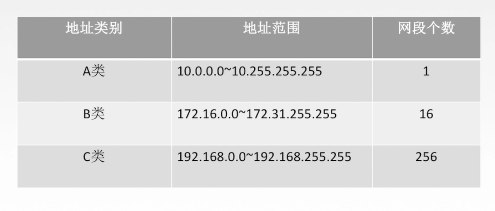

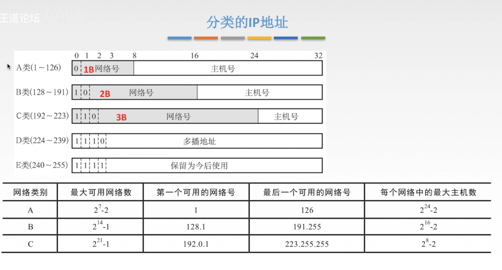

### 网络地址转换 NAT

私有IP地址(用于本地网络,专用网络中,在互联网中无法识别)

路由器对目的地址是私有IP地址的数据报一律不进行转发

网络地址转换NAT(Network Address Translation): 在 专用网 连接到 因特网 的路由上安装NAT软件, 安装了NAT软件的路由叫NAT路由题,它至少有一个有效的外部全球IP地址

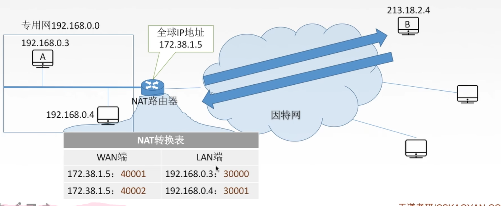

### 子网划分

**分类的IP地址的弱点:**
1. IP地址控件的利用率有时很低
2. 两级IP地址不够灵活,

思想:  
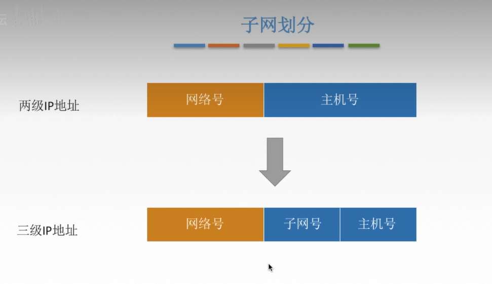

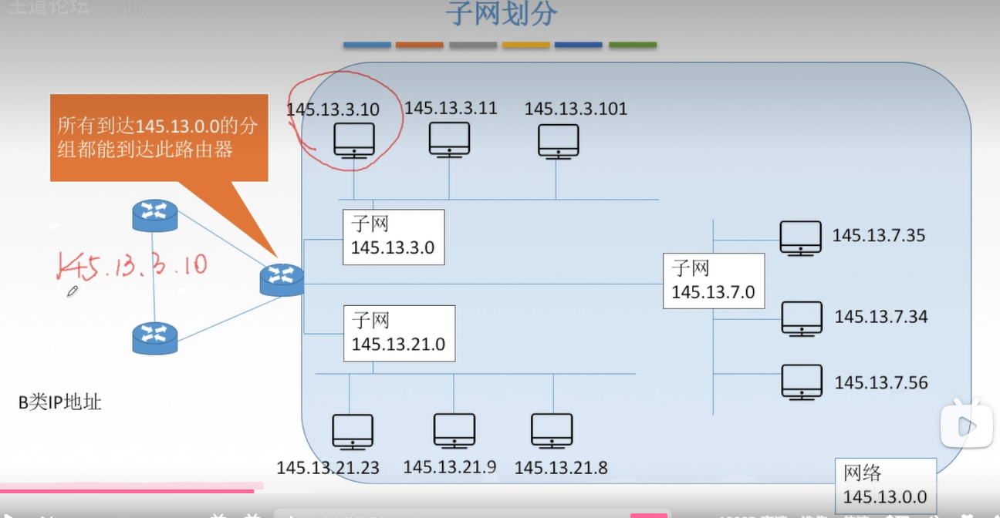

### 子网掩码

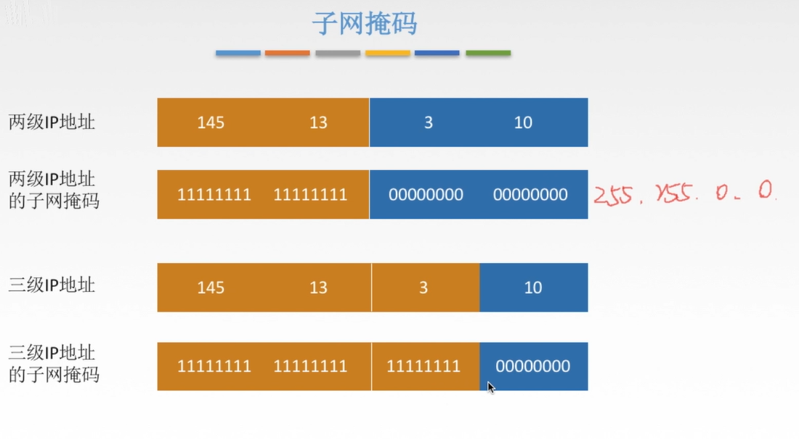

子网掩码与IP地址逐位相与,就得到子网网络地址
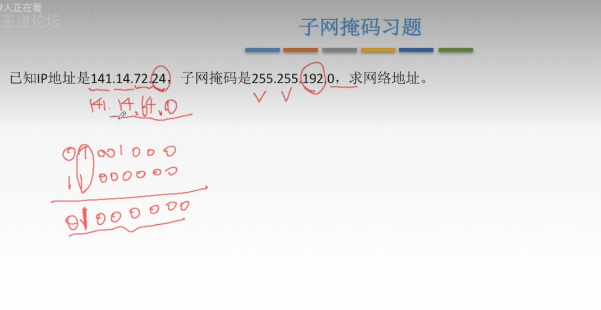
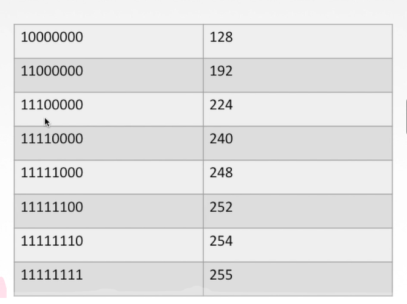