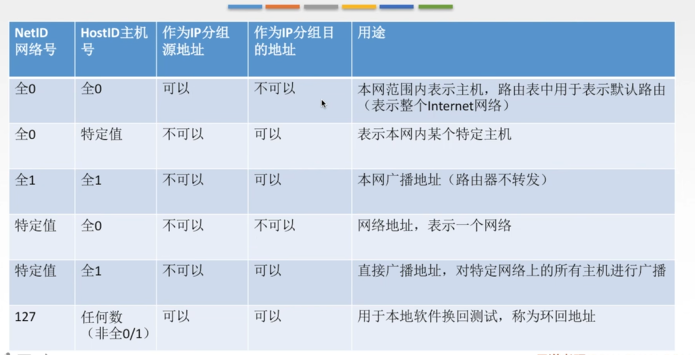
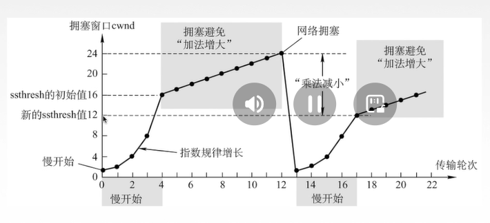
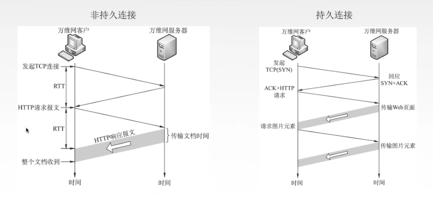

### ip数据报格式

## IP地址

给网络中的主机的标识符;方便寻址与数据通信,数据共享

### 分类的IP地址

IP地址:全世界唯一的32位/4字节表示符,标识路由器主机的接口

IP地址:: = {<网络号>,<主机号>}

为什么分类? 各种网络差异比较大,不同的网络主机数量不同,分类可以满足不同用户的要求

网络号全0表示本网络下的主机  

如果网络号和主机号全0表示自己, 只能作为IP地址的源地址,不能作为IP分组的目的地址

网络号和主机号全1 : 255.255.255.255 表示本网络广播地址 如果向全一发送一段数据报,就相当于发送给本网络所有主机一段数据报

网络号是特定值,主机号是全0, 表示的是一个网络

网络号是特定值, 主机号是全1 表示直接广播地址对特定网络上的所有主机进行广播,可与作为IP分组的目的地址,不能作为IP分组的源地址

网络号 127 主机号任何数(非全0/1) 有哦那个与本地软件环回测试, 称为环回地址

**私有IP地址**  

### 网络地址转换 NAT

私有IP地址(用于本地网络,专用网络中,在互联网中无法识别)

路由器对目的地址是私有IP地址的数据报一律不进行转发

网络地址转换NAT(Network Address Translation): 在 专用网 连接到 因特网 的路由上安装NAT软件, 安装了NAT软件的路由叫NAT路由题,它至少有一个有效的外部全球IP地址

### 子网划分

**分类的IP地址的弱点:**
1. IP地址控件的利用率有时很低
2. 两级IP地址不够灵活,

思想:  

### 子网掩码

子网掩码与IP地址逐位相与,就得到子网网络地址

### 无分类编制 CIDR

无分类域间路由选择CIDR: 
1. 消除了传统的A,B,C类地址以及划分子网的概念

   
CIDR记法: IP地址后加上:"/",然后写上网络前缀(可以任意长度)的位数

e.g. 128.14.32.0/20

2. 融合子网地址与子网掩码,方便子网划分,CIRD把网络前缀都相同的连续的IP地址组成"CIDR地址块"

128..14.35.7/20是某个CIDR地址中的一个地址  

**构成超网**   
将多个子网举和成一个较大的子网,叫走构成超网,或路由聚合  

方法: 将网络前缀缩短

**最长前缀匹配**  

使用CIDR时,查找路由表可能得到几个匹配结果,应选择具有最长网络前缀的路由,前缀越长,地址块越小,路由越具体

## ARP协议

### 发送数据的过程

由于在实际网络的链路上传送数据帧时,最终必须使用MAC地址

ARP协议: 完成主机或者路由器IP地址到MAC地址的映射, `接剧吓一跳走哪的问题`

ARP协议使用过程:  
检查ARP告诉缓存,对应表项则写入MAC帧,没有则用目的MAC地址未FF-FF-FF-FF-FF-FF的帧封装并`广播ARP请求分组`**同一局域网中**所有主机都能收到
该请求,目的主机收到请求后会向源主机`单播一个ARP响应分组`源主机收到后将此映射写入**ARP缓存**(10-2-min更新一次)

ARP协议4中典型情况:
1. 主机A发给本网络上的主机B,用ARP找到主机B的硬件地址
2. 主机A发给另一个网络上的主机B:用ARP找到本网络上一个路由器(网关)的硬件地址
3. 路由器发个**本网络**的主机A,用ARP找到主机A的硬件地址
4. 路由器发个**另一个网络**的主机B: 用ARP找到本网络上的一个路由器的硬件地址

## DHCP协议  

**主机如何获得IP地址**

静态配置: IP地址,子网掩码,默认网关

动态配置:  

### DHCP协议

动态主机配置协议DHCP是应用层协议, 使用 客户/服务器 方式, 客户端和服务端通过**广播**的方式进行交互,基于UDP

DHCP提供即插即用联网的机制,主机可以从服务器动态获取IP地址,子网掩码,默认网关,DNS服务名称与IP地址,
允许地址重用,支持移动用户加入网络,支持在用地址续租

### ICMP协议

**网络控制报文协议ICMP**

ICMP协议支持主机或路由器:
    差错(或异常)报告  
    网络探询问

**ICMP差错报告报文(5种)**  

1. 终点不可达: 当路由器或主机不能交付数据报的时候就向源点发送终点不可达报文
   (无法交付)
2. 源点抑制: 当路由器或主机由于拥塞而丢弃数据报时,就向源点发送源点抑制报文,使源点知道应当把数据报的发送速率放慢,
   (拥塞丢失数据)

3. 时间超过: 当路由器收到生存时间TTL=0的数据报时,除丢弃该数据报外,还要向源点发送时间超过报文,当终点再预先规定的时间内不能收到一个数据报的全部
数据报片时,就把已收到的数据报片都丢弃,并向源点发送时间超过报文  
   

4. 参数问题: 当路由器或目的主机收到的数据报首部字段的值不正确时,就丢弃该数据报,并向源点发送参数问题报文,(首部字段有问题)

5. 改变路由(重定向): 路由器把改变路由报文发送给主机,让主机知道下次应该将数据报发送给另外的路由器(可通过更好的路由)

**不应该发送ICMP差错报文的情况**  
1. 对ICMP差错报告报文不再发送ICMP差错报告报文
2. 对第一个分片的数据报片所有后续数据报片都不发送ICMP差错报告报文
3. 对具有组播地址的数据保都不发送ICMP差错报告报文
4. 对具有特殊地址的数据报不发送ICMP差错报文

#### ICMP询问保卫呢

1. 回送请求和回答报文: 主机或路由器向特定的目的主机发送的询问,收到此报文的主机必须给源主机或路由器发送ICMP回送回答报文
   (测试目的栈是否可达以及了解其相关状态)
2. 时间戳请求和回到报文: 请求某个主机或路由器回答当前的日期和时间, 用来进行时钟同步和测量时间

3. 掩码地址请求和回答报文

4. 路由器询问和通告报文

#### ICMP的应用

Ping : 测试两个主机之间的连通性,使用了ICMP的回送请求和回答报文

Traceroute 跟踪一个分组从源点到终点的路径,使用了ICMP时间超过差错报告报文

## IPv6

### IPv6数据报格式

**IPv6和IPv4的区别**

## 传输层

只有主机才有的层次

传输层的功能:
1. 传输层体哦国内进程和进程之间的逻辑通信
2. 复用和分用, 
3. 传输层对收到的报文进行差错检测
4. 传输层的两种协议

**传输层的寻址与端口**

复用: 应用层所有的应用进程可以通过传输层再传输到网络层  

分用:传输层从网络层收到数据后交付指明的应用进程

端口时传输层的SAP,标识主机中的应用进程 (逻辑端口/软件端口)  
端口号只有本地意义,再因特网中不同计算机的相同端口是没有联系的

端口号长度未16bit, 能表示65536个不同的端口号

再网络中采用发送方和接收方的套接字组合来识别端点, 套接字唯一标识了网络中的一个主机和它上上面的一个进程

套接字Socket = (主机IP地址,端口号)

### UDP协议 

UDP只是再IP数据报服务之上增加了很少功能,即复用分用和差错检测功能

UDP的主要特点: 
1. UDP是无连接的,减少开销和发送数据之间的时延,
2. UDP使用最大努力交付,即不保证可靠交付
3. UDP是面向报文的,适合一次性传输少量数据的网络应用
4. UDP无拥塞控制,适合很多实时应用
5 .UDP首部开销小, 8B, TCP 208

应用层给UDP多长报文,UDP就按照发送,即一次发一个完整报文

### TCP协议

#### TCP协议的特点

1. TCP是面向想连接(虚连接)的传输层协议
2. 每一条TCP连接只能由两个端点,每一条TCP只能是点对点的
3. TCP提供可靠支付的服务,无差错,不丢失,不重复,按序到达,
4 TCP提供全双工通信
   发送缓存: 准备发送的数据&以发送但尚未收到确认的数据
   接收缓存: 按序到达但尚未被接受应用程序读取的数据&不按序到达的数据
   
5. TCP面向字节流
    TCP把应用程序交下来的数据看成仅仅是一连串的无结构的字节流
        流:流入到进程或从进程流出的字节序列
   
#### TCP报文段首部格式

窗口: 指的实际发送报文的一方的接受窗口,即现在允许对方发送的数据量

检验和: 检验首部+数据,检验时要加上12b伪首部,第四条个字段为6

紧急指针: URG=1 时才有意义,指出本报文段中紧急数据的字节数

选项: 最大报文段长度MSS,窗口扩大,时间戳,选择确定...

#### TCP连接管理

TCP连接的建立采用**客户服务器方式**,主动发起连接建立的应用进程叫做客户,
而被动等待连接建立的应用进程叫服务器  

### TCP的连接建立

### SYN洪泛攻击

SYN洪泛攻击发送在OSI第四层,这种方式利用TCP协议的特性,就是第三次握手; 攻击者发送TCP SYN;
SYN时TCP三次握手中的第一个数据包,而当服务器返回ACK后,该攻击者就不对其进行再确认,而那个TCP连接
就处于挂起状态,也就是所谓的半连接状态,服务器收到不到再确认的话,还会重复发送ACK给攻击者,
这样更加会浪费服务器资源,攻击者就对服务器发送大量的这种TCP连接,由于每一个都没法完成三次握手,
所以再服务器上,这些TCP连接会因为挂起状态而消耗CPU和内存,最后服务器可能四级,就无法为正常用户提供服务了

### TCP的连接释放

### TCP可靠传输

重传: TCP再发送方**规定的时就按**内没有收到确认就要重传以发送的报文段;(超时重传)

TCP采用自适应算法,动态改变重传时间RTTs(加权平均往返时间)

冗余ACK(冗余确认)  
每当比期望序号大的失序报文段到达时,发送一个冗余ACK,置命下一个期待字节的序号

### TCP流量控制

流量控制: 让发送方慢点,要让接收方来得及接受

TCP利用**滑动窗口**机制实现流量控制;

再通信过程中,接收方根据自己**接收缓存的大小,**动态地调整发送方的发送窗口大小,即接收窗口rwnd(接收方设置确认报文段的窗口字段来将rwnd通知给发送方),
发送方的**发送串口取接收窗口rwnd和拥塞窗口cwnd的最小值**

### TCP拥塞控制

出现拥塞的条件:

对资源需求的总和 > 可用资源

网络中有许多资源同时呈现供应不足 -> 网络性能变坏 -> 网络吞吐量将随输入符合增大而下降

拥塞控制: 防止过多的数据注入网络中, 全局性

### 拥塞控制四种算法

慢开始 拥塞避免 快重传  快恢复

#### 慢开始和拥塞避免

#### 快重传和快恢复

## 应用层

### 应用层概述

应用层对应用程序的通信提供服务

应用层协议定义:
    应用进程交换的报文类型,请求还是响应  
    各种报文类型的语法,如报文的各种字段及其详细描述,  
    字段的语义,即包含在字段中的信息的含义,  
    进程何时,如何发送报文,以及对报文进行响应的规则  

应用层的功能:  
    文件传输,访问和管理  
    电子邮件  
    虚拟终端  
    查询服务和远程作业登录

应用层的重要协议:
FTP,  
SMTP,  
POP3  
HTTP  
DNS  
    

客户/服务器(c/s)模型  
服务器: 提供计算服务的设备  
    1. 永久提供服务
    2. 永久性访问地址/域名

客户机: 请求计算服务的主机
    1. 与服务器通信,使用服务器提供的服务
    2. 间接性接入网络
    3. 可能使用动态IP地址
    4. 不与其他客户机直接通信  

P2P模型:  

不存在永远在线的服务器,每个主机即可以提供服务,也可以请求服务  
任意端系统/节点之间可以直接通讯  
节点简写性接入网络  
节点可能改变IP地址  
可扩展性好  
网络健壮性强  

DNS系统:  

域名服务器: 
根域名服务器  
顶级域名服务器  
权限域名服务器  
本地域名服务器: 顶一个主机发出DNS查询请求时,这个查询请求报文就发给本地域名服务器

### 域名解析过程

#### 递归查询  迭代查询

### 文件传送协议

文件传送协议FTP(File Transfer Protocol)  
提供不同种类主机系统(硬,软件体系都可以不同)之间的文件传输能力  
简单文件传送协议TFTP(Trivial File Transfer Protocol)
 
#### FTP服务器和用户端

FTP时基于客户/服务器(C/S)的协议  
用户通过一个客户机程序连接至远程计算机上运行的服务器程序  
依照FTP协议提供服务,进行文件传送的计算机就是FTP服务器  
连接FTP服务器,遵循FTP协议与服务器传送文件的电脑就是FTP客户端  

FTP使用TCP实现可靠传输  

#### FTP工作原理

控制连接始终保持  

数据连接保持一会  

是否使用TCP20端口进行数据连接与传输模式有关  

主动方式使用TCP20端口

被动方式有服务器和客户端自行协商决定 (端口>1024)  

FTP传输模式:
1. 文本模式: ASCLL模式,以文本序列传输数据
2. 二进制模式: Binary模式,以二进制序列传输数据

### 电子邮件  

#### 电子邮件系统概述_组成结构

SMTP的缺点:
1. SMTP蹦年传送可执行文件或者其他二进制对象
2. SMTP仅限于传送7为ASCll吗,不能传送其他非英语国家的文字
3. SMTP服务器会拒绝超过一定长度的邮件

####  MIME(通用因特网邮件扩充)  

使电子邮件系统可以支持声音,图像,视频,多种国家语言等

#### 邮局协议POP3

TCP连接 端口号110 C/S

#### 基于万维网的电子邮件  

### 万维网 

万维网WWW是一个大规模的,联机式的信息储藏所/资料空间,式无数个网络站点和网页的集合

### 超文本传输协议

#### HTTP协议的特点

HTTP协议是无状态的

但是在实际工作中,一些万维网站点常常希望识别用户

cookie是存储在用户主机的文本文件,记录一段时间内某个用户的访问记录

HTTP采用TCP作为运输层协议,但**HTTP协议本身是无连接的**(通信双方在交换HTTP报文之前不需要线建立HTTP连接)

#### HTTP协议的连接方式

#### HTTP请求报文

HTTP报文是面向文本的,因此在报文中每一个字段都是一些ASCll码串

#### HTTP响应报文
 

#### 报文结构

