##  前端面试计算机网络部分总结
_____

本笔记由作者在复习八股文之计算机网络部分的相关的一些总结, 如果有什么错误的地方或者有什么相关的建议欢迎联系我

这份笔记借鉴了很多网上的文章, 如果有雷同或者相似的地方, 不用怀疑, 那就是搬得, 如果你是当中一些文章得作者,
如果觉得这种行为不恰当, 请与我联系, 收到消息后我会尽快处理

邮箱: zwn_fobj@foxmail.com

QQ: 1879154660  
QQ昵称: 只为你乱了浮生

感谢各位观看者的支持, 希望能对正在面临面试的你有所帮助,
____

<!--TOC-->
- [前端面试计算机网络部分总结](#前端面试计算机网络部分总结)
- [1. osi七层模型](#1-osi七层模型)
- [2. HTTP协议是哪层通信协议](#2-http协议是哪层通信协议)
- [3. HTTP标头(header)](#3-http标头header)
- [4.content-type的具体四种类型(POST提交数据方式)](#4content-type的具体四种类型post提交数据方式)
- [5. https和http的区别](#5-https和http的区别)
- [6. 对称加密](#6-对称加密)
- [7. 非对称加密](#7-非对称加密)
- [8. 数字证书](#8-数字证书)
- [9. https的加密原理(工作机制)](#9-https的加密原理工作机制)

<!--/TOC-->

____

## 1. osi七层模型

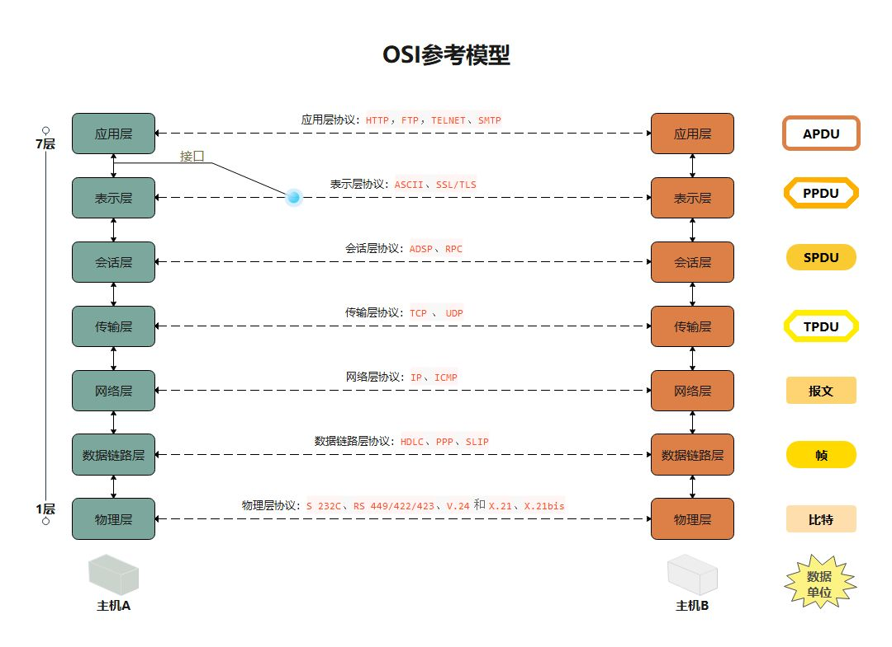

- **物理层:**   
  解决两个硬件之间怎么通信的问题,常见的物理媒介由光纤,电缆,中继器等;它主要定义物理设备标准,如网线的接口类型,光纤的接口类型,各种传输介质的传输速率等   
  它的主要作用是传输比特流(就是由1,0转换为电流强弱来进行传输,到达目的地后再转化为1,0,也就是我们常说的数模转换与模数转换)这一层的数据叫做比特

- **数据链路层:**  
  再计算机网络中由于各个干扰的存在,物理链路是不可靠的;该层的主要功能是:通过各种控制协议,将有差错的物理信道变为无差错的,能可靠传输数据帧的数据链路  
  它的具体工作是接收来自物理层的位流形式的数据,并封装成帧,传送到上一层;同样,也将来自上层的数据帧,拆装为位流式的数据转发到物理层,这一层的数据叫做帧

- **网络层:**  
  计算机网络中如果有堕胎计算机,怎么找到要发的那台?如果中间有多个节点,怎么选择路径?这就是路由该做的事  
  该层的主要任务就是:通过路由选择算法,为报文(该层的数据单位,由上一层数据打包而来)通过通信子网选择最适当的路径,这一层的定义是IP地址,通过IP地址寻址,所以产生了IP协议  


- **传输层:**  
  当发送大量数据时,很可能会出现先丢包的状况,另一台电脑要告诉是否完整接收到全部的包,如果缺了,就告诉丢了哪些包,然后再重发一次,直至全部接收为止,  
  简单来说,传输层的主要功能就是: 监控数据传输服务的质量,保证报文的正确传输 

- **会话层:**  
  虽然已经可以实现给正确的计算机发送正确的封装过后的信息了,但我们总不可能每次都要调用传输层协议去打包,然后再嗲用IP协议去找路由,所以我们要建立一个自动收发包,自动自动寻址的功能,于式会话层出现了:它的作用就是建立和管理应用程序之间的通信  

- **表示层:**  
  表示层负责数据格式的转换,将应用处理的信息转换为适合网络传输的格式,或者将来下一层的数据转换为上层能处理的格式

- **应用层:**    
 应用层是计算机用户,以各种应用程序和网络之间的接口,其功能是直接项用户体提供服务,完成用户希望再网络上完成的各种工作 

- TCP/IP 4层模型,5层模型和OSI七层模型的差别

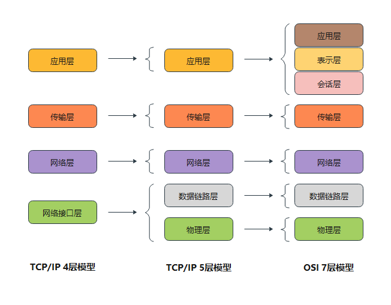

简单记一下他们的作用:  

|发送端| |接收端|
|:---:|:---:|:---:|
| 人做好信息往下发|**应用层**|看信息 | 
|翻译一下|**表示层**| 翻译一下 |
|打包|**会话层**| 看看包送全了没,没全就叫送缺的那个 |
| 把包发给下层|**传输层**|把包发给下层|
|给包贴IP地址的标签|**网络层**|报文--整理成包,看看送对了没|
|帧：查表ip转mac，然后转成电信号|**数据链路层**|信号: 整理成帧,看看不全送上去|
|定义好各种信号的意思，线路和插口的格式，发送吧|**物理层**|收到信号，送上去|

## 2. HTTP协议是哪层通信协议

HTTP协议处于TCP/IP协议体系的应用层, 它与FTP DNS等协议工作在同一层
  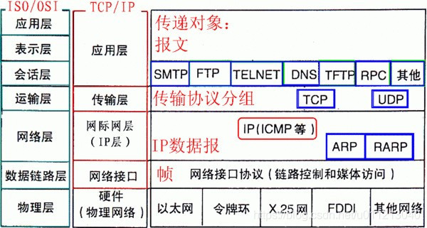

应用层(Application Layer) 包含所有的高层协议,包括: 

1. 虚拟终端协议（TELNET，TELecommunications NETwork）；
2. 文件传输协议（FTP，File Transfer Protocol）；
3. 电子邮件传输协议（SMTP，Simple Mail Transfer Protocol）；
4. 域名服务（DNS，Domain Name Service）；
5. 网上新闻传输协议（NNTP，Net News Transfer Protocol）；超文本5. 传送协议（HTTP，HyperText Transfer Protocol）。


HTTP协议被用于WWW服务器传输超文本到本地浏览器的传输    
它可以使浏览器更加高效,使网络传输减少;它不仅保证计算机正确快速地传输超文本文档,还确定传输文档中的哪一部分,以及哪部分内容首先显示等

在TCP/IP协议的应用层中包含了大量人们普遍需要的协议  

不同的我呢见系统又不同的文件命名原则;此外,应用层还有虚拟终端,电子邮件和新闻组等各种通用和专用的功能
  
## 3. HTTP标头(header)  

**HTTP标头**(header)是HTTP请求和响应的核心,它承载了关于客户端浏览器,请求页面,服务器等相关的信息  

当你在浏览器地址栏里键入一个URL,你的浏览器将会将类似如下的HTTP请求:
```
GET /tutorials/other/top-20-mysql-best-practices/ HTTP/1.1
Host: net.tutsplus.comUser-Agent: Mozilla/5.0 (Windows; U; Windows NT 6.1; en-US; rv:1.9.1.5) Gecko/20091102 Firefox/3.5.5 (.NET CLR 3.5.30729)
Accept: text/html,application/xhtml+xml,application/xml;q=0.9,*/*;q=0.8Accept-Language: en-us,en;q=0.5
Accept-Encoding: gzip,deflate
Accept-Charset: ISO-8859-1,utf-8;q=0.7,*;q=0.7
Keep-Alive: 300
Connection: keep-alive
Cookie: PHPSESSID=r2t5uvjq435r4q7ib3vtdjq120Pragma: no-cacheCache-Control: no-cache
```
第一行被称为"Request Line"它描述的是这个请求的基本信息,剩下的就是HTTP headers了.

请求完之后,你的浏览器可能会收到如下HTTP响应:
```
HTTP/1.x 200 OK
Transfer-Encoding: chunkedDate: Sat, 28 Nov 2009 04:36:25 
GMTServer: LiteSpeedConnection: closeX-Powered-By: W3 Total Cache/0.8Pragma: publicExpires: Sat, 28 Nov 2009 05:36:25 GMTEtag: "pub1259380237;gz"Cache-Control: max-age=3600, public
Content-Type: text/html; charset=UTF-8
Last-Modified: Sat, 28 Nov 2009 03:50:37
 GMTX-Pingback: http://net.tutsplus.com/xmlrpc.php
Content-Encoding: gzipVary:
 Accept-Encoding, 
 Cookie, User-Agent<!-- ... rest of the html ... 
```
第一行被称为"State Line", 它之后就是http headers, 空行完了就开始输出内容了

**HTTP header 常用属性**  

1. Host:  
   请求报头域域主要用于指定被请求资源的internet主机和端口号,它通常从HTTP URL中提取出来的,例如我们在浏览器输入: https://www.baidu.com,浏览器发送的请求消息中,就会包含Host请求报头域;

   `HOST: www.baidu.com(此处使用缺省端口443)`

2. Referer  
   当浏览器项web服务器发送请求的时候,一般会带上Referer,告诉服务器该请求从哪个页面链接过来的,服务器借此可以获得一些信息用于处理,比如从我的主页链接到另一台别人的网站那里,它的服务器就能够从HTTP Referer中统计出每天有多少用户带年纪我主页上的链接访问它的网站

3. User-Agent  
   - 这个对于爬虫比较重要, 因为一般都需要加该属性,否则稍微处理过的网站都无法爬取  
  告诉HTTP服务器,客户端使用的操作系统和浏览器的名称以及版本  
  我们上网登录论坛的时候,往往会看到一些欢迎信息,其中列出了你的操作系统的名称和版本, 实际上,服务器应用程序就是从User-Agent这个请求报头域中获取到这些信息,User-Agent请求报头域允许客户端将它的操作系统,浏览器和它的属性告诉服务器 

例如: 
```
User-Agent: Mozilla/4.0 (compatible; MSIE 8.0; Windows NT 5.1; Trident/4.0; CIBA; .NET CLR 2.0.50727; .NET CLR 3.0.4506.2152; .NET CLR 3.5.30729; .NET4.0C; InfoPath.2; .NET4.0E)

1. 应用程序版本“Mozilla/4.0”表示：你使用Maxthon 2.0 浏览器使用 IE8 内核；  
2. 版本标识“zhiMSIE 8.0”
3. 平台自身的dao识别信息“Windows NT 5.1”表示“操作系统为:Windows XP”
Trident内核版本“Trident/4.0”，浏览器的一种内核，还有一种就是WebKit内核
```
4. Conent-type  
   表示后面的文档属于什么MIME类型,  
   常间的媒体格式类型如下:

```
text/html ： HTML格式
text/plain ：纯文本格式
text/xml ： XML格式
image/gif ：gif图片格式
image/jpeg ：jpg图片格式
image/png：png图片格式
以application开头的媒体格式类型：

application/xhtml+xml ：XHTML格式
application/xml ： XML数据格式
application/atom+xml ：Atom XML聚合格式
application/json ： JSON数据格式
application/pdf ：pdf格式
application/msword ： Word文档格式
application/octet-stream ： 二进制流数据（如常见的文件下载）
application/x-www-form-urlencoded ： 中默认的encType，form表单数据被编码为key/value格式发送到服务器（表单默认的提交数据的格式）
另外一种常见的媒体格式是上传文件之时使用的：

multipart/form-data ： 需要在表单中进行文件上传时，就需要使用该格式。
```

5. Accept-Language  
   Accept-Language:指出浏览器可以接受的语言类型如en或en-us指英语,zh或者zh-cn指中文  

6. Cookie  
   Cookie:浏览器用这个属性向服务器发送Cookie,Cookie是在浏览器中寄存的小型数据题,它可以记载和服务器相关的用户信息,也可以来实现会话功能

7. headers常见的安全攻击

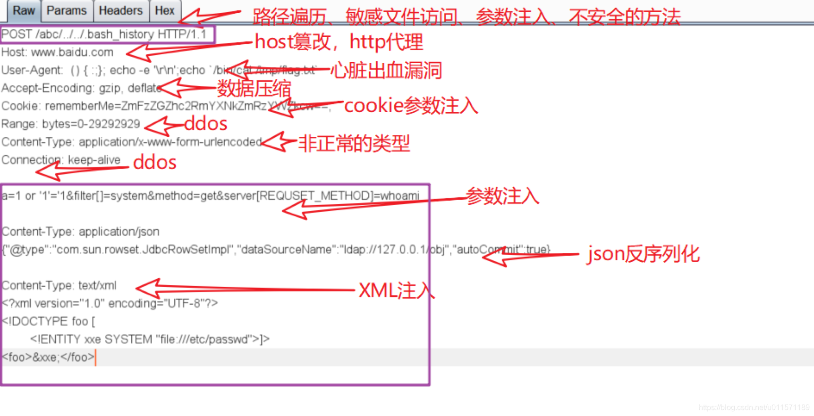


## 4.content-type的具体四种类型(POST提交数据方式)

content-type是http的实体首部字段,用户说明请求或返回的消息主题是用何种方式编码,在request header 和response header里都存在

**几个常用的类型:**  

1. application/x-www-form-urlencoded  
   1) 浏览器的原生form表单
   2) 提交的数据按照`key1=val1&key2=val2`的方式进行编码,key和val都进行了URL转码
2. multipart/form-data  
   常见的PST数据提交的方式,我们使用表单上传文件时,必须让form的enctype等于这个值,

```HTML
<form action="/" method="post" enctype="multipart/form-data">
  <input type="text" name="description" value="some text">
  <input type="file" name="myFile">
  <button type="submit">Submit</button>
</form>
```

请求头看器来像这样

```
POST /foo HTTP/1.1
Content-Length: 68137
Content-Type: multipart/form-data; boundary=---------------------------974767299852498929531610575

---------------------------974767299852498929531610575
Content-Disposition: form-data; name="description"

some text
---------------------------974767299852498929531610575
Content-Disposition: form-data; name="myFile"; filename="foo.txt"
Content-Type: text/plain

(content of the uploaded file foo.txt)
---------------------------974767299852498929531610575--
```
对上面的格式进行一下分析: 

> 首先生成了一个boundary用于分割不同的字段,为了避免于正文内容重复,
>  boundary很长很复杂  
> 然后Conent-Type里指明了数据是3以multipart/form-data来转码,本次
>  请求的boundary是什么内容   
> 消息主题里按照字段个数又分为多个结构类似的部分,每部分都是以
> `--boundart`开始,紧接着是内容的描述信息,然后是回车,最后是字段具体
> 内容(文本或二进制)  
> 如果传输的是文件,还要包含文件名和文件类型信息,消息主题最后以
> `--boundary--`标识结束.

3. application/json  
   消息主体是序列化后的JSON字符串,这个类型越来越被大家所使用

```
POST [http://www.example.com](http://www.example.com) HTTP/1.1 
Content-Type: application/json;charset=utf-8 

{"title":"test","sub":[1,2,3]}
```
  这种方案,可以方便的提交复杂的结构话数据,特别适合RESTful的几口,特别适合 RESTful 的接口。各大抓包工具如 Chrome 自带的开发者工具、Firebug、Fiddler，都会以树形结构展示 JSON 数据，非常友好。


4. text/xml  
是一种使用HTTP作为传输协议,XML作为编码方式的远程调用规范
```
POST [http://www.example.com](http://www.example.com) HTTP/1.1 
Content-Type: text/xml 
<!--?xml version="1.0"?--> 
<methodcall> 
    <methodname>examples.getStateName</methodname> 
    <params> 
        <param> 
            <value><i4>41</i4></value> 
    </params> 
</methodcall> 
```


## 5. https和http的区别

**HTTP协议:**  

HTTP协议，是一种使用明文数据传输的网络协议。一直以来HTTP协议都是最主流的网页协议，不提供任何方式的数据加密，如果攻击者截取了Web浏览器和网站服务器之间的传输报文，就可以直接读懂其中的信息。HTTP协议的明文传输会让用户存在非常大的安全隐患。

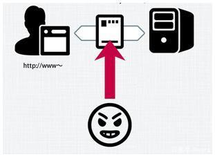


**HTTPS协议:**    

安全套接字层超文本传输协议HTTPS，为了数据传输的安全，HTTPS在HTTP的基础上加入了SSL/TLS协议，SSL/TLS依靠证书来验证服务器的身份，并为浏览器和服务器之间的通信加密。就是在HTTP的基础上增加了数据加密。在数据进行传输之前，对数据进行加密，然后再发送到服务器。这样，就算数据被第三者所截获，但是由于数据是加密的，所以你的个人信息仍然是安全的。这就是HTTP和HTTPS的最大区别。

HTTPS协议是由SSL/TLS+HTTP协议构建的可进行加密传输、身份认证的网络协议，要比http协议安全，很多大型互联网网站，如百度、淘宝、腾讯很早就已经把HTTP换成HTTPS了。

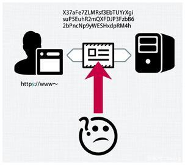

**HTTP和HTTPS的区别:**  

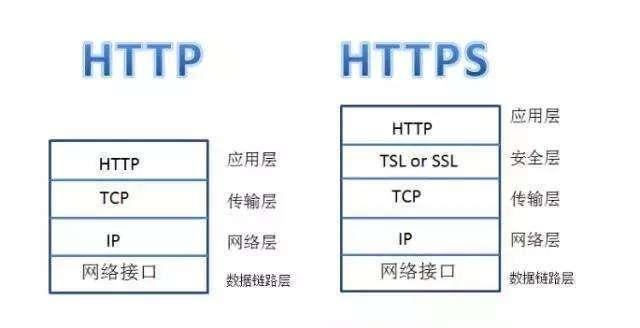  

1. 安全性不同:  
   https://前缀表明是用SSL (安全套接字)或TSL加密的，你的电脑与服务器之间收发的信息传输将更加安全。当你使用浏览器访问一个HTTP网站的时候，你会发现浏览器会对该HTTP网站显示“不安全”的安全警告，提示用户当前所访问的网站可能会存在风险。


  而假如你访问的是一个HTTPS网站时，情况却是完全不一样。你会发现浏览器的地址栏会变成绿色，企业名称会展示在地址栏中，地址栏上面还会出现一把“安全锁”的图标。这些都会给予用户很大的视觉上的安全体验。
  
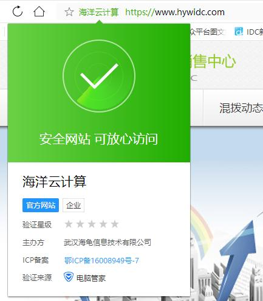

2. 网站申请流程不同  
   https协议需要到CA申请整数,一般免费证数很少,需要缴费,web服务器启用SSL需要获得一个服务器证数并将该证书与要使用SSL的服务器绑定  

3. 默认端口不同    
   http和http使用的是完全不同的连接方式,同时使用的端口也不同,http使用的是80端口,https使用的是443端口;在网络模型种,HTTP工作于应用层,而HTTPS工作在传输层
     
4. 对搜索排名的提升 
   这也是很多站长所关注的地方,百度和谷歌两大搜索引擎都已经明确表示,HTTPS网站将会作为搜索排名的一个重要权重指标,也就是说HTTPS网站比起HTTP网站在搜索排名中更有优势  


HTTPS网站相比起HTTP网站拥有着多种的优势,HTTP明显已经不能适应当今这个互联网时代,可以预见到HTTP将在不久的爱你过来会被HTTPS所取代  

**对以上总结以及理解:**  

> http:超文本传输协议,明文传输,信息不安全,用的是80端口
> httpS: 安全套接字超文本传输协议,有ssl/tsl证数,信息安全,443端口

> 虽然都是超文本传输协议，但是:
> http 就是你跟你女朋友之间对话都是直接大声喊的，而且旁边大家都听的
> 到，都可以知道你们在说什么。  
> https 是虽然也是直接对喊，但是加密了，说的是火星文，旁边的的人能
> 听见,但听不懂


## 6. 对称加密  

对称加密又叫做私钥加密,即信息的发送方和接收方使用同一各密钥去加密和解析数据; 对称加密的特点是算法公开,加密和解密速度快,适合对大数据量进行加密

> **加密过程**: 明文 + 加密算法 + 私钥 => 密文  
> **解密过程**: 密文 + 加密算法 + 私钥 => 明文

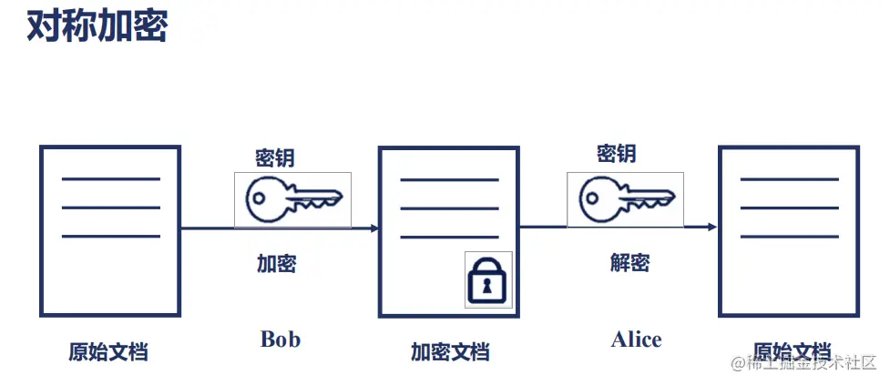

对称加密中用到的密钥叫做私钥,私钥表示个人私有的密钥,即该密钥不能被泄露,其加密过程中的私钥与解密过程中用到的私钥是同一个密钥,这也是对称加密之所以称之为"对称"的原因,由于对称加密的算法是公开的,所以一旦私钥被邪路,那么密文就很容易破解,所以对称加密的缺点是密钥安全管理困难

**例子:**  
> 甲对乙说，我这有一把锁，以后我们互相传消息，就把消息放盒子里，然
> 后用这个锁锁上再传，这个锁有两把一模一样的钥匙，咱俩一人一把，说
> 完甲把钥匙递给了乙。

但怎么来约定这个密钥呢？如果这个密钥在互联网上传输，也是很有可能让黑客截获的。黑客一旦截获这个秘钥，它可以佯作不知，静静地等着你们两个交互。这时候你们之间互通的任何消息，它都能截获并且查看，就等你把银行卡账号和密码发出来。

所以只能通过线下传输。比如，你和外卖网站偷偷约定时间地点，它给你一个纸条，上面写着你们两个的密钥，然后说以后就用这个密钥在互联网上定外卖了。当然你们接头的时候，也会先约定一个口号，什么”天王盖地虎”之类的，口号对上了，才能把纸条给它。但是，“天王盖地虎”同样也是对称加密密钥，同样存在如何把”天王盖地虎”约定成口号的问题。这样就陷入了死循环了。

**总结**:  
 对称加密算法中,加密和解密使用的密钥是相同的;对称加密算法要保证安全性的话,密钥要做好保密,只能让使用者知道,不能对外公开,  
 特点是对称加密的特点是算法公开,加密和解密速度快,适合对大数据量进行加密


## 7. 非对称加密   

非对称加密也叫做公钥加密,非对称加密与对称加密相比,其安全性更好;  
对称加密的通信双方使用相同的密钥,如果一方的密钥枣泄露,那么整个通信就会被破解;  
而非对称加密使用一对密码,即公钥和私钥,且二者成对出现;  
私钥被自己保存,不能对外泄露;  
公钥指的是公共的密钥;  
任何人都可以获得该密钥;  
用公钥或私钥的任何一个进行加密,用另一个进行解密  

被公钥加密过的密文只能被私钥解密,过程如下:  
> 明文 + 加密算法 + 公钥=>密文  
> 密文 + 解密算法 + 私钥 => 明文

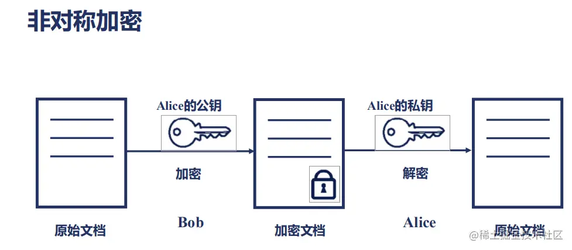  

**举个梨子**:  

> 甲对乙说，我这里有A型号锁，对应钥匙A，我给你一大箱子A锁，但是钥匙
> A不给你，以后你给我发消息就用A锁锁在盒子里给我，然后我自己用钥匙A
> 就能打开看。  
> 乙对甲说，我这里有B型号锁，对应钥匙B，我给你一大箱子B锁，但是钥匙
> B不给你，以后你给我发消息就用B锁锁在盒子里给我，然后我自己用钥匙B
> 就能打开看。


非对称加密的私钥放在外卖网站这里，不会在互联网上传输，这样就能保证这个秘钥的私密性。但是，对应私钥的公钥，是可以在互联网上随意传播的，只要外卖网站把这个公钥给你，你们就可以愉快地互通了。

比如说你用公钥加密，说“我要定外卖”，黑客在中间就算截获了这个报文，因为它没有私钥也是解不开的，所以这个报文可以顺利到达外卖网站，外卖网站用私钥把这个报文解出来，然后回复，“那给我银行卡和支付密码吧”。

先别太乐观，这里还是有问题的。回复的这句话，是外卖网站拿私钥加密的，互联网上人人都可以把它打开，当然包括黑客。因为外卖网站的公钥在互联网上随意传播的，每个人都可以拿到。同样，黑客也可以模拟用户发送“我要定外卖”这个过程的，因为它也有外卖网站的公钥。

**总结一下: **  
在非对称加密算法中，加密使用的密钥和解密使用的密钥是不相同的。  
一把是作为公开的公钥，另一把是作为谁都不能给的私钥。  
公钥加密的信息，只有私钥才能解密。私钥加密的信息，只有公钥才能解密。

## 8. 数字证书  

数字证数是一种权威性的电子文档,它提供了一种在Internet上验证身份的方式;  
其作用类似于司机的驾驶证或日常生活中的凭证;  
它是由一个权威机构--CA证数授权(Certificate Authority)中心发行的，人们可以在互联网交往中用它来识别对方的身份。  
以数字证书为核心的加密技术可以对网络上传输的信息进行加密和解密、数字签名和签名验证，确保网上传递信息的机密性、完整性，以及交易实体身份的真实性，签名信息的不可否认性。  
当然在数字证书认证的过程中，数字证书认证中心（CA）作为权威的、公正的、 可信赖的第三方，其作用是至关重要的。数字证书也必须具有唯一性和可靠性。  

**数字证数的原理**  

数字证数采用公钥密码体制, 即利用一对互相匹配的密钥进行加密,解密;  
每个用户拥有一把仅为本人所掌控的私有密钥(私钥),用来进行解密和签名;  
同时拥有一把公共密钥(公钥)并可以对外公开,用于加密和验证签名;  
当发送一份保密文件时,发送方使用接收方的公钥对数据加密,而接收方使用自己的私钥解密,这样信息就可以安全无误地到达目的地了,即使第三方解或,由于没有相应的私钥,也无法进行解密;  
通过数字的手段保证加密过程是一个不可逆过程,即只有用私钥才能解密;  
在公开密钥密码体制中,常用的一种是RSA体制   

用户也可以采用自己的密钥对信息进行处理,由于密钥仅为本人所有,这样就产生了别人无法生成的文件,也就形成了数字签名,次啊用数字签名,能够确认以下两点:  
1)保证信息是由签名者发送的,签名者不能否认或难以否认  
2)保证信息自签发后到收到为止,未曾作过任何修改,签发的文件是真实文件  

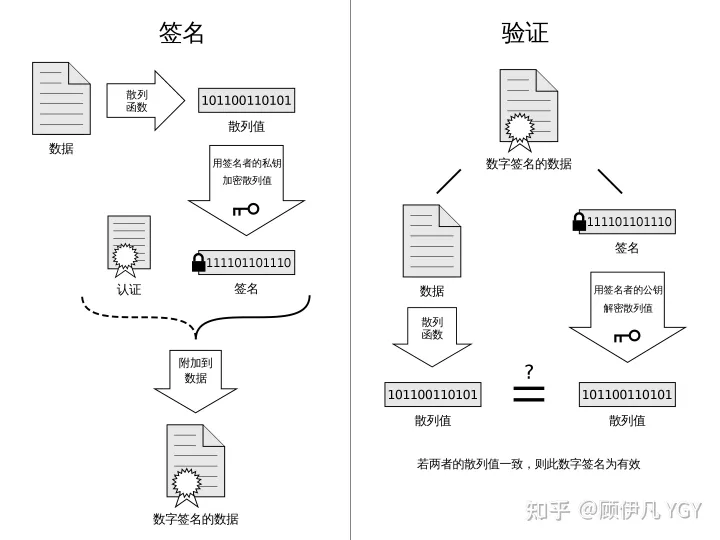


**数字证书的作用**

数字证书可用于发送安全电子邮件、访问安全站点、网上证券、网上招标采购、网上签约、网上办公、网上缴费、网上税务等网上安全电子事务处理和安全电子交易活动。数字证书的格式一般采用X.509国际标准。

**数字证书的功能**

```
一、信息保密性

交易中的商务信息均有保密的要求。
帐号和用户名被人知悉，就可能被盗用，订货和付款的信息被竞争对手获悉，就可能丧失商机。
而CA中心颁发的数字安全证书保证了电子商务的信息传播中信息的保密。

二、身份确定性

网上交易的双方很可能素昧平生，相隔千里。
要使交易成功首先要能确认对方的身份，对商家要考虑 客户端不能是骗子，而客户也会担心网上的商店不是一个玩弄欺诈的黑店。
因此能方便而可靠地确认对方身份是交易的前提。
对于为顾客或用户开展服务的银行、公司和销售商店，为了做到安全、保密、可靠地开展服务活动，都要进行身份认证的工作。
而CA中心颁发的电子签名可保证网上交易双方的身份，银行和公司可以通过CA认证确认身份，放心的开展网上业务。

三、不可否认性

由于商情的千变万化，交易一旦达成是不能被否认的。
否则必然会损害一方的利益。
例如订购黄金， 订货时金价较低，但收到订单后，金价上涨了，如收单方能否认受到订单的实际时间，甚至否认收到订单的事实，则订货方就会蒙受损失。
因此CA中心颁发的数字安全证书确保了电子交易通信过程的各个环节的不可否认性，使交易双方的利益不受到损害。

四、不可篡改性

交易的文件是不可被修改的，如上例所举的订购黄金。
供货单位在收到订单后，发现金价大幅上涨了，如其能改动文件内容，将订购数1吨改为1克，则可大幅受益，那么订货单位可能就会因此而蒙受损失。

 因此CA中心颁发的数字安全证书也确保了电子交易文件的不可修改性，以保障交易的严肃和公正。
```

**对上面一堆东西的简单理解:**  

如何将不对称加密的公钥给对方呢？一种是放在一个公网的地址上，让对方下载；另一种就是在建立连接的时候，传给对方。

这两种方法有相同的问题，那就是，作为一个普通网民，你怎么鉴别别人给你的公钥是对的。会不会有人冒充外卖网站，发给你一个它的公钥。接下来，你和它所有的互通，看起来都是没有任何问题的。毕竟每个人都可以创建自己的公钥和私钥。

公说公有理婆说婆有理，这个时候就需要权威部门的介入了，就像每个人都可以打印自己的简历，说自己是谁，但是有公安局盖章的，就只有户口本，这个才能证明你是你。这个由权威部门颁发的称为证书（Certificate）。

证书里面有什么呢？当然应该有公钥，这是最重要的；还有证书的所有者，就像户口本上有你的姓名和身份证号，说明这个户口本是你的；另外还有证书的发布机构和证书的有效期，这个有点像身份证上的机构是哪个区公安局，有效期到多少年。

这个证书是怎么生成的呢？会不会有人假冒权威机构颁发证书呢？就像有假身份证、假户口本一样。生成证书需要发起一个证书请求，然后将这个请求发给一个权威机构去认证，这个权威机构我们称为 CA（ Certificate Authority）。

将这个请求发给权威机构，权威机构会给这个证书卡一个章，我们称为签名算法。问题又来了，那怎么签名才能保证是真的权威机构签名的呢？当然只有用只掌握在权威机构手里的东西签名了才行，这就是 CA 的私钥。

签名算法大概是这样工作的：一般是对信息做一个 Hash 计算,得到一个 Hash 值，这个过程是不可逆的，也就是说无法通过 Hash 值得出原来的信息内容。在把信息发送出去时，把这个 Hash 值加密后，作为一个签名和信息一起发出去。

CA 用自己的私钥给外卖网站的公钥签名，就相当于给外卖网站背书，形成了外卖网站的证书。

证书的内容：这里面有个 Issuer，也即证书是谁颁发的；Subject，就是证书颁发给谁；Validity 是证书期限；Public- key 是公钥内容；Signature Algorithm 是签名算法。

这下好了，你不会从外卖网站上得到一个公钥，而是会得到一个证书，这个证书有个发布机构 CA，你只要得到这个发布机构 CA 的公钥，去解密外卖网站证书的签名，如果解密成功了，Hash 也对的上，就说明这个外卖网站的公钥没有啥问题。

有没有发现，又有新问题了。要想验证证书，需要 CA 的公钥，问题是，你怎么确定 CA 的公钥就是对的呢? 所以，CA 的公钥也需要更牛的 CA 给它签名，然后形成 CA 的证书。要想知道某个 CA 的证书是否可靠, 要看 CA 的上级证书的公钥，能不能解开这个 CA 的签名。就像你不相信区公安局，可以打电话问市公安局，让市公安局确认区公安局的合法性。这样层层上去，直到全球皆知的几个著名大 CA，称为 root CA，做最后的背书。通过这种层层授信背书的方式，从而保证了非对称加密模式的正常运转。

## 9. https的加密原理(工作机制)

**1. 为什么需要加密?**  

因为http的内容是明文传输的,明文数据会经过中间代理服务器,路由器,wifi热点,服务运营商等多个物理节点,如果信息在传输过程中被劫持,传输的内容就会完全暴露了;  
劫持者还可以篡改传输的信息且不被双方察觉, 这就是"中间人攻击",所以我们才需要对信息进行加密;  


**2. 为什么不用对称加密?**  

对称加密算法中,加密和解密解密使用的密钥是相同的;对称加密要保证安全性的话,密钥要做好保密,不能对外公开;  
如果通信双方都各自持有同一个密钥，且没有别人知道，这两方的通信安全当然是可以被保证的（除非密钥被破解）。  
但 密钥在又服务器传到客户端的安全性无法保证,很可能密钥在传输工程中被某些人获取  


**3. 为什么不用非对称加密:**  

非对称加密: 两把密钥,一把是公钥,一把是私钥, 公钥加密的内容只有私钥能解,私钥加密的内容只有公钥能解  
如果私钥在服务端, 公钥以明文传输给浏览器端,中间人只能获得公钥无法获取私钥;  
这样只能保证浏览器向服务器传输数据的安全性  
而服务端向浏览器传输的数据依旧无法保证 

**4. 为什么不用双对称加密:**  
双对称加密: 服务端公钥A密钥A, 浏览器端公钥B,密钥B  
服务端向浏览器端: 服务器端公钥B加密,浏览器端私钥B解密  
浏览器向服务器端: 浏览器公钥A加密, 服务端私钥A解密  

非对称算法是非常耗时的,对服务端有一定的压力(而且这种方法也不完美)

**5. 非对加密 + 对称加密?:**  
1. 网站拥有用于非对称加密的公钥A,私钥A
2. 浏览器向网站服务请求,服务器把公钥A明文传输浏览器
3. 浏览器随机生成一个用于对称加密的密钥X,用公钥A加密后传给服务器
4. 服务器拿到后用 私钥A 解密得到密钥X
5. 这样双方都拥有密钥X了,且鄙人无法知道它,之后双方所有数据都通过密钥X加密解密即可 

HTTPS基本就是采用的这种方案, 但是还有漏洞  
为什么不用这种方法,请看下面这个例子: 
> 1. 某网站有用于非对称加密的公钥A,私钥A
> 2. 浏览器向网站服务器请求, 服务器把公钥A明文传给浏览器
> 3. **中间人劫持到公钥A,保存下来,把数据包中的公钥替换成自己伪造的公钥B(它会有自己的公钥B对应的私钥B)**
> 4. 浏览器生成一个用于对称加密的密钥X,用**公钥B**(浏览器无法得知公钥被替换了)加密后传给服务器
> 5. **中间人劫持后用私钥B,解密得到密钥X,再用公钥A加密后传给服务器**
> 6. 服务器拿到后用私钥A,解密得到密钥X  
> 这样再双方都不会发现异常的情况下,中间人同故宫一套"狸猫换太子"的操
> 作,调包了服务器传来的公钥,进而得到了密钥X**根本原因是浏览器无法确认收到的公钥是不是网站自己的**,因为公钥本身是明文传输的


6. **数字证书!!!**

网站在使用HTTPS前，需要向CA机构申领一份数字证书，数字证书里含有证书持有者信息、公钥信息等。服务器把证书传输给浏览器，浏览器从证书里获取公钥就行了，证书就如身份证，证明“该公钥对应该网站”。

**6.1 如何防止数字证书被篡改?**

  我们把证书原本的内容生成一份**签名**对比证书内容和签名是否一致就能判别是否被篡改,这就是数字证书的"防伪技术",这里的"签名"就是`数字签名`

**6.2 数字签名?**

> - 数字签名的制作过程: 
>   1. CA机构拥有非对称加密的私钥和公钥
>   2. CA机构对证书明文数据T进行hash
>   3. 对hash候得值用私钥加密得到数字S
>
> 明文和数字签名共同组成了数字证书,这样一份数字证书就可以颁发给网站了    
> 那浏览器拿到服务器串来的数字证书后,如何验证它是不是真的? (有没有被篡改,掉包) 
>
> - 浏览器验证过程  
>   1. 拿到证书,得到明文T,签名S
>   2. 用CA机构的公钥对S解密(由于是浏览器信任的机构,所以浏览器保有它的公钥,详细请看下面)得到 s'
>   3. 用证书里置命的hash算法对明文T进行hash得到T'
>   4. 显然通过以上步骤, T' 应当等于 S', 除非明文或签名被篡改; 所以此时比较 S' 是否等于 T',等于则表明证书可信  


**6.3 中间人有可能篡改证书吗?**  
假设中间人篡改了证书的原文,由于他没有CA机构的私钥,所以无法得到此时加密后的签名,无法相应的篡改签名,浏览器收到该证书后会发现原文和签名解密后的值不一致,则说明证书已被篡改,证书不可信,从而种终止向服务器传输信息,防止信息泄露给中间人;  

**6.4 中间人可能把证书掉包吗?**  
假设有另一个网站B也拿到了CA机构的认证的证书, 他想劫持网站A的信息,于是它成为中间人拦截到了A传给浏览器的这个证书,然后替换成自己的证书,传给浏览器,之后浏览器就会错误的拿到B的证书里面的公钥, 就会导致"中间人攻击"

其实者并不会发生,因为证书里面包含A的信息,包括域名,浏览器把证书里的域名与自己请求的域名比对一下就知道有没有被掉包了。

**6.5 为什么制作数字签名时需要hash一次?**  

非对称加密效率较差，证书信息一般较长，比较耗时。而hash后得到的是固定长度的信息（比如用md5算法hash后可以得到固定的128位的值），这样加解密就快很多。

还有一些安全上的原因,这部分内容更6一些:  
[crypto.stackexchange.com/a/12780](crypto.stackexchange.com/a/12780)

**6.6 怎么证明CA机构的公钥是可信的？**  

为了证明某公钥是可信的，即“该公钥是否对应该网站”，那CA机构的公钥是否也可以用数字证书来证明？没错，操作系统、浏览器本身会预装一些它们信任的根证书，如果其中会有CA机构的根证书，这样就可以拿到它对应的可信公钥了。

实际上证书之间的认证也可以不止一层，可以A信任B，B信任C，以此类推，我们把它叫做信任链或数字证书链。也就是一连串的数字证书，由根证书为起点，透过层层信任，使终端实体证书的持有者可以获得转授的信任，以证明身份。

另外，不知你们是否遇到过网站访问不了、提示需安装证书的情况？这里安装的就是根证书。说明浏览器不认给这个网站颁发证书的机构，那么你就得手动下载安装该机构的根证书（风险自己承担XD）。安装后，你就有了它的公钥，就可以用它验证服务器发来的证书是否可信了。


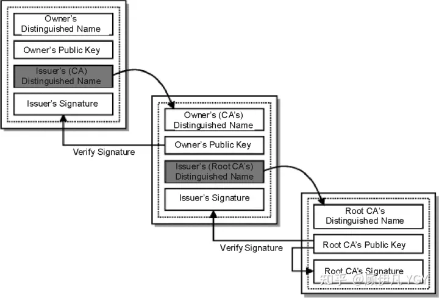

**6.7 每次进行HTTPS请求时都必须在SSL/TLS层进行握手传输密钥吗？**

显然每次请求都经历一次密钥传输过程非常耗时，那怎么达到只传输一次呢？

服务器会为每个浏览器（或客户端软件）维护一个session ID，在TLS握手阶段传给浏览器，浏览器生成好密钥传给服务器后，服务器会把该密钥存到相应的session ID下，之后浏览器每次请求都会携带session ID，服务器会根据session ID找到相应的密钥并进行解密加密操作，这样就不必要每次重新制作、传输密钥了！

**6.8 总结**  

可以看下这张图，梳理一下整个流程（SSL、TLS握手有一些区别，不同版本间也有区别，不过大致过程就是这样)

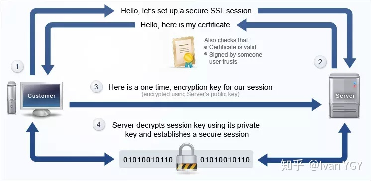


**7. HTTPS工作机制?**  

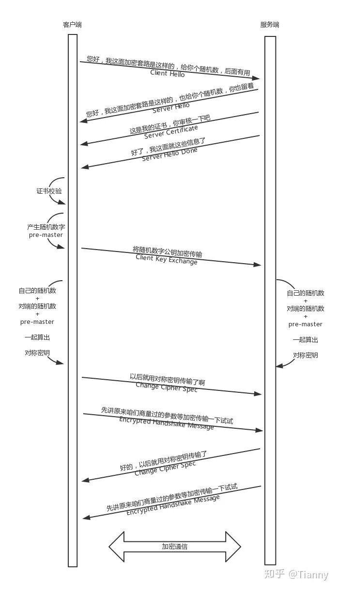

举个离子:
```

当你登录一个外卖网站的时候，由于是 HTTPS，客户端会发送 Client Hello 消息到服务器，
以明文传输 TLS 版本信息、加密套件候选列表、压缩算法候选列表等信息。
另外，还会有一个随机数，在协商对称密钥的时候使用。

这就类似在说：“您好，我想定外卖，但你要保密我吃的是什么。
这是我的加密套路，再给你个随机数，你留着。”

然后，外卖网站返回 Server Hello 消息,，告诉客户端，服务器选择使用的协议版本、加密套件、压缩算法等，
还有一个随机数，用于后续的密钥协商。

这就类似在说：“您好，保密没问题，你的加密套路还挺多，
咱们就按套路 2 来吧，我这里也有个随机数，你也留着。”

然后，外卖网站会给你一个服务器端的证书，然后说：“Server Hello Done，我这里就这些信息了。”

你当然不相信这个证书，于是你从自己信任的 CA 仓库中,
拿 CA 的证书里面的公钥去解密外卖网站的证书。如果能够成功，
则说明外卖网站是可信的。这个过程中，
你可能会不断往上追溯CA、CA的CA、CA的CA的CA，反正直到一个授信的 CA，就可以了。

证书验证完毕之后，觉得这个外卖网站可信，于是客户端计算产生随机数字Pre-master，
发送 Client Key Exchange，用证书中的公钥加密，再发送给服务器，服务器可以通过私钥解密出来。

到目前为止，无论是客户端还是服务器，
都有了三个随机数，分别是：自己的、对端的以及刚生成的 Pre-Master 随机数。
通过这三个随机数，可以在客户端和服务器产生相同的对称密钥。

有了对称密钥，客户端就可以说：“Change Cipher Spec，
咱们以后都采用协商的通信密钥和加密算法进行加密通信了。”

然后发送一个 Encrypted Handshake Message，
将已经商定好的参数等，采用协商密钥进行加密，
发送给服务器用于数据与握手验证。

同样，服务器也可以发送 Change Cipher Spec，
说：“没问题,咱们以后都采用协商的通信密钥和加密算法进行加密通信了”，并且也发送 Encrypted Handshake Message 的消息试试。
当双方握手结束之后，就可以通过对称密钥进行加密传输了。

这个过程除了加密解密之外，其他的过程和 HTTP 是一样的，过程也非常复杂。

上面的过程只包含了 HTTPS 的单向认证，也即客户端验证服务端的证书，
是大部分的场景，也可以在更加严格安全要求的情况下，
启用双向认证，双方互相验证证书。

```

参考资料:  
[HTTPS 加密原理](https://zhuanlan.zhihu.com/p/268329381)  
[彻底搞懂HTTPS的加密原理](https://zhuanlan.zhihu.com/p/43789231)

[数字证书是什么原理,有什么作用](https://zhuanlan.zhihu.com/p/330525206)


