## 前端面试CSS部分总结
_____

本笔记由作者在复习前端CSS部分的相关的一些总结, 如果有什么错误的地方或者有什么相关的建议欢迎联系我

这份笔记借鉴了很多网上的文章, 如果有雷同或者相似的地方, 不用怀疑, 那就是搬得, 如果你是当中一些文章得作者, 
如果觉得这种行为不恰当, 请与我联系, 收到消息后我会尽快处理

邮箱: zwn_fobj@foxmail.com

QQ: 1879154660  
QQ昵称: 只为你乱了浮生

感谢各位观看者的支持, 希望能对正在面临面试的你有所帮助,   
____

### 目录

- [前端面试总结](#前端面试总结)
  - [目录](#目录)
  - [1.z-index的作用和用法](#1)
  - [2.圣杯布局和双飞翼布局](#2)
  - [3.什么是BFC,IFC](#3)
    - [3.1 BFC(Block Formatting Contexts)块级格式化上下文](#3_1)
    - [3.2 IFC(Inline Formatting Contexts)行内格式化上下文](#3_2)
  - [4.清除浮动方式](#4)
  - [5. CSS中position(定位)使用](#5)
  - [6.CSS3常见的伪类和伪元素选择器](#6)
  - [7.浏览器渲染机制](#7)
  - [8.浏览器地址输入回车显示页面经历了哪些过程](#8)
  - [9. css实现水平或垂直居中](#9)
    - [9.1 absolute + 0000auto法:](#9_1)
    - [9.2 absolute + 50%法](#9_2)
    - [9.3 flex的双center法](#9_3)
    - [9.4 使用绝对定位 + transform](#9_4)
    - [9.5 grid的双center法  justify-self  align-self center](#9_5)
    - [9.6 父元素display: table-cell;    vertical-align: middle;  子元素：margin:auto;](#9_6)
  - [10 `visibility:hidden`和`display:none`区别](#10)
  - [11. 简单说明css的盒子模型](#11)
  - [12. rgba 和 opacity透明效果有什么区别](#12)
  - [13.常见的CSS选择器](#13)
  - [14.css选择器权重](#14)
  - [15. css隐藏元素方式](#15)
  - [16. CSS3新特性](#16)
  - [17. flex布局](#17)
  - [18. filter(滤镜)的使用](#18)
  - [19. 渐变](#19)
    -[19.1 线性渐变](#19_1)
    -[19.2 径向渐变](#19_2)
  - [20. CSS动画](#20)
  - [](#20)


----
### <h2 id="1">1.z-index的作用和用法</h2> 
z-index 属性设定了一个定位元素及其后代元素或 flex 项目的 z-order。当元素之间重叠的时候，z-index 较大的元素会覆盖较小的元素在上层进行显示。

z-index可以是0, 处于正值下面, 处于auto前面  

z-index可以是负数,处于auto下面  

### <h2 id="2">2.圣杯布局和双飞翼布局</h2> 

圣杯布局和双飞翼布局都是三栏布局: 两边高度固定, 中间栏自适应, 中间栏优先渲染

<h3 id="2_1">2.1圣杯布局实现过程</h3>

尾部: 清除浮动  
容器: bfc  
三栏: float:left; positive:relative;height:500px  
左右栏: 宽度+背景颜色  
左侧挪到上一行前面: margin-left: -100%  
右侧往前挪: right: -150px  
给容器: pandding-left: 200px; padding-right:150px


- 具体实现  
```html
<!DOCTYPE html>
<html lang="en">
<head>
    <meta charset="UTF-8">
    <title>Title</title>
    <style>
        body{
            min-width: 550px;
            font-weight: bold;
            font-size: 20px;
        }

        .header,.footer{
            background-color: rgba(29,27,27,0.726);;
            text-align: center;
            height: 60px;
            line-height: 60px;
        }

        .footer{
            /*清除浮动*/
            clear: both;
        }

        .middle,.left,.right{
            height: 100px;
        }
        .content{
            padding-left: 200px; /*空出left的位置*/
            padding-right: 150px; /*空出right的位置*/
            overflow: hidden;
        }

        .content div{
            position: relative;
            float: left;
            text-align: center;
            height: 300px;
            line-height: 300px;
        }

        .middle {
            width: 100%;
            background-color: orange;
        }
        .left {
            width: 200px;           /* leftContent width */
            right: 200px;           /* leftContent width */
            margin-left: -100%;
            background-color: green;
        }
        .right {
            width: 150px;           /* rightContent width */
            margin-left: -150px;   /* rightContent width */
            right: -150px;
            background-color: skyblue;
        }
    </style>
</head>
<body>
<div class="header">header</div>
<div class="content wrapper">
    <div class="middle">middle</div>
    <div class="left">left</div>
    <div class="right">right</div>
</div>
<div class="footer">footer</div>
</body>
</html>
```

- 效果展示  

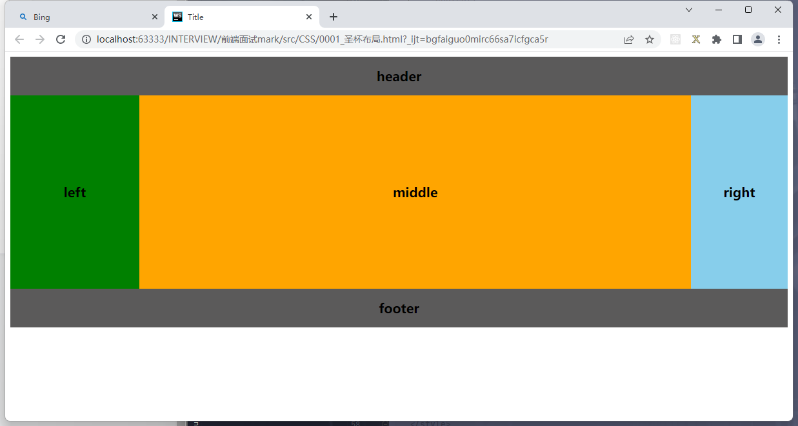


<h3 id="2_2">2.2双飞翼布局实现过程</h3>

中间栏里再放inner  
容器:bfc  
三栏:  float:left; height: 500px  
左右栏: 宽度+背景颜色  
中间栏:  100%+背景颜色  
左右栏： 宽度+背景颜色  
左侧挪到上一行前面： margin-left：-100%；  
右侧挪到上一行后面： margin-left： -150px；  
inner里面margin： 0 200px 0 150px；

- 具体实现  
```html
<!DOCTYPE html>
<html lang="en">
<head>
    <meta charset="UTF-8">
    <title>双飞翼布局</title>
    <style>
        body {
            min-width: 550px;
            font-weight: bold;
            font-size: 20px;
        }
        #header, #footer {
            background: darkgoldenrod;
            text-align: center;
            height: 60px;
            line-height: 60px;
        }
        #container {
            /*这里预留位置用再预留*/
            /*该元素大小有center撑开*/
            overflow: hidden;
        }
        .column {
            text-align: center;
            height: 300px;
            line-height: 300px;
        }
        #left, #right, #center {
            float: left;
        }
        #center {
            width: 100%;
            background: gray;
        }
        #left {
            width: 200px;
            /*移动到上一行首首*/
            margin-left: -100%;
            background: skyblue;
        }
        #right {
            width: 150px;
            /*移动到上一行行尾*/
            margin-left: -150px;
            background: orange;
        }
        .content {
            /*内容区显示的位置*/
            margin: 0 150px 0 200px;
        }
    </style>

</head>
<body>
    <div id="header"># header</div>

    <div id="container">
        <div id="center" class="column">
            <div class="content"># center</div>
        </div>

        <div id="left" class="column">#left</div>
        <div id="right" class="column">#right</div>
    </div>

    <div id="footer">#footer</div>
</body>
</html>

```
- 效果展示  

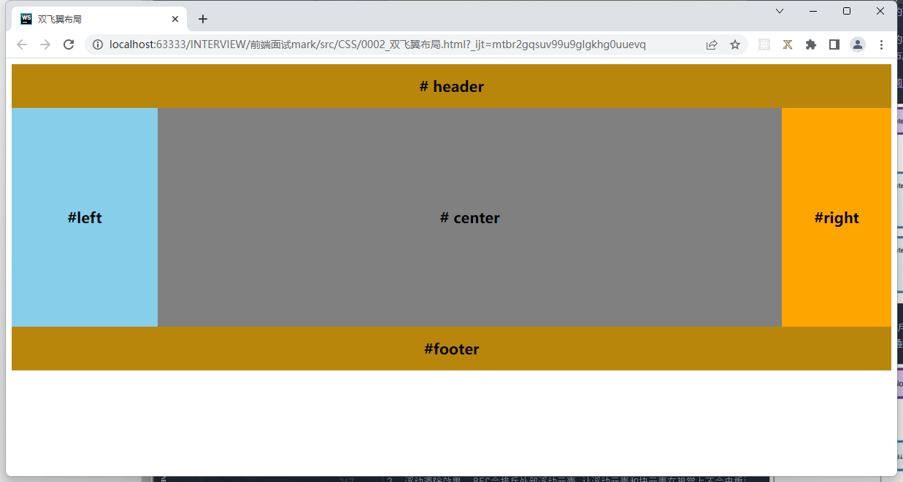


### <h2 id="3">3.什么是BFC,IFC</h2> 

#### <h3 id="3_1">3.1 BFC(Block Formatting Contexts)块级格式化上下文</h3>
 

块级格式化上下文使页面上的一块渲染区域, 这块区域由符合条件的容器产生.
容器内的子元素会由块盒子和浮动元素按如下规则排列:

- 纵向一个挨着一个排列
- 两个贺子的纵向间距由`margin`属性决定, 两个相邻的盒子在垂直方向上的`margin`
会有种"重叠合并"的效果,此时纵向间距距离取较大的那个`margin`值

这个容器可以看作一个独立的布局环境,容器外的元素与容器内的元素(包括浮动元素)
再布局上不会影响到对方

1.  BFC容器的高度将浮动圆度的高度计算进去

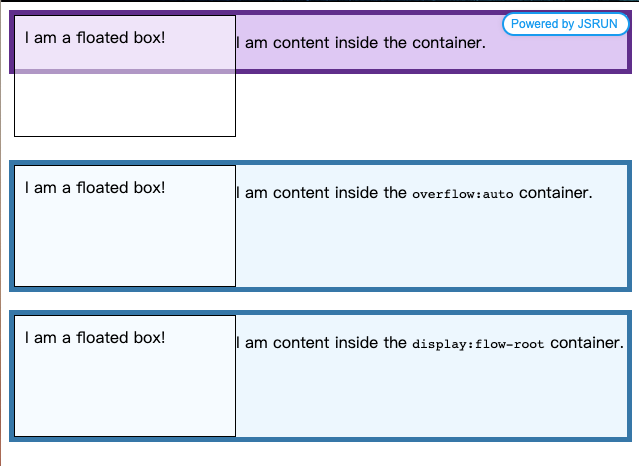

2. 浮动清除效果. BFC会排斥外部浮动元素,让浮动元素和块元素在视觉上不会由重叠的效果:

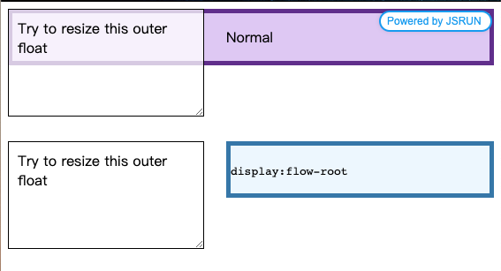

产生块格式上下文的方式有:

``` 
1. 根元素 - <html>

2. 浮动元素 - 非float: none的元素

3. 绝对定位元素 - position为absolute或fixed的元素（和产生粘滞效果sticky的元素？）

4. 行内块元素 - display为inline-block的元素

5. 表格元素

    display: table-cell的元素，如<td>
    display: table-caption的元素，如<th>
    display: table的元素，如<table>
    display: table-row的元素，如<tr>
    display: table-row-group的元素，如<tbody>
    display: table-header-group的元素，如<thead>
    display: table-footer-group的元素，如<tfoot>
    display: inline-table的元素
    
6. overflow不为visible的块元素

7. display: flow-root的元素

8. contain: layout | content | paint的元素

9. 弹性元素 - display: flex | inline-flex的直接子元素

10. 网格元素 - display: grid | inline-grid的直接子元素

11 .多列容器 - column-count或column-width不为auto

12. column-span: all的元素
```

#### <h3 id="3_2">3.2 IFC(Inline Formatting Contexts)行内格式化上下文</h3>

行内格式化上下文的布局首先要根据水平, 垂直和左右书写模式来说明:

- 在水平书写模式 `writing-mode: hortizontal-td`下,盒子会在时评方向上从左到右排列,空间不够时换到下一行继续
- 在垂直书写模式下 `writing-mode: vertical-rl | vertical-lr`, 盒子会在垂直方向上从上到下排列, 空间不够时换到下一行继续, 只是这里的下一行有左右之分
`writing-mode: vetical-rl`时就像古人书写以及日本台湾书籍的格式一样,从右到左排列; `writing-mode: vertival-lr`则时从左到右排列
  
每"行"在浏览器中会被作为一个盒子处理, 这个盒子叫行框(line box),他的高度由其包含行内元素的最低位置到最高位置(不包含`margin`)计算而来; 因为考虑盒子件对齐处理的关系,
这个值可能会被行内最高的元素要搞

当由浮动元素在行内式化上下文时, 在浮动元素的行框可能会因为它而缩短宽度,产生"文字环绕"效果
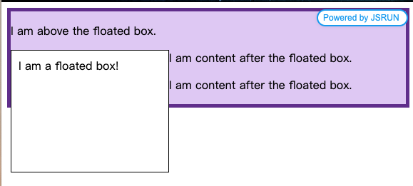

当行框内的行内元素没有占满整行的空间时, 他们在水平方向的位置会受到`text-align`属性的影响

而当行内元素太长时, 会被分割为多行, 也就是说这个元素内产生了多个行框排列在一起,此时`margin`.
`border`, `padding`都不会在断裂处生效

满足以下条件时,行框会被当做高度为0的盒子处理:

- 不包含文字
- 非white-space: pre | pre-wrap | pre-line
-  不含margin、padding、border值不为零的元素
-  不含在常规流中的元素，如图片、表格之类


### <h2 id="4">4.清除浮动方式</h2>

清除浮动: 清除浮动后造成的影响-->清除浮动主要为了解决父级元素因为浮动引起内部高度为0的问题

1. 额外标签法(在最后一个浮动标签后,新新加一个标签, 给其设置clear: both;)(不推荐)  
`<div style="clear:both"></div>`  
   我们清除了浮动,父元素自动检测盒子的高度,然后与其同高  
   - 优点: 通俗易懂, 方便  
   - 缺点: 添加无意义标签, 语义化差

2. 父级添加overflow属性, 变成BFC([块级格式化上下文](#3_1)),就可以解决浮动带来的影响(不推荐)  
   通过除法BFC方式,实现清除浮动  
   - 优点:代码简洁
   - 缺点: 内容增多的时候容易造成不会自动换行,导致内容被隐蔽掉,无法显示要溢出的元素
```css
    .fahter{
        width: 400px;
        border: 1px solid deeppink;
        overflow: hidden;
    }
```
3. 使用before和after伪元素清除浮动(推荐使用):
   这种方式也是使用额外标签方式达到效果，只是变相的使用了伪元素after/before，使得页面结构更简介，也是常用的清除浮动的方式
   - 优点: 符合闭合浮动思想,结构语义化正确
    - 缺点: ie6-7不支持伪元素：after，使用zoom:1触发hasLayout.
```css
.clearfix:after{/*伪元素是行内元素 正常浏览器清除浮动方法*/
    content: ""; /*元素设置为空*/
    display: block; /*转换为块级元素*/
    height: 0; /*高度为0*/
    clear:both;/*清除浮动*/
    visibility: hidden;/*将元素隐藏*/
}
/*下面为了兼容IE*/
.clearfix{
    *zoom: 1;/*ie6清除浮动的方式 *号只有IE6-IE7执行，其他浏览器不执行*/
}
```
- 具体使用
```html

<body>
    <div class="fahter clearfix">
        <div class="big">big</div>
        <div class="small">small</div>
        <!--<div class="clear">额外标签法</div>-->
    </div>
    <div class="footer"></div>
</body>
```
- 使用before和after双伪元素清除浮动
    - 优点: 代码更简洁
    - 缺点: 用zoom:1除法hasLayout
```css

.clearfix:after,.clearfix:before{
    content: "";
    display: table;
}
.clearfix:after{
    clear: both;
}
.clearfix{
    *zoom: 1;
}
```
- 具体使用

```html

 <div class="fahter clearfix">
        <div class="big">big</div>
        <div class="small">small</div>
 </div>
 <div class="footer"></div>
```

4. 使用 `display: flow-root`(推荐):  
   
   一个新的 `display` 属性的值，它可以创建无副作用的 BFC。在父级块中使用 `display: flow-root` 可以创建新的 BFC。  
  
   给 `<div>` 元素设置 `display: flow-root` 属性后，`<div>` 中的所有内容都会参与 BFC，浮动的内容不会从底部溢出。  
   
   你可以从 `flow-root` 这个值的名字上看出来，它创建一个新的用于流式布局的上下文，类似于浏览器的根（`html`）元素。

- 具体使用      
```css
.box[style] {
  background-color: aliceblue;
  border: 5px solid steelblue;
}
.float {
  float: left;
  width: 200px;
  height: 100px;
  background-color: rgba(255, 255, 255, .5);
  border:1px solid black;
  padding: 10px;
}   
```
```html
  <div class="box" style="display:flow-root">
    <div class="float">I am a floated box!</div>
    <p>I am content inside the <code>display:flow-root</code> container.</p>
  </div>
```
- 实现效果:  
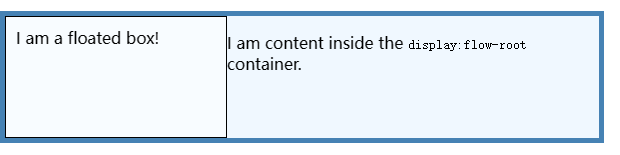

### <h2 id="5">5. CSS中position(定位)使用</h2>

<h3>static定位(静态定位)</h3>

HTML元素的默认值,即没有定位,遵循正常的文档流对象  
静态定位的元素不会受到top,bottom,left,right影响  

```css
div.static {
    position: static; /*静态定位,HTML元素默认值*/
    border: 3px solid #73AD21;
}
```

<h3>fixed定位(固定定位)</h3>  

元素的位置相对于浏览器窗口是固定位置  
即使窗口是滚动的它也不会移动  

**特点**:  
- 固定定位之后,不占据原来的位置(脱标)
- 元素使用固定定位之后,位置从浏览器出发
``` css
p.pos_fixed
{
    position:fixed; /*固定定位*/
    top:30px;
    right:5px;
}
```


<h3>relative定位(相对定位)</h3>

相对定位元素的定位是相对其正常位置

**特点**:
- 使用相对定位,位置从自身出发  
- 还占据原来的位置(不脱标)
- 子绝夫相(父元素相对定位,子元素绝对定位)
- 行内元素使用相对定位不能转行内块

```css
h2.pos{
    position: relative;
    left: -20px;
}
```

<h3>absolute定位(绝对定位)</h3>

绝对定位的元素的位置相对于最近的已定位父元素,如果元素没有已定位的父元素,
那么它的位置相对于`<html>`

**特点**:  
- 元素使用绝对定位之后不占据原来的位置(脱标)  
- 元素使用绝对定位,位置是从浏览器出发  
- 嵌套的盒子,父盒子没有使用定位,子盒子绝对定位,子盒子位置是从浏览器出发  
- 嵌套的盒子,父元素使用定位, 子盒子绝对定位,子盒子位置是从父元素位置出发

```css
h2 {
    position:absolute;
    left:100px;
    top:150px;
}
```

<h3>sticky定位:粘性定位</h3>

粘性定位的元素是依赖于用户的滚动,在 position:relative 与 position:fixed定位之间切换

它的行为就像position:relative;而当页面滚动超出目标区域时, 它的表现就像position:fixed; 它会固定在目标位置
元素定位表现在跨越特定阈值为相对定位,之后为固定定位

这个特定域指指的是top,right,bottom或left之一,换言值,指定top,right,bottom或left四个阈值其中之一,才可使粘性定位生效,否则其行为与相对定位相同

粘性定位的元素是依赖于用户的滚动,在 position:relative 与 position:fixed定位之间切换
它的行为就像position:relative;而当页面滚动超出目标区域时, 它的表现就像position:fixed; 它会固定在目标位置
元素定位表现在跨越特定阈值为相对定位,之后为固定定位
这个特定域指指的是top,right,bottom或left之一,换言值,指定top,right,bottom或left四个阈值其中之一,才可使粘性定位生效,否则其行为与相对定位相同

**特点**:   
top,right,bottom,left四个属性中至少设置一个具体值,  
当小于这个距离时呈现fixed,大于时呈现relative

```css
div.sticky {
    position: -webkit-sticky; /* Safari */
    position: sticky;
    top: 0;
    background-color: green;
    border: 2px solid #4CAF50;
}
```

### <h2 id="6">6.CSS3常见的伪类和伪元素选择器</h2>

- **伪类**: 以冒号(:)开头,用于选择处于特定状态的元素
``` 
:checked ---页面中有选中状态的元素
:active --- 想被激活的元素添加样式
:focus ---想拥有键盘输入焦点的元素添加样式
:hover ---当鼠标悬浮在元素上时,想元素添加样式
:link ---想未被访问的链接添加演示
:visited ---向已被访问的链接添加样式
:first-child ---向元素的第一个子元素添加样式
:lang ---向带有指定lang属性的元素添加样式
:nth-child(n) ---第n个子元素(odd奇数,even偶数)
```

- **伪元素**: 以双冒号(::)开头, 用于在文档中插入虚构的元素
``` 
::first-letter ---向文本的第一个字母添加特殊样式
::first-line ---向文本的首航添加特殊样式
::before ---在元素之前添加内容
::after ---在元素之后添加内容
::selection ---元素被选择后的颜色
::placeholder ---选中表单元素的占位文本
```

1. 伪类的本质上是为了弥补常规CSS选择器的不足,以便获取到更多信息;
2. 伪元素本质上是创建了一个有内容的虚拟容器,不存在于文档树中
3. CSS中伪类和伪元素的语法不同
4. 可以同时使用多个伪类, 而只能同时使用一个伪元素

### <h2 id="7">7.浏览器渲染机制</h2>

1. 在浏览器中输入URL  
2. 浏览器向响应的服务器发送请求,服务器接受响应
3. HTML解析器自上而下地将HTML文件解析成一棵DOM树, 树上的节点就是响应的元素
4. CSS解析器将CSS解析成CSSOM树
5. 根据DOM树和CSSOM树构建相应的Render树(渲染树)
6. Layout(布局): 计算出每个节点在屏幕中的位置
7. Paint(绘制): 将内容显示在屏幕上


### <h2 id="8">8.浏览器地址输入回车显示页面经历了哪些过程</h2>

1. DNS解析:  
    寻找资源所在的机器的过程, 返回一个IP地址, 递归和迭代解析, 默认和使用较多的是递归
   
2. TCP连接:
    - 第一次握手, 由浏览器发起,告诉服务器我要发送请求了
    - 第二次握手, 由服务器发起,告诉浏览器我准鄂毕接受了,你赶紧发送吧
    - 第三次我手, 由六零奶骑发起, 告诉服务器, 我马上就发送了, 你准备接受吧,发送HTTP请求
3. 客户端向服务器发送请求,HTTP请求报文包括请求行,请求头部,请求体
4. 服务器响应请求:
    根据路由器返回HTTP报文, 包含响应行,响应头部,响应体
   
5. 浏览器解析:
    - 遇见HTMl标记, 浏览器调用HTML解析器解析成Token并构建DOM
    - 遇见style标记, 浏览器调用css解析器处理css标记并构建cssom树
    - 遇见js标记, 浏览器调用js解析器处理script代码
    - 将dom树和cssom树合并成一个渲染树
    - 根据根据渲染树来计算布局,计算每个节点的集合信息(布局Loyout)
    - 将每个节点颜色绘制到屏幕上 (渲染Render)
    
6. 关闭TCP连接:
    - 第一个挥手: 由浏览器发起,发送给服务器,我东西发送完了(请求报文), 你准备关闭吧
    - 第二次挥手: 由服务器发起,发送给浏览器,我东西接受完了(请求报文),我准备关闭了,你也准备关闭吧
    - 第三次挥手: 由浏览器发起,发送给服务器,我东西发送完了(响应报文),你准备关闭吧
    - 第四次回收: 由服务器发起,发送给浏览器,我东西接收完了(响应报文),我准备关闭了,你也关闭吧
    


### <h2 id="9">9. css实现水平或垂直居中</h2>  

#### <h3 id="9_1">9.1 absolute + 0000auto法:</h3>
- 使用绝对定位+margin:auto, 给子元素添加如下样式
- 父子元素宽高都未知时也适用

```css
.op1{
    position: absolute;
    top: 0;
    bottom: 0;
    right: 0;
    left: 0;
    margin: auto;
}
```
#### <h3 id="9_2">9.2 absolute + 50%法</h3>
- 使用绝对定位 + margin, 给子元素添加如下样式
- 这种方法适合子元素宽高确定的情况,给margin-top设置百分比的大小将不生效,即margin-top%;不能达到垂直居中的效果

```css
.op2{
    position: absolute;
    top: 50%;
    left: 50%;
    margin-top: -100px; /*向上返回自身的50%高度*/
    margin-left: -100px; /*向左返回自身的50%宽度*/
}
```

#### <h3 id="9_3">9.3 flex的双center法</h3>

- 父元素使用flex布局,并设置设置相关的属性伪center
- 这种方式要求父元素的高度是确定的,百分比形式的高度将不生效
```css
/*这个方法给父元素使用*/
.pro_po3{ 
    height: 100vh;
    display: flex;
    justify-content: center; /*设置主轴方向居中显示*/
    align-items: center;/*设置从轴方向居中显示*/
}

```

#### <h3 id="9_4">9.4 使用绝对定位 + transform</h3>

- 这种方式比较常用, 父子元素都不确定宽高的情况也适用
- 如果子元素的宽高确定的化,`translate`中的值也可以设置伪子元素宽高的一半,即transform: translate(-100px,-100px)
- 使用决定定位 + tansform, 给元素添加如下样式
```css
.op4{
    position: absolute;
    top: 50%;
    left: 50%;
    transform: translate(-50%,-50%); /*translate的百分比是基于元素自身的宽高,而不是父元素的宽高*/
}
```

#### <h3 id="9_5">9.5 grid的双center法  justify-self  align-self center</h3>

- 使用grid布局
- 这种方式适用于父元素高度确定的情况, 有关grid布局的适用可以参考 [CSS Grid 网格布局教程](http://www.ruanyifeng.com/blog/2019/03/grid-layout-tutorial.html)
```css
.par_po5{
    display: grid;
    height: 500px;
}
.son_po5{
    align-self: center;/*设置单元内容的垂直位置*/
    justify-self: center;/*设置单元格内容的水平位置*/
}
```

#### <h3 id="9_6">9.6 父元素display: table-cell;    vertical-align: middle;  子元素：margin:auto;</h3>

- 使用table-cell实现
- 这种方式需要父元素的宽高都是确定的,才能保证子元素在父元素中垂直水平居中

```css
.par_po6{
    height: 500px;
    width: 500px;
    display: table-cell;
    vertical-align: middle;
    text-align: center;
}
.son_po6{
    display: inline-block;
}

```

### <h2 id="10">10 `visibility:hidden`和`display:none`区别</h2>

1. 作用不同  
    visibity: hidden ---将元素隐藏, 但是在网页中该占的位置还是占着  
    display: none ---将元素的显示设为无,即在网页中不占任何的位置
   
2. 使用后HTML元素有所不同
    visibility: hidden,使用该属性后, HTML元素(对象)仅仅是在视觉上看不见(完全透明), 而它所占据的空间位置仍然存在
   也就是说它仍具有 高度,宽度等属性值  
   display:none, 使用该属性后,HTML元素(对象)的宽度,高度等各种属性值都将"丢失"
   
3. 定义不同  
    visibility 属性指定一个元素是否可见的  
   display 这个属性用于定义建立布局时元素生成的显示框类型

### <h2 id="11">11. 简单说明css的盒子模型</h2>

分为怪异盒模型, w3c盒模型(标准盒子模型)  
标准和模型中`width`就是指的是内容区域content的宽度  
`height`就是指的是内容区域content的高度  
标准盒模型下盒子的大小 = content + border +padding + margin

怪异和模型中`width`指的是内容,边框,内边距的宽度(content+border+padding)  
`height`指的是内容,边框,内边距总的高度    
怪异盒模型下盒子的大小=width(content+border+padding)+marin

### <h2 id="12">12. rgba 和 opacity透明效果有什么区别</h2>

rgba是单纯的**颜色**透明, opacity设置的是**整个元素**的透明效果

r:red g:green b:blue a:透明度(从0-1)  
0透明 --- 1 完全不透明

opcity属性值, 可以被其**子元素**继承,给父级元素div设置opacity属性,那么所有元素都会继承这个属性,并且
该元素及其继承该属性的所有子元素的所有内容透明度都会改变

rgba()设置的元素,只对该元素的**背景色**有改变,并且,该元素的后代不会继承该属性

### <h2 id="13">13.常见的CSS选择器</h2>

id选择器: `#box`  
标签选择器: `div`  
类选择器: `.box`   
通配符选择器: `*{}`  
伪类选择器: `p:first-child   p:nth-child(4) p:nth-child(odd/even)  :checked :selection :focus :palceholder`  
a标签配套的伪类选择器: `a:link a:visited a:hover a:active`  
伪元素选择器:  `::before   ::after  ::first-letter  ::first-line`  
后代选择器:  `div h3` (可以跳层去选)  
子代选择器: `div>p` (只能一层接着一层)  
相邻选择器(兄弟选择器): `box+p`: 紧跟在box后面的p  `box~p`:在box后面所有的标签    
并集选择器: `.box4>p, .box4>selection, .box4 a`: 逗号前后都是独立的选择器  
交集选择器: `div.myclass` (交集选择器是由两个选择器直接连接构成的,其中第一个必须是标签选择器,第二个必须是类选择器或者ID选择器,这两个选择器之间不能由空格,必须连续书写)  
### <h2 id="14">14.css选择器权重</h2>

!important    
内联样式(标签内style形式)  
id选择器  
类选择器, 属性选择器, 伪类选择器  
元素,伪元素选择器  
通配符选择器 0  
继承的权重最低

### <h2 id="15">15. css隐藏元素方式</h2>

使用css隐藏页面有许多种方法,可以将opacity设为0,将visibility设置为hidden,将display设置为none或者将position设置为absolute然后将位置设置到不可见的区域等


### <h2 id="16">16. CSS3新特性</h2>  

1. transition(过渡):   transition简写属性,用于在一个属性种设置四个过度属性 `transition: transition-property(规定应用过渡的CSS的属性名称) tansition-duration(定义过渡效果花费的时间,默认是0) transition-time-function(规定过渡的时间曲线,默认是"ease") transition-delay(规定过渡效果何时开始,默认是0) `
2. 盒模型定义: `box-sizing: content-box/border-box(标准盒模型/怪异盒模型)`
3. [flex布局](#17):
    - 以下6个属性在容器上：flex-direction flex-wrap flex-flow justify-content align-items align-content
    - 以下6个属性设置在项目上：order flex-grow flex-shrink flex-basis flex align-self
4. filter滤镜: 饱和度 对比度 亮度 模糊 阴影 亮度 黑白
5. 线性渐变: 线性渐变：（渐变类型 起始点 结束点） 径向渐变
6. 文字阴影 text-shadow:水平阴影 垂直阴影 模糊距离 阴影颜色
7. 边框圆角：border-radius：左上角 右上角 右下角 左下角
8. 盒子阴影：box-shadow:水平阴影 垂直阴影 模糊距离 阴影颜色
9. 选择器：p:first-of-type选择父元素首个P元素的每个P元素
10. transform：rotate(30deg)   transform:translate(30px,30px);
11. grid布局：  
设置在网格容器上的属性：grid-template-columns/rows:40px 50px auto 50px   
grid-template-areas:"header header header" "main main main" "footer footer footer"   生成三行 四列的网格
### <h2 id="17">17. flex布局</h2>

- 定义在容器上: 
  - 1)`flex-direction: row(默认值,主轴未水平方向,起点在左端) | row-reverse(主轴为水平方向,起点在右端) | colunm(主轴为垂直方向,起始点在上沿) | column-reverse(主轴方向为垂直方向,起始点在下沿)`决定主轴的方向
  - 2)`flex-wrap: nowrap(默认值,不换行) | wrap(换行,第一行在上方) | wrap-reverse(换行,第一行在下方)`如果一条轴线排不下，如何换行
  - 3)`flex-flow: <flex-direction> <flex-wrap>`属性是flex-direction属性和flex-wrap属性的简写形式
  - 4)`justify-content: flex-start | flex-end  | center | space-between | space-around; `属性定义了项目在主轴上的对齐方式 
    - 它可能取5个值，具体对齐方式与轴的方向有关。下面假设主轴为从左到右。
    - flex-start（默认值）：左对齐
    - flex-end：右对齐
    - center： 居中
    - space-between：两端对齐，项目之间的间隔都相等。
    - space-around：每个项目两侧的间隔相等。所以，项目之间的间隔比项目与边框的间隔大一倍。
 - 5)`align-items:align-items: flex-start | flex-end | center | baseline | stretch;` 属性定义项目在交叉轴上如何对齐
    - 它可能取5个值。具体的对齐方式与交叉轴的方向有关，下面假设交叉轴从上到下
    - flex-start：交叉轴的起点对齐。
   - flex-end：交叉轴的终点对齐。
   - center：交叉轴的中点对齐。
   - baseline: 项目的第一行文字的基线对齐。
   - stretch（默认值）：如果项目未设置高度或设为auto，将占满整个容器的高度。
 - 6)`align-content: flex-start | flex-end | center | space-between | space-around | stretch;`属性定义了多跟轴线的对齐方式,如果项目只有一根轴线,该属性不起作用
   - 该属性可能取6个值。 
   - flex-start：与交叉轴的起点对齐。
   - flex-end：与交叉轴的终点对齐
   - center：与交叉轴的中点对齐。
   - space-between：与交叉轴两端对齐，轴线之间的间隔平均分布。
   - space-around：每根轴线两侧的间隔都相等。所以，轴线之间的间隔比轴线与边框的间隔大一倍。
   - stretch（默认值）：轴线占满整个交叉轴。
- 定义在项目上
    - 1)`order: <integer>;`order属性定义项目的排列顺序。数值越小，排列越靠前，默认为0。
    - 2)`flex-grow: <number>; /* default 0 */`flex-grow属性定义项目的放大比例，默认为0，即如果存在剩余空间，也不放大。
        - 如果所有项目的flex-grow属性都为1，则它们将等分剩余空间（如果有的话）。如果一个项目的flex-grow属性为2，其他项目都为1，则前者占据的剩余空间将比其他项多一倍。
    - 3)`flex-shrink: <number>; /* default 1 */`flex-shrink属性定义了项目的缩小比例，默认为1，即如果空间不足，该项目将缩小。
        - 如果所有项目的flex-shrink属性都为1，当空间不足时，都将等比例缩小。如果一个项目的flex-shrink属性为0，其他项目都为1，则空间不足时，前者不缩小。
        - 负值对该属性无效。
    - 4)`flex-basis: <length> | auto; /* default auto */`flex-basis属性定义了在分配多余空间之前，项目占据的主轴空间（main size）。浏览器根据这个属性，计算主轴是否有多余空间。它的默认值为auto，即项目的本来大小。
      - 它可以设为跟width或height属性一样的值（比如350px），则项目将占据固定空间。
    - 5)` flex: none | [ <'flex-grow'> <'flex-shrink'>? || <'flex-basis'> ]` flex属性是flex-grow, flex-shrink 和 flex-basis的简写，默认值为0 1 auto。后两个属性可选。
        - 该属性有两个快捷值：auto (1 1 auto) 和 none (0 0 auto)。
        - 建议优先使用这个属性，而不是单独写三个分离的属性，因为浏览器会推算相关值。
    - 6)`align-self: auto | flex-start | flex-end | center | baseline | stretch;`align-self属性允许单个项目有与其他项目不一样的对齐方式，可覆盖align-items属性。默认值为auto，表示继承父元素的align-items属性，如果没有父元素，则等同于stretch。
        - 该属性可能取6个值，除了auto，其他都与align-items属性完全一致。

### <h2 id="18">18. filter(滤镜)的使用</h2>

filter属性定义了元素(通常是)的可视效果(例如:模糊和饱和度)

- **css语法**  
`filter: none | blur() | brightness() | contrast() | drop-shadow() | grayscale() | hue-rotate() | invert() | opacity() | saturate() | sepia() | url();`

- **Filter函数**  
注意: 滤镜通常使用百分比(比如: 75%),当然也可以使用小数来表示(如: 0.75)


|Filter|描述|
|:---|:---|
|none|	默认值，没有效果。|
|blur(px)|	给图像设置高斯模糊。"radius"一值设定高斯函数的标准差，或者是屏幕上以多少像素融在一起， 所以值越大越模糊；如果没有设定值，则默认是0；这个参数可设置css长度值，但不接受百分比值。
|brightness(%)|	给图片应用一种线性乘法，使其看起来更亮或更暗。如果值是0%，图像会全黑。值是100%，则图像无变化。其他的值对应线性乘数效果。值超过100%也是可以的，图像会比原来更亮。如果没有设定值，默认是1。
|contrast(%)|调整图像的对比度。值是0%的话，图像会全黑。值是100%，图像不变。值可以超过100%，意味着会运用更低的对比。若没有设置值，默认是1。
|drop-shadow(h-shadow v-shadow blur spread color)|给图像设置一个阴影效果。阴影是合成在图像下面，可以有模糊度的，可以以特定颜色画出的遮罩图的偏移版本。 函数接受<shadow>(在CSS3背景中定义)类型的值，除了"inset"关键字是不允许的。该函数与已有的box-shadow box-shadow属性很相似；不同之处在于，通过滤镜，一些浏览器为了更好的性能会提供硬件加速。<shadow>参数如下：<offset-x> <offset-y> (必须)这是设置阴影偏移量的两个 <length>值. <offset-x> 设定水平方向距离. 负值会使阴影出现在元素左边. <offset-y>设定垂直距离.负值会使阴影出现在元素上方。查看<length>可能的单位.如果两个值都是0, 则阴影出现在元素正后面 (如果设置了 <blur-radius> and/or <spread-radius>，会有模糊效果).
|<blur-radius> (可选)|这是第三个code><length>值. 值越大，越模糊，则阴影会变得更大更淡.不允许负值 若未设定，默认是0 (则阴影的边界很锐利).<spread-radius> (可选)这是第四个 <length>值. 正值会使阴影扩张和变大，负值会是阴影缩小.若未设定，默认是0 (阴影会与元素一样大小).注意: Webkit, 以及一些其他浏览器 不支持第四个长度，如果加了也不会渲染。<color> (可选)查看 <color>该值可能的关键字和标记。若未设定，颜色值基于浏览器。在Gecko (Firefox), Presto (Opera)和Trident (Internet Explorer)中， 会应用colorcolor属性的值。另外, 如果颜色值省略，WebKit中阴影是透明的。
|grayscale(%)|将图像转换为灰度图像。值定义转换的比例。值为100%则完全转为灰度图像，值为0%图像无变化。值在0%到100%之间，则是效果的线性乘子。若未设置，值默认是0；
|hue-rotate(deg)|给图像应用色相旋转。"angle"一值设定图像会被调整的色环角度值。值为0deg，则图像无变化。若值未设置，默认值是0deg。该值虽然没有最大值，超过360deg的值相当于又绕一圈。
|invert(%)|反转输入图像。值定义转换的比例。100%的价值是完全反转。值为0%则图像无变化。值在0%和100%之间，则是效果的线性乘子。 若值未设置，值默认是0。
|opacity(%)|转化图像的透明程度。值定义转换的比例。值为0%则是完全透明，值为100%则图像无变化。值在0%和100%之间，则是效果的线性乘子，也相当于图像样本乘以数量。 若值未设置，值默认是1。该函数与已有的opacity属性很相似，不同之处在于通过filter，一些浏览器为了提升性能会提供硬件加速。
|saturate(%)|转换图像饱和度。值定义转换的比例。值为0%则是完全不饱和，值为100%则图像无变化。其他值，则是效果的线性乘子。超过100%的值是允许的，则有更高的饱和度。 若值未设置，值默认是1。
|sepia(%)|将图像转换为深褐色。值定义转换的比例。值为100%则完全是深褐色的，值为0%图像无变化。值在0%到100%之间，则是效果的线性乘子。若未设置，值默认是0；
|url()|URL函数接受一个XML文件，该文件设置了 一个SVG滤镜，且可以包含一个锚点来指定一个具体的滤镜元素。例如：`filter: url(svg-url#element-id)`


### <h2 id="19">19. 渐变</h2>  
- 线性渐变(Linear Gradients) --向下/向上/向左/向右/对角方向
- 径向渐变（Radial Gradients）- 由它们的中心定义

#### <h3 id="19_1">19.1 线性渐变</h3>

- 语法  
`background-image: linear-gradient(direction, color-stop1, color-stop2, ...);`
  
- 线性渐变-从上到下(默认情况下)  
```css
#grad {
    background-image: linear-gradient(#e66465, #9198e5);
}
```
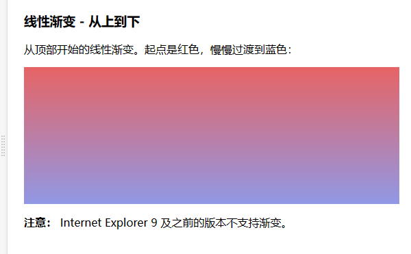


- 线性渐变 - 从左到右

```css
#grad {
  height: 200px;
  background-image: linear-gradient(to right, red , yellow);
}
```
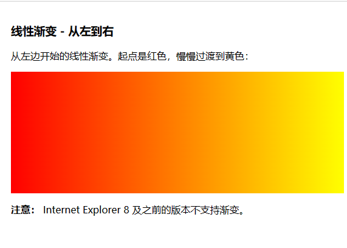
- 线性渐变 - 对角
```css
#grad {
  height: 200px;
  background-image: linear-gradient(to bottom right, red, yellow);
}
```
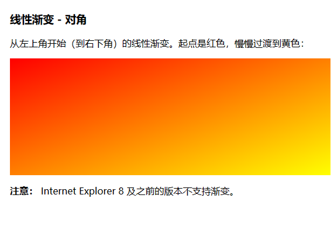

- 使用角度
  如果你想要在渐变的方向上做更多的控制，你可以定义一个角度，而不用预定义方向（to bottom、to top、to right、to left、to bottom right，等等）。
    -  语法`background-image: linear-gradient(angle, color-stop1, color-stop2);`

```css
#grad {
  background-image: linear-gradient(-90deg, red, yellow);
}
```
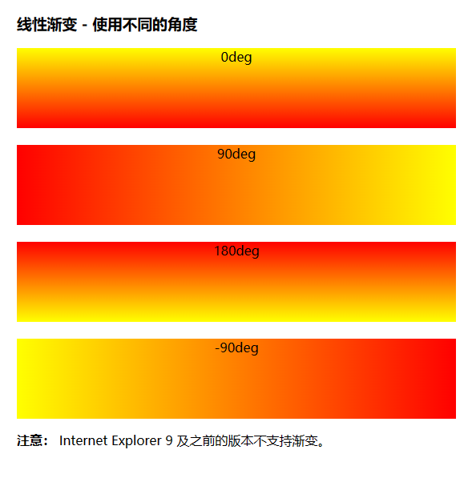

- 使用多个颜色节点
```css
#grad {
  background-image: linear-gradient(red, yellow, green);
}
```
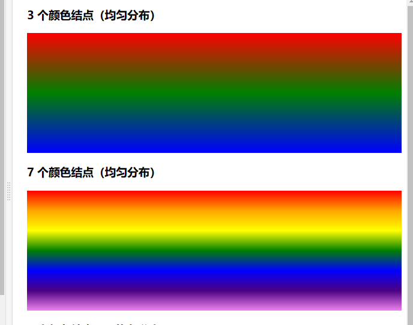


- 重复的线性渐变

repeating-linear-gradient()函数用于重复线性渐变

```css
#grad {
  /* 标准的语法 */
  background-image: repeating-linear-gradient(red, yellow 10%, green 20%);
}
```
#### <h3 id="19_2">19.2 径向渐变</h3>

径向渐变由它的中心定义。

为了创建一个径向渐变，你也必须至少定义两种颜色节点。颜色节点即你想要呈现平稳过渡的颜色。同时，你也可以指定渐变的中心、形状（圆形或椭圆形）、大小。默认情况下，渐变的中心是 center（表示在中心点），渐变的形状是 ellipse（表示椭圆形），渐变的大小是 farthest-corner（表示到最远的角落）

- 语法  
`background-image: radial-gradient(shape size at position, start-color, ..., last-color);`
  
- 径向渐变 - 颜色节点均匀分布（默认情况下）

```css
#grad {
  background-image: radial-gradient(red, yellow, green);
}
```

- 设置形状  

shape 参数定义了形状。它可以是值 circle 或 ellipse。其中，circle 表示圆形，ellipse 表示椭圆形。默认值是 ellipse。


```css
#grad {
  background-image: radial-gradient(circle, red, yellow, green);
}
```
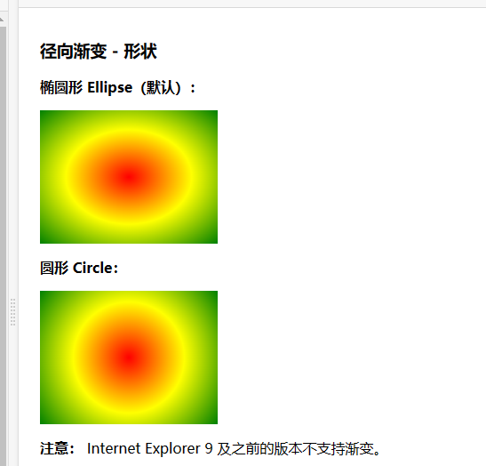

- 不同尺寸大小关键字的使用  
size 参数定义了渐变的大小。它可以是以下四个值：
    -  closest-side
    - farthest-side
    - closest-corner 
    - farthest-corner
```css
#grad1 {
    background-image: radial-gradient(closest-side at 60% 55%, red, yellow, black);
}

#grad2 {
    background-image: radial-gradient(farthest-side at 60% 55%, red, yellow, black);
}
```

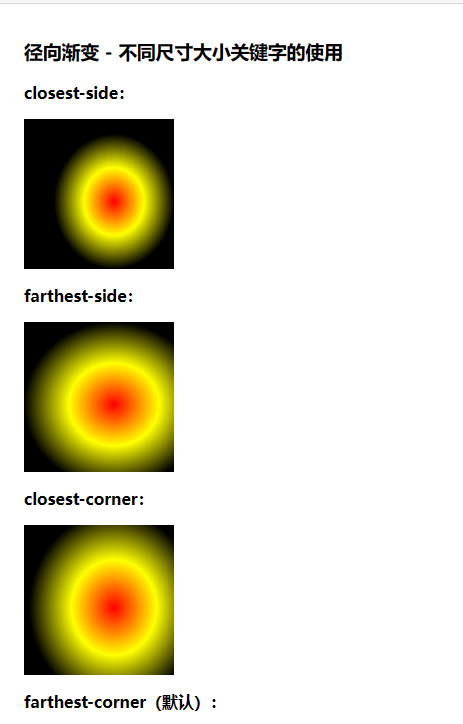

### <h2 id="20">20. CSS动画</h2>
transform：  
``` 
rotateX(30deg) 绕着x旋转30deg
rotateY(30deg) 绕着y旋转30deg
rotateZ(30deg) 绕着z旋转30deg
translateX(30px) 沿着x轴移动30px
translatey(30px) 沿着y轴移动30px
translatez(30px) 沿着Z轴移动30px( 必须给父盒子加透视)
```

### <h2 id="21">21.Css单位px,rem,em,vw,wh的区别</h2>

1. px  

px就是pixel像素的所系,相对长度单位,网页设计hi常用的基本单位  
像素px时相对于显示器分辨率而言的

2. em

em时相对长度单位,相对于当前对象内文本的字体尺寸(参考元素时父元素font-size)  
如果当前父元素尺寸为设置,则相对于浏览器默认的字体尺寸(一般浏览器默认16px)  

特点: 
> 1. em的值并不是固定的
> 2. em会集成父级元素的字体大小

3. rem

rem是CSS3新增的一个相对单位,rem是相对于HTML根元素的字体大小(font-size)
来计算的长度单位 
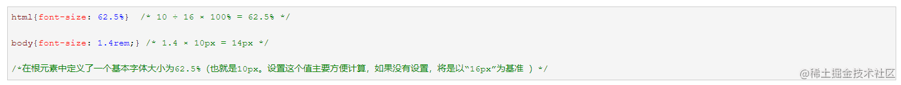

优点: 只要设置根元素的字体大小就可以把整个页面的比例调调好    
rem兼容性: 除了IE8及更早版本外,所有浏览器都已支持rem  
如没有设置html的字体大小,就会以浏览器默认的字体大小,一般是16px  

**em与rem的区别:**  

rem是相对与根元素(html)的字体大小,而em是相对与其入元素的字体大小  

**两者的使用规则**  
如果整个属性根据它的font-size进行测量,则使用em其他的一切事物均使用rem  

推荐单位转换工具: [pxtorem.com/](pxtorem.com/)

4. vw,vh 

vw,vh,vmax,vmin这四个单位都是基于视口  

vw是相对视口(viewport)的宽度而定的,长度等于视口宽度1/100

如果浏览器的宽度为200px, 那么1vw就等于2px(200px/100)

vh是相对视口的高度而定的,长度等于视口高度的1/100

vmin是相对于视口的高度和宽度两者之间的最小值或者最大值


5. 其他单位

%(百分比)  

一般来说就是相对于父元素  

1. 对于普通定位元素就是我们理解的父元素  
2. 对于position:absolute;的元素是相对于已定位的父元素
3. 对于position:fixed的元素是相对于ViewProt(可视窗口)

6. vm 

css3新单位,相对于视口的宽度或高度中较小的那个

其中最小的那个被均分为100单位的vm  

缺点: 兼容性差

**常见问题:**  
```text
1. pc,pt,ch一般用在什么场景?
    这些网页设计基本上用不到,在排版上会有用处
   
2. 如何使 1rem = 10px?
    设置HTML{font-siz:62.5%}即可

3. 如果父元素没有指定高度，那么子元素的百分比的高度是多少？

会按照子元素的实际高度，设置百分比则没有效果    

```

### <h2 id="21"></h2>
### <h2 id="21"></h2>
### <h2 id="21"></h2>
### <h2 id="21"></h2>
### <h2 id="21"></h2>
### <h2 id="21"></h2>
### <h2 id="21"></h2>


