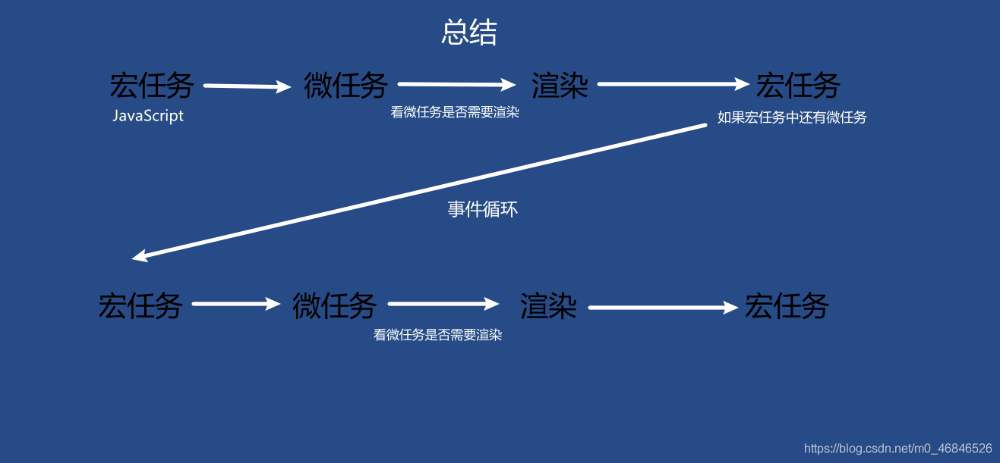

## 前端面试JS部分总结
_____

本笔记由作者在复习前端JS部分的相关的一些总结, 如果有什么错误的地方或者有什么相关的建议欢迎联系我

这份笔记借鉴了很多网上的文章, 如果有雷同或者相似的地方, 不用怀疑, 那就是搬得, 如果你是当中一些文章得作者,
如果觉得这种行为不恰当, 请与我联系, 收到消息后我会尽快处理

邮箱: zwn_fobj@foxmail.com

QQ: 1879154660  
QQ昵称: 只为你乱了浮生

感谢各位观看者的支持, 希望能对正在面临面试的你有所帮助,
____

## 目录

- [1. 对js语言理解](#1)
- [2. MD5加密步骤](#2)
- [3. super关键字 --- ES6新特性class类](#3)
- [4. typeof原理:](#4)
- [5. instanceof原理:(可以判断是否是父类的实例)](#5)
- [6. localStorage和sessionStorage的区别](#6)
- [7. es6中set和map](#7)
- [8. var/let/const 区别](#8)
- [9.重绘和回流](#9)
- [10. es6中的Promise理解](#10)
- [11. es6中async/await和.then的区别](#11)
- [12. jd原型链](#12)
- [13. 宏任务和微任务](#13)
- [14. es6箭头函数](#14)
- [15. 防抖和节流](#15)
- [16. JS闭包](#16)
    - [16.1 对js闭包的理解以及常见应用场景(闭包的作用)](#16_1)
- [17.js获取和添加节点方法](#17)
- [18. 线程与进程](#18)
- [19. async和await](#19)
- [20. for in 和 for of 的区别](#20)
- [21. 对深拷贝和浅拷贝有了解吗为什么会出现深拷贝和浅拷贝这两种概念](#21)
- [22.扩展运算符](#22)
- [23. 在es5中的变量](#23)
- [24. 词法作用域和动态作用域](#24)
- [25.JavaScript this关键字](#25)
- [26. DOM事件流机制 / 事件捕获](#26)
- [27. 如何阻止冒泡?](#27)
- [28. let var const](#28)
- [29. 箭头函数](#29)
- [30. promise的all和race](#30)
- [31. JS闭包](#31)
- [32. 深拷贝和浅拷贝](#32)
- [33. set和map的区别](#33)
- [34. promise和setTimeout及asyn,awit的区别是什么](#34)
- [35. JS的垃圾回收机制](#35)
- [36. 懒加载有哪些内容](#36)
- [37.  JS的数据类型都有哪些](#37)
- [38. 除了const以外可以用什么方式让变量不能被更改](#38)
- [39. url的组成部分](#39)
- [40. js中获取url的信息是什么](#40)
- [41. 为什么要使用路由呢？](#41)
- [42. URL和URI之间的区别是什么](#42)


____

### <h2 id="1">1. 对js语言理解</h2>

JavaScript(简称"JS")是一种具有函数优先的轻量级, 解释型或及时编译型的编程语言;
虽然它是作为开发Web页面的脚本语言而出名,但是它也被用到了很多非浏览器环境中, JavaScript基于原型编程,
多范式的动态脚本语言, 并且支持面向对象,命令式,声明式,函数式编程范式

### <h2 id="2">2. MD5加密步骤</h2>

创建一个MD5加密对象,然后获取我们输入的明文,用getBytes()方法转换成字符串的形式,因为用md5的digest方式把他们都加密成16位字符,
因为md5是要把16位字符转换成32位的16进制字符串, 所以我们要遍历这16位字符,如果有小于16位的话,那就在后面append补0,这样就能够保证了这个字符串转换后是2位字符了,
如果有小于0的也不可以,一个字符的区间最大是255最小是-256,所以有小于0的字符就+256就可以保证他们都是非负数了,这样所有的16位字符都能满足要求;
再把他们通过md5的内部算法转化成32位16进制字符就可以了

### <h2 id="3">3. super关键字 --- ES6新特性class类</h2>

可以作为函数, 也可以作为对象去使用

当作为函数的时候: 只能在构造器中使用, 代表调用父类的构造器

当作为对象使用时, 如果去调用一个方法,那么它指向的时父类的原型对象, 调用的方法中如果有this的话, this的指向时字类实例

当作为对象使用时,如果去调用static静态方法, 那他指向的是父类, 调用方法中如果有this的话, this的指向是子类

- 语法

``` javascript
    super(arguments);  // 调用父构造函数
    super.parentMethod(arguments);  // 调用父方法
```

```javascript

class Polygon {
    constructor(height, width) {
        this.name = 'Rectangle';
        this.height = height;
        this.width = width;
    }

    sayName() {
        return 'Hi, I am a ', this.name + '.';
    }

    get area() {
        return this.height * this.width;
    }

    set area(value) {
        this._area = value;
    }
}

class Square extends Polygon {
    constructor(length) {
        // 这里，它调用父类的构造函数的，
        // 作为 Polygon 的 height, width
        super(length, length);

        this.height; // 需要放在 super 后面，不然引发 ReferenceErro

        // 注意：在派生的类中，在你可以使用'this'之前，必须先调用 super()。
        // 忽略这，这将导致引用错误。
        this.name = 'Square';
    }
}
```

### <h2 id="4">4. typeof原理:</h2>

判断变量的类型: object number string boolean function undefined null symbol  

js在底层存储变量的时候, 会在变量的机器码的为hi在1-3位存储其类型信息:

000: 对象   010: 浮点数   100: 字符串    110: 布尔    1: 整数

但是对于null: 所有机器码均为0 undefined: 用 -2 的30次幂来表示

null 是一个空指针, 准备存储数据的: undefined是定义了一个变量但是没有赋值就undefined

### <h2 id="5">5. instanceof原理:(可以判断是否是父类的实例)</h2>

只要右边的prototype属性在左边的原型链上:

instanceof在查找的过程中会遍历左边变量的原型链 直到找到右边变量的prototype属性

想比较准确的确定对象类型时可以采用: 
object.prototype.tostring.call()

Function.prototype._proto__==Object.prototype

Object._proto_=Function.prototype


### <h2 id="6">6. localStorage和sessionStorage的区别</h2>

1. 生命周期

localStorage的生命周期是永久的,关闭页面后浏览器后localStorage中的数据也不会消失;
localStorage防护非主动删除数据,否则数据永远不会消失

sessionStorage的生命周期是仅在当前会话下有效  
sessionStorage引入了一个"浏览器窗口"的概念  
sessionStorage是在同源的窗口中始终存在的数据, 只要这个浏览器窗口没有关闭,即使刷新页面或者进入另一个页面,  
数据依然存在. 但是sessionStorage在关闭了浏览器窗口后就会被销毁;
同时独立的打开同一个窗口同一个页面,sessionStorage也是不一样的

2. 存储大小

localStorage和sessionStorage的存储数据大小一般都是5MB

3. 存储位置  
   localStorage和sessionStorage都保存在浏览器端,不与服务器进行交互通信  
   
4. 存储内容类型  
   localStorage和sessionStorage**只能存储字符串类型**对于复杂的对象可以使用ECMAScript提供的JSON对象的`stringify`和`parse`来处理
   
5. 获取方式  

localStorage: window.localStorage  
sessionStorage: window.sessionStorage

6. 应用场景

localStorage: 常用于长期登录(+判断用户是否已登录), 适合长期保存在本地的数据  
sessionStorage: 敏感账号一次性登录  

### <h2 id="7">7. es6中set和map</h2>

**set(集合)**

基本用法: 他类似于数组, 但是成员的值都是唯一的, 没有重复的值, 可以用来数组去重/字符串去重(join("")).  
使用的算法叫做`Same-value-zero-equality`, 它类似于精确相等运算符(`===`),但是在Set内部,
两个`NaN`是相等的;而`===`中NaN是不等于自身的  

属性: consructor属性, size属性: 返回set中元素的总和(set的大小)

方法:  
1.操作方法 add has delete clear   
2. 遍历方法 `keys(键名)` `values(键值)` `entries(键值对)` `forEach() 遍历每个成员对象`  
   遍历应用: 用map把所有值诚意2, 用filter过滤条件实现交集并集
   

**weakset**:  
与set两个区别:  
1. 成员只能是对象  
2. 对象只能是弱引用,也就是说如果其他独享都不再引用该对象,那么垃圾回收机制会自动回收该对象所占的内存  

方法: 有 add delete has 没有 size 和foreach, 因为成员都是弱引用,遍历机制无法保证成员的存在,
和可能刚遍历结束,成员就取不到了


**map**  
本质就是键值对的集合  
基本用法: 是js的对象, 值-值对对应, 对一个键多次赋值会覆盖,位置的键undefined,跟内存地址绑定的,
内存地址不一样就视为两个键  

属性:
size属性: 返回所有成员所有总和  
方法: 1.操作方法: set,get,has,delete,clear
    2. 遍历方法: keys() values() entries() forEach()

map转数组: [...map] 数组转map: 把数组传入new map中  
map转对象: 
对象转map:  

weakmap: 与map两个区别  
1. 只能是对象  
2. 对象不计入垃圾回收机制  

set是一种关联容器, 其特性如下:  
- set以RBTree作为底层容器  
- 所得元素的只有key没有value, value就是key  
- 不允许出现键值重复  
- 所有的元素都会被自动排序  
- 不能通过迭代器来改变set的值, 因为set的值就是键  

map和set一样是关联式容器,他们的底层容器都是红黑树, 区别在于map的值不作为键, 键和值是分开的,
他的特性如下:  

- map以RBTree作为底层容器  
- 所有元素都是键 + 值存在
- 不允许键重复
- 所有元素是通过键进行自动排序的
- map的键是不能修改的, 但是其对应的值是可以修改的

### <h2 id="8">8. var/let/const 区别</h2>
var:存在全局作用域window和函数作用域两种,没有块级作用域的说法,并且存在变量提升

let: 用于js中定义变量, 只再声明的代码块中生效(块级作用域),暂时性死区(在声明变量之前无法读取或操作这个变量 会报错),
没有变量提升,无法let重复声明

const: 用于js中定有常量, 如果存储简单类型如字符串, 数字和布尔值, 值就能保存在常量指向的内存地址,
而复杂类型的数据如 对象,数组和函数,常量指向的内存地,址, 实际上是保存了指向实际数据的指针, 
所以const只能保证指针是固定的,只遇指针指向的数据结构变不变就无法控制了,
一旦声明变量,就必须立即初始化,不能留到以后赋值

const 是用来定义常量的, 尝试修改const声明的变量会导致运行上报错  
const也不可以重复声明, const也是块级作用域

### <h2 id="9">9.重绘和回流</h2>

什么是回流

当render tree 中的一部分(或全部)因为元素的规模尺寸, 布局, 隐藏等改变而需要重新构建, 这就称为回流(reflow),
每个也面至少需要一次回流,就是在页面第一次加载的时候,这时候是一定会发生回流的, 因为要构建 render tree;
在回流的时候, 浏览器会使渲染树中受到影响的部分失效,并重新构造这部分渲染树,完成回流后,浏览器会重新绘制受印象的部分到屏幕中,
该过程称为回流

什么是重绘

当render tree中的一些元素需要更新属性,而这些属性只是影响元素的外观,风格, 而不影响布局的,  比如: background-color,z 这就称之为重绘

区别: 

回流必将引起重绘, 而重绘不一定引起回流, 比如: 只有颜色改变的时候,就只会发生重绘而不会引起回流,  
当页面和集合属性改变时就需要回流  
比如: 添加或者删除可见的DOM元素,元素位置不变,元素尺寸改变--边距,填充,边框,宽度,高度,和内容的改变

### <h2 id="10"> 10. es6中的Promise理解</h2>
1. promise是一种异步编程的解决方案, 简单来说就是一种容器, 里面保存着某种未来才会结束的事件;

```promise对象有两个特点:  
    1. 状态不受外界影响, pending fulfilled rejected, 只有异步操作的结果才可以决定是哪一种状态, 其他任何操作都无法改变这个状态,  
    2. 一旦状态改变就不会再变; pending->fulfilled   pending->rejected 只要改变就 resolved 凝固了, 会一直保持这个结果  

缺点:  
    1. promise无法取消, 新建就会立即执行, 无法中途取消  
    2. 如果不设置回调的话,promise内部抛出的结果不会反映到外部  
    3. 当处于pending状态时, 无法得知进展道哪一个阶段(刚开始还是即将完成)  

```

2. 基本用法
    1) 先 new Promise再then回调两个函数
    2) promise.prototype.then(), 该then方法返回的是新的promise实例,因此可以采用链式写法,
       then方法后面调用then方法, 
       比如说第一个then方法返回一个promise新对象，第二个then方法就会等待这个新的promise对象状态发生改变。  
       
    3) promise.prototype.catch()用于发生错误时的回调，抛出错误。但是如果状态是promise的reject的话，再抛出错误是无效的。如果不用catch的话，程序执行报错就无法运行了，但是catch的话只是输出错误然后继续运行。

    4) promise.prototype.finilly()定义不管promise对象最后状态是什么都会执行的操作。finilly里面的操作，应该是与状态无关的，不依赖于promise的执行结果。

    5) promise.all() 用于多个promise实例包装成一个新的promise实例，const p = Promise all ([p1,p2,p3]) 只有p1,p2,p3状态都变成fulfilled时，p的状态才是fulfilled，三个返回值组成数组传递给p的回调函数。只要有一个是rejected，那p的状态就是rejected，第一个被rejected的实例就传递给p的回调函数。并行。

    6) promise.race()同上，只要有一个状态先改变，p的状态就会改变。

    7) promise.allSettled()   无论几个状态是成功还是失败，都可以返回结果，包容性强。
    

应用场景: 加载图片

### <h2 id="11">11. es6中async/await和.then的区别</h2>

async/await是一种编写异步代码的新方法,在这之前编写异步代码使用的是回调函数和promise

async/await实际上是建立在promise之上的, 因此你不能把它和回调函数搭配使用  

async/await可以使异步代码在形式上更接近于同步代码, 这就是它最大的价值

async/await是过去几年中JavaScript引入的最具革命性的特性之一。它使你意识到promise在语法上的糟糕之处，并提供了一种简单，直接的替代方案。

async说白了就是让请求接口的顺序按自己想要的顺序执行。一个等一个

**promise + .then 写法**

```javascript
const makeRequest = () => {
  return promise1()
    .then(value1 => {
      return promise2(value1)
        .then(value2 => {     
          return promise3(value1, value2)
        })
    })
}
```
**或者用promise + .all 写法优化一下**: 

```javascript
const makeRequest = () => {
  return promise1()
    .then(value1 => {
      return Promise.all([value1, promise2(value1)])
    })
    .then(([value1, value2]) => {       
      return promise3(value1, value2)
    })
}
```
**用async 解决:**
```javascript
const makeRequest = async () => {
  const value1 = await promise1()
  const value2 = await promise2(value1)
  return promise3(value1, value2)
}
```

### <h2 id="12">12. js原型链</h2>

原型对象

在 JavaScript 中,每当定义一个对象(函数也是对象)时候,对象中都会包含一些预定的属性,其中每个**函数对象**都有一个`prototype`属性,
这个属性指向函数的**原型对象**

原型链

每个对象都可以有一个原型*proto*,这个原型还可以有自己的原型,以此类推,形成一个原型链,链。
**查找特定属性的时候，我们先去这个对象里去找，如果没有的话就去它的原型对象里面去，如果还是没有的话再去向原型对象的原型对象里去寻找...... 这个操作被委托在整个原型链上，这个就是我们说的原型链了。**

### <h2 id="13">13. 宏任务和微任务</h2>

**宏任务**  
(macro)task, 可以理解是每次执行栈执行的代码就是一个宏任务(包括每次从事件队列中获取一个事件回调并放到执行栈中执行)  

浏览器为了能够使JS内部(macro)task与DOM任务能够有序的执行, 会在一个(macro)task执行后,在下一个(macro)task执行开始之前,
对页面重新渲染, 流程如下
```(macro)task->渲染->(macro)task->...```

宏任务是一些独立和离散的工作,有主机(如浏览器或Node.js)发起,例如setTimeout,setInterval,setImmeditate等

**宏任务包括**

``` 
script(整体代码)
setTimeout
setInterval
I/O
UI交互事件
postMessage
MessageChannel
setImmediate(Node.js 环境)
```

**微任务**  


microtask,可以理解在当前task执行后立即执行的任务,
也就是说,在当前task任务后,下一个task之前,在渲染之前;

所以它的响应速度相比setTimeout(setTimeout是task)会更块,因为无需渲染;
也就是说在某个macrotask执行后,将会将在它执行期间产生的所有microtask都执行完毕(在渲染前)

微任务是一些由JAvaScript本身发起的更小和更快的工作,例如Promise.then,MutationObserver等,
微任务队列在每个宏任务执行之后执行,直到清空

在ES6规范中,微任务被称为jobs, 而宏任务被称为task

**微任务包括**
``` 
Promise.then  
Object.observe  
MutationObserver  
process.nextTick(Node.js 环境)

```

**宏任务与微任务的执行顺序**   

请参考:  
[宏任务与微任务的执行顺序](https://blog.csdn.net/m0_46846526/article/details/117909805)

**运行机制**  

在事件循环中,每进行一次循环操作称为tick,这一次tick的任务处理模型是比较复杂的,但关键步骤如下:  
- 执行一个宏任务(栈中没有就从事件队列中获取)
- 执行过程中如果遇到微任务,将将它添加道微任务的任务队列中
- 宏任务执行完毕后,立即执行当前微任务队列中的所有微任务(依次执行)
- 当前宏任务执行完毕, 开始检查渲染,然后GUI线程接管渲染
- 渲染完毕后, JS线程继续接关, 开始下一个宏任务(从事件队列中获取)


**事件循环**




### <h2 id="14">14. es6箭头函数</h2>

**箭头函数**内部的this是词法作用域,由上下文确定. (词法作用域是由你在写代码时将变量和块作用域写在哪里来决定的,因此当词法分析器
处理代码时会保持作用域不变)

- - 只有一个参数, 可以省略()
  - 只有一条命令语句,可以省略()
  - 只有一条命令语句且时return可以省略{} 和 return
  
- - 箭头函数由几个使用注意点:  
    (1) 箭头函数没有自己的this对象, 指向外层函数的对应变量: arguments, super, new.target  
    (2) 不可当做构造函数,也就是说,不可以对箭头函数使用new命令,否则会抛出一个错误  
    (3) 另外,由于箭头函数没有自己的this, 所以当然也就不能用call(), apply(), bind()这些方法来改变this的指向  
    最重要的是第一点, 对于普通函数来说,内部的this指向函数运行时所在的对象,但是这一点对箭头函数不成立;
    它没有自己的`this`对象,内部的`this`就是定义时上层作用域中的`this`,也就是说;
    箭头函数内部`this`指向是固定的,相比之下,普通函数的`this`指向是可变的
    

不适合场合:
```javascript 

const cat = {
  lives: 9,
  jumps: () => {
    this.lives--;
  }
}
//1.对象不能单独构成作用域，使得this指向全局变量，不能达到预期目的。


var button = document.getElementById('press');
button.addEventListener('click', () => {
  this.classList.toggle('on');
});

//2.动态使用this的时候，也不应该使用箭头函数。
//在这个例子中this指向了全局对象，会报错；如果改成普通函数的话this就会指向按钮，实现点击功能。

```

### <h2 id="15">15. 防抖和节流</h2>
- 什么是防抖: 防抖指的是触发事件之后n秒后才执行,如果在n秒内又触发了事件,则会重新计算函数执行时间
- 什么是节流: 就是连续触发事件但在n秒钟只执行一次函数, 节流会稀释函数的执行频率

``` 
当函数绑定一些持续触发的事件如：resize、scroll、mousemove ，键盘输入，多次快速click等等，

如果每次触发都要执行一次函数，会带来性能下降，资源请求太频繁等问题
```

**防抖的操作:**  
只有在某个时间内,没有再次触发某个函数时,才真正的调用这个函数;

理解一下他的过程:  
- 事件触发时,相应的函数并不会立即触发,而是会等待一定的事件;;
- 当事件密集触发时, 函数的触发会被频繁的推迟;
- 只有等待了一段事件也没有事件触发,才会真正的执行相应安徽拿书

防抖的应用场景很多:     
搜索框钟的输入内容,搜获或者提交信息;  
频繁的点击按钮, 触发某个事件;  
监听浏览器滚动事件,完成某个特定操作;
用户缩放浏览器的resize事件;

总之,**密集的事件触发,我们只希望触发比较靠后的发生的事件,就可以使用防抖函数;**


**为什么需要节流?**   王者荣耀技能

**节流的操作：在某个时间内（比如500ms），某个函数只能被触发一次；**  

**节流的应用场景：**

监听页面的滚动事件；

鼠标移动事件；

用户频繁点击按钮操作；

游戏中的一些设计；

总之，依然是**密集的事件触发，但是这次密集事件触发的过程，不会等待最后一次才进行函数调用，而是会按照一定的频率进行调用**；


### <h2 id="16">16. JS闭包</h2>

闭包构成的条件: 函数 + 函数 能够访问的自由变量

**闭包**是一个函数以及其捆绑的周边环境(词法环境)的引用的组合,换而言之,闭包让开发这可以从内部函数访问外部函数的作用域,
在JavaScript钟,闭包会随着函数的创建而被同时创建

```javascript
var add = (function () {
    var counter = 0;
    return function () {return counter += 1;}
})();
 
add();
add();
add();
 
// 计数器为 3

/*
* 实例解析
* 变量 add 指定了函数自我调用的返回字值。

* 自我调用函数只执行一次。设置计数器为 0。并返回函数表达式。

* add变量可以作为一个函数使用。非常棒的部分是它可以访问函数上一层作用域的计数器。

* 这个叫作 JavaScript 闭包。它使得函数拥有私有变量变成可能。

* 计数器受匿名函数的作用域保护，只能通过 add 方法修改。
* */

```
> 闭包是一种保护私有变量的机制，在函数执行时形成私有的作用域，保护里面的私有变量不受外界干扰。
>
> 直观的说就是形成一个不销毁的栈环境。

#### <h3 id="16_1">对js闭包的理解以及常见应用场景(闭包的作用)</h3> 

使用闭包住哟啊为了设计私有的方法和变量

- 优点是可以避免环境变量的污染
- 缺点是闭包会长驻内存,ui增大内存的使用量,使用不当很容易造成内容泄露

在js中, 函数及闭包,函数才会产生作用域的概念

参考资料:  

[面试官：谈谈对JS闭包的理解及常见应用场景(闭包的作用)](https://blog.csdn.net/qq_39903567/article/details/115010640)


### <h2 id="17">17.js获取和添加节点方法</h2>

**获取：**

通过 id 找到 HTML 元素

```js
document.getElementById("demo");
```

通过标签名找到 HTML 元素

```js
document.getElementsByTagName("div");
```

通过类名找到 HTML 元素

```js
document.getElementsByClassName("a");
```

h5新增方法

document.querySelector和document.querySelectorAll

添加: 
1. 父节点.appendChild()
2. 夫界定啊insertBefore(要插入的节点,参考节点)


### <h2 id="18">18. 线程与进程</h2>
1. 线程是执行程序的最小单位, 而进程是操作系统分配资源的最小单位  

2. 一个进程由由一个或多个线程组成, 线程是一个进程中代码的不同执行路线

3. 进程之间互相独立,但同一个进程下的各个线程之间共享程序的内存控件(包括代码段,数据集,堆等)
   及一些进程的资源(如打开文件和信号等),某进程的线程在其他进程不可见
   
4. 调度和切换: 线程上下文切换比进程上下文切换要快的多

### <h2 id="19">19. async和await</h2>

```
    async
    async是一个加载函数前的修饰符,被async定义的函数会默认返回一个Promise对象resolve的值,因此堆async函数可以直接then,
    返回值就是then方法传入的函数
    
    await
    await也是一个修饰符,只能放在async定义的函数内,额可以理解为等待,
    await修时的如果是Promise对象: 可以获取Promise中返回的内容
    (resolve或reject的参数), 且取值后语句才会向下执行;
    如果不是Promise对象: 把这个非Promise的东西当作await表达式的结果
```


### <h2 id="20">20. for in 和 for of 的区别</h2>

`for in` 遍历的是一个对象的索引, 而`for of `遍历的时候数组元素的值,  
`for in` 总是得到对象的 `key` 或 数组和字符串 的下标
`for of` 总是得到的数组,字符串的值

for of适用遍历数/数组对象/字符串/map/set等拥有迭代器对象（iterator）的集合，但是不能遍历对象，
因为没有迭代器对象，但如果想遍历对象的属性，你可以用for in循环（这也是它的本职工作）或用内建的Object.keys()方法

示例:

```javascript
let arr = [1,2,3]
Array.prototype.a = 123

for (let index in arr) {
    let res = arr[index]
    console.log(res)
}
//1 2 3 123

for(let index in arr) {
    if(arr.hasOwnProperty(index)){
        let res = arr[index]
        console.log(res)
    }
}
// 1 2 3

```

### <h2 id="21">对深拷贝和浅拷贝有了解吗为什么会出现深拷贝和浅拷贝这两种概念</h2>

首先深复制和浅复制只针对像 Object, Array 这样的复杂对象的。
简单来说，浅复制只复制一层对象的属性，而深复制则递归复制了所有层级。

浅复制只会将对象的各个属性进行依次复制，
并不会进行递归复制，而 JavaScript 存储对象都是存地址的，
所以浅复制会导致 [obj.arr](https://www.zhihu.com/search?q=obj.arr&search_source=Entity&hybrid_search_source=Entity&hybrid_search_extra={"sourceType"%3A"answer"%2C"sourceId"%3A46220227})
和 shallowObj.arr 指向同一块内存地址

而深复制则不同，它不仅将原对象的各个属性逐个复制出去，
而且将原对象各个属性所包含的对象也依次采用深复制的方法**递归复制**到新对象上。
这就不会存在上面 obj 和 shallowObj 的 arr 属性指向同一个对象的问题。

需要注意的是，如果对象比较大，层级也比较多，深复制会带来性能上的问题。
在遇到需要采用深复制的场景时，可以考虑有没有其他替代的方案。在实际的应用场景中，也是浅复制更为常用。


### <h2 id="22">22.扩展运算符</h2>

**定义:**
扩展运算符(...)是ES6的语法, 用于取出参数对象的所有可遍历属性,然后拷贝到当前对象中, (在react setStatus和redux的reducer中经常使用)

**基本用法:**
```javascript
let person = {name:'Amy', age: 15}
let someone = {...person}
//someone // {name:'Amy',age:'15'}
```
**特殊用法:** 

**数组**

由于数组是特殊的对象, 所以对象的扩展也能算符可以用于数组  
```javascript
let foo = {...['a','b','c']};
foo
// {0:'a', 1:'b', 2:'c'}
```

**空对象**

如果扩展运算符后面是一个空对象, 则没有任何效果
```javascript
    let a = {...{},a:1}
    a // { a : 1 }
```

**Int 类型, Boolean类型, undefined, null**

如果扩展运算符后面是上面这几种类型,都会返回一个空对象,因为他们没有自身属性

```
// 等同于 {...Object(1)}
{...1} // {}

// 等同于 {...Object(true)}
{...true} // {}

// 等同于 {...Object(undefined)}
{...undefined} // {}

// 等同于 {...Object(null)}
{...null} // {}
```

**字符串**
如果扩展运算符后面是字符串，它会自动转成一个类似数组的对象

```javascript
let a = {...'hello'}
//a == {0: "h", 1: "e", 2: "l", 3: "l", 4: "o"}
```

对象的合并

```javascript
let age = {age:15}
let name = {name:'Amy'}
let person = {...age,...name}
person; //{age:15, name:'Amy'}
```

**注意事项**
> 自定义的属性和拓展运算符对象里面属性相同的时候;  
> 自定义的属性在扩展运算符后面, 则扩展运算符对象内部同名的属性将被覆盖掉

```javascript
let person = {name: "Amy", age: 15};
let someone = { ...person, name: "Mike", age: 17};
someone;  //{name: "Mike", age: 17}
```
自定义的属性在拓展运算符前面, 则变成设置新对象默认属性值
```javascript
let person = {name:'Amy',age:'15'};
let someone = {name:'Mike',age:'17',...person};
someone; //{name:'Amy', age:15}
```

### <h2 id="23">23. 在es5中的变量</h2>

在es5中变量作用域分为两种: 全局变量,局部变量;  

局部变量: 写在函数体内部, 其中安徽拿书中所传递的参数也是局部变量(小括号中的), 
仅在定义的部分能够使用;  

全局变量: 写在函数体外部的变量, 其中在函数中使用但未用var声明的变量也是全局变量, 可以在全局中任何部分使用

### <h2 id="24">24. 词法作用域和动态作用域</h2>

词法作用域: 函数在定义的时候决定了函数的作用域, JavaScript采用词法作用域

动态作用域: 函数在调用的时候决定函数的作用域,目前只有部分语言支持

### <h2 id="25">25.JavaScript this关键字</h2>

面向对象语言中this表示当前对象的一个引用  

但在JavaScript中this不是固定不变的,它会随着环境的改变而改变

- 在方法中,this表示该方法所属的对象
- 如果单独使用, this表示全局对象
- 在函数中, this表示全局对象
- 在函数中, 在严格模式下, this是未定义的(undefined)
- 在事件中, this表示接收事件的元素
- 类似call() 和 apply() 方法可以将this引用到任何对象

### <h2 id="26">26. DOM事件流机制 / 事件捕获</h2>

什么是DOM?  
    DOM 是描述 HTML 的内部数据结构,它会将 Web 页面和 JavaScript 脚本连接起来, 并过滤一些不安全的内容;
    HTML 解析器会把字节转换成DOM

一个事件在发生的时候会在子元素和父元素之间传播,这会分成三个阶段:  
1. window 传到目标节点 ---- 捕获阶段(上层传到底层)
2. 目标节点触发 ---- 目标阶段
3. 目标节点传到window ---- 冒泡阶段(底层传到上层)

### <h2 id="27">27. 如何阻止冒泡?</h2>

1. event.stopPropagation()方法 阻止事件冒泡
```javascript
	$('.btn').click(function (even) {
		even.stopPropagation();
		alert('按钮被点击了');
	})
```

这是阻止事件的冒泡方法，不让事件向documen上蔓延，但是默认事件任然会执行，当你掉用这个方法的时候，如果点击一个链接，这个链接仍然会被打开。

例如: 

```html
<a href="https://www.csdn.net/" class="box">
	<button class="btn">按钮</button>
</a>
```

2. event.preventDefault()方法 阻止默认事件

```javascript
	$('.btn').click(function (even) {
		even.preventDefault();
		alert('按钮被点击了');
	})
```

这是阻止默认事件的方法,调用此方方法,链接不会被打开,但是会发生冒泡, 冒泡会传递到上一层的父元素;

3. return false;

```javascript
	$('.btn').click(function (even) {
		alert('按钮被点击了');
		return false;
	})
```
这个方法比较暴力, 他会同时阻止冒泡也会阻止默认事件; 写上这段代码, 链接不会被打开,事件也不会传递到上一层的u父元素; 类似于同时调用了event.stopPropagation()和event.preventDefault()

### <h2 id="28">28. let var const</h2>
``` 
    var定义的变量没有块的概念, 可以跨块访问, 不能跨函数访问  
    let定义的变量,之恶能在块作用域里访问, 不能跨块访问, 也不能跨函数访问
    const用来定义常量, 使用时必须初始化(即必须赋值), 只能在块作用域里访问,而且不能修改

```

### <h2 id="29">29. 箭头函数</h2>
```
    箭头函数没有自己的this，指向外层普通函数作用域
    箭头函数没有constructor，不能通过new 调用；
    没有new.target 属性
    箭头函数不绑定Arguments 对象
```


### <h2 id="30">30. promise的all和race</h2>

all与then同级的另一个方法, all方法, 该方法提供了并行执行异步操作的能力,并且所有异步操作执行完成后并且执行结果都是成功的时候才执行回调  
all是等所有异步操作执行完了再执行then方法, 

race方法就是相反的,谁先执行完成就先执行回调,执行完的不管是进行了race的成功回调还是失败回调,其余的将不会再进入race的任何回调

### <h2 id="31">JS闭包</h2>

闭包是指有权访问另一个函数作用域中变量的函数,创建闭包的最常见的方式就是在一个函数内创建另一个函数,通过另一个安徽拿书访问呢这个函数的局部变量  

- 闭包的特性:
    - 函数内再嵌套函数  
    - 内部函数可以引用外层的参数和变量
    - 参数和变量不会被垃圾回收机制回收
    
- 标记清除 

这是JavaScript中最常用的垃圾回收方式; 当变量进入执行环境时,就标记这个变量为"进入环境";
  从逻辑上讲,永远不能释放进入环境的变量占用的内存, 因为只要执行流进入相应的环境,就可能会用到他们, 
  当变量离开环境时,则将其标记为"离开环境"

- 引用计数

另一种不太常见的垃圾回收策略是引用计数。引用计数的含义是跟踪记录每个值被引用的次数。
当声明了一个变量并将一个引用类型赋值给该变量时，
则这个值的引用次数就是1。相反，如果包含对这个值引用的变量又取得了另外一个值，
则这个值的引用次数就减1。当这个引用次数变成0时，则说明没有办法再访问这个值了，
因而就可以将其所占的内存空间给收回来。这样，垃圾收集器下次再运行时，它就会释放那些引用次数为0的值所占的内存。


### <h2 id="32">32. 深拷贝和浅拷贝</h2>
首先深复制和浅复制只针对像 Object, Array 这样的复杂对象的。
简单来说，浅复制只复制一层对象的属性，而深复制则递归复制了所有层级。

浅复制只会将对象的各个属性进行依次复制，并不会进行递归复制，
而 JavaScript 存储对象都是存地址的，所以浅复制会导致 [obj.arr](https://www.zhihu.com/search?q=obj.arr&search_source=Entity&hybrid_search_source=Entity&hybrid_search_extra={"sourceType"%3A"answer"%2C"sourceId"%3A46220227}) 
和 shallowObj.arr 指向同一块内存地址

而深复制则不同，它不仅将原对象的各个属性逐个复制出去，
而且将原对象各个属性所包含的对象也依次采用深复制的方法**递归复制**到新对象上。
这就不会存在上面 obj 和 shallowObj 的 arr 属性指向同一个对象的问题。

需要注意的是，如果对象比较大，层级也比较多，
深复制会带来性能上的问题。在遇到需要采用深复制的场景时，
可以考虑有没有其他替代的方案。在实际的应用场景中，也是浅复制更为常用。

### <h2 id="33">33. set和map的区别</h2>

set和map一样是关联容器, 他们的底层都是红黑树, 区别在于map的值不作为键, 键和值是分开的

set特性如下:
- set以RBTree作为底层容器
- 所得元素的只有key没有value，value就是key
- 不允许出现键值重复
- 所有的元素都会被自动排序
- 不能通过迭代器来改变set的值，因为set的值就是键

map特性如下:
- map以RBTree作为底层容器
- 所有元素都是键+值存在
- 不允许键重复
- 所有元素是通过键进行自动排序的
- map的键是不能修改的，但是其键对应的值是可以修改的


### <h2 id="34">34. promise和setTimeout及asyn,awit的区别是什么</h2>

1、JS是单线程语言，包括同步任务、异步任务，异步任务又包括宏观任务和微观任务

2、执行顺序：同步任务——>微观任务——>宏观任务

3、宏观任务的方法有：script(整体代码)、setTimeout、setInterval、
I/O、UI交互事件、postMessage、MessageChannel、setImmediate(Node.js 环境)

4、微观任务的方法有：Promise.then、
MutaionObserver、process.nextTick(Node.js 环境)，
async/await实际上是promise+generator的语法糖，也就是promise，也就是微观任务


### <h2 id="35">35. JS的垃圾回收机制</h2>
答：**[垃圾回收](https://developer.mozilla.org/en-US/docs/Web/JavaScript/Memory_Management#garbage_collection)** 是一个术语，
在 [计算机编程 (en-US)](https://developer.mozilla.org/en-US/docs/Glossary/Computer_Programming)中用于描述查找和删除那些不再被其他[对象引用 (en-US)](https://developer.mozilla.org/en-US/docs/Glossary/Object_reference)的[对象](https://developer.mozilla.org/zh-CN/docs/Glossary/Object) 处理过程。
换句话说，垃圾回收是删除任何其他对象未使用的对象的过程。 
垃圾收集通常缩写为 "GC"， 是[JavaScript](https://developer.mozilla.org/zh-CN/docs/Glossary/JavaScript)中使用的内存管理系统的基本组成部分。

为什么需要垃圾回收？
遇到函数时会创建函数执行上下文放到栈顶，执行完毕后，从栈顶弹出，作用域随之销毁。
如果在作用域被销毁的过程中，其中的变量不被回收持久的存在内存中
，必然会导致内存暴增，引发内存泄漏导致程序的性能直线下降甚至崩溃。

如何避免内存泄漏？

1.尽可能少创建全局变量

2.手动清除定时器

3.少用闭包。

weakmap和weakset就是为了解决内存泄漏的问题诞生的，表示为弱引用。


### <h2 id="36">36. 懒加载有哪些内容</h2>

懒加载(Load On Demand)是一种独特而又强大的数据获取方法,
它能够在用户滚动页面的时候自动获取更多的数据,而新得到的数据不会影响原有数据的显示,
同时最大程度上减少服务器端的资源耗用。


### <h2 id="37">37. JS的数据类型都有哪些</h2>

分为基础数据类型和复杂数据类型，分别是

number string Boolean object array symbol function undefined null

### <h2 id="38">38. 除了const以外可以用什么方式让变量不能被更改</h2>

Object.freeze() 方法可以冻结一个对象。一个被冻结的对象再也不能被修改；冻结了一个对象则不能向这个对象添加新的属性，不能删除已有属性，
不能修改该对象已有属性的可枚举性、可配置性、可写性，以及不能修改已有属性的值。此外，冻结一个对象后该对象的原型也不能被修改。
freeze() 返回和传入的参数相同的对象。

### <h2 id="39">39. url的组成部分</h2>

协议：//域名：端口号/虚拟目录/文件目录/#锚点部分？请求参数

### <h2 id="40">40. js中获取url的信息是什么</h2>

在js的**window.location**身上可以获取到url地址信息

此函数对特殊字符进行编码，除了： , / ? : @ & = + $ #（请使用 encodeURIComponent() 对这些字符进行编码）。

### <h2 id="41">41. 为什么要使用路由呢？</h2>

ajax异步请求完成页面的无缝刷新，导致浏览器的url不会发生任何变化就完成了请求。  
同时本次浏览的页面内容在用户下次使用url进行访问的时候无法重新呈现，使用路由可以很好的解决这个问题。

路由实现三个功能：  
1.当浏览器地址变化时，切换页面。  
2.前进后退  
3.刷新浏览器时，网页还加载当前浏览器对应的内容。  

两种模式hash和history模式  

hash模式：    
可以用过onhashchange监听浏览器url变化，#后面的也叫锚点，就是它的散列值，hash值  
散列值改变不会向服务器发送请求，hash值变化浏览器不会向服务器发送任何请求  
监听hashchange方法，当hash改变时，用local.hash获取hash值  

history模式：    
window.history的history指的是浏览历史，改变时只会改变页面路径 不会刷新页面  
可以通过history.length获得页面的个数  
浏览器的前进后退其实就是在对history对象进行操作    
history.back()后退  history.forward()前进  history.go()  1 前进 -1后退 0 刷新页面    
history.pushState(),可以添加浏览记录 三个参数 1.新的对象 2.标题  3.新的网站    
history.replacestate(),修改历史记录    
popstate进行history历史记录监听，前进后退或者back  forward go都会触发，    
缺点：当改变地址时，会强制刷新页面。  


### <h2 id="42">42.URL和URI之间的区别是什么</h2>

URL是统一资源定位器,用于标识资源;URI(统一资源标识符)提供了更简单和可扩展的标识的方法; URL是URI的子集

1. 作用区别  

URL(统一资源定位符)主要用于链接网页,网页组件或网页上的程序,
借助访问方法(http,ftp,mailto等协议)来检索位置资源

URI(统一资源标识符)用于定义项目的标识,此处单词标识符标识无论使用的方法是什么(URL或URN)
到要将一个资源与其他资源区别开来


2. 可以说URL是URI(URL是URI的子集),但URI永远不能是URL

3. 协议区别

URL指定要使用的协议类型,而URI不涉及协议规范

### <h2 id="43">43. js的显示原型和隐式原型</h2>

1. 什么是原型(what)

> 每个构造函数(可以理解为类)都拥有一个属性(prototype), 该属性指向一个对象,
> 用于存放公共的属性和构造函数的定义方式

```js
    var Fun=new Function()
	Function Fun(){} 
	//Fun就是创建出来的构造函数 
```
2. 为什么要用原型? 

> 虽然说js中一切皆对象,但js本身不是一项面向对象编程的语言,
> 没有类(class)的说法, 所以为了让构造函数(Function fun())构造出来的对象
> 拥有公共的属性和方法, 故js使用原型(prototype)来存储这些公共的属性和方法,

3. 如何使用原型?

使用原型给对象添加方法和属性

定义
```js
    Fun.prototype.num = 250; //添加公共属性
    Fun.prototype.getPrice = function (){ // 添加公共方法
        return `price:${this.num}` // 这里的this指向的调用的对象
    }
```
使用
```js
var fun = new Fun()
fun.num;
fun.getPrice()
```

4. 显示原型和隐式原型的区别

> 显示原型(prototype)是函数对象的一个属性,它指向函数的原型对象
> 
> 隐式原型(__proto__): 是示例对象的一个属性, 它指向创建该对象的构造函数的原型对象
> 
> 示例对象可以通过隐式原型对象访问构造函数和原型对象上的属性和方法,这就形成了原型链
>

```javascript

//定义一个构造函数
function Person(name, age) {
  this.name = name;
  this.age = age;
}

//给构造函数的原型对象添加一个方法
Person.prototype.sayHello = function() {
  console.log("Hello, I'm " + this.name);
};

//创建一个实例对象
var p1 = new Person("Alice", 18);

//访问实例对象的属性和方法
console.log(p1.name); //Alice
console.log(p1.age); //18
p1.sayHello(); //Hello, I'm Alice

//访问实例对象的显示原型和隐式原型
console.log(p1.prototype); //undefined，因为实例对象没有prototype属性
console.log(p1.__proto__); //Person { sayHello: [Function] }，因为实例对象有__proto__属性，指向构造函数的原型对象

//访问构造函数的属性和方法
console.log(Person.name); //Person，因为函数也是一种对象，有name属性
console.log(Person.age); //undefined，因为构造函数没有age属性
Person.sayHello(); //TypeError: Person.sayHello is not a function，因为构造函数没有sayHello方法

//访问构造函数的显示原型和隐式原型
console.log(Person.prototype); //Person { sayHello: [Function] }，因为构造函数有prototype属性，指向自己的原型对象
console.log(Person.__proto__); //[Function]，因为构造函数也是一种特殊的对象，有__proto__属性，指向Function.prototype

```

## <h2>44. JavaScript改变this指向的三种方法</h2>

JavaScript改变this指向的三种方法

每个Function构造构造函数的原型prototype,都有方法, call(), apply(), bind()

1. call方法  

call() 方法调用一个对象。简单理解为调用函数的方式，  
但是它可以改变函数的 this 指向。
fun.call(thisArg, arg1, arg2, ...)  
thisArg：在 fun 函数运行时指定的 this 值  
arg1，arg2：传递的其他参数  
返回值就是函数的返回值，因为它就是调用函数  
```javascript
var Person = {
    name: "zhangsan",
    age: 19
}

function aa(x, y) {
    console.log(x + "," + y);
    console.log(this);
    console.log(this.name);
}

aa(4, 5); //this指向window--4,5  window  空

aa.call(Person, 4, 5); //this指向Person--4,5  Person{}对象  zhangsan

```

我们可以使用call()方法来实现继承关系
```javascript
       var o = {
            name: 'andy'
        }

        function fn(a, b) {
            console.log(this);
            console.log(a + b);

        };
        fn.call(o, 1, 2);
        // call 第一个可以调用函数 第二个可以改变函数内的this 指向
        // call 的主要作用可以实现继承
        function Father(uname, age, sex) {
            this.uname = uname;
            this.age = age;
            this.sex = sex;
        }

        function Son(uname, age, sex) {
            Father.call(this, uname, age, sex);
        }
        var son = new Son('刘德华', 18, '男');
        console.log(son);
```
2. apply()方法,  

`apply()`与`call()`非常相似,不同之处在于提供参数的方式, apply()使用参数数组,而不是参数列表

```javascript
var Person = {
    name: "zhangsan",
    age: 19
}

function aa(x, y) {
    console.log(x + "," + y);
    console.log(this);
    console.log(this.name);
}

aa.apply(Person, [4, 5]); //this指向Person--4,5  Person{}对象  zhangsan

```

3. bind()方法

bind()创建的是一个新的函数(称为绑定函数),与被调用函数有相同的函数体, 当目标函数被调用时
this的值绑定到bind()的第一个参数上

```javascript
var Person = {
    name: "zhangsan",
    age: 19
}

function aa(x, y) {
    console.log(x + "," + y);
    console.log(this);
    console.log(this.name);
}

aa.bind(Person, 4, 5); //只是更改了this指向，没有输出
aa.bind(Person, 4, 5)(); //this指向Person--4,5  Person{}对象  zhangsan

```

4. 另外我们可以存储this指向到变量中, 也可以改变this指向

```javascript
var oDiv1 = document.getElementById("div1");
oDiv1.onclick = function () {
    var _this = this; //将this储存在变量中，而且不改变定时器的指向
    setTimeout(function () {
        console.log(_this); //注意这里是_this，而不是this-- <div id="div1">点击</div>
        console.log(this); //定时器的指向没有被改变--仍然是window
    }, 1000)
}

```


