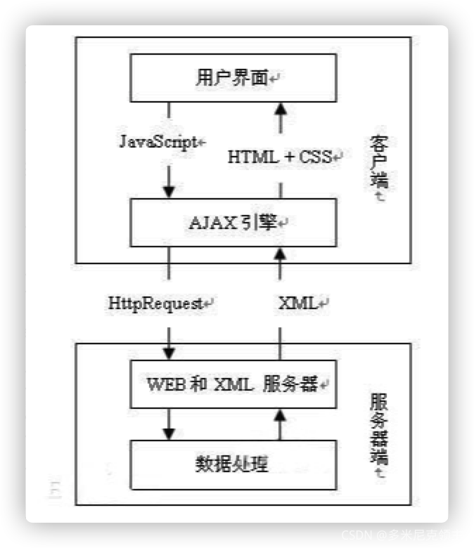

## 前端面试JS部分总结
_____

本笔记由作者在复习前端JS部分的相关的一些总结, 如果有什么错误的地方或者有什么相关的建议欢迎联系我

这份笔记借鉴了很多网上的文章, 如果有雷同或者相似的地方, 不用怀疑, 那就是搬得, 如果你是当中一些文章得作者,
如果觉得这种行为不恰当, 请与我联系, 收到消息后我会尽快处理

邮箱: zwn_fobj@foxmail.com

QQ: 1879154660  
QQ昵称: 只为你乱了浮生

感谢各位观看者的支持, 希望能对正在面临面试的你有所帮助,
____

## 目录

- [1. 对js语言理解](#1)
- [2. MD5加密步骤](#2)
- [3. super关键字 --- ES6新特性class类](#3)
- [4. typeof原理:](#4)
- [5. instanceof原理:(可以判断是否是父类的实例)](#5)
- [6. localStorage和sessionStorage的区别](#6)
- [7. es6中set和map](#7)
- [8. var/let/const 区别](#8)
- [9.重绘和回流](#9)
- [10. es6中的Promise理解](#10)
- [11. es6中async/await和.then的区别](#11)
- [12. jd原型链](#12)
- [13. 宏任务和微任务](#13)
- [14. es6箭头函数](#14)
- [15. 防抖和节流](#15)
- [16. JS闭包](#16)
    - [16.1 对js闭包的理解以及常见应用场景(闭包的作用)](#16_1)
- [17.js获取和添加节点方法](#17)
- [18. 线程与进程](#18)
- [19. async和await](#19)
- [20. for in 和 for of 的区别](#20)
- [21. 对深拷贝和浅拷贝有了解吗为什么会出现深拷贝和浅拷贝这两种概念](#21)
- [22.扩展运算符](#22)
- [23. 在es5中的变量](#23)
- [24. 词法作用域和动态作用域](#24)
- [25.JavaScript this关键字](#25)
- [26. DOM事件流机制 / 事件捕获](#26)
- [27. 如何阻止冒泡?](#27)
- [28. let var const](#28)
- [29. 箭头函数](#29)
- [30. promise的all和race](#30)
- [31. JS闭包](#31)
- [32. 深拷贝和浅拷贝](#32)
- [33. set和map的区别](#33)
- [34. promise和setTimeout及asyn,awit的区别是什么](#34)
- [35. JS的垃圾回收机制](#35)
- [36. 懒加载有哪些内容](#36)
- [37.  JS的数据类型都有哪些](#37)
- [38. 除了const以外可以用什么方式让变量不能被更改](#38)
- [39. url的组成部分](#39)
- [40. js中获取url的信息是什么](#40)
- [41. 为什么要使用路由呢？](#41)
- [42. URL和URI之间的区别是什么](#42)


____

### <h2 id="1">1. 对js语言理解</h2>

JavaScript(简称"JS")是一种具有函数优先的轻量级, 解释型或及时编译型的编程语言;
虽然它是作为开发Web页面的脚本语言而出名,但是它也被用到了很多非浏览器环境中, JavaScript基于原型编程,
多范式的动态脚本语言, 并且支持面向对象,命令式,声明式,函数式编程范式

### <h2 id="2">2. MD5加密步骤</h2>

创建一个MD5加密对象,然后获取我们输入的明文,用getBytes()方法转换成字符串的形式,因为用md5的digest方式把他们都加密成16位字符,
因为md5是要把16位字符转换成32位的16进制字符串, 所以我们要遍历这16位字符,如果有小于16位的话,那就在后面append补0,这样就能够保证了这个字符串转换后是2位字符了,
如果有小于0的也不可以,一个字符的区间最大是255最小是-256,所以有小于0的字符就+256就可以保证他们都是非负数了,这样所有的16位字符都能满足要求;
再把他们通过md5的内部算法转化成32位16进制字符就可以了

### <h2 id="3">3. super关键字 --- ES6新特性class类</h2>

可以作为函数, 也可以作为对象去使用

当作为函数的时候: 只能在构造器中使用, 代表调用父类的构造器

当作为对象使用时, 如果去调用一个方法,那么它指向的时父类的原型对象, 调用的方法中如果有this的话, this的指向时字类实例

当作为对象使用时,如果去调用static静态方法, 那他指向的是父类, 调用方法中如果有this的话, this的指向是子类

- 语法

``` javascript
    super(arguments);  // 调用父构造函数
    super.parentMethod(arguments);  // 调用父方法
```

```javascript

class Polygon {
    constructor(height, width) {
        this.name = 'Rectangle';
        this.height = height;
        this.width = width;
    }

    sayName() {
        return 'Hi, I am a ', this.name + '.';
    }

    get area() {
        return this.height * this.width;
    }

    set area(value) {
        this._area = value;
    }
}

class Square extends Polygon {
    constructor(length) {
        // 这里，它调用父类的构造函数的，
        // 作为 Polygon 的 height, width
        super(length, length);

        this.height; // 需要放在 super 后面，不然引发 ReferenceErro

        // 注意：在派生的类中，在你可以使用'this'之前，必须先调用 super()。
        // 忽略这，这将导致引用错误。
        this.name = 'Square';
    }
}
```

### <h2 id="4">4. typeof原理:</h2>

判断变量的类型: object number string boolean function undefined null symbol  

js在底层存储变量的时候, 会在变量的机器码的为hi在1-3位存储其类型信息:

000: 对象   010: 浮点数   100: 字符串    110: 布尔    1: 整数

但是对于null: 所有机器码均为0 undefined: 用 -2 的30次幂来表示

null 是一个空指针, 准备存储数据的: undefined是定义了一个变量但是没有赋值就undefined

### <h2 id="5">5. instanceof原理:(可以判断是否是父类的实例)</h2>

只要右边的prototype属性在左边的原型链上:

instanceof在查找的过程中会遍历左边变量的原型链 直到找到右边变量的prototype属性

想比较准确的确定对象类型时可以采用: 
object.prototype.tostring.call()

Function.prototype._proto__==Object.prototype

Object._proto_=Function.prototype


### <h2 id="6">6. localStorage和sessionStorage的区别</h2>

1. 生命周期

localStorage的生命周期是永久的,关闭页面后浏览器后localStorage中的数据也不会消失;
localStorage防护非主动删除数据,否则数据永远不会消失

sessionStorage的生命周期是仅在当前会话下有效  
sessionStorage引入了一个"浏览器窗口"的概念  
sessionStorage是在同源的窗口中始终存在的数据, 只要这个浏览器窗口没有关闭,即使刷新页面或者进入另一个页面,  
数据依然存在. 但是sessionStorage在关闭了浏览器窗口后就会被销毁;
同时独立的打开同一个窗口同一个页面,sessionStorage也是不一样的

2. 存储大小

localStorage和sessionStorage的存储数据大小一般都是5MB

3. 存储位置  
   localStorage和sessionStorage都保存在浏览器端,不与服务器进行交互通信  
   
4. 存储内容类型  
   localStorage和sessionStorage**只能存储字符串类型**对于复杂的对象可以使用ECMAScript提供的JSON对象的`stringify`和`parse`来处理
   
5. 获取方式  

localStorage: window.localStorage  
sessionStorage: window.sessionStorage

6. 应用场景

localStorage: 常用于长期登录(+判断用户是否已登录), 适合长期保存在本地的数据  
sessionStorage: 敏感账号一次性登录  

### <h2 id="7">7. es6中set和map</h2>

**set(集合)**

基本用法: 他类似于数组, 但是成员的值都是唯一的, 没有重复的值, 可以用来数组去重/字符串去重(join("")).  
使用的算法叫做`Same-value-zero-equality`, 它类似于精确相等运算符(`===`),但是在Set内部,
两个`NaN`是相等的;而`===`中NaN是不等于自身的  

属性: consructor属性, size属性: 返回set中元素的总和(set的大小)

方法:  
1.操作方法 add has delete clear   

2. 遍历方法 `keys(键名)` `values(键值)` `entries(键值对)` `forEach() 遍历每个成员对象`  
   遍历应用: 用map把所有值诚意2, 用filter过滤条件实现交集并集

**weakset**:  
与set两个区别:  

1. 成员只能是对象  
2. 对象只能是弱引用,也就是说如果其他独享都不再引用该对象,那么垃圾回收机制会自动回收该对象所占的内存  

方法: 有 add delete has 没有 size 和foreach, 因为成员都是弱引用,遍历机制无法保证成员的存在,
和可能刚遍历结束,成员就取不到了

**map**  
本质就是键值对的集合  
基本用法: 是js的对象, 键-值对 对应, 对一个键多次赋值会覆盖,未知的键undefined,跟内存地址绑定的,
内存地址不一样就视为两个键  

属性:
size属性: 返回所有成员所有总和  
方法: 1.操作方法: set,get,has,delete,clear
    2. 遍历方法: keys() values() entries() forEach()

map转数组: [...map] 

数组转map: 把数组传入new map中  
map转对象: 
对象转map:  

weakmap: 与map两个区别  
1. 只能是对象  
2. 对象不计入垃圾回收机制  

set是一种关联容器, 其特性如下:  
- set以RBTree作为底层容器  
- 所得元素的只有key没有value, value就是key  
- 不允许出现键值重复  
- 所有的元素都会被自动排序  
- 不能通过迭代器来改变set的值, 因为set的值就是键  

map和set一样是关联式容器,他们的底层容器都是红黑树, 区别在于map的值不作为键, 键和值是分开的,
他的特性如下:  

- map以RBTree作为底层容器  
- 所有元素都是键 + 值存在
- 不允许键重复
- 所有元素是通过键进行自动排序的
- map的键是不能修改的, 但是其对应的值是可以修改的

### <h2 id="8">8. var/let/const 区别</h2>
var:存在全局作用域window和函数作用域两种,没有块级作用域的说法,并且存在变量提升

let: 用于js中定义变量, 只再声明的代码块中生效(块级作用域),暂时性死区(在声明变量之前无法读取或操作这个变量 会报错),
没有变量提升,无法let重复声明

const: 用于js中定有常量, 如果存储简单类型如字符串, 数字和布尔值, 值就能保存在常量指向的内存地址,
而复杂类型的数据如 对象,数组和函数,常量指向的内存地,址, 实际上是保存了指向实际数据的指针, 
所以const只能保证指针是固定的,只遇指针指向的数据结构变不变就无法控制了,
一旦声明变量,就必须立即初始化,不能留到以后赋值

const 是用来定义常量的, 尝试修改const声明的变量会导致运行上报错  
const也不可以重复声明, const也是块级作用域

### <h2 id="9">9.重绘和回流</h2>

什么是回流

当render tree 中的一部分(或全部)因为元素的规模尺寸, 布局, 隐藏等改变而需要重新构建, 这就称为回流(reflow),
每个也面至少需要一次回流,就是在页面第一次加载的时候,这时候是一定会发生回流的, 因为要构建 render tree;
在回流的时候, 浏览器会使渲染树中受到影响的部分失效,并重新构造这部分渲染树,完成回流后,浏览器会重新绘制受印象的部分到屏幕中,
该过程称为回流

什么是重绘

当render tree中的一些元素需要更新属性,而这些属性只是影响元素的外观,风格, 而不影响布局的,  比如: background-color,z 这就称之为重绘

区别: 

回流必将引起重绘, 而重绘不一定引起回流, 比如: 只有颜色改变的时候,就只会发生重绘而不会引起回流,  
当页面和集合属性改变时就需要回流  
比如: 添加或者删除可见的DOM元素,元素位置不变,元素尺寸改变--边距,填充,边框,宽度,高度,和内容的改变

### <h2 id="10"> 10. es6中的Promise理解</h2>
1. promise是一种异步编程的解决方案, 简单来说就是一种容器, 里面保存着某种未来才会结束的事件;

```promise对象有两个特点:  
    1. 状态不受外界影响, pending fulfilled rejected, 只有异步操作的结果才可以决定是哪一种状态, 其他任何操作都无法改变这个状态,  
    2. 一旦状态改变就不会再变; pending->fulfilled   pending->rejected 只要改变就 resolved 凝固了, 会一直保持这个结果  

缺点:  
    1. promise无法取消, 新建就会立即执行, 无法中途取消  
    2. 如果不设置回调的话,promise内部抛出的结果不会反映到外部  
    3. 当处于pending状态时, 无法得知进展道哪一个阶段(刚开始还是即将完成)  

```

2. 基本用法
    1) 先 new Promise再then回调两个函数
    2) promise.prototype.then(), 该then方法返回的是新的promise实例,因此可以采用链式写法,
       then方法后面调用then方法, 
       比如说第一个then方法返回一个promise新对象，第二个then方法就会等待这个新的promise对象状态发生改变。  
       
    3) promise.prototype.catch()用于发生错误时的回调，抛出错误。但是如果状态是promise的reject的话，再抛出错误是无效的。如果不用catch的话，程序执行报错就无法运行了，但是catch的话只是输出错误然后继续运行。

    4) promise.prototype.finilly()定义不管promise对象最后状态是什么都会执行的操作。finilly里面的操作，应该是与状态无关的，不依赖于promise的执行结果。

    5) promise.all() 用于多个promise实例包装成一个新的promise实例，const p = Promise all ([p1,p2,p3]) 只有p1,p2,p3状态都变成fulfilled时，p的状态才是fulfilled，三个返回值组成数组传递给p的回调函数。只要有一个是rejected，那p的状态就是rejected，第一个被rejected的实例就传递给p的回调函数。并行。

    6) promise.race()同上，只要有一个状态先改变，p的状态就会改变。

    7) promise.allSettled()   无论几个状态是成功还是失败，都可以返回结果，包容性强。
    

应用场景: 加载图片

### <h2 id="11">11. es6中async/await和.then的区别</h2>

async/await是一种编写异步代码的新方法,在这之前编写异步代码使用的是回调函数和promise

async/await实际上是建立在promise之上的, 因此你不能把它和回调函数搭配使用  

async/await可以使异步代码在形式上更接近于同步代码, 这就是它最大的价值

async/await是过去几年中JavaScript引入的最具革命性的特性之一。它使你意识到promise在语法上的糟糕之处，并提供了一种简单，直接的替代方案。

async说白了就是让请求接口的顺序按自己想要的顺序执行。一个等一个

**promise + .then 写法**

```javascript
const makeRequest = () => {
  return promise1()
    .then(value1 => {
      return promise2(value1)
        .then(value2 => {     
          return promise3(value1, value2)
        })
    })
}
```
**或者用promise + .all 写法优化一下**: 

```javascript
const makeRequest = () => {
  return promise1()
    .then(value1 => {
      return Promise.all([value1, promise2(value1)])
    })
    .then(([value1, value2]) => {       
      return promise3(value1, value2)
    })
}
```
**用async 解决:**
```javascript
const makeRequest = async () => {
  const value1 = await promise1()
  const value2 = await promise2(value1)
  return promise3(value1, value2)
}
```

### <h2 id="12">12. js原型链</h2>

原型对象

在 JavaScript 中,每当定义一个对象(函数也是对象)时候,对象中都会包含一些预定的属性,其中每个**函数对象**都有一个`prototype`属性,
这个属性指向函数的**原型对象**

原型链

每个对象都可以有一个原型*proto*,这个原型还可以有自己的原型,以此类推,形成一个原型链,
**查找特定属性的时候，我们先去这个对象里去找，如果没有的话就去它的原型对象里面去，如果还是没有的话再去向原型对象的原型对象里去寻找...... 这个操作被委托在整个原型链上，这个就是我们说的原型链了。**

### <h2 id="13">13. 宏任务和微任务</h2>

**宏任务**  
(macro)task, 可以理解是每次执行栈执行的代码就是一个宏任务(包括每次从事件队列中获取一个事件回调并放到执行栈中执行)  

浏览器为了能够使JS内部(macro)task与DOM任务能够有序的执行, 会在一个(macro)task执行后,在下一个(macro)task执行开始之前,
对页面重新渲染, 流程如下
```(macro)task->渲染->(macro)task->...```

宏任务是一些独立和离散的工作,有主机(如浏览器或Node.js)发起,例如setTimeout,setInterval,setImmeditate等

**宏任务包括**

``` 
script(整体代码)
setTimeout
setInterval
I/O
UI交互事件
postMessage
MessageChannel
setImmediate(Node.js 环境)
```

**微任务**  

microtask,可以理解在当前task执行后立即执行的任务,
也就是说,在当前task任务后,下一个task之前,在渲染之前;

所以它的响应速度相比setTimeout(setTimeout是task)会更块,因为无需渲染;
也就是说在某个macrotask执行后,将会将在它执行期间产生的所有microtask都执行完毕(在渲染前)

微任务是一些由JAvaScript本身发起的更小和更快的工作,例如Promise.then,MutationObserver等,
微任务队列在每个宏任务执行之后执行,直到清空

在ES6规范中,微任务被称为jobs, 而宏任务被称为task

**微任务包括**

``` 
Promise.then  
Object.observe  
MutationObserver  
process.nextTick(Node.js 环境)

```

**宏任务与微任务的执行顺序**   

请参考:  
[宏任务与微任务的执行顺序](https://blog.csdn.net/m0_46846526/article/details/117909805)

**运行机制**  

在事件循环中,每进行一次循环操作称为tick,这一次tick的任务处理模型是比较复杂的,但关键步骤如下:  
- 执行一个宏任务(栈中没有就从事件队列中获取)
- 执行过程中如果遇到微任务,将它添加到微任务的任务队列中
- 宏任务执行完毕后,立即执行当前微任务队列中的所有微任务(依次执行)
- 当前宏任务执行完毕, 开始检查渲染,然后GUI线程接管渲染
- 渲染完毕后, JS线程继续接关, 开始下一个宏任务(从事件队列中获取)

**事件循环**


### <h2 id="14">14. es6箭头函数</h2>

**箭头函数**内部的this是词法作用域,由上下文确定. (词法作用域是由你在写代码时将变量和块作用域写在哪里来决定的,因此当词法分析器
处理代码时会保持作用域不变)

- - 只有一个参数, 可以省略()
  - 只有一条命令语句,可以省略{}
  - 只有一条命令语句且时return可以省略{} 和 return
  
- - 箭头函数由几个使用注意点:  
    (1) 箭头函数没有自己的this对象, 指向外层函数的对应变量: arguments, super, new.target  
    (2) 不可当做构造函数,也就是说,不可以对箭头函数使用new命令,否则会抛出一个错误  
    (3) 另外,由于箭头函数没有自己的this, 所以当然也就不能用call(), apply(), bind()这些方法来改变this的指向  
    最重要的是第一点, 对于普通函数来说,内部的this指向函数运行时所在的对象,但是这一点对箭头函数不成立;
    它没有自己的`this`对象,内部的`this`就是定义时上层作用域中的`this`,也就是说;
    箭头函数内部`this`指向是固定的,相比之下,普通函数的`this`指向是可变的

不适合场合:
```javascript 

const cat = {
  lives: 9,
  jumps: () => {
    this.lives--;
  }
}
//1.对象不能单独构成作用域，使得this指向全局变量，不能达到预期目的。


var button = document.getElementById('press');
button.addEventListener('click', () => {
  this.classList.toggle('on');
});

//2.动态使用this的时候，也不应该使用箭头函数。
//在这个例子中this指向了全局对象，会报错；如果改成普通函数的话this就会指向按钮，实现点击功能。

```

### <h2 id="15">15. 防抖和节流</h2>
- 什么是防抖(debounce): 防抖指的是在一定时间内多次触发一个函数,只执行最后一次   或者在开始时执行
- 什么是节流(throttle): 是指在一定时间内多次触发同一个函数,只有第一次生效, 或者每隔一定时间才执行一次

防抖和节流的目的是减少函数的执行频率,调高性能和用户体验

``` 
当函数绑定一些持续触发的事件如：resize、scroll、mousemove ，键盘输入，多次快速click等等，

如果每次触发都要执行一次函数，会带来性能下降，资源请求太频繁等问题
```

防抖的应用场景:用户输入搜索关键词时，可以使用防抖来避免频繁地向服务器发送请求。  
节流的应用场景也比较广泛，例如在用户滚动页面时，可以使用节流来避免频繁地触发函数。  


简单的防抖实现代码:
```javascript
/**
 * 防抖函数
 * @param {Function} fn - 需要执行的函数
 * @param {Number} delay - 时间延迟参数
 * @return {Function} 返回一个新的函数
 */
function debounce(fn, delay) {
  // 定义一个变量来保存定时器的返回值
  let timer = null;
  // 返回一个新的函数
  return function() {
    // 保存函数执行时的参数
    const args = arguments;
    // 如果已经存在定时器，则清除之前的定时器
    if (timer) clearTimeout(timer);
    // 创建一个新的定时器
    timer = setTimeout(() => {
      // 在延迟结束后执行传入的函数，并传入之前保存的参数
      fn.apply(this, args); //改变函数的this指向
    }, delay);
  }
}

```

简单的节流代码:

```javascript
/**
 * 节流函数
 * @param {Function} fn - 需要执行的函数
 * @param {Number} delay - 时间延迟参数
 * @return {Function} 返回一个新的函数
 */
function throttle(fn, delay) {
  // 定义一个变量来保存定时器的返回值
  let timer = null;
  // 返回一个新的函数
  return function() {
    // 保存函数执行时的参数
    const args = arguments;
    // 如果已经存在定时器，则直接返回
    if (timer) return;
    // 创建一个新的定时器
    //fn.apply(this, args); //在延迟前执行传入的函数，并传入之前保存的参数
    timer = setTimeout(() => {
      // 在延迟结束后执行传入的函数，并传入之前保存的参数
      fn.apply(this, args);
      // 执行完毕后将定时器变量设置为 null，以便下一次调用函数
      timer = null;
    }, delay);
  }
}

```

**防抖的操作:**  
只有在某个时间内,没有再次触发某个函数时,才真正的调用这个函数;

理解一下他的过程:  
- 事件触发时,相应的函数并不会立即触发,而是会等待一定的事件;;
- 当事件密集触发时, 函数的触发会被频繁的推迟;
- 只有等待了一段事件也没有事件触发,才会真正的执行相应安徽拿书

防抖的应用场景很多:     
搜索框钟的输入内容,搜获或者提交信息;  
频繁的点击按钮, 触发某个事件;  
监听浏览器滚动事件,完成某个特定操作;
用户缩放浏览器的resize事件;

总之,**密集的事件触发,我们只希望触发比较靠后的发生的事件,就可以使用防抖函数;**


**为什么需要节流?**   王者荣耀技能

**节流的操作：在某个时间内（比如500ms），某个函数只能被触发一次；**  

**节流的应用场景：**

监听页面的滚动事件；

鼠标移动事件；

用户频繁点击按钮操作；

游戏中的一些设计；

总之，依然是**密集的事件触发，但是这次密集事件触发的过程，不会等待最后一次才进行函数调用，而是会按照一定的频率进行调用**；

具体参考:  
[前端面试相关:性能优化之防抖与节流](https://juejin.cn/post/7206180323784294456)

### <h2 id="16">16. JS闭包</h2>

闭包构成的条件: 函数 + 函数 能够访问的自由变量

**闭包**是一个函数以及其捆绑的周边环境(词法环境)的引用的组合,换而言之,闭包可以从内部函数访问外部函数的作用域,
在JavaScript中,闭包会随着函数的创建而被同时创建

```javascript
var add = (function () {
    var counter = 0;
    return function () {return counter += 1;}
})();
 
add();
add();
add();
 
// 计数器为 3

/*
* 实例解析
* 变量 add 指定了函数自我调用的返回值。

* 自我调用函数只执行一次。设置计数器为 0。并返回函数表达式。

* add变量可以作为一个函数使用。非常棒的部分是它可以访问函数上一层作用域的计数器。

* 这个叫作 JavaScript 闭包。它使得函数拥有私有变量变成可能。

* 计数器受匿名函数的作用域保护，只能通过 add 方法修改。
* */

```
> 闭包是一种保护私有变量的机制，在函数执行时形成私有的作用域，保护里面的私有变量不受外界干扰。
>
> 直观的说就是形成一个不销毁的栈环境。

#### <h3 id="16_1">对js闭包的理解以及常见应用场景(闭包的作用)</h3> 

使用闭包主要是为了设计私有的方法和变量

- 优点是可以避免环境变量的污染
- 缺点是闭包会长驻内存,ui增大内存的使用量,使用不当很容易造成内容泄露

在js中, 函数及闭包,函数才会产生作用域的概念

参考资料:  

[面试官：谈谈对JS闭包的理解及常见应用场景(闭包的作用)](https://blog.csdn.net/qq_39903567/article/details/115010640)


### <h2 id="17">17.js获取和添加节点方法</h2>

**获取：**

通过 id 找到 HTML 元素

```js
document.getElementById("demo");
```

通过标签名找到 HTML 元素

```js
document.getElementsByTagName("div");
```

通过类名找到 HTML 元素

```js
document.getElementsByClassName("a");
```

h5新增方法

`document.querySelector和document.querySelectorAll`

添加: 
1. `父节点.appendChild()`
2. `父节点.insertBefore(要插入的节点,参考节点)`: 其中参数 newchild 表示新插入的节点，
   refchild 表示插入新节点的节点，用于指定插入节点的后面相邻位置。插入成功后，该方法将返回新插入的子节点。


### <h2 id="18">18. 线程与进程</h2>
1. 线程是执行程序的最小单位, 而进程是操作系统分配资源的最小单位  

2. 一个进程由一个或多个线程组成, 线程是一个进程中代码的不同执行路线

3. 进程之间互相独立,但同一个进程下的各个线程之间共享程序的内存控件(包括代码段,数据集,堆等)
   及一些进程的资源(如打开文件和信号等),某进程的线程在其他进程不可见
   
4. 调度和切换: 线程上下文切换比进程上下文切换要快的多

### <h2 id="19">19. async和await</h2>

```
    async
    async是一个加在函数前的修饰符,被async定义的函数会默认返回一个Promise对象resolve的值,因此对async函数可以直接then,
    返回值就是then方法传入的函数
    
    await
    await也是一个修饰符,只能放在async定义的函数内,额可以理解为等待,
    await修时的如果是Promise对象: 可以获取Promise中返回的内容
    (resolve或reject的参数), 且取值后语句才会向下执行;
    如果不是Promise对象: 把这个非Promise的东西当作await表达式的结果
```


### <h2 id="20">20. for in 和 for of 的区别</h2>

`for in` 遍历的是一个对象的索引, 而`for of `遍历的时候数组元素的值,  
`for in` 总是得到对象的 `key` 或 数组和字符串 的下标
`for of` 总是得到的数组,字符串的值

for of适用遍历数/数组对象/字符串/map/set等拥有迭代器对象（iterator）的集合，但是不能遍历对象，
因为没有迭代器对象，但如果想遍历对象的属性，你可以用for in循环（这也是它的本职工作）或用内建的Object.keys()方法

示例:

```javascript
let arr = [1,2,3]
Array.prototype.a = 123

for (let index in arr) {
    let res = arr[index]
    console.log(res)
}
//1 2 3 123

for(let index in arr) {
    if(arr.hasOwnProperty(index)){
        let res = arr[index]
        console.log(res)
    }
}
// 1 2 3

```

### <h2 id="21">21.对深拷贝和浅拷贝有了解吗为什么会出现深拷贝和浅拷贝这两种概念</h2>

首先深复制和浅复制只针对像 Object, Array 这样的复杂对象的。
简单来说，浅复制只复制一层对象的属性，而深复制则递归复制了所有层级。

浅复制只会将对象的各个属性进行依次复制，
并不会进行递归复制，而 JavaScript 存储对象都是存地址的，
所以浅复制会导致 [obj.arr](https://www.zhihu.com/search?q=obj.arr&search_source=Entity&hybrid_search_source=Entity&hybrid_search_extra={"sourceType"%3A"answer"%2C"sourceId"%3A46220227})
和 shallowObj.arr 指向同一块内存地址

而深复制则不同，它不仅将原对象的各个属性逐个复制出去，
而且将原对象各个属性所包含的对象也依次采用深复制的方法**递归复制**到新对象上。
这就不会存在上面 obj 和 shallowObj 的 arr 属性指向同一个对象的问题。

需要注意的是，如果对象比较大，层级也比较多，深复制会带来性能上的问题。
在遇到需要采用深复制的场景时，可以考虑有没有其他替代的方案。在实际的应用场景中，也是浅复制更为常用。


### <h2 id="22">22.扩展运算符</h2>

**定义:**
扩展运算符(...)是ES6的语法, 用于取出参数对象的所有可遍历属性,然后拷贝到当前对象中, (在react setStatus和redux的reducer中经常使用)

**基本用法:**
```javascript
let person = {name:'Amy', age: 15}
let someone = {...person}
//someone // {name:'Amy',age:'15'}
```
**特殊用法:** 

**数组**

由于数组是特殊的对象, 所以对象的扩展也能算符可以用于数组  
```javascript
let foo = {...['a','b','c']};
foo
// {0:'a', 1:'b', 2:'c'}
```

**空对象**

如果扩展运算符后面是一个空对象, 则没有任何效果
```javascript
    let a = {...{},a:1}
    a // { a : 1 }
```

**Int 类型, Boolean类型, undefined, null**

如果扩展运算符后面是上面这几种类型,都会返回一个空对象,因为他们没有自身属性

```
// 等同于 {...Object(1)}
{...1} // {}

// 等同于 {...Object(true)}
{...true} // {}

// 等同于 {...Object(undefined)}
{...undefined} // {}

// 等同于 {...Object(null)}
{...null} // {}
```

**字符串**
如果扩展运算符后面是字符串，它会自动转成一个类似数组的对象

```javascript
let a = {...'hello'}
//a == {0: "h", 1: "e", 2: "l", 3: "l", 4: "o"}
```

对象的合并

```javascript
let age = {age:15}
let name = {name:'Amy'}
let person = {...age,...name}
person; //{age:15, name:'Amy'}
```

**注意事项**
> 自定义的属性和拓展运算符对象里面属性相同的时候;  
> 自定义的属性在扩展运算符后面, 则扩展运算符对象内部同名的属性将被覆盖掉

```javascript
let person = {name: "Amy", age: 15};
let someone = { ...person, name: "Mike", age: 17};
someone;  //{name: "Mike", age: 17}
```
自定义的属性在拓展运算符前面, 则变成设置新对象默认属性值
```javascript
let person = {name:'Amy',age:'15'};
let someone = {name:'Mike',age:'17',...person};
someone; //{name:'Amy', age:15}
```

### <h2 id="23">23. 在es5中的变量</h2>

在es5中变量作用域分为两种: 全局变量,局部变量;  

局部变量: 写在函数体内部, 其中安徽拿书中所传递的参数也是局部变量(小括号中的), 
仅在定义的部分能够使用;  

全局变量: 写在函数体外部的变量, 其中在函数中使用但未用var声明的变量也是全局变量, 可以在全局中任何部分使用

### <h2 id="24">24. 词法作用域和动态作用域</h2>

词法作用域: 函数在定义的时候决定了函数的作用域, JavaScript采用词法作用域

动态作用域: 函数在调用的时候决定函数的作用域,目前只有部分语言支持

### <h2 id="25">25.JavaScript this关键字</h2>

面向对象语言中this表示当前对象的一个引用  

但在JavaScript中this不是固定不变的,它会随着环境的改变而改变

- 在方法中,this表示该方法所属的对象
- 如果单独使用, this表示全局对象
- 在函数中, this表示全局对象
- 在函数中, 在严格模式下, this是未定义的(undefined)
- 在事件中, this表示接收事件的元素
- 类似call() 和 apply() , bind()方法可以将this引用到任何对象

### <h2 id="26">26. DOM事件流机制 / 事件捕获</h2>

什么是DOM?  
    DOM 是描述 HTML 的内部数据结构,它会将 Web 页面和 JavaScript 脚本连接起来, 并过滤一些不安全的内容;
    HTML 解析器会把字节转换成DOM

一个事件在发生的时候会在子元素和父元素之间传播,这会分成三个阶段:  
1. window 传到目标节点 ---- 捕获阶段(上层传到底层)
2. 目标节点触发 ---- 目标阶段
3. 目标节点传到window ---- 冒泡阶段(底层传到上层) 

### <h2 id="27">27. 如何阻止冒泡?</h2>

1. event.stopPropagation()方法 阻止事件冒泡
```javascript
	$('.btn').click(function (even) {
		even.stopPropagation();
		alert('按钮被点击了');
	})
```

这是阻止事件的冒泡方法，不让事件向documen上蔓延，但是默认事件任然会执行，当你掉用这个方法的时候，如果点击一个链接，这个链接仍然会被打开。

例如: 

```html
<a href="https://www.csdn.net/" class="box">
	<button class="btn">按钮</button>
</a>
```

2. event.preventDefault()方法 阻止默认事件

```javascript
	$('.btn').click(function (even) {
		even.preventDefault();
		alert('按钮被点击了');
	})
```

这是阻止默认事件的方法,调用此方方法,链接不会被打开,但是会发生冒泡, 冒泡会传递到上一层的父元素;

3. return false;

```javascript
	$('.btn').click(function (even) {
		alert('按钮被点击了');
		return false;
	})
```
这个方法比较暴力, 他会同时阻止冒泡也会阻止默认事件; 写上这段代码, 链接不会被打开,事件也不会传递到上一层的u父元素; 类似于同时调用了event.stopPropagation()和event.preventDefault()

### <h2 id="28">28. let var const</h2>
``` 
    var定义的变量没有块的概念, 可以跨块访问, 不能跨函数访问  
    let定义的变量,只能在块作用域里访问, 不能跨块访问, 也不能跨函数访问
    const用来定义常量, 使用时必须初始化(即必须赋值), 只能在块作用域里访问,而且不能修改

```

### <h2 id="29">29. 箭头函数</h2>
```
    箭头函数没有自己的this，指向外层普通函数作用域
    箭头函数没有constructor，不能通过new 调用；
    没有new.target 属性
    箭头函数不绑定Arguments 对象
```


### <h2 id="30">30. promise的all和race</h2>

all与then同级的另一个方法, all方法, 该方法提供了并行执行异步操作的能力,并且所有异步操作执行完成后并且执行结果都是成功的时候才执行回调  
all是等所有异步操作执行完了再执行then方法, 

race方法就是相反的,谁先执行完成就先执行回调,执行完的不管是进行了race的成功回调还是失败回调,其余的将不会再进入race的任何回调

### <h2 id="31">JS闭包</h2>

闭包是指有权访问另一个函数作用域中变量的函数,创建闭包的最常见的方式就是在一个函数内创建另一个函数,通过另一个安徽拿书访问呢这个函数的局部变量  

- 闭包的特性:
    - 函数内再嵌套函数  
    - 内部函数可以引用外层的参数和变量
    - 参数和变量不会被垃圾回收机制回收
    
- 标记清除 

这是JavaScript中最常用的垃圾回收方式; 当变量进入执行环境时,就标记这个变量为"进入环境";
  从逻辑上讲,永远不能释放进入环境的变量占用的内存, 因为只要执行流进入相应的环境,就可能会用到他们, 
  当变量离开环境时,则将其标记为"离开环境"

- 引用计数

另一种不太常见的垃圾回收策略是引用计数。引用计数的含义是跟踪记录每个值被引用的次数。
当声明了一个变量并将一个引用类型赋值给该变量时，
则这个值的引用次数就是1。相反，如果包含对这个值引用的变量又取得了另外一个值，
则这个值的引用次数就减1。当这个引用次数变成0时，则说明没有办法再访问这个值了，
因而就可以将其所占的内存空间给收回来。这样，垃圾收集器下次再运行时，它就会释放那些引用次数为0的值所占的内存。


### <h2 id="32">32. 深拷贝和浅拷贝</h2>
首先深复制和浅复制只针对像 Object, Array 这样的复杂对象的。
简单来说，浅复制只复制一层对象的属性，而深复制则递归复制了所有层级。

浅复制只会将对象的各个属性进行依次复制，并不会进行递归复制，
而 JavaScript 存储对象都是存地址的，所以浅复制会导致 [obj.arr](https://www.zhihu.com/search?q=obj.arr&search_source=Entity&hybrid_search_source=Entity&hybrid_search_extra={"sourceType"%3A"answer"%2C"sourceId"%3A46220227}) 
和 shallowObj.arr 指向同一块内存地址

而深复制则不同，它不仅将原对象的各个属性逐个复制出去，
而且将原对象各个属性所包含的对象也依次采用深复制的方法**递归复制**到新对象上。
这就不会存在上面 obj 和 shallowObj 的 arr 属性指向同一个对象的问题。

需要注意的是，如果对象比较大，层级也比较多，
深复制会带来性能上的问题。在遇到需要采用深复制的场景时，
可以考虑有没有其他替代的方案。在实际的应用场景中，也是浅复制更为常用。

### <h2 id="33">33. set和map的区别</h2>

set和map一样是关联容器, 他们的底层都是红黑树, 区别在于map的值不作为键, 键和值是分开的

set特性如下:
- set以RBTree(红黑树)作为底层容器
- 所得元素的只有key没有value，value就是key
- 不允许出现键值重复
- 所有的元素都会被自动排序
- 不能通过迭代器来改变set的值，因为set的值就是键

map特性如下:
- map以RBTree作为底层容器
- 所有元素都是键+值存在
- 不允许键重复
- 所有元素是通过键进行自动排序的
- map的键是不能修改的，但是其键对应的值是可以修改的


### <h2 id="34">34. promise和setTimeout及asyn,awit的区别是什么</h2>

1、JS是单线程语言，包括同步任务、异步任务，异步任务又包括宏观任务和微观任务

2、执行顺序：同步任务——>微观任务——>宏观任务

3、宏观任务的方法有：script(整体代码)、setTimeout、setInterval、
I/O、UI交互事件、postMessage、MessageChannel、setImmediate(Node.js 环境)

4、微观任务的方法有：Promise.then、
MutaionObserver、process.nextTick(Node.js 环境)，
async/await实际上是promise+generator的语法糖，也就是promise，也就是微观任务


### <h2 id="35">35. JS的垃圾回收机制</h2>
答：**[垃圾回收](https://developer.mozilla.org/en-US/docs/Web/JavaScript/Memory_Management#garbage_collection)** 是一个术语，
在  [计算机编程 (en-US)](https://developer.mozilla.org/en-US/docs/Glossary/Computer_Programming) 中用于描述查找和删除那些不再被其他 [对象引用 (en-US)](https://developer.mozilla.org/en-US/docs/Glossary/Object_reference)
的 [对象](https://developer.mozilla.org/zh-CN/docs/Glossary/Object) 处理过程。
换句话说，垃圾回收是删除任何其他对象未使用的对象的过程。 
垃圾收集通常缩写为 "GC"， 是  [JavaScript](https://developer.mozilla.org/zh-CN/docs/Glossary/JavaScript) 中使用的内存管理系统的基本组成部分。

为什么需要垃圾回收？
遇到函数时会创建函数执行上下文放到栈顶，执行完毕后，从栈顶弹出，作用域随之销毁。
如果在作用域被销毁的过程中，其中的变量不被回收持久的存在内存中
，必然会导致内存暴增，引发内存泄漏导致程序的性能直线下降甚至崩溃。

如何避免内存泄漏？

1.尽可能少创建全局变量

2.手动清除定时器

3.少用闭包。

weakmap和weakset就是为了解决内存泄漏的问题诞生的，表示为弱引用。


### <h2 id="36">36. 懒加载有哪些内容</h2>

懒加载(Load On Demand)是一种独特而又强大的数据获取方法,
它能够在用户滚动页面的时候自动获取更多的数据,而新得到的数据不会影响原有数据的显示,
同时最大程度上减少服务器端的资源耗用。


### <h2 id="37">37. JS的数据类型都有哪些</h2>

分为基础数据类型和复杂数据类型，分别是

number string Boolean object array symbol function undefined null

### <h2 id="38">38. 除了const以外可以用什么方式让变量不能被更改</h2>

Object.freeze() 方法可以冻结一个对象。一个被冻结的对象再也不能被修改；冻结了一个对象则不能向这个对象添加新的属性，不能删除已有属性，
不能修改该对象已有属性的可枚举性、可配置性、可写性，以及不能修改已有属性的值。此外，冻结一个对象后该对象的原型也不能被修改。
freeze() 返回和传入的参数相同的对象。

### <h2 id="39">39. url的组成部分</h2>

协议：//域名：端口号/虚拟目录/文件目录/#锚点部分？请求参数

### <h2 id="40">40. js中获取url的信息是什么</h2>

在js的**window.location**身上可以获取到url地址信息

此函数对特殊字符进行编码，除了： , / ? : @ & = + $ #（请使用 encodeURIComponent() 对这些字符进行编码）。

### <h2 id="41">41. 为什么要使用路由呢？</h2>

ajax异步请求完成页面的无缝刷新，导致浏览器的url不会发生任何变化就完成了请求。  
同时本次浏览的页面内容在用户下次使用url进行访问的时候无法重新呈现，使用路由可以很好的解决这个问题。

路由实现三个功能：  
1.当浏览器地址变化时，切换页面。  
2.前进后退  
3.刷新浏览器时，网页还加载当前浏览器对应的内容。  

两种模式hash和history模式  

hash模式：    
可以用过onhashchange监听浏览器url变化，#后面的也叫锚点，就是它的散列值，hash值  
散列值改变不会向服务器发送请求，hash值变化浏览器不会向服务器发送任何请求  
监听hashchange方法，当hash改变时，用local.hash获取hash值  

history模式：    
window.history的history指的是浏览历史，改变时只会改变页面路径 不会刷新页面  
可以通过history.length获得页面的个数  
浏览器的前进后退其实就是在对history对象进行操作    
history.back()后退  history.forward()前进  history.go()  1 前进 -1后退 0 刷新页面    
history.pushState(),可以添加浏览记录 三个参数 1.新的对象 2.标题  3.新的网站    
history.replacestate(),修改历史记录    
popstate进行history历史记录监听，前进后退或者back  forward go都会触发，    
缺点：当改变地址时，会强制刷新页面。  


### <h2 id="42">42.URL和URI之间的区别是什么</h2>

URL是统一资源定位器,用于标识资源;URI(统一资源标识符)提供了更简单和可扩展的标识的方法; URL是URI的子集

1. 作用区别  

URL(统一资源定位符)主要用于链接网页,网页组件或网页上的程序,
借助访问方法(http,ftp,mailto等协议)来检索位置资源

URI(统一资源标识符)用于定义项目的标识,此处单词标识符标识无论使用的方法是什么(URL或URN)
到要将一个资源与其他资源区别开来


2. 可以说URL是URI(URL是URI的子集),但URI永远不能是URL

3. 协议区别

URL指定要使用的协议类型,而URI不涉及协议规范

### <h2 id="43">43. js的显示原型和隐式原型</h2>

1. 什么是原型(what)

> 每个构造函数(可以理解为类)都拥有一个属性(prototype), 该属性指向一个对象,
> 用于存放公共的属性和构造函数的定义方式

```js
    var Fun=new Function()
	Function Fun(){} 
	//Fun就是创建出来的构造函数 
```
2. 为什么要用原型? 

> 虽然说js中一切皆对象,但js本身不是一项面向对象编程的语言,
> 没有类(class)的说法, 所以为了让构造函数(Function fun())构造出来的对象
> 拥有公共的属性和方法, 故js使用原型(prototype)来存储这些公共的属性和方法,

3. 如何使用原型?

使用原型给对象添加方法和属性

定义
```js
    Fun.prototype.num = 250; //添加公共属性
    Fun.prototype.getPrice = function (){ // 添加公共方法
        return `price:${this.num}` // 这里的this指向的调用的对象
    }
```
使用
```js
var fun = new Fun()
fun.num;
fun.getPrice()
```

4. 显示原型和隐式原型的区别

> 显示原型(prototype)是函数对象的一个属性,它指向函数的原型对象
> 
> 隐式原型(__proto__): 是示例对象的一个属性, 它指向创建该对象的构造函数的原型对象
> 
> 示例对象可以通过隐式原型对象访问构造函数和原型对象上的属性和方法,这就形成了原型链
>

```javascript

//定义一个构造函数
function Person(name, age) {
  this.name = name;
  this.age = age;
}

//给构造函数的原型对象添加一个方法
Person.prototype.sayHello = function() {
  console.log("Hello, I'm " + this.name);
};

//创建一个实例对象
var p1 = new Person("Alice", 18);

//访问实例对象的属性和方法
console.log(p1.name); //Alice
console.log(p1.age); //18
p1.sayHello(); //Hello, I'm Alice

//访问实例对象的显示原型和隐式原型
console.log(p1.prototype); //undefined，因为实例对象没有prototype属性
console.log(p1.__proto__); //Person { sayHello: [Function] }，因为实例对象有__proto__属性，指向构造函数的原型对象

//访问构造函数的属性和方法
console.log(Person.name); //Person，因为函数也是一种对象，有name属性
console.log(Person.age); //undefined，因为构造函数没有age属性
Person.sayHello(); //TypeError: Person.sayHello is not a function，因为构造函数没有sayHello方法

//访问构造函数的显示原型和隐式原型
console.log(Person.prototype); //Person { sayHello: [Function] }，因为构造函数有prototype属性，指向自己的原型对象
console.log(Person.__proto__); //[Function]，因为构造函数也是一种特殊的对象，有__proto__属性，指向Function.prototype

```

## <h2>44. JavaScript改变this指向的三种方法</h2>

JavaScript改变this指向的三种方法

每个Function构造构造函数的原型prototype,都有方法, call(), apply(), bind()

1. call方法  

call() 方法调用一个对象。简单理解为调用函数的方式，  
但是它可以改变函数的 this 指向。
fun.call(thisArg, arg1, arg2, ...)  
thisArg：在 fun 函数运行时指定的 this 值  
arg1，arg2：传递的其他参数  
返回值就是函数的返回值，因为它就是调用函数  

```javascript
var Person = {
    name: "zhangsan",
    age: 19
}

function aa(x, y) {
    console.log(x + "," + y);
    console.log(this);
    console.log(this.name);
}

aa(4, 5); //this指向window--4,5  window  空

aa.call(Person, 4, 5); //this指向Person--4,5  Person{}对象  zhangsan

```

我们可以使用call()方法来实现继承关系
```javascript
       var o = {
            name: 'andy'
        }

        function fn(a, b) {
            console.log(this);
            console.log(a + b);

        };
        fn.call(o, 1, 2);
        // call 第一个可以调用函数 第二个可以改变函数内的this 指向
        // call 的主要作用可以实现继承
        function Father(uname, age, sex) {
            this.uname = uname;
            this.age = age;
            this.sex = sex;
        }

        function Son(uname, age, sex) {
            Father.call(this, uname, age, sex);
        }
        var son = new Son('刘德华', 18, '男');
        console.log(son);
```
2. apply()方法,  

`apply()`与`call()`非常相似,不同之处在于提供参数的方式, apply()使用参数数组,而不是参数列表

```javascript
var Person = {
    name: "zhangsan",
    age: 19
}

function aa(x, y) {
    console.log(x + "," + y);
    console.log(this);
    console.log(this.name);
}

aa.apply(Person, [4, 5]); //this指向Person--4,5  Person{}对象  zhangsan

```

3. bind()方法

bind()创建的是一个新的函数(称为绑定函数),与被调用函数有相同的函数体, 当目标函数被调用时
this的值绑定到bind()的第一个参数上

```javascript
var Person = {
    name: "zhangsan",
    age: 19
}

function aa(x, y) {
    console.log(x + "," + y);
    console.log(this);
    console.log(this.name);
}

aa.bind(Person, 4, 5); //只是更改了this指向，没有输出
aa.bind(Person, 4, 5)(); //this指向Person--4,5  Person{}对象  zhangsan

```

4. 另外我们可以存储this指向到变量中, 也可以改变this指向

```javascript
var oDiv1 = document.getElementById("div1");
oDiv1.onclick = function () {
    var _this = this; //将this储存在变量中，而且不改变定时器的指向
    setTimeout(function () {
        console.log(_this); //注意这里是_this，而不是this-- <div id="div1">点击</div>
        console.log(this); //定时器的指向没有被改变--仍然是window
    }, 1000)
}

```

## <h2 id="42">42. js中数组常用的方法有哪些</h2>

1. push(元素1,元素2,...元素n)

push()方法可以把参数指定的元素一次添加到数组的末尾,并返回添加元素后数组的长度(该方法有一个或多个参数)

2. unshift(元素1,...元素n)

unshif()方法可以把参数指定的元素一次添加到数组的前面,并返回添加元素后的数组长度(该方法有一个或多个参数)

3. pop() 
   

pop()方法可以弹出(删除)数组最后一个元素,并返回弹出的元素

4. shift()

shift()方法可删除数组第一个元素,并返回删除的元素  

5. splice(index,count,[元素1,...元素n])

splice()功能比较强大,它可以实现删除指定数量的元素,替换指定元素以及指定位置添加元素,
这些不同的功能的实现需要结合方法参数来确定:  

当参数只有index和count两个参数时,如果count不等于0,splice()发给发实现删除功能,同时返回所删除的元素:
从index参数指定位置开始删除, count参数指删除元素的个数  

当参数为3个以上,且count部位0时,splice()方法实现天魂功能,同时返回所替换的元素:
用第三个及其之后的参数替换index参数指定位置开始count参数指定个数的元素  

当参数为3个以上,且count参数为0时,splice()方法实现添加功能:用第三个及其之后的参数添加到index参数指定位置上  

splice()方法实现的各个功能实例如下  

```javascript
let arr = ['A','B','C','D'];

// 2个参数,第二个参数不为0,实现删除功能
/*
console.log(arr.splice(0,2))
console.log(arr) //C,D
*/

arr = ['A','B','C','D'];
// 3个参数,第二个参数部位0,实现替换功能: 用a替换A返回A
console.log(arr.splice(0,2))
console.log(arr) //a,B,C,D

arr = ['A','B','C','D'];
//4个参数,第二个参数为0,实现添加功能,在下标为 1 处添加 aaa,bbb 没有返回值

console.log(arr.splice(1,0,'aaa','bbb'))
alert(arr);// A,aaa,bbb,B,C,D

```

6. slice(index1,[idnex2])
   slice()方法返回包含从数组对象中的 `[index1,index2)` 之间的所有所有元素,
   参数可以省略,省略时表示返回从index1位置开始一直到最后将位置的元素,需要注意的时,
   该方法只是读取指定的元素,并不会对原数组作任何修改  
   

示例如下:
```javascript
let arr = ['A','B','C','D'];
console.log(arrs.slice(0,3)) //A,B,C
console.log(arr) //A,B,C,D
```

7. sort(),sort(compareFunction)
   sort() 方法用于按某种规则排序数组:当方法的参数为孔氏,按字典序(即元素的Unicode编码从大到小排序顺序)排序数组元素;
   当参数为一个函数时,按匿名函数指定的规则排序数组元素,sort()排序后返回排序候得数组
   
```javascript
let arr = ['a','d','e','c']
console.log(arr.sort());//a,c,d,e
console.log(arr)//a,c,d,e

// sort()默认是对每个元素按字符串进行排序,排序时会从左到右位比骄傲元素的每个字符,
// 对应位的unicode编码大的就意味着这个元素大,此时将不再对后买你的字符进行比较;
//对应字符相同时才比较后面位置的字符,显然上述数组使用了sort的默认排序规则人;
arr = [1,76,8]
arr.sort();
console.log(arr) // 1,,78,8
```

通过匿名函数指定的规则排序数组  
```javascript
arr = [1,76,8];
arr.sort(function (a,b){
    return a-b; //从小到大排序
    //return b-a//从大到小排序
})

alert(arr) //1,8,76
```

8. concat(数组1,...数组n)  
   concat()将参数指定的数组和当前数组连成一个新数组,
   
```javascript
let arr1 = [1,2,3]
let arr2 = [4,5,6]
let arr3 = [7,8,9]
console.log(arr1.concat(arr2,arr3)) // 1,2,3,4,5,6,7,8,9
```

9.reverse()

reverse()方法可返回当前数组倒序形式
```javascript
let arr = [1,2,3]
console.log(arr.reverse())
```

10. join()

join()方法可以将数组内各个元素按参数指定的分割符连成一个字符串;参数可以省略,
参数省略时,分隔符默认为都"逗号"

11. forEach()

forEach方法用于对数组的每个元素执行一次回调函数

语法如下
```javascript
Array.forEach(function (currentValue,[index,array]),thisArg)
```

forEach()方法的第一个参数为array对象中每个元素需要调用的函数

forEact()方法中的各个参数说明如下:  
- currentValue参数:必须参数,表示正在数组里的元素(当前元素);
- index参数:可选参数,表示正在处理的当前元素的索引;
- array参数:可选参数,表示正在操作的数组  
- thisArg参数, 可选参数通常为this,为空时取值为undefined

forEach()函数的返回值为undefined


12. filter()

filter()方法用于创建一个新的数组,其中的元素是指定数组中所有符合指定数组要求的元素;

语法如下: 
```javascript
Array.filter(function (currentValue,[index,array]),[thisArg])
```

filter()方法的第一个参数为回调函数,array对象中每个元素都需要调用该函数,
filter()会返回所有使回调函数返回值为true的元素

filter()函数返回一个新数组,其中包含了指定数组中所有符合条件的元素,如果没有符合条件的元素则返回空数组


13. map()
    map()方法用于创建一个新的数组,其中的每个元素是指定数组的对应元素调用指定的函数处理后的值
    

语法如下:
```javascript
Array.map(function(current,[index,array]),[thisArg])
```

map()方法的第一个参数为回调函数,array对象中每个元素都需要调用该函数  

```javascript
let arr = [1,2,3] //原数组
var nums = arr.map(function (item){//对原数组中的每个元素*2,将值分别存储在num数组中
    return item*2
})

console.log(nums) // 2,4,6
```

14. reduce() 

reduce()用于使用回调函数对数组中的每个元素进行处理,并 将处理进行汇总返回,语法如下:  
```javascript
Array.reduce(function(result,currentValue,[index,array]),[initialValue])
```
reduce()方法的第一个参数为回调函数  
- result参数: 必须参数,表示返回值或回调函数执行后的返回值,在第一个调用回调函数前,
  result参数表示初始值;在调用回调函数之后,result参数表示回调函数执行后的返回值

需要注意的是,如果指定了initialValue参数,则初始值就是initialValue参数值,
否则初始值为数组的第一个元素  

- intialValue参数,可选参数,作第一次调用回调函数时的第一个参数的值,如果没有提供该参数,
  第一次调用回调函数时的第一个参数将使用数组的第一个元素  


需要注意的时: 对一个空数组抵用reduce()方法时,如果没有指定initialValue参数吃屎将会报错

reduce的使用示例如下:
```javascript
let num1 = [1,3,6,9];
// 没有提供initialValue参数
var num2 = num1.reduce(function (v1,v2){
    return v1 + v2 * 2
})

console.log(num2) // 27


//提供了initialValue参数

var num3 = num1.reduce(function (v1,v2){
    return v1 + 2 * v2
},2)

// num3 = 40

```
上述示例中，1 处调用的 reduce() 没有指定 initialValue 参数，因而初始值为数组的第一个元素，即 1，此时 reduce() 的执行过程等效于：
1+2*3+2*6+2*9 运算表达式的执行，结果返回 37。

2处调用的 reduce()指定了值为 2 的 initialValue 参数，
因而初始值为 2，此时 reduce() 的执行过程等效于：
2+2*1+2*3+2*6+2*9 运算表达式的执行，结果返回 40

15. find()

find()用于获取使回调函数值为true的第一个数组元素,如果没有符合条件的元素,则返回undefined

语法如下: 
```javascript
Array.find(function (currentValue,[index,array[]]),[thisArg])
```

find()函数使用示例如下: 
```javascript
let names = ["kak","qwq","QwQ",'BwB','OwO','kakaxi']

let name = names.find(function (item){ //返回名字数组中名字大于或等于4的第一个名字
    return item.length >= 4
})
console.log(name) // kakaxi
```


## 43. 原生AJAX发送请求  

1. Ajax是什么?  

Ajax是一种使用现有技术集合,技术内容包括: HTML或XHTML, css,JavaScript,DOM,XML,XSLT,
以及最重要的XMLHttpRequest  

用于浏览器于服务器之间使用异步数据传输(HTTP请求),做到局部请求以实现局部刷新


2. Ajax的作用?  

- 不刷新页面就更新网页(局部刷新)  
- 在页面加载后从服务器请求数据
- 在页面加载后从服务器接受数据  
- 在后台向服务器发送数据


3. 如何使用Ajax  

- 创建XMLHTTPRequest对象  
- 使用open方法设置和服务器交互的信息  
- 设置requestHeader(),request.setRequestHeader(属性名称,属性值)  
- send()设置发送的数据,开始和服务器端交互
- 取得响应,注册事件  

**发送get请求**  
```javascript
//1. 创建XMLHttpRequest对象  
let xhr = new XMLHttpRequest()
//2.调用open函数,指定请求方式与url地址  
xhr.open('GET','httt://XXX') //如果需要带参数需要拼接到url地址后
//3.调用send函数,发起ajax请求  
xhr.send()
//4.监听onreadystatechange事件
xhr.onreadystatechange = function () {
    //4.1监听xhe对象的请求状态readyState与服务器响应的状态Status
    if(xhr.readyState === 4 && xhr.status === 200){
        //if里面的判断条件第一个是状态,第二个是状态码
        
        //4.2打印服务器响应回来的而数据  
        
        console.log(xhr.responseText)
    }
}

```


**发送post请求**
```javascript
//1. 创建异步对象  
var xhr = new XMLHttpRequest()
//2.  设置请求行  
//设置i青柠给i去行的时候,要调用异步对象的open方法  
//一个参数表示请求方式,
//第二个参数是请求的目标地址  
xhr.open('post','http://xxx.com')
//3. 这hi请求头 POST请求需要设置请求头,要不然数据发不过去   
//因为POST请求时通过请求体发送的数据,需要对数据进行格式处理  

xhr.setRequestHeader('content-type','application/x-www-form-urlencoded')
// 4. 设置请求体  

xhr.send('username='+'kakaxi') 

//5.监听异步对象的状态变化  

xhr.onreadystatechange = function () {
    //一次成功的请求和响应包括两部分,
    //一个时服务器接收到了请求并做出了正确的函数
    //一个是六拉你去端发送了请求并接受到了服务器端响应回来的数据目的使用这些数据  
    if(xhr.state===200 && xhr.readyState ===4){
        //使用xhr.responseText  来接受服务端响应回来的数据
        console.log(xhr.responseText)
    }
}

```

## 44. js的Symbol?

概念:  
symobol是ES6标准中新增的一种基本数据类型,在JavaScript中,共有七种数据类型:  
string,number,bigint,boolean,null,undefined,symobol,  

symbol的值是通过Symbol()函数生成,每一个symbol的值都是唯一的,并且symbol类型的值,
可以作为对象的属性标识符使用,这也是symbol类型设计的目的;  
所以现在对象属性命名可以为两种类型: 一种是原本的字符串类型,一种即为新增的symbol类型,  
凡是使用symbol命名的属性都是独一无二的,保证不与其他属性名产生冲突  

JavaScript种大多处的数值都支持隐式转换为字符串,单symbol不会转换:  

```javascript
let s1 = Symbol('sym');
alert(s1); // TypeError: Cannot convert a Symbol value to a string

```
symbol不能与其他类型的值进行运算
```javascript
console.log('symobol is' + s1)  // TypeError: Cannot convert a Symbol value to a string
```
但是如果有必要,额可以手动将symbol转换成字符串  

```javascript
console.log(s1.toString())
```
或者获得定义symbol时的描述;

```javascript
alert(s1.description)
```
symbol转换为其他类型: 
```javascript
Boolean(s1);//true
Number(s1); // TypeError: Cannot convert a Symbol value to a number
parseInt(s1); // NaN
```

**用法**

创建一个symbol的值需要使用Symbol()函数,而不能使用new命令

```javascript
let s1 =Symbol('sym')
```

用于生成的symbol是一个值而不是对象,所以不能为其添加属性  
Symbol()函数可以接受一个字符串作为参数,标识对该值的藐视,因此即使定义symbol使用
相同的参数互相之间也是不同的:

```javascript
let s1 = Symbol('sym')
let s2 = Symbol('sym')
s1 === s2 //false
```
**Symbol.for(),Symbol.keyFor()**  

如果我们要重复使用一个symbol时,可以用到Symbol.for()方法,Symbol.for()方法接受一个字符串参数,  
会在全局中搜索有没有该参数命名的symbol的值,如果查找到就返回这个值,  
如果没有查到就生成一个新的值,并且该值以参数名称注册到全局  

```javascript
let s1 = Symbol.for('sym')//创建
let s2 = Symbol.for('sym') //查找  
s1 === s2 //true
```

Symbol.for()和Symbol()方法都会生成新的symbol类型的值,
不同的是Symbol.for()方法会查找命名参数是否在全局中注册过,
如果注册过就不会创建新的值,而是会直接返回,所以我们可以使用到相同的symbol值,
但使用Symbol()方法每次都会创建一个新的值,且不会注册到全局  

Symbol.keyFor()方法表示获取一个symbol的值在全局中注册的命名参数key,  
只有使用Symbol.for()创建的值才会有注册的命名参数,使用Symbol()生成的值则没有: 

```javascript
let s4 = Symbol('sym')
let s5 = Symbol.for('sym')
Symbol.keyFor(s4); //undefined
Symbol.keyFor(s5) //sym
```

注意使用Symbol.for()注册的全局命名参数是真正意义上的全局,而不管是否运行在全局环境  

```javascript
let iframe = document.createElement('iframe');
iframe.src = 'http://www.baidu.com';
document.body.append(iframe);
iframe.contentWindow.Symbol.for('sym') === Symbol.for('sym'); // true
```

详细请参考:  
[理解JavaScript基本数据类型symbol](https://blog.csdn.net/xcg132566/article/details/108109837)


## 45. DOM事件的级别(必会)

DOM级别一共可以分为四个级别: ：DOM0 级、DOM1 级、DOM2 级和 DOM3级

而DOM事件分为3各级别:DOM0级事件处理,DOM2级事件处理和DOM3级事件处理,  
由于DOM1级中没有事件的相关内容,所以没有DOM1级事件  

1. dom0 `element.onclick=funcition(){}`  
2. dom2 `element.addEventListener('click',function(){},false)` //默认是false, false:冒泡阶段,true:事件捕获阶段  
3. `dom3 element.addEventListener('keyup',function(){},false)`//事件类型增加了很多,鼠标事件,键盘事件,UI事件
    当用户与页面上的元素交互时触发,如:load,sroll  
   焦点事件.当元素获得或失去焦点时触发:如:blur,focus  
   鼠标事件:当用户通过鼠标在也买你执行操作时触发如:click,mouseup,
   滚轮事件: 当用户鼠滚轮或类似设备时触发 如mousewheel  
   文本事件: 当在文档中输入文本时触发:如textInput  
   键盘事件: 当用户同故宫键盘上在页面上执行操作时触发,如:keydown,keypress  
   合成事件: 当为IME(输入法编辑器)输入字符时触发; 如: compositionStar
   变动事件: 当底层SOM结构发生变化时触发;如COMsubtreeModified
   同时DOM3级事件也允许使用自定义一些事件  
## 46. dom事件模型?(必会)  

DOM事件模型分为两种: 事件捕获时事件冒泡  

事件捕获以点击事件为例,同类型事件会由根元素开始触发,向内传播,一直到目标元素;  
从外到内一次触发: 根=>目标的祖先=>目标的父元素=>目标元素

事件冒泡和事件捕获截然相反,放生点击事件时,事件会从目标元素开始触发,向外传播,  
一直到根元素停止;从内到外一次触发,目标元素=>目标元素的父元素=>目标元素的祖先元素=>根  

事件传播  
事件捕获和事件冒泡都有事件传播阶段,传播阶段就是事件从触发开始到结束的过程,  
优先级:先捕获,再冒泡  
两种传播方式的来源: W3C推行DOM2级事件之前网景和IE再竞争,网景用到额传播方式是捕获,IE用的事件传播方式是冒泡  

## 47. DOM事件流  

1. 事件捕获阶段:事件传播由目标节点的祖先节点逐级传播到目标节点,  
   先从文档的根节点document(window)开始触发对象,最后传播到目标节点,
   从外向内捕获事件  
   
2. 处于目标阶段,事件到达目标对象,事件触发,如果事件不允许冒泡,
   事件会子啊这一阶段停止传播  
   
3. 事件冒泡阶段: 从目标节点逐级传播到document节点  


## 48. 什么是事件冒泡,他是如何工作的? 如何阻止事件冒泡? 

1. 什么是事件冒泡,他是如何工作的? 

在一个对象上触发某类事件(比如单继onclick事件),如果次此对象定义了此事件的处理程序;
那么此事件就会调用这个处理程序,如果没有定义此事件处理程序或者事件返回true;
那么这个事件会像这个对象的父级元素传播,从里到外,直至他被处理(父级对象所有同类事件都将被激活),
或者它到达了对象层次的最顶级,即document对象(有些卢兰其是window)  

2. 阻止事件冒泡的几种方法  
    - 第一种: `event.stopPropagation()`
    - 第二种: `return false`  
    - 第三种: 'event.preventDefault()'
    
## 49.JavaScript动画和CSS3动画有什么区别?  

1. CSS3 

优点:  
- 浏览器可以对动画进行优化
    - 浏览器使用requestAnimationFrame类似的机制,requestAnimationFrame比起setTimeout
      和setInterval设置动画的优势主要是: 1) requestAnimationFrame会把每一帧种的所有DOM操作集中起来,
      在一次重绘或回流种就完成,斌且重绘或回流的事件间隔仅仅跟随着浏览器的刷新频率,
      一般来说,这个频率为每秒60帧 2) 在隐藏或看不见的元素种requestAnimationFrame不会进行回流或重绘,着当然就意味着更少的
      cpu和内存使用量
    - 强制是哟个硬件加速(通过GPU来提高动画性能)
    - 代码相对简单,性能调优方向固定  
    - 对于帧率表现不好的低版本浏览器,CSS3可以做到自动降级,而JS则需要写额外的代码
    

缺点:  
    - 运行过程控制较弱,无法附加事件绑定回调函数,CSS动画只能暂停,不能再动画中国寻找一特定的时间点,
    不能再办卢反转动画,不能变换时间尺度,不能再特定的位置添加回调函数或是绑定回放时间,无进度报告  
    - 代码冗长,想用CSS实现稍微复杂一点的动画,最后CSS代码都会变得非常笨重

2. JS动画  

优点:
    - JavaScript动画控制能力很强,可以在动画播放过程中对动画进行控制: 
    开始,终止,取消都是可以做到的  
    - 动画效果比css3动画丰富,有些动画效果,比如曲线运动,冲击闪烁,时差滚动效果,
    只有JavaScript动画才能完成
    - CSS3有兼容性问题,而JS大多数时候没有兼容性问题  
缺点:  
    - JavaScript在浏览器主线程中运行,而主线程中还有其他需要运行的JavaScript脚本,
    样式计算,布局,绘制等任务,对齐干扰导致线程可能出现阻塞,从而造成丢帧的情况  
    - 代码的复杂度高于CSS动画  

总结: 如果动画只是简单的状态切换不需要中间过程控制,在这种情况下,css动画是优选方案;
它可以让你将动画逻辑放在样式文件里,而不会让你的页面充斥JavaScript库,然而如果你在设计很复杂的富客户端页面
或者在开发一个有着复杂UI状态的APP,那么你应该使用JS动画,这样你的公话可以保持高效,并且你的工作流
也更可控,所以实现一些小的互动的时候,就多考虑CSS东爱护,对于一些复杂的控制的动画,使用JavaScript比较可靠  

3. CSS动画和JS动画的差异  
    - 代码复杂度,js动画代码相对复杂一些  
    - 动画运行时,对动画的控制程度上,js能够让动画,暂停,取消,终止,css动画不能添加事件   
    - 动画性能上,js动画多了一个js机械过程,新能不如CSS动画好
    

## 50 event 对象常见应用?  

1. event.preventDefault()//阻止默认行为,阻止A链接默认的跳转行为  
2. event.stopPropagation() //阻止冒泡  
3. event.stopImmediatePropagation() //按钮绑定了2各响应函数,'依次注册a,b两个事件,点击按钮,a事件中添加event.stopOmmdeatePropagation()就能阻止b事件'  
4. event.currentTarget //当前绑定的事件, event.target

## 51. dom和bom的区别

1. bom
    - BOM 时Browser Object Model 的缩写,即浏览器对象模型
    - BOM没有相关的标准
    - BOM的根本对象时window
    
2. dom
    - DOM时Document Object Model的缩写,即文档对象模型
    - DOM时W3C的标准
    - DOM最根本对象时document(实际上是window.document)
    
## 52 获取元素位置  

1. 通过元素的offsetLeft和offsetTop  
    dom元素的offsetLeft,offsetTop指的是元素对其offsetParent指定的坐标来说;
   offsetParent: 是指当前元素最近的经过定位的父级元素,如果没有则一直向上直至body,注意当前元素为fixed时,其offsetParent的值为null  
2. evnent.clientX 和 event.clientY  
    事件相对于文档的水平和垂直距离  
   
3. getBoundingClientRect  
    方法返回一个一个矩形对象,包含四个属性:left,top,right,和bottom,分别表示元素各边于页面上面和左边的距离  

## 53. 绑定事件和解除事件的区别  

1. 事件绑定  
    定义: 一个事件可以添加多次,且不会覆盖  
   
2. 绑定方法  
    - attachEvent('on+事件名',函数名) 这个只兼容ie 6-8  
    - addEventListener(事件名,函数名,false) 只是ie9+ chrom firfox  
    

绑定事件的封装  

```javascript
function addEvent(obj,sEv,fn){
    if(obj.addEventListener){
        obj.addEventListener(sEv,fn,false);
    }else{
        obj.attachEvent('on'+sEv,fn);
    }
};
```
解除绑定事件的封装: 
```javascript
function removeEvent(obj, sEv, fn) {
    if (obj.removeEventListener) {
        obj.removeEventListener(sEv, fn, false);
    } else {
        obj.detachEvent('on' + sEv, fn);
    }
}
```

## 54. 谈谈事件委托的理解?  

JavaScript事件代理可以通过把事件处理器添加到一个上一级元素上来实现;
这样就避免了把事件处理添加到多个子级元素上,当我们需要对很多元素添加事件的时候,
可以通过将事件添加到他们的上级元素而将事件委托给上级元素来触发处理函数;
这主要得益于浏览器的事件冒泡机制;事件代理用到了两个在JavaScript事件中常被忽略的特性;
事件冒泡以及目标元素  

优点:  
1. 减少事件注册,节省内存  
2. 简化了dom节点更新时,相应事件的更新,

缺点:   
1. 事件委托基于冒泡,对于不冒泡的事件不支持  
2. 层级过多,冒泡过程中,可能会被某层阻止掉;
3. 理论上委托会导致浏览器频繁调用处理函数,虽然很可能不需要处理,所以建议就近委托  
4. 把所有事件都用代理,可能会出现事件物误判;


## 55. JavaScirpt中的定时器有哪些? 他们得的区别时什么?  

1. JavaScript中的定时器有以下几种
    1) setTimeout() 方法用于在指定毫秒数后掉哟个函数或计算表达式  
    2) setInterval() 方法可按照指定的周期(以毫秒计)来调用函数或计算表达式  
       setInterval()方法会不停的调用函数,知道clearInterval被调用或窗口被关闭,
       setInterval()返回的ID可以作为clearInterval()方法的参数
## 56. 比较attachEvent和addEventListener?

attachEvent 方法可以动态的为网页内的元素添加一个事件,通常你想为某个按钮添加一个单击事件时,
你都会在按钮上写上onclick=事件名称.使用attchEvent则不必这样做,
把一个写好的事件准鄂毕好,在需要的时候给元素绑定上再执行,而且attachEvent支持位某个元素绑定多个事件,
执行顺序是,后绑定的先执行,后果想删除事件请使用detachEvent  
attachEvent方法指支持IE浏览器,与其功能相同的指令是addEventListener,该指令支持FF等浏览器,并且是W3C标砖  

`语法:Element.attchEvent(Etype,EventName) `
↑ 正经人谁兼容IE啊  


addEventListener方法是W3c标准,
语法:   
`Element.addEventListener(Etype,EventName,bool)`
参数说明:  

- Etype:事件类型,如click,keyup,mousemove等 ,
- EventName是回调函数名,
- bool值: false 冒泡, true 捕获

## 57. document.write和innerHTML的区别?  

document.write是直接写入到页面的内容流,如果写在之前没有调用 document.open, 
浏览器会自动调用open,每次写完关闭之后重新调用该函数,会导致页面被重写  

innerHTML则是DOM页面元素的一个属性,代表该元素的HTML内容,聂可以精确到某一个具体的元素进行更改,  
如果想修改document的内容,则需要修改,document.documentElement.innerElement  

innerHTML将内容写入某个DOM节点,不会导致页面全部重绘  
innerHTML很多情况下都优于document.write其原因在于其允许更精确的控制  
要刷新页面的哪一个部分  

## 58. 什么是window对象? 什么是document对象?  

1. 什么是window对象?  
    简单来说,document是window的一个对象属性  
   Window对象标识浏览器中打开的窗口  
   如果文档包含框架(iframe或iframe标签),浏览器会位HTML文档创建一个window对象  
   并为每个框架创建一个额外的window对象   
   所有全局函数和对象都属于window对象的属性和方法  
   document对Document对象的只读引用  
   window对象他是一个顶层对象,而不是一个对象的属性,即浏览器窗口    
   
2. 什么是document对象?  

该对啊ing是window和frams对象的一个属性,是显示于窗口或框架的一个文档  

## 59. dom树和render树之间的关系?  

1. dom树,css合并成渲染树(render树)  
2. DOM树和HTML标签一一对应,包括head和隐藏元素
3. 渲染树不包括head和隐藏元素,大段文本的每一行都是独立节点,
    每一个节点都有对应的CSS属性  

## 60. 获取页面中所有CheckBox怎么做? 

```javascript
var domList = document.getElementByTagName('input')  
var checkBoxList = [] 
var len = domList.length;//缓存到局部变量  
while(len--){ //使用filter可能会更好
    //使用while效率会比for循环更高  
    if(domList[len].type === 'checkbox'){
        checkBoxList.push(domList[len])
    }
}


```
## 61. 简单说一下页面重绘和回流(已经被问烂了的问题)  

1. **回流**: 当render tree 的一部分或全部的元素改变了自身的宽高,布局,显示或隐藏  
    或元素内部的文字结构发生变化,导致需要重新构建页面的时候,回流就产生了
   
2. **重绘**: 当一个元素自身的宽高,布局,及显示或隐藏没有改变,只是改变了元素的外观风格的时候,就会产生重绘  

> 重点: 回流必定触发重绘,重绘不一定触发回流  


## 62. 如何最小化重绘(repaint)和回流(reflow)  

需要对元素进行复杂的操作是,可以先隐藏(display:'none'),
操作完成后再显示需要创建多个DOM节点是,使用DocumentFragment  
创建完后一次性加如document缓存Layout属性值,如 var left = elem.offsetLeft;
多次使用left只产生一次回流,尽量避免使用table布局(table元素一旦触发回流就会导致table里所有的其他元素回流)
避免使用css表达式(expression),一位内每次调用都会重新计算值(包括加载页面)  
见谅使用css属性间隙,如: 用border代替boder-width,border-style,border-color
批量修改元素样式: elem.className 和 elem.syle.cssText代理elem.style.xxx

## 63. Js延迟加载的方式由哪些? 

js实现延迟加载的几种方法,js的延迟加载有助于提高页面的加载速度,JS延迟加载,也就是等页面加载完成之后再加载Javascirpt文件  

一般由以下几种方法:  
defer 属性  
async 属性  
动态创建DOM方式  
使用jQuery的getScript方法  
使用setTimeout延迟方法  
让JS最后加载  


1. defer属性
    HTML4 为<script>标签定义了defer属性,标签定义了defer属性元素中设置defer属性,
   等于高区浏览器立刻下载,但延迟执行标签定义了defer属性  
   用途: 表明脚本再执行时不会影响页面的构造,也就是说,脚本会被延迟到整各也买你都解析完毕之后再执行  
   

再<script>元素中设置defer属性,等于告诉浏览器立即下载,但延迟执行  
```html
<!doctype html>
<html lang="en">
<head>
    <meta charset="UTF-8">
    <meta name="viewport"
          content="width=device-width, user-scalable=no, initial-scale=1.0, maximum-scale=1.0, minimum-scale=1.0">
    <meta http-equiv="X-UA-Compatible" content="ie=edge">
    <title>Document</title>
    <script src="test1.js" defer="defer"></script>
    <script src="test2.js" defer="defer"></script>
</head>
<body>

</body>
</html>
```
说明: 虽然<script>元素放在了<head>元素中,但包含的脚本将延迟到浏览器遇到</html>标签后再执行  

HTML5规范中要求脚本按照他们出现的先后顺序执行,在现实当中,延迟脚本并不一定会按照执行顺序执行  

defer属性只适用于外部脚本文件,支持HTML5的试下会忽略嵌入脚本设置的defer属性  

2. async 属性  

HTML5 属性

HTML5 为<script>标签定义了async属性,与defer属性类似,
都用于改变处理脚本的行为;同样,只适用于外部脚本问价  
目的不让页面等待脚本下载和执行,从异步加载页面其他内容,
异步脚本一定会在页面load事件前执行,不能保证脚本会按顺序执行  

```html
<!doctype html>
<html lang="en">
<head>
    <meta charset="UTF-8">
    <meta name="viewport"
          content="width=device-width, user-scalable=no, initial-scale=1.0, maximum-scale=1.0, minimum-scale=1.0">
    <meta http-equiv="X-UA-Compatible" content="ie=edge">
    <title>Document</title>
    <script src="test1.js" async></script>
    <script src="test1.js" async></script>
</head>
<body>

</body>
</html>
```
async和defer一样,都不会阻塞其他资源下载,所以不会影响页面的加载  
缺点:不能控制加载的顺序  

3. 动态创建DOM方式  

```html
<script>
    function downloadJSAtOnload(){
        var element = document.createElement("script")
        element.src="defer.js"
        document.body.appendChild(element)
    }
    if(window.addEventListener){
        window.addEventListener("load",downloadJSAtOnload,false);
    }else if (window.attachEvent){
        window.attachEvent('onload',downloadJSAtOnload)
    }else{
        window.onload = downloadJSAtOnload;
    }
</script>
```

4. 是哟个Jquery的getScript()方法  
```javascript
$.getScript('outer.js',function (){
    //回调函数,成功获取文件后执行的函数

    console.log('脚本加载完成')
})
```

5.适用setTimeout延迟方法的加载时间  
延迟加载js代码,给网页加载流出更多事件  

```javascript
function A(){
    console.log("hello world")
}
$(function (){
    setTimeout(A(),1000)
})
```

6. 让JS最后加载  
   把js外部引入的文件放到页面的底部,让js最后引入,从而加快页面的加载速度,
   例如引入外部JS脚本我呢见时,如果放在html的head中,则页面加载前该js脚本就会被加载到页面  
   而放入body中,则会按照页面从上倒下的加载顺序来运行javaScript的代码,
   所以我们可以把js外部引入的文件放到页面底部,来让js最后引入,从而加快页面的加载速度  
   
## 64. typeof 和 instanceof区别

在javascript中,判断一个变量类型可以用  
1. 数字类型, typeof返回的时number  
2. 字符串类型, typeof 返回的是 string 
3. 布尔类型, typeof返回的是boolean
4. 对象,数组,null返回的值是object,
5. 函数类型,返回的值是function  
6. 不存在的变量,函数或者undefined将返回undefined  

在javascript中,instanceof用于判断某个对象是否被另一个对象构造  

是哟个typeof运算符是采用引用类型会出现一个问题,无论引用的是什么类型的对象  
它都会返回"Object", ECMAScript引入了另一个java运算符instanceof来解决这个问题  
instanceof运算符与typeof运算符类似,用于识别这在处理对象的类型,  
与typeof不同的是,instanceof方法要开发这明确地确认队形为某特定类型  


## 65. js适用typeof能得到哪些类型?  

typeof 只能区分值类型  
typeof undefined //undefined   
typeof null //object
typeof console.log //function
typeof NaN //number  

## 66. 哪些操作会造成内存泄露?  

1. 垃圾回收器定期扫描对象,并计算引用了每个对象的其他对象的数量,
如果一个对象的引用数量为0(没有其他对象引用过该对象),或对该对象的
   唯一引用是循环的,那么该对象的内存即可回收

2. setTimeout 的第一个参数使用字符串而非函数的话,会引发内存泄露  

3. 闭包,控制台日志,循环(在两个对象彼此引用或彼此保留时,就会产生一个循环)  


## 67. JS内存泄露的解决方式

1. global variables: 对未声明的变量引用子在全局对象内创建一个新变量,  
在浏览器中,全局对象时window


```javascript
function foo(arg){
    bar='some text'//等同域window.bar = 'some text'
}
```
创建意外的全局变量  
```javascript
function foo(){
    this.var1 = 'potential accident'
}
```
解决: 
- 可以在JavaScript文件开头添加"use strict"使用严格模式,
这样严格模式下解析JavaScript可以防止意外的全局变量
- 在使用完之后,对其赋值未null或者重新分配  

2. 被忘记的Times 或者 callbacks
   在JavaScript中使用setInterfval非常常见
   大多数库都会体哦那个观察者或者其他工具来处理回调函数,在他们自己的示例变为不可达时,
   会让回调函数也变为不可达的,对于setInterval,下面这样的代码非常常见  
   
```javascript
var serverData = loadData();
setInterval(function () {
    var renderer = document.getElementById('renderer');
    if (renderer) {
        renderer.innerHTML = JSON.stringify(serverData);
    }
}, 5000); //This will be executed every ~5 seconds
```
这个例子阐述者times可能发生的情况,计时器会引用不再需要的节点或数据

3. 闭包: 一个可以访问外部(封装) 函数变量的内部函数  

JavaScript开发的一个关键方面就是闭包,一个可以访问外部(封闭)函数变量的那日不函数;
由于JavaScript 运行时的实现细节,可以通过以下方式泄露内存:  

```javascript

var theThing = null;
var replaceThing = function () {
    var originalThing = theThing;
    var unused = function () {
        if (originalThing) // a reference to 'originalThing'
            console.log("hi");
    };
    theThing = {
        longStr: new Array(1000000).join('*'),
        someMethod: function () {
            console.log("message");
        }
    };
};
setInterval(replaceThing,1000);
```
4. DOM引用  

有时候在数据结构中DOM结构式有用的,假设要快速更新表中的几行内容,
将每行DOM的引用存储在字典或数组中,可能是有意义的,当这种情况发生时,
就会保留同一DOM元素的两份引用,一个在DOM树种,
另一个在字典中,如果未来某个时候你要删除这些,则需要让两个引用都不可达

```javascript

var elements = {
    button: document.getElementById('button'),
    image: document.getElementById('image')
}

function doStuff() {
    elements.image.src = 'http://example.com/image_name.png';
}

function removeImage() {
// The image is a direct child of the body element.
    document.body.removeChild(document.getElementById('image'));
// At this point, we still have a reference to #button in the
//global elements object. In other words, the button element is
//still in memory and cannot be collected by the GC.
}
```

## 67. 硕说你对原型(prototype)的理解  

JavaScript是一种通过原型实现继承的语言, 与别的高级语言是有区别的,像java,
是通过类型决定继承关系的,JavaScript是动态的弱类型语言,总之可以认为JavaScript
中所有的对象中都包含了一个"prototype"内部属性,这个属性所对应的就是该对象的原型  
"prototype"作为对象的内部熟悉感,是不能被直接访问的,所以为了方便查看一个对象的原型,
Firefox和Chrome内核的JavaScript引擎中提供了一个"proto"这个非标准的访问器(ECMA
新标准中引入了标准对象原型访问器,"object.getPrototype(object)")  
原型的主要作用就是为了实现继承与扩展对象  

## 68. 介绍下原型链(解决的是继承问题吗)? 

JavaScript原型,每个对象都会在其内部初始化一个属性,就是prototype(原型)

原型链: 
当我们访问一个对象的属性时,如果这个对象内部不存在这个属性,那么它就会去prototype里找这个属性,  
这个prototype又会有自己的protype,于是就这样一直找下去,也就是我们平时所说的原型链概念  

特点:  
JavaScript对象时通过引用来传递的,我们创建的每个对象实体中国并没有一份属于自己的
原型副本,当我们修改原型时,与之相关的对象会继承这一改变  


## 69. 数组中 forEach 和 map 的区别  

forEach 和 map的相同点  

相同点: 都是循环遍历数组中的每一项  
forEach和map方法里每次执行匿名函数都支持三个参数,参数分别是item(当前每一项),
index(索引项),arr(原数组)   
匿名函数中的this都是指向window,    
只能遍历数组,都不会改变原组  

**区别:**  

|map方法|forEach方法 |
| :---| :---|
|1.map方法返回一个新的函数,数组中的元素为原数组调用函数处理后的值|1.forEach方法用来调用数组的每个元素,将元素传给回调函数|
|2. map方法不对空数组进行检擦,map方法不会改变原始数组  |forEach对空数组不会调用回调函数的,无论arr是不是空数组,forEach返回的都是undefined|
|3. 若arr为空数组,则map方法返回的也是空数组  |这个方法只是将数组中的每一项作为callback的参数执行一次|

## 70 new 操作符具体干了什么? 

1. 创建一个空对象: 并且this变量引入该对象,同时还继承了函数的原型  
2. 设置原型链 空对象指向构造函数的原型对象  
3. 执行函数体, 执行构造安徽拿书this指针指向空对象,并执行函数体  
4. 判断返回值, 返回对象就用该对象,没有的话就创建一个对象  

## 71 Split()和join()的区别

Split() 是把一串字符(根据某个分隔符)分成若干个元素存放在一个数组里,即切割成数组的形式  
join()是把数组中的字符串连成一个长传,可以大体上认为是Split()的逆操作  

## 72. 谈谈你对JavaScript垃圾回收机制的理解? 

1. 标记清除  
   这是JavaScript最常见的垃圾回收方式,当变量进入执行环境的时候,比如函数中声明一个变量;  
   垃圾回收器将其标记伪"进入环境",当变量离开环境的时候(函数执行结束)将其标记为'离开环境'

垃圾回收器会在运行的时候给存储在内存中的所有变量家上标记,然后去掉环境中的变量以及

2. 引入计数
   在低版本IE中经常出现内存泄露,很多时候就是因为其采用引用技术方式进行垃圾回收;
   引用基础的策略是追踪记录每个值被使用的次数,当声明了一个变量,并将另一个引用类型
   赋值给该变量的时候这个值的引用次数+1,如果变量的值变成了另外一个,则这个值的引用次数-1
   ,当这个值的引用次数变为0的时候,说明没有变量在用,这个值就没法访问了,因此可以将其中
   占用的空间回收,这样垃圾回收器会在运行的时候清理掉引用次数为0的值占用的空间,在IE中虽然   
   JavaScript对象通过标记清除的方式进行垃圾回收,但BOM和DOM却是通过引用计数回收垃圾的,
   也就是说只要涉及BOM和DOM就会出现循环引用问题  
## 73 Class和普通构造函数有何区别?  

js构造:  
```javascript
function MathHandle(x,y){
    this.x = x
    this.y = y
}
MathHandle.prototype.add = function (){
    return this.x + this.y
}
var m = new MathHandle(1,2)
console.log(m.add())


//class基本语法:
class MathHandle{
    constructor(x,y){
        this.x = x
        this.y = y
    }
    add(){
        return this.x + this.y
    }
}

const m = new MathHandle(1,2)
console.log(m.add())
```

认为:class实际上是一个句法糖:  
```javascript
console.log(typeof MathHandle) //function  
console.log(MathHandle.prototype.constructor === MathHandle)//true
console.log(m.__proto__ === MathHandle.prototype) //true
```

> 总结:  
> Class在语法省更加贴合面向对象的写法 
> Class实现继承更加易读,易理解
> 更易于写 java 等后端语言开发者的使用
> 本质上还是语法糖,使用prototype  

## 74 什么是js事件循环 event loop 

主线程"任务队列"中读取事件,这个过程是循环不断的,所以整个的这种运行机制又称为
Event Loop(事件循环)   

## 75 JS里垃圾回收机制是什么,常用的是那种? 怎么处理的?  

JS的垃圾回收机制是为了以防内存泄露,内存泄露的含义就是当已经不需要某块内存时,这块内存还存在着,
垃圾回收机制就是为了间歇不定期的寻找到不再使用的变量,并释放掉他们所指向的内存

js中最常见的垃圾回收方式就是标记清除  
工作原理: 当变量进入环境时,将这个变量标记为"进入环境",则将其标记为"离开环境",标记"离开环境"的就回收内存  

工作流程": 

垃圾回收器,在运行的时候会给存储在内存中的所有变量都加上标记,  
去掉环境中的变量以及被环境中的变量引用的变量的标记  
再被加上标记的会被视为准备删除的变量  
垃圾回收器完成内存清除工作,销毁哪些带标记的值,并回收他们所占用的内存空间  

## 76 js如何处理防抖何节流  

在进行窗口的resize,scroll,输入框内容校验等操作时,如果事件处理函数调用的频率无限制,
会加重浏览器的负担,导致用户体验非常糟糕  
此时我么可以采用debounce(防抖)何throttle(节流)的方式来减少是哟个频率,
同时又不影响实际效果  

函数防抖:  
函数防抖(debounce):当持续触发事件时,一定时间段内没有再触发事件,事件处理函数才会执行一次,
如果设定的事件到来之前,又一次触发事件,就重新开始延时  
如下,持续触发scroll事件时,并不执行handle函数,当1000毫秒内没有触发scroll事件时,
才会延时触发scroll事件  

```javascript
function debounce(fn,wait){
    var timeout = null;
    return function(){
        if(timeout !== null) clearTimeout(timeout);  //如果
        timeout =setTimeout(fn,wait)
    }
}
// 处理函数 
function handle(){
    console.log(Math.random())
}
//滚动事件  
window.addEventListener('scroll',debounce(handle,1000))

```

函数节流:  

函数节流(throttle): 当持续触发事件时,保证一定时间段内只调用一次事件处理函数,
节流的现实用途比如王者荣耀的攻击键: 短时间内多次按下攻击键,在一段时间内只有第一次
点击攻击是有效的;

如下: 持续触发scroll事件时,并不立刻执行handle函数,每隔1000毫秒才会执行一次
handle函数:  

```javascript
let throttle = function (func,delay){
    var prev = Date.now();
    return function (){
        var args = arguments;
        var context = this;
        var now = Date.now();
        if(now - prev >= delay){
            func.apply(context,args)
        }
    }
}

function handle() {
    console.log(Math.random())
}
window.addEventListener('scroll',throttle(handle,1000))
```

总结:  

> 函数防抖:  
> 将击此操作合并为一次操作进行,原理时维护一个定时器,规定在delay时间后触发函数,
> 但是在delay时间内再次触发的话,就会取消之前的计时器而重新设置,这样一来只有最后一次操作能被触发  
> 
> 函数节流: 
> 使得一定时间内只触发一次函数,原理是通过判断是否达到一定时间来触发函数   
> 
> 区别:  
> 函数节流不管事件触发有多频繁,都会保证再规定事件内一定执行有一次真正的事件处理函数,
> 而防抖只是在最后一次事件后才触发一次函数,比如在页面的无限加载场景下,我们选哟用户在
> 滚动页面时,每隔一段时间触发一次ajax请求,而不是在用户停下滚动页面操作采取请求数据,
> 这样的场景就适合用节流
> 


## 77 Eval 是做什么的? 

1. eval()的作用  
    把字符串解析成js代码并运行,返回执行的结果  
   例如:
   
```javascript
eval("2+3") //执行加运算,并返回运算值  
eval("var age=10")//声明一个age变量   
```

2. eval的作用域在它所有的范围内容有效  
```javascript
function a(){
    eval("var x = 1")  //等效于 var x = 1
    console.log(x) //1
}
a();
console.log(x)//错误 x没有定义
```

```javascript
function a(){
    window.eval('var x=1') //等效于window.x=1, 定义了全局变量

    console.log(x)// 输出1
}

a()

console.log(x) //输出1
```

3. 注意事项  
   应该避免使用eval 不安全,非常耗性能(2次,一次解析成js语句,一次执行)  
   
4. 其他作用  
   由json字符串转换为JSOJN对象的时候可以用eval,例如  
   
```javascript
    var json = "{name:'ZWN',age:99}"
    var jsonObj = eval(`{${json}}`)
console.log(jsonObj)

```

## 78  什么是任务队列? 

任务队列(task queue)主要分为两种: 
1. 宏任务(macrotask): 在新标准中叫task  
    主要包括:script(整体代码)

## 79. ES6 Generator函数

1. **Generator**

常规函数会返回一个单一直(或者不反回任何值)
而Generator可以按需一个接一个地返回('yield')多个值,他们可与`iterable`完美配合使用,从而可以轻松地创建数据流

2. **Generator函数**

要创建一个generator,我们需要一个特殊的语法结构: `function*`,即所谓的"generator function"

它看起来像这样

```js
function* generateSequence(){
    yield 1;
    yield 2;
    return 3;
} 
```

Generator函数与常规函数的行为不同,再此类函数被调用时,他不会运行其代码,而是返回一个被称为`generator object`的特殊对象,来管理执行流程

```js
function* generateSequence(){
    yield 1;
    yield 2;
    return 3;
} 

//generator function 创建了一个 generator object
let generator = generateSequence()
console.log(generator);//[object Generator]
```

到目前位之,上面这段代码中的函数体代码还没有开始执行


一个generator的主要方法时`next()`,当next()被调用时,他会恢复上图所示的原型,执行到`yield<value>`语句(`value`可以被省略,默认为`undefined`)然后函数执行暂停,并将产生(yielded)值返回到外部代码,`next()`的结果始终是一个具有两种属性的对象:
- `value`:阐述的(yielded)的值
- `done`: 如果generator函数已经执行完成则为`true`否则为`false`

例如,我们可以创建一个generator并获取其第一个产出的`yielded`值:
```js
function* generateSequence(){
    yield 1;
    yield 2;
    return 3;
}

let generator = generateSequence();
let one = generator.next();
alert(JSON.stringify(one))//{{value:1,done:false}}
```
截至目前,我们只获得了第一个值,现在寒湖执行在第二行:
让我们再次调用`generator.next()`,代码恢复执行并返回下一个`yield`的值:
```js
let two = generator = generator.next()
alert(JSON.stringify(two)) //{value:2,done:false}
```


如果我们第三次调用`generator.next()`代码将会执行到`return`语句,此时就完成这个函数的执行:
```js
let three = generator.next()

alert(JSON.stringify(three))//{value:3,done:ture}
```


现在generator执行完成,我们通过`done:ture`可以看出来这一点,并且安静`value:3`处理为最终结果,

再对`generator.next()`进行新的调用不再有人恶化意义,如果我们这样做,他将返回相同的对象:`{done:true}`

> `function* f(...)`或`function *f(...)`?
> 这两种语法都是对的,
> 但是通常更倾向于第一种语法,一位内星号`*`表示它是一个generator函数,它描述的是函数种类而不是名称,因此`*`应该和`function`关键字紧贴一起

### Generator 是可迭代的

当你看到`next()`方法的时候, 就能菜刀generator是可迭代的(iterable)的(next()是iterator的必要方法)

我们可以使用`for..of`循环遍历它所有的值

```js
function* generateSequence(){
    yield 1;
    yield 2;
    return 3;
}

let generator = generateSequence();

for(let value of generator){
    console.log(value) // 1, 然后是2
}
```
上面的例子不会显示3!

这是因为当 `done:true`时,`for..of`循环回忽略最后一个`value`,因此,如果我们想要通过`for...of`循环显示所有的结果,我们必须使用`yield`返回他们:

```js
function* generateSequence(){
    yield 1;
    yield 2;
    return 3;
}
let generator = generateSequence();

for(let value of generator) {
    alert(value); // 1，然后是 2，然后是 3
}
```


因为generator时可迭代的,我们可以使用iterator的所有相关功能,例如: spread语言`...`"

```js
function* generateSequence() {
  yield 1;
  yield 2;
  yield 3;
}

let sequence = [0, ...generateSequence()];

alert(sequence); // 0, 1, 2, 3
```

### 使用generator进行迭代

```js
let range = {
  from: 1,
  to: 5,

  // for..of range 在一开始就调用一次这个方法
  [Symbol.iterator]() {
    // ...它返回 iterator object：
    // 后续的操作中，for..of 将只针对这个对象，并使用 next() 向它请求下一个值
    return {
      current: this.from,
      last: this.to,

      // for..of 循环在每次迭代时都会调用 next()
      next() {
        // 它应该以对象 {done:.., value :...} 的形式返回值
        if (this.current <= this.last) {
          return { done: false, value: this.current++ };
        } else {
          return { done: true };
        }
      }
    };
  }
};

// 迭代整个 range 对象，返回从 `range.from` 到 `range.to` 范围的所有数字
alert([...range]); // 1,2,3,4,5
```


我们可以同故宫一个Generator作为`Symbol.iterator`,来使用generator进行迭代:
下面是一个相同的 range，但紧凑得多：
```js
let range = {
  from: 1,
  to: 5,

  *[Symbol.iterator]() { // [Symbol.iterator]: function*() 的简写形式
    for(let value = this.from; value <= this.to; value++) {
      yield value;
    }
  }
};

alert( [...range] ); // 1,2,3,4,5
```


之所以代码正常工作,是因为`range[Symbol.iteratot]()`现在返回一个generator,而generator方法正是`for..of`所希望的
- 它具有.next()方法
- 他以`{value:...,done:true/false}`的形式返回值

当然,这不是巧合,Generator被添加到JavaScript语言中有对iterator的考量的,以便更容易的实现iterator

带有generator的变化比原来`range`迭代代码简洁得多,并且保持了相同得功能  

``` 
Generator可以永远产出(yield)值

在上面得示例中,我们生成了有限序列,当时我们也可以创建一个无限序列的generator,它可以一直阐述(yield)值,例如,无序的伪随机数序列

这种情况下肯定需要在generator的`for..of`循环中添加一个break(或者return,)否则循环将永远重复下去并挂起

```

## 80 实现一个 Promise?

Promise是如恶化实现异步加载的呢? 其实Promise并没有那么什么;

它的本质就是一个状态机

想要实现一个Promise其实很简单, 状态机, 我们需要几个参数:

- _success_res 用来存储成功时的的参数
- _error_res 用来存储失败时的参数
- _status 用来存储状态
- _watchList 用来促成农户执行队列

下面就手动实现一个Promise

```js
class Promise1{
    constructor(fn){
        //执行队列
        this._watchList = []
        //成功结果
        this._success_res = null
        //失败结果
        this._error_res = null
        //状态
        this._status = "";
        
        fn((...args)=>{
            //保存成功数据
            this._success_res = args;
            //状态改为成功
            this._status = 'success'
            //若为异步则回头执行then成功方法
            this._watchList.forEach(element=>{
                element.fn1(...args)
            })
        },(...args)=>{
            //保存失败数据
            this._error_res = args;
            //状态改为失败
            this._status = 'error'
            //若为异步函数则回头执行then失败方法
            this._watchList.forEach(element=>{
                element.fn2(...args);
            })
        });
    }
    
    //then函数
    then(fn1,fn2){
        if (this._status === 'success'){
            fn1(...this._success_res)
        }else if(this._status === error){
            fn2(...this._error_res)
        }else{
            this._watchList.push(
                {
                    fn1,
                    fn2
                }
            )
        }
    }
    
    
}
```
这样就见到那实现了Promise的功能,在使用上和JS的Promise并无其他区别,若想实现Promise.all方法,则只需要进行小小的迭代


```js
Promise1.all = function(arr){
    //存放结果集
    let result = []
    return Promise1(function (resolve,reject){
        let i = 0;
        //进行迭代执行
        function next(){
            arr[i].then(function (res) {
                //存放每个方法的返回值
                result.push(res);
                i++;
                //若全部执行
                if(i===result.length){
                    //执行then回调
                    resolve(result)
                }else{
                    //继续迭代
                    next()
                }
            },reject)
        }
    })
}


```


## 81 状态机? 有限状态机???

### 81.1 状态机

世界上导初都是状态机, 你可以到处看到他们, 但也许并没有想过他们时这样的

最流行和最常见的例子就是**交通灯**

在任何时间点上,交通信号等都有一个确定的状态,通常情况下,它要么
- 绿灯亮起,其他两个灯关闭
- 红灯亮起,其他两个灯熄灭
- 黄灯亮起,其他两个灯熄灭

(有些信号灯略不同,但为了这个例子,我们并不关心)

在状态机的术语中,灯的开启或关闭被称为**输出**

这3中情况中每一种都被称为**状态**,当交通信号灯收到一个输入时,它将改变状态,通常只是一个固定的计时器,
它绝对了交通灯应该在多长时间内是绿色,黄色和红色

在这种情况下,定时器就是系统的**输入**, 有些信号机有一个按钮,行人可以按下, 使红色显示为汽车,这将是另一个输入

在状态机中,状态只有在响应输入时才能改变(我们一个**过渡**)

### 81.2 有限状态机

我们的交通灯状态机被说成是**有限的**,因为我们有有限数量的状态

有些系统可能有无限多的状态

比如世界生态系统模型,或者昆虫的生命,我们不能用有限的状态数来定义它;

但是交通灯呢? 那是一个见到那的东西,它有3个状态,


