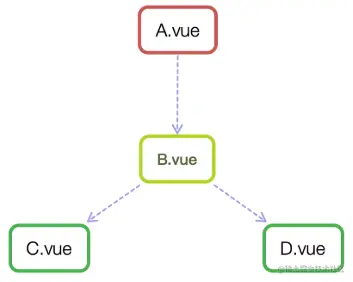
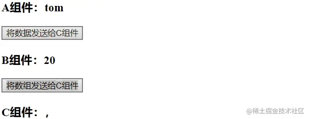
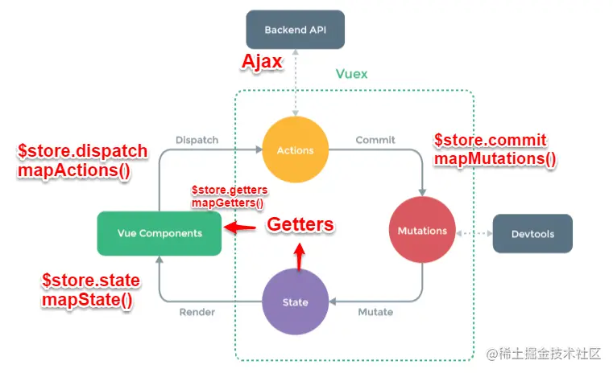
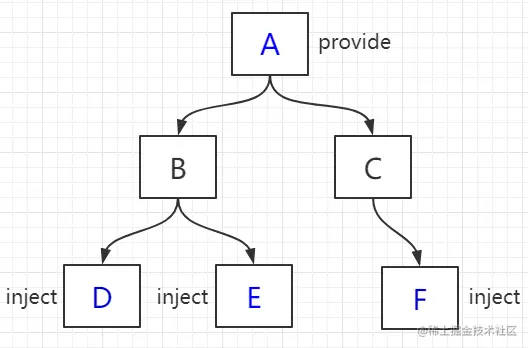
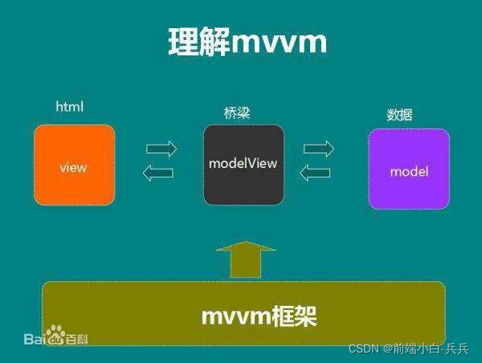
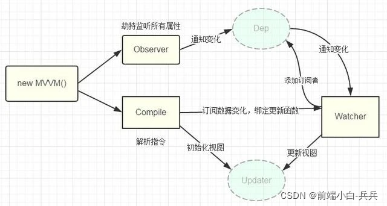
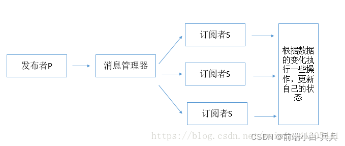
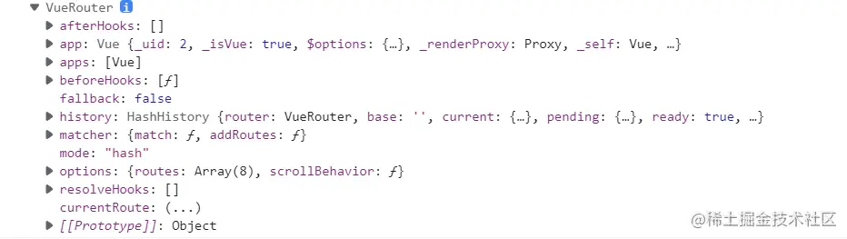
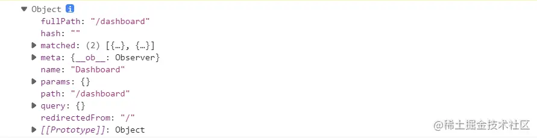

## 前端面试Vue部分总结
_____

本笔记由作者在复习前端Vue部分的相关的一些总结, 如果有什么错误的地方或者有什么相关的建议欢迎联系我

这份笔记借鉴了很多网上的文章, 如果有雷同或者相似的地方, 不用怀疑, 那就是搬得, 如果你是当中一些文章得作者,
如果觉得这种行为不恰当, 请与我联系, 收到消息后我会尽快处理

邮箱: zwn_fobj@foxmail.com

QQ: 1879154660  
QQ昵称: 只为你乱了浮生

感谢各位观看者的支持, 希望能对正在面临面试的你有所帮助,
____

## 目录 

- [一 Vue面试题<](#one)
    - [1. Vue优点?](#1)
    - [2. vue父组件向子组件传递数据？](#2)
    - [3. 子组件向父组件传递事件？](#3)
    - [4. v-show和v-if指令的共同点和不同点？](#4)
    - [5.如何让CSS只在当前组件中起作用？](#5) 
    - [6. keep-alive的作用是什么](#6)
    - [7. 如何获取dom?](#7)
    - [8. 说出几种vue当中的指令和它的用法？](#8)
    - [9. vue-loader是什么? 使用它的用途有哪些?](#9)
    - [10.为什么使用key?](#10)
    - [11.axios及安装?](#11)
    - [12. v-modal的使用。](#12)
    - [13.请说出vue.cli项目中src目录每个文件夹和文件的用法？](#13)
    - [14.分别简述computed和watch的使用场景](#14)
    - [16.$ nextTick的使用](#16)
    - [17. vue组件中data为什么必须是一个函数？](#17)
    - [18.渐进式框架的理解](#18)
    - [19.Vue中双向数据绑定是如何实现的？](#19)
    - [20.单页面应用和多页面应用区别及优缺点](#20)
  
- [二 声明周期函数面试题](#two)
    - [1.什么是 vue 生命周期？有什么作用？](#21)
    - [2.第一次页面加载会触发哪几个钩子？](#22)
    - [3.简述每个周期具体适合哪些场景](#15)
    - [4.created和mounted的区别](#23)
    - [5.vue获取数据在哪个周期函数](#24)
    - [6.请详细说下你对vue生命周期的理解？](#25)
  
- [三、vue路由面试题 ](#three)
    - [1.mvvm 框架是什么？](#26)
    - [2.vue-router 是什么?它有哪些组件](#27)
    - [3.active-class 是哪个组件的属性？](#28)
    - [4.怎么定义 vue-router 的动态路由? 怎么获取传过来的值？](#29)
    - [5.vue-router 有哪几种导航钩子?](#31)
    - [6.$route 和 $router 的区别</h2>](#32)
    - [7.vue-router的两种模式](#33)
    - [8.vue-router实现路由懒加载（ 动态加载路由 ）](#34)
    
- [四, vuex常见面试题](#four)
    - [1. vuex是什么？怎么使用？哪种功能场景使用它？](#35)
    - [2.vuex有哪几种属性？](#36)
    - [3.Vue.js中ajax请求代码应该写在组件的methods中还是vuex的actions中？](#37)
    - []()
    - []()
    - []()
    - []()
    - []()
    - []()
    - []()
-----

# <h1 id="one">一 Vue面试题</h1>

## <h2 id="1">1. Vue优点?</h2>

答：轻量级框架：只关注视图层，是一个构建数据的视图集合，大小只有几十kb；  
简单易学：国人开发，中文文档，不存在语言障碍 ，易于理解和学习；  
双向数据绑定：保留了angular的特点，在数据操作方面更为简单；   
组件化：保留了react的优点，实现了html的封装和重用，在构建单页面应用方面有着独特的优势；  
视图，数据，结构分离：使数据的更改更为简单，不需要进行逻辑代码的修改，只需要操作数据就能完成相关操作；   
虚拟DOM：dom操作是非常耗费性能的， 不再使用原生的dom操作节点，极大解放dom操作，但具体操作的还是dom不过是换了另一种方式；  
运行速度更快:相比较与react而言，同样是操作虚拟dom，就性能而言，vue存在很大的优势

## <h2 id="2">2. vue父组件向子组件传递数据？</h2>

通过props

## <h2 id="3">3. 子组件向父组件传递事件？</h2>

答：$emit方法

## <h2 id="4">4. v-show和v-if指令的共同点和不同点？</h2>

答:
共同点：都能控制元素的显示和隐藏；  

不同点：实现本质方法不同，v-show本质就是通过控制css中的display设置为none，
控制隐藏，只会编译一次；v-if是动态的向DOM树内添加或者删除DOM元素，若初始值为false，就不会编译了。
而且v-if不停的销毁和创建比较消耗性能。

总结：如果要频繁切换某节点，使用v-show(切换开销比较小，初始开销较大)。如果不需要频繁切换某节点使用v-if（初始渲染开销较小，切换开销比较大）。

## <h2 id="5">5.如何让CSS只在当前组件中起作用？</h2>

在组件中的style前面加上scoped

## <h2 id="6">6. keep-alive的作用是什么</h2>

keep-alive 是 Vue 内置的一个组件，可以使被包含的组件保留状态，或避免重新渲染。
## <h2 id="7">7. 如何获取dom?</h2>

答：ref=“domName” 用法：this.$refs.domName

## <h2 id="8">8. 说出几种vue当中的指令和它的用法？</h2>

答：
v-model双向数据绑定；  
v-for循环；  
v-if v-show 显示与隐藏；  
v-on事件；v-once: 只绑定一次。    

## <h2 id="9">9. vue-loader是什么? 使用它的用途有哪些?</h2>

vue-loader 是用于 webpack 的加载器，
允许你用 Single-File Components 单文件组件的格式来写 Vue 组件。
其作用就是提取 *.vue 文件中的template，script，style等，
再通过 vue-template-compiler，style-loader 等插件，
最终形成一个可以在浏览器中运行的 js 文件。


答：vue文件的一个加载器，将template/js/style转换成js模块。  
用途：js可以写es6、style样式可以scss或less、template可以加jade等  

## <h2 id="10">10.为什么使用key?</h2>

答：需要使用key来给每个节点做一个唯一标识，Diff算法就可以正确的识别此节点。  
作用主要是为了高效的更新虚拟DOM。

## <h2 id="11">11.axios及安装?</h2>

答：请求后台资源的模块。npm install axios --save装好，  
js中使用import进来，然后.get或.post。返回在.then函数中如果成功，失败则是在.catch函数中。

## <h2 id="12">12. v-modal的使用。</h2>

答：
v-model用于表单数据的双向绑定，其实它就是一个语法糖，这个背后就做了两个操作：
v-bind绑定一个value属性；
v-on指令给当前元素绑定事件。

## <h2 id="13">13.请说出vue.cli项目中src目录每个文件夹和文件的用法？</h2>

答：assets文件夹是放静态资源；components是放组件；router是定义路由相关的配置; app.vue是一个应用主组件；main.js是入口文件。

## <h2 id="14">14.分别简述computed和watch的使用场景</h2>

答：  
computed:  
当一个属性受多个属性影响的时候就需要用到computed  
最典型的栗子： 购物车商品结算的时候  
watch:  
当一条数据影响多条数据的时候就需要用watch  
栗子：搜索数据  

## <h2 id="16">16.$ nextTick的使用</h2>

答：当你修改了data的值然后马上获取这个dom元素的值，是不能获取到更新后的值，
你需要使用$nextTick这个回调，让修改后的data值渲染更新到dom元素之后在获取，才能成功。

## <h2 id="17">17.vue组件中data为什么必须是一个函数？</h2>

答：因为JavaScript的特性所导致，在component中，data必须以函数的形式存在，不可以是对象。  
组建中的data写成一个函数，数据以函数返回值的形式定义，这样每次复用组件的时候，都会返回一份新的data，  
相当于每个组件实例都有自己私有的数据空间，它们只负责各自维护的数据，不会造成混乱。而单纯的写成对象形式，就是所有的组件实例共用了一个data，
这样改一个全都改了

## <h2 id="18">18.渐进式框架的理解</h2>
答：主张最少；可以根据不同的需求选择不同的层级；

## <h2 id="19">19.Vue中双向数据绑定是如何实现的？</h2>

答：vue 双向数据绑定是通过 数据劫持 结合 发布订阅模式的方式来实现的，   
也就是说数据和视图同步，数据发生变化，视图跟着变化，视图变化，数据也随之发生改变；  
核心：关于VUE双向数据绑定，其核心是 Object.defineProperty()方法。

## <h2 id="20">20.单页面应用和多页面应用区别及优缺点</h2>

答：  
单页面应用（SPA），通俗一点说就是指只有一个主页面的应用，浏览器一开始要加载所有必须的 html, js, css。
所有的页面内容都包含在这个所谓的主页面中。但在写的时候，还是会分开写（页面片段），然后在交互的时候由路由程序动态载入，
单页面的页面跳转，仅刷新局部资源。多应用于pc端。  

多页面（MPA），就是指一个应用中有多个页面，页面跳转时是整页刷新  

单页面的优点：  
用户体验好，快，内容的改变不需要重新加载整个页面，基于这一点spa对服务器压力较小；前后端分离；页面效果会比较炫酷（比如切换页面内容时的专场动画）。  

单页面缺点：
不利于seo；导航不可用，如果一定要导航需要自行实现前进、后退。（由于是单页面不能用浏览器的前进后退功能，所以需要自己建立堆栈管理）；初次加载时耗时多；页面复杂度提高很多。

# <h1 id="two">声明周期函数面试题</h1>

## <h2 id="21">1.什么是 vue 生命周期？有什么作用？</h2>

答：每个 Vue 实例在被创建时都要经过一系列的初始化过程——例如，需要设置数据监听、编译模板、将实例挂载到 DOM 并在数据变化时更新 DOM 等。
同时在这个过程中也会运行一些叫做 生命周期钩子 的函数，这给了用户在不同阶段添加自己的代码的机会。
（ps：生命周期钩子就是生命周期函数）例如，如果要通过某些插件操作DOM节点，如想在页面渲染完后弹出广告窗， 那我们最早可在mounted 中进行。

## <h2 id="22">2.第一次页面加载会触发哪几个钩子？</h2>

答：beforeCreate， created， beforeMount， mounted

## <h2 id="15">3.简述每个周期具体适合哪些场景</h2>

答：  
beforeCreate：在new一个vue实例后，只有一些默认的生命周期钩子和默认事件，其他的东西都还没创建。
在beforeCreate生命周期执行的时候，data和methods中的数据都还没有初始化。不能在这个阶段使用data中的数据和methods中的方法   

created：data 和 methods都已经被初始化好了，如果要调用 methods 中的方法，或者操作 data 中的数据，最早可以在这个阶段中操作  

beforeMount：执行到这个钩子的时候，在内存中已经编译好了模板了，但是还没有挂载到页面中，此时，页面还是旧的  

mounted：执行到这个钩子的时候，就表示Vue实例已经初始化完成了。此时组件脱离了创建阶段，进入到了运行阶段。
如果我们想要通过插件操作页面上的DOM节点，最早可以在和这个阶段中进行  (可以再这个时候发送一些网络请求)

beforeUpdate： 当执行这个钩子时，页面中的显示的数据还是旧的，data中的数据是更新后的， 页面还没有和最新的数据保持同步  

updated：页面显示的数据和data中的数据已经保持同步了，都是最新的

beforeDestory：Vue实例从运行阶段进入到了销毁阶段，这个时候上所有的 data 和 methods ， 指令， 过滤器 ……都是处于可用状态。还没有真正被销毁
(这个时候通常会关闭一些定时器的使用)

destroyed： 这个时候上所有的 data 和 methods ， 指令， 过滤器 ……都是处于不可用状态。组件已经被销毁了。


## <h2 id="23">4.created和mounted的区别</h2>

答：  
created:在模板渲染成html前调用，即通常初始化某些属性值，然后再渲染成视图。  
mounted:在模板渲染成html后调用，通常是初始化页面完成后，再对html的dom节点进行一些需要的操作。

## <h2 id="24">5.vue获取数据在哪个周期函数</h2>

答：一般 created/beforeMount/mounted 皆可.  
比如如果你要操作 DOM , 那肯定 mounted 时候才能操作.

## <h2 id="25">6.请详细说下你对vue生命周期的理解？</h2>

答：  
总共分为8个阶段创建前/后，载入前/后，更新前/后，销毁前/后。  

创建前/后： 在beforeCreated阶段，vue实例的挂载元素 $ el和数据对象data都为undefined， 还未初始化。  
在created阶段，vue实例的数据对象data有了，$ el还没有。  

载入前/后：在beforeMount阶段，vue实例的$el和data都初始化了，但还是挂载之前为虚拟的dom节点， data.message还未替换。
在mounted阶段，vue实例挂载完成，data.message成功渲染。  

更新前/后：当data变化时，会触发beforeUpdate和updated方法。  

销毁前/后：在执行destroy方法后，对data的改变不会再触发周期函数，说明此时vue实例已经解除了事件监听以及和dom的绑定，但是dom结构依然存在。


# <h1 id="three">三、vue路由面试题 </h1>

## <h2 id="26">1.mvvm 框架是什么？</h2>

答：  
vue是实现了双向数据绑定的mvvm框架，当视图改变更新模型层，当模型层改变更新视图层。
在vue中，使用了双向绑定技术，就是View的变化能实时让Model发生变化，而Model的变化也能实时更新到View。

## <h2 id="27">2.vue-router 是什么?它有哪些组件</h2>

答：vue用来写路由一个插件。<font color="red">router-link、router-view</font> 

vue-router是Vue.js官方的路由管理器,它和Vue.js的核心深度集成,让构建单页面应用变得更加简单  

**vue-router组件:**  
  - <router-link to=""> 路由的路径
  - <router-link :to="{name:' '|路由名}" 命名路由
  - <router-view> 路由的显示


## <h2 id="28">3.active-class 是哪个组件的属性？</h2>

active-class属于vue-router的样式方法,当`routerlink`标签被点击是,将会应用这个样式  

使用方法一: touterLink标签内使用  

```html
<router-link to="/" active-class="active">首页</router-link> 
```

使用方法二:在路由js文件,配hi在active-vlass
```html
<script>
    const router = new VueRouter({
        routes,
        linkActiveClass: 'active'
    });
</script>
```
在使用时会有一个小bug: 首页的active会一直被应用  
为了解决这个问题,还需要加入一个属性`exact`(表示路由的严格匹配),也有两种方法  


方式一:在router-link中写入exact  
```html
<router-link to="/" active="active" exact>首页</router-link>
```

方式二: 在路由js文件配置active-class  
```html
<script>
    const router = new VueRouter({
        routes,
        linkExactActiveClass: 'active'
    });
</script>

```

## <h2 id="29">4.怎么定义 vue-router 的动态路由? 怎么获取传过来的值？</h2>

答：在router目录下的index.js文件中，对path属性加上/:id。 使用router对象的params.id。


可以通过query,param两种方式, 区别: query通过url传参, 刷新 页面参数还在, params刷新页面参数不在  

param的类型: 
- 配置路由格式: /router/:id  
- 传递的方式: 在path后面跟上对应的值
- 传递后的合成路径:/router/123
```
<!-- 动态路由-params -->
 
//在APP.vue中
    <router-link :to="'/user/'+userId" replace>用户</router-link>    
 
//在index.js
     {
    path: '/user/:userid',
    component: User,
    },
```
跳转方法:  
``` 
// 方法1：
<router-link :to="{ name: 'users', params: { uname: wade }}">按钮</router-link>
// 方法2：
this.$router.push({name:'users',params:{uname:wade}})
// 方法3：
this.$router.push('/user/' + wade)
```
通过$route.params.参数名 获取你所传递的值

query的类型:

- 配置路由格式:/router,也就是普通配置
- 传递的方式,对象中使用query的key作为传递方式
-传递后形成的路径:/route?id=123
  
```html
  <!-- 动态路由-params -->

//在APP.vue中
<router-link :to="'/user/'+userId" replace>用户</router-link>

//在index.js
{
path: '/user/:userid',
component: User,
},
```
**跳转方法：**

```html
//方法1 
<touter-link :to="{name='users',params:{uname:wade}">按钮</touter-link>
//方法2
this.$router.push({name:'users',params:{uname:wade}})
//方法2
this.$router.push('/user/'+wade)
```
通过$route.params.参数名 获取你所传递的值

query的类型: 
- 配置路由格式:/router,也就是普通配置
- 传递的方式: 对象中使用query的key作为传递方式
- 传递后性成分的路径: `/route?id=123`

```html
<!--动态路由-query -->
//01-直接在router-link 标签上以对象的形式
<router-link :to="{path:'/profile',query:{name:'why',age:28,height:188}}">档案</router-link>
/*
    02-或者写成按钮以点击事件形式
    <button @click='profileClick'>我的</button>    
*/
 
 //点击事件
 profileClick(){
   this.$router.push({
        path: "/profile",
        query: {
          name: "kobi",
          age: "28",
          height: 198
        }
      });
 }
```
跳转方法: 

```html
// 方法1：
<router-link :to="{ name: 'users', query: { uname: james }}">按钮</router-link>
// 方法2：
this.$router.push({ name: 'users', query:{ uname:james }})
// 方法3：
<router-link :to="{ path: '/user', query: { uname:james }}">按钮</router-link>
// 方法4：
this.$router.push({ path: '/user', query:{ uname:james }})
// 方法5：
this.$router.push('/user?uname=' + jsmes)
```

通过$route.query获取你所传递的值

## <h2 id="31">5.vue-router 有哪几种导航钩子?</h2>

答：三种，
第一种：是全局导航钩子：router.beforeEach(to,from,next)，作用：跳转前进行判断拦截。
  - 前置钩子 router.beforeEach,初始化的时候被调用,每次路由切换之前被调用   
    一般用来做一些进入页面的限制, 比如没有登录,就不能进入某些也页面  
```javascript
meta: { may: true }
router.beforeEach((to, from, next) => {
    if (to.matched.some(item => item.meta.may)) {
        let id = window.localStorage.getItem("id")
        if (id) {
            next()
        } else {
            next({ name: "login" })
        }
    } else {
        next()
    }
})
//注意：next 方法必须要调用，否则钩子函数无法 resolved 
```
  - 后置钩子 router.afterEach 初始化的时候被调用,每次路由切换之后被调用 在动态更改系统顶部的标题的时候，
    就需要使用这个全局后置路由守卫
```javascript
// 全局后置路由守卫，它只有两个参数
// to==>到哪一个路由，
// form ==> 来源哪一个路由，
router.afterEach((to,form) => {
    console.log('to', to, form);
    console.log('form',to,form);
})

router.afterEach((to,form) => {
    console.log('to', to);
    console.log('form', form);
    document.title=to.mata.title
})

/**
 * 元路由meta
 * 很多时候路,我们需要将一个路由上放置一个信息  
 * 我们可以放在meta上
 * 简单配置如下
 * {
    path: "/zujian",
    name: "zujian",
    meta: {
        user: admin,
        info:'我是admin',
        key:'key-value的形式'
    },
    component: () => import("../views/zujian.vue"),
},
 */
```
  
第二种：组件内的钩子
```javascript
beforeRouteEnter(to, from, next) {
    // do someting
    // 在渲染该组件的对应路由被 confirm 前调用
},
beforeRouteUpdate(to, from, next) {
    // do someting
    // 在当前路由改变，但是依然渲染该组件是调用
},
beforeRouteLeave(to, from ,next) {
    // do someting
    // 导航离开该组件的对应路由时被调用
}
```
第三种：单独路由独享钩子
```javascript
{
    path: '/home',
    name: 'home',
    component: Home,
    beforeEnter(to, from, next) {
        if (window.localStorage.getItem("id")) {
            next()
        } else {
            next({ name: "login" })
        }
    }
}
```

全局解析守卫  
router.beforeResolve 注册一个全局守卫, 和 router.beforeEach类似
可以在src目录下创建一个permission.js文件

```javascript
router.afterEach((to,from) => {
	if(to.meta && to.meta.title){
		document.title = to.meta.title
	}else{
		document.title = "666"
	}
})
第二种：单独路由独享钩子

{
    path: '/home',
    name: 'home',
    component: Home,
    beforeEnter(to, from, next) {
        if (window.localStorage.getItem("id")) {
            next()
        } else {
            next({ name: "login" })
        }
    }
}
第三种：组件内的钩子

beforeRouteEnter(to, from, next) {
    // do someting
    // 在渲染该组件的对应路由被 confirm 前调用
},
beforeRouteUpdate(to, from, next) {
    // do someting
    // 在当前路由改变，但是依然渲染该组件是调用
},
beforeRouteLeave(to, from ,next) {
    // do someting
    // 导航离开该组件的对应路由时被调用
}
```


## <h2 id="32">6.$route 和 $router 的区别</h2>

答：  
$route对象: $route对象表示当前的的路由信息,包含当前URL解析得到的信息,包含当前的路径,参数,query对象等

```
1.$route.path 字符串,对应当前路由的路径,总是解析为绝对路径 如:"/foo/bar"
2. $route.params 一个key/value对象,包含了 动态片段和 全匹配片段,如果没有路由参数就是一个空对象
3. $route.params 一个key/value对象,白哦是URL查询参数.例如,对于路径/foo?uer=1,
  有$route.query.user == 1， 如果没有查询参数，则是个空对象。
4. $route.hash当前路由的hash值(不带#),如果没有hash值,则为空字符串 锚点*
5. $route.fullPath完成解析后的URL,包含查询参数和hash的完整路径
6. $route.matched数组,包含当前匹配的路径中所包含的所有片段所对应的配置参数对象
7. $toute.name 当前路径名字
8. $route.meta路由元信息
```

$route对象: $router对象时全局路由的实例,时router构造方法的实例

实例方法:
```java
1. push
  1. 字符串this.$router.push('home')
  2. 命名的路由this.$router.push({name:'user',params:{userId:123}})
  3. 带查询参数 变成 /register?plan=123 this.$router.push({path:'register',query:{plan:'123'}})
    push方法其实和<router-link :to="...">是等同的。
  4.对象 this.$router.push({path:'home'})
  注意: push方法的会跳转向history栈添加一个新的记录,当我们点击浏览器的返回按钮时可以看到之前的页面

2. go
  页面路由跳转
  签进或者后退this.$router,go(-1)//后退

3. replace
  push方法会向history栈添加一个新的记录,而replace方法时替换当前的页面  
  不会像history栈添加一个新的记录
```


router是VueRouter的实例，在script标签中想要导航到不同的URL,
使用router.push方法。返回上一个历史history用$router.to(-1)

$route为当前router跳转对象。里面可以获取当前路由的name,path,query,parmas等。

## <h2 id="33">7.vue-router的两种模式</h2>

答:

hash模式：即地址栏 URL 中的 # 符号；

history模式：window.history对象打印出来可以看到里边提供的方法和记录长度。
利用了 HTML5 History Interface 中新增的 pushState() 和 replaceState() 方法。（需要特定浏览器支持）。

因此可以说，hash 模式和 history 模式都属于浏览器自身的特性，Vue-Router 只是利用了这两个特性（通过调用浏览器提供的接口）来实现前端路由。


一般情景下, hahs和history都可以,除非你更在意颜值,`#`符号夹杂在URL来确实有些不太美丽

另外，根据 Mozilla Develop Network 的介绍，
调用 history.pushState() 相比于直接修改 hash，存在以下优势：
```text
pushState() 设置的新 URL 可以是与当前 URL 同源的任意 URL；
而 hash 只可修改 # 后面的部分，因此只能设置与当前 URL 同文档的 URL；

pushState() 设置的新 URL 可以与当前 URL 一模一样，这样也会把记录添加到栈中；
而 hash 设置的新值必须与原来不一样才会触发动作将记录添加到栈中；

ushState() 通过 stateObject 参数可以添加任意类型的数据到记录中
；而 hash 只可添加短字符串；

pushState() 可额外设置 title 属性供后续使用。
```

比较:
1. `hash`模式下,仅`hash`符号之前的内容会被包含在前求中,
   如 `http://www.abc.com`，因此对于后端来说，
   即使没有做到对路由的全覆盖，也不会返回 404 错误。
   
2.`history`模式下,前端的URL必须和实际像后端发起的URL一致,
  如 `http://www.abc.com/book/id `。
  如果后端缺少对 /book/id 的路由处理，将返回 404 错误。

```text
Vue-Router 官网里如此描述：“不过这种模式要玩好，还需要后台配置支持……所以呢
，你要在服务端增加一个覆盖所有情况的候选资源：
如果 URL 匹配不到任何静态资源，则应该返回同一个 index.html 页面，
这个页面就是你 app 依赖的页面。”
```


## <h2 id="34">8.vue-router实现路由懒加载（ 动态加载路由 ）</h2>

答:  
三种方式  

第一种：vue异步组件技术 ==== 异步加载，v
ue-router配置路由 , 使用vue的异步组件技术 , 可以实现按需加载 .
但是,这种情况下一个组件生成一个js文件。  
```javascript
/* vue异步组件技术 */
{
  path: '/home',
  name: 'home',
  component: resolve => require(['@/components/home'],resolve)
},{
  path: '/index',
  name: 'Index',
  component: resolve => require(['@/components/index'],resolve)
},{
  path: '/about',
  name: 'about',
  component: resolve => require(['@/components/about'],resolve)
} 
```
第二种：路由懒加载(使用import)。    
```javascript
// 下面2行代码，没有指定webpackChunkName，每个组件打包成一个js文件。
/* const Home = () => import('@/components/home')
const Index = () => import('@/components/index')
const About = () => import('@/components/about') */
// 下面2行代码，指定了相同的webpackChunkName，会合并打包成一个js文件。 把组件按组分块
const Home =  () => import(/* webpackChunkName: 'ImportFuncDemo' */ '@/components/home')
const Index = () => import(/* webpackChunkName: 'ImportFuncDemo' */ '@/components/index')
const About = () => import(/* webpackChunkName: 'ImportFuncDemo' */ '@/components/about')

//再路由文件下进行配置

{
  path: '/about',
          component: About
}, {
  path: '/index',
          component: Index
}, {
  path: '/home',
          component: Home
}

```
第三种：webpack提供的require.ensure()，  
vue-router配置路由，使用webpack的require.ensure技术，也可以实现按需加载。   
这种情况下，多个路由指定相同的chunkName，会合并打包成一个js文件。  
```javascript
/* 组件懒加载方案三: webpack提供的require.ensure() */
{
  path: '/home',
  name: 'home',
  component: r => require.ensure([], () => r(require('@/components/home')), 'demo')
}, {
  path: '/index',
  name: 'Index',
  component: r => require.ensure([], () => r(require('@/components/index')), 'demo')
}, {
  path: '/about',
  name: 'about',
  component: r => require.ensure([], () => r(require('@/components/about')), 'demo-01')
}
```
# <h1 id="four">四, vuex常见面试题</h1>

## <h2 id="35">1.vuex是什么？怎么使用？哪种功能场景使用它？</h2>

答：vue框架中状态管理。在main.js引入store，注入。

新建了一个目录store.js，…… export 。  

场景有：单页应用中，组件之间的状态。音乐播放、登录状态、加入购物车


## <h2 id="36">2.vuex有哪几种属性？</h2>

答：   
有五种，分别是 State、 Getter、Mutation 、Action、 Module  
state => 基本数据(数据源存放地)  
getters => 从基本数据派生出来的数据  
mutations => 提交更改数据的方法，同步！  
actions => 像一个装饰器，包裹mutations，使之可以异步。   
modules => 模块化Vuex  

## <h2 id="37">3.Vue.js中ajax请求代码应该写在组件的methods中还是vuex的actions中？</h2>

答：   
如果请求来的数据是不是要被其他组件公用，仅仅在请求的组件内使用，就不需要放入vuex 的state里。  
如果被其他地方复用，这个很大几率上是需要的，如果需要，请将请求放入action里，方便复用。   


# <h1>后续补充内容</h1>

## <h2 id="38">1. Vue组件间通信方式总结</h2>

Vue组件间通信方式: props、$emit/$on、vuex、$parent / $children、$attrs/$listeners和provide/inject



#### 方法一: `props`/`$emit`  

如组件A通过props的方式向子组件B传递, B to A通过在B组件中$emit, A组件中v-on的方式实现

1. 父组件向子组件传值: 在子组件中获取获取父组件中的数据 

```javascript
//App.vue父组件
<template>
  <div id="app">
    <users v-bind:users="users"></users>//自定义名称便于子组件调用，后者要传递数据名
  </div>
</template>
<script>
import Users from "./components/Users"
export default {
  name: 'App',
  data(){
    return{
      users:["Henry","Bucky","Emily"]
    }
  },
  components:{
    "users":Users
  }
}
</script>
```

```javascript
/users子组件
<template>
  <div class="hello">
    <ul>
      <li v-for="user in users">{{user}}</li>//遍历传递过来的值，然后呈现到页面
    </ul>
  </div>
</template>
<script>
export default {
  name: 'HelloWorld',
  props:{
    users:{           //这个就是父组件中子标签自定义名字
      type:Array,     //这个是值的类型
      required:true   // 值是否必须传递
    }
  }
}
</script>
```
总结：父组件通过props向下传递数据给子组件。注：组件中的数据共有三种形式：data、props、computed

2. 子组件向父组件传值（通过事件形式）  
事件在父组件里申明,由子组件调用,在传递参数的时候使用的是子组件的参数, 这样就完成了子组件向父组件传值

```javascript
// 子组件
<template>
  <header>
    <h1 @click="changeTitle">{{title}}</h1> <!--//绑定一个点击事件-->
  </header>
</template>
<script>
export default {
  name: 'app-header',
  data() {
    return {
      title:"Vue.js Demo"
    }
  },
  methods:{
    changeTitle() {
      this.$emit("titleChanged","子向父组件传值");//自定义事件  传递值“子向父组件传值”
    }
  }
}
</script>
```


```javascript
// 父组件
<template>
  <div id="app">
    <app-header v-on:titleChanged="updateTitle" ></app-header>//与子组件titleChanged自定义事件保持一致
    // updateTitle($event)接受传递过来的文字
    <h2>{{title}}</h2>
  </div>
</template>
<script>
  import Header from "./components/Header"
  export default {
  name: 'App',
  data(){
  return{
  title:"传递的是一个值"
}
},
  methods:{
  updateTitle(e){   //声明这个函数
  this.title = e;
}
},
  components:{
  "app-header":Header,
}
}
</script>

```
总结：子组件通过events给父组件发送消息，实际上就是子组件把自己的数据发送到父组件。

#### 方法二: `$emit/on`  

这种方法通过一个空的Vue的示例作为中央事件总线(事件中心), 用它来触发事件和监听事件, 巧妙而轻量地实现了任何组件的通信,
包括父子,兄弟,跨级, 当我们的项目比较大时, 可以选择个好的状态管理解决方案vuex

1. 具体实现方式：

```javascript
    var Event=new Vue();
    Event.$emit(事件名,数据);
    Event.$on(事件名,data => {});
```
2. 举个例子

假设兄弟组件有三个，分别是A、B、C组件，C组件如何获取A或者B组件的数据
```html
<div id="itany">
  <my-a></my-a>
  <my-b></my-b>
  <my-c></my-c>
</div>
<template id="a">
  <div>
    <h3>A组件：{{name}}</h3>
    <button
    @click="send">将数据发送给C组件
  </button>
</div>
</template>
<template id="b">
  <div>
    <h3>B组件：{{age}}</h3>
    <button
    @click="send">将数组发送给C组件
  </button>
</div>
</template>
<template id="c">
  <div>
    <h3>C组件：{{name}}，{{age}}</h3>
  </div>
</template>
<script>
  
var Event = new Vue();//定义一个空的Vue实例
  
var A = { // A组件
  template: '#a',
  data() {
    return {
        name: 'tom'
    }
  },
  methods: {
    send() {
      Event.$emit('data-a', this.name);
    }
  }
}
  
var B = { // B组件
  template: '#b',
  data() {
    return {
        age: 20
    }
  },
  methods: {
    send() {
        Event.$emit('data-b', this.age);
    }
  }
}
  
var C = { // C 组件
  template: '#c',
  data() {
    return {
      name: '',
      age: ""
    }
  },
  mounted() {//在模板编译完成后执行
    Event.$on('data-a',name => {
        this.name = name;//箭头函数内部不会产生新的this，这边如果不用=>,this指代Event
    })
    Event.$on('data-b',age => {
        this.age = age;
    })
  }
}

var vm = new Vue({
  el: '#itany',
  components: {
        'my-a': A,
        'my-b': B,
        'my-c': C
    }
});
</script>
```



#### 方法三: vuex



1. 简单介绍Vuex原理  

Vuex实现了一个单向数据流, 在全局中拥有一个State存放数据, 当组件要更改State中的数据时, 必须通过Mutation进行,
Mutation同时提供了订阅者模式供外部插件调用State数据的更新,而当所有异步操作(常见于调用后端接口异步获取更新数据)
或批量的同步操作需要走Action, 但Action也是无法直接修改State的,还是需要通过Mutation来修改的数据,最后State的变化,
渲染到视图上

2. 简要介绍各模块在流程中的功能: 

+ VueComponents: Vue组件,HTML页面上,负责接收用户操作等交互行为,执行dispatch方法触发对应action进行回应
+ dispatch: 操作行为触发方法, 是唯一能执行action的方法
+ actions: 操作行为处理模块, 由组件中$store.dispatch('action 名称', data1)来触发,然后由commit()来触发mutation的调用
  间接更新state,负责处理Vue Components 接收到所有交互行为, 包含同步/异步操作,支持多个同名方法, 按照注册的顺序一次触发;
  向后台API请求的操作就这个模块中进行,包括触发其他action以及提交mutation的操作; 该模块提供了Promise的封装,以及支持action的
  链式触发
  
+ commit:状态改变提交操作方法, 对mutation进行提交,是唯一能操作mutation的方法
+ mutations: 状态改变操作方法,由actions中的`commit('mutation 名称')`来触发, 是Vue修改State的唯一推荐方法,
该方法只能进行同步操作,且方法名只能全局唯一,操作之中会有一些hook暴露出来,以及进行state的监控等
  
+ state:页面装台管理容器对象,几种存储Vue commponents中data对象的零散数据,全局唯一,以进行统一的状态管理,
页面显示所需的数据从该对象中进行读取,利用Vue的细粒度数据响应机制来进行高效的状态更新
  
+ getters: state对象读取方法,图中没有单独列出该模块,应该包含在render中, Vue Components 通过该方法读取全局state对象


3. Vuex与localStorage

vuex 是 vue的状态管理器, 存储的数据是响应式的并不会保存起来,刷新之后就回到了初始状态,具体做法应该在vuex里数据改变的时候把数据拷贝一份到localStorage里面,
刷新之后,如果localStorage里由保存的数据,取出来再替换store里的state

```javascript
let defaultCity = "上海"
try {   // 用户关闭了本地存储功能，此时在外层加个try...catch
  if (!defaultCity){
    defaultCity = JSON.parse(window.localStorage.getItem('defaultCity'))
  }
}catch(e){}
export default new Vuex.Store({
  state: {
    city: defaultCity
  },
  mutations: {
    changeCity(state, city) {
      state.city = city
      try {
      window.localStorage.setItem('defaultCity', JSON.stringify(state.city));
      // 数据改变的时候把数据拷贝一份保存到localStorage里面
      } catch (e) {}
    }
  }
})

```

这里需要注意的是: 由于vuex,我们保存的状态都是数组,而localStorage只支持字符串,所以需要用JSON转换

```javascript
JSON.stringify(state.subscribeList);   // array -> string
JSON.parse(window.localStorage.getItem("subscribeList"));    // string -> array
```

#### 方法四. $attrs/$listeners

1. 简洁  

多组件嵌套需要传递数据时,通常使用的方法是vuex, 但如果仅仅是传递数据,而不做中间处理, 使用vuex, 未免有点大材小用,
为此Vue2.4版本提供了另一种方法----`$attrs`/`$listeners`

- `$attrs`: 包含了父作用域中不被prop所识别(且获取)的特性绑定(class和style除外),当一个组件没有声明任何prop时,
这里会报含所有父作用域的绑定(class和style除外),并且可以同故宫v-bind="$attrs"传入内部组件,通常配合inheritAttrs选择一起使用  
  
- `$listeners`:包含了父作用域中的(不含 .native 修饰器的)v-on事件监听器,它可以通过v-on="$listeners"传入内部组件

跨级别通信的例子:

```javascript
// index.vue
<template>
  <div>
    <h2>浪里行舟</h2>
    <child-com1
      :foo="foo"
      :boo="boo"
      :coo="coo"
      :doo="doo"
      title="前端工匠"
    ></child-com1>
  </div>
</template>
<script>
const childCom1 = () => import("./childCom1.vue");
export default {
  components: { childCom1 },
  data() {
    return {
      foo: "Javascript",
      boo: "Html",
      coo: "CSS",
      doo: "Vue"
    };
  }
};
</script>
```
```javascript
// childCom1.vue
<template class="border">
  <div>
    <p>foo: {{ foo }}</p>
    <p>childCom1的$attrs: {{ $attrs }}</p>
    <child-com2 v-bind="$attrs"></child-com2>
  </div>
</template>
<script>
const childCom2 = () => import("./childCom2.vue");
export default {
  components: {
    childCom2
  },
  inheritAttrs: false, // 可以关闭自动挂载到组件根元素上的没有在props声明的属性
  props: {
    foo: String // foo作为props属性绑定
  },
  created() {
    console.log(this.$attrs); // { "boo": "Html", "coo": "CSS", "doo": "Vue", "title": "前端工匠" }
  }
};
</script>

```

```javascript
// childCom2.vue
<template>
  <div class="border">
    <p>boo: {{ boo }}</p>
    <p>childCom2: {{ $attrs }}</p>
    <child-com3 v-bind="$attrs"></child-com3>
  </div>
</template>
<script>
const childCom3 = () => import("./childCom3.vue");
export default {
  components: {
    childCom3
  },
  inheritAttrs: false,
  props: {
    boo: String
  },
  created() {
    console.log(this.$attrs); // { "coo": "CSS", "doo": "Vue", "title": "前端工匠" }
  }
};
</script>
```

```javascript
// childCom3.vue
<template>
  <div class="border">
    <p>childCom3: {{ $attrs }}</p>
  </div>
</template>
<script>
export default {
  props: {
    coo: String,
    title: String
  }
};
</script>

```

#### 方法五. provide/inject

1. 简介  

Vue2.2.0新增API, 这对选择需要一起使用, 以允许一个祖先组件向所其所有子孙后代注入一个依赖,不论组件层次有多深,并再起上下游关系成立
的时间里始终生效, 一言而蔽之：祖先组件中通过provider来提供变量，然后在子孙组件中通过inject来注入变量。
provide / inject API 主要解决了跨级组件间的通信问题，不过它的使用场景，
主要是子组件获取上级组件的状态，跨级组件间建立了一种主动提供与依赖注入的关系。

2. 举个栗子

假设有两个租价: A.vue 和 B.vue B是A的子组件
```javascript
// A.vue
export default {
  provide: {
    name: '浪里行舟'
  }
}
```
```javascript
// B.vue
export default {
  inject: ['name'],
  mounted () {
    console.log(this.name);  // 浪里行舟
  }
}
```

可以看到，在 A.vue 里，我们设置了一个`provide`: name，
值为 浪里行舟，它的作用就是将`name`这个变量提供给它的所有子组件。
而在 B.vue 中，通过`inject`注入了从 A 组件中提供的`name`变量，
那么在组件 B 中，就可以直接通过`this.name`访问这个变量了，
它的值也是 浪里行舟。这就是 provide / inject API 最核心的用法。
需要注意的是：provide 和 inject 绑定并不是可响应的。这是刻意为之的。
然而，如果你传入了一个可监听的对象，那么其对象的属性还是可响应的----vue官方文档

所以，上面 A.vue 的 name 如果改变了，B.vue 的`this.name`是不会改变的，仍然是 浪里行舟。

3. provide与inject 怎么实现数据响应式

一般来说，有两种办法：

provide祖先组件的实例，然后在子孙组件中注入依赖，这样就可以在子孙组件中直接修改祖先组件的实例的属性，不过这种方法有个缺点就是这个实例上挂载很多没有必要的东西比如props，methods
使用2.6最新API Vue.observable 优化响应式 provide(推荐)

我们来看个例子：孙组件D、E和F获取A组件传递过来的color值，并能实现数据响应式变化，即A组件的color变化后，组件D、E、F会跟着变（核心代码如下：）



```javascript
// A 组件 
<div>
      <h1>A 组件</h1>
      <button @click="() => changeColor()">改变color</button>
      <ChildrenB />
      <ChildrenC />
</div>
......
  data() {
    return {
      color: "blue"
    };
  },
  // provide() {
  //   return {
  //     theme: {
  //       color: this.color //这种方式绑定的数据并不是可响应的
  //     } // 即A组件的color变化后，组件D、E、F不会跟着变
  //   };
  // },
  provide() {
    return {
      theme: this//方法一：提供祖先组件的实例
    };
  },
  methods: {
    changeColor(color) {
      if (color) {
        this.color = color;
      } else {
        this.color = this.color === "blue" ? "red" : "blue";
      }
    }
  }
  // 方法二:使用2.6最新API Vue.observable 优化响应式 provide
  // provide() {
  //   this.theme = Vue.observable({
  //     color: "blue"
  //   });
  //   return {
  //     theme: this.theme
  //   };
  // },
  // methods: {
  //   changeColor(color) {
  //     if (color) {
  //       this.theme.color = color;
  //     } else {
  //       this.theme.color = this.theme.color === "blue" ? "red" : "blue";
  //     }
  //   }
  // }

```

```javascript
// F 组件 
<template functional>
  <div class="border2">
    <h3 :style="{ color: injections.theme.color }">F 组件</h3>
  </div>
</template>
<script>
export default {
  inject: {
    theme: {
      //函数式组件取值不一样
      default: () => ({})
    }
  }
};
</script>
```

#### 方法六、$parent / $children与 ref

```javascript

```

## <h2 id="39">39.MVVM模型的理解?</h2>

MVVM（Model-View-ViewModel）是对 MVC（Model-View-Control）和 MVP（Model-View-Presenter）的进一步改进。

> View: 视图层(UI用户界面)
> ViewModel: 业务逻辑层(一切 js 可视为业务逻辑,也就是前端的日常工作)
> Model: 数据层(存储数据以及数据的处理如增删改查)

- MVVM将数据双向绑定(data-binding)作为核心思想,View和Model之间没有联系,
  他们通过ViewModel这个桥梁进行交互  
  
- Model和ViewModel之间的交互是双向的,因此View的拜年话回自动同步到Model,  
  而model的变化也会立即反映到View上显示
  
- 当用户操作View, ViewModel感知到变化,然后通知Model发生相应的改变;  
  反之当Model发生改变,ViewModel也能感知到变化,使View做出相应的更新  
  


MVVM框架的核心就是双向绑定,器原理是同故宫数据劫持+发布订阅模式结合的方式实现的,
简单来说就是数据层发生变化的时候,可同步更新视图层,当视图层发生变化的时候,
同步更新到数据层  

## <h2 id="40">40. 双向绑定的核心: Object.defineProperty()</h2>

Object.defineProperty(obj,prop,descriptor)方法回直接在一个对象上定义一个新属性,
或者修改一个对象的现有属性,并返回此对象  

> - obj: 要定义属性的对象
> - prop: 要定义或修改的属性的名称或Symbol
> - descriptor: 要定义或修改的属性描述符  
> - 返回值: 被传递给函数的对象

我们通过Object.defineProperty的get方法用来获取set方法用来拦截设置值  

```javascript
var obj = {} //定义一个空对象
Object.defineProperty(obj,'val',{ //定义要修改对象的属性
    get:function(){
      console.log('获取对象的值')
    },
    set:function (newVal) {
      console.log('设置对象的值,最新的值是'+newVal);
    }
})

obj.hello = 'hello world'

```

js通过Object.defineProperty方法简单的实现双向绑定  

```html
<!DOCTYPE html>
<html lang="en">
<head>
    <meta charset="UTF-8">
    <meta http-equiv="X-UA-Compatible" content="IE=edge">
    <meta name="viewport" content="width=device-width, initial-scale=1.0">
    <title>Document</title>
</head>
<body>
    <input type="text" id="app">
    <span id="childSpan"></span>
</body>
<script>
    var obj = {}
    var initValue='初始值'
    Object.defineProperty(obj,'initValue',{
        get(){
            console.log('获取obj最新的值');
            return initValue
        },
        set(newVal){
            initValue = newVal
            console.log('设置最新的值');
            // 获取到最新的值  然后将最新的值赋值给我们的span
            document.getElementById('childSpan').innerHTML = initValue
            console.log(obj.initValue);
        }
    })
    document.addEventListener('keyup', function (e) {
        obj.initValue = e.target.value; //监听文本框里面的值 获取最新的值 然后赋值给obj 
    })
    
</script>
</html>
```

## <h2 id="41">41. 实现双向数据绑定的过程</h2>



任务拆分:
  1. 将vue实例中的数据渲染到页面上  
  2. 将页面上的数据变更同步到vue实例中
  3. vue实例中data数据变更,页面上数据同步变更

传统的JS来操作dom是非常繁琐的,性能极低,比如我们要错做dom 10次,操作第一次的时候,
浏览器还不知道后面还有9次操作,所以浏览器回进行10次的重绘重排 ,
但有的时候,我们进行下一次操作的时候,前一次的操作结果已经不准确了,
那前一次的操作结果就是无用功了,白白浪费了性能;  

DocumentFragment(碎片化文档)可以把其看成一个容器,
把浏览器10次操作都扔到这个容器里,最终把最后一次的结果输出到浏览器上,
真央我们只渲染了一次,并且DocumentFragment是在内存中执行的效率非常高  

DocumentFragment拦截数据:  
```javascript
function nodeToFragment(node){ //这里的node是一个链表的头部
    var fragment = docuemnt.createDocumentFragment();
    var child = null;
    while(child = node.firstChild){
        fragment.appendChild(child)
    }
    return fragment
}
```
实现思路:  
  1. 如何将vue data中的数据对应绑定到文本上  
  2. 如果将input中的数据更新到vue实例的data中  

nodeToFragment方法中,我们会拦截到所有的dom然后对dom节点的属性进行分析,
比如找到v-model中的对应的变量跟vue data中的变量进行匹配,匹配到对应项
然后更新数据  

vue构造函数  
```javascript
//构造函数 
function Vue(options) {
  this.data = options.data
  var id = options.el
}

// 实例
var vm = new Vue({
  el: 'app',
  data: {
    text: '赵刚',
    test: '测试',
    name: 'hbb'
  }
})
        // dom结构
<div id="app"> 
        测试双向绑定demo 
        <input type="text" v-model="text" /> {{text}}
</div>


```

拦截dom并找到vue实例中data对应的数据,然后渲染到页面上

```javascript
// 编译函数
function compile(name,vm){
  var reg = /\{\{(.*)\}\}/; // 来匹配{{xxx}}中的xxx
  //如果元素节点
  if(node.nodeType === 1){
      var attr = node.attributes;
      //解析元素所有属性
        for(let i = 0; i <attr.length;i++){
            if (attr[i].nodeName === 'v-model'){
                var name = attr[i].nodeValue //看看是与哪一个数据相关
                //元素监听输入事件,来实时更新data中的值
                node.addEventListener('input',function (e){ 
                  //将与其相关的数据改为最新值
                  vm[name] = e.target.value
                })
              node.value = vm.data[name];
            }
        }
  }
  
  //如果是文本节点
  if(node.nodeType === 3){
      if (reg.test(node.nodeValue)){
          var name = RegExp.$1; //获取到匹配的字符串
            name = name.trim();
            node.nodeValue = vm[name] //将data中的值赋予给该node
      }
  }
}

```
将获取到的data中的数据更新到文档碎片中
```javascript
function nodeToFrament(node,vm){
    var fragment = document.createDocumentFragment();
    var child;
    while (child = node.firstChild){
        compile(child,vm) //将从dta中获取到的数据的dom更新到文档碎片中
        fragment.appendChild(child)
    }
    return fragment
}
```

如果我们完成了第一步,将最新的数据更新到data中  
首先我们需要拦截data对象中的所有属性,这样当页面数发生改变,我们会在setter函数中监听到数据变化并拿到最新的数据
```javascript
function Vue(options){
    this.data = options.data;
    observe(this.data,this) //观察整个data对象
    var id = options.el 
    var dom = nodeToFragment(document.getElementById(id),this)
    //处理完所有节点后,重新把内容添加回去  
    document.getElementById(id).appendChild(dom)
}
//拦截data中所有数据
function observe(obj,vm){
    for (let key of Object.keys(obj)){
        defineReactive(vm,key,obj[key]);
    }
} 

function defineReactive(obj,key,val){
    Object.defineProperties(obj,key,{
        get:function (){
            // 获取对象的值
            return val
        },
        set: function (newVal){
            val = newVal;
            //当对象属性变更, 拦截数据
          console.log('新值'+val)
        }
    })
}

```
第三步 就是当我们已经拿到最新的变更后的数据了 那么怎么通知dom 让其对应的更新成最新的数据呢 我们都知道一个页面就是一个组件 一个vue实例对象 
那么我们就需要一个中间桥梁 当数据发生变化 这个中间桥梁拿到最新数据 然后告诉页面 数据更新了 你需要重新渲染了

发布订阅模式:  
发布订阅者模式就是一种 一对多 的依赖关系。多个订阅者（一般是注册的函数）同时监听同一个数据对象，
当这个数据对象发生变化的时候会执行一个发布事件，通过这个发布事件会通知到所有的订阅者，使它们能够自己改变对数据对象依赖的部分状态。  
一个完整的订阅发布模式，由发布者、订阅者、消息管理器三部分组成  
  

在双向数据绑定中,每当又数据发生变化就要发布一个通知,让驶入更新,那么在set函数汇总就要发布订阅函数, 而每一个对象属性都是订阅者

```javascript

  //dep构造函数
  function Dep(){
    this.subs = [] //观察主体添加订阅者
  }
  Dep.prototype = {
    // 添加订阅者
    addSub(sub){
        this.subs.push(sub)
    },
    //发布通知
    notify(){
        this.subs.forEach(function (sub){
            sub.update()
        })
    }
  }
  
  function  defineReactive(obj,key,val){
    var def = new Dep(); //观察者实例
    Object.defineProperties(obj,key,{
        get:function (){
            if(Dep.target){//每一个观察者都是唯一的
                dep.addSub(Dep.target)
            }
            return val
        },
        set: function (newVal){
            if (newVal === value){
                return
            }
            val = newVal;
          console.log('新值'+val)
          //一旦更新立马通知
          dep.notify()
        }
    })
  }

```
以上我们已经完成了当数据发生变化的时候,通知多有的订阅者数据更新了,快更新DOM吧, 如何将发布者和订阅者关联起来?
通过将每一个watch实例赋值给Dep.target的全局变量,这样Watcher和Dep就有关系了,当操作完成了就需要将Dep.target置为空,


```javascript
function Watch(vm,node,name){
    Dep.target = this;
    this.vm = vm;
    this.node = node;
    this.name = name;
    this.update();
    Dep.target = null;
}

Watcher.prototype = {
  update() {
    this.get();
    this.node.nodeValue = this.value //更改节点内容的关键
  },
  get() {
    this.value = this.vm[this.name] //触发相应的get
  }
}
```

## <h2 id="42">42. vue的v-on指令的使用</h2>

**v-on**   
  1. 为元素绑定监听事件  
  2. `v-on:事件名="函数名"`,简写`@事件名='函数名'`
  3. `v-on`绑定的事件触发后,vue会去实例对象的`methods`中找对应的回调函数  
  4. 使用修饰符,如`v-on:事件名.once="函数名"`
  5. 使用`@事件名='函数名($event)'来获取事件对象`

**常用修饰符**  
**.once**  
默认只要事件触发,回调函数会反复执行,只想让它执行一次,可以使用once修时符  

**.prevent**  
阻止舰艇和的元素本身的默认行为(而非监听事件的)  

**.stop**  
嵌套的元素中,多个元素监听到发生同一事件时,会发生事件冒泡,可用stop修饰符阻止  

**.self**  
让回调函数只有当前元素触发事件时才执行(即避免**被其他元素**冒泡影响,但该元素触发监听事件,可影响其他元素)

**.capture**  
添加事件侦听器时使用capture模式,将事件冒泡变成事件捕获  

**v-on按键修饰符**  
用来监听按键  
1. 文中建议使用内置的按键别名,当不满足需求的情况下,可以通过keycode自定义按键名  
2. Keycode: 键盘上每个键对应一个数字,整个数字就是键的Keycode  
3. 知道了键的Keycode就可以在js代码位置根据keycode自定义键的别名:  
`Vue.config.keyCodes.f2=113`  

   

## <h2 id="43">43. $route和$router的区别 </h2>

1. $router是VueRouter的一个对象,通过Vue.use(VueRouter)和Vue构造函数得到
一个router的实例对象,整个对象中是一个全局对象,他包含了所有的路由, 
   包含了许多关键的对象和属性  
   



> 以history对象举例:  
> $router.push({path:'home'}),本质是history栈中添加一个路由,
> 在我们看来是切换路由,单本质是添加一个history记录  
> 
> $router.replace({path:'home'}) //替换路由,没有历史记录  
> $router.push('/login') ,跳转到指定的路由

2. $route 是一个跳转对象,每一个路由都会有一个$route对象,是一个局部的对象,可以获取对应的
name,path,params,query等
   

> 这两者不同的结构可以看出两者的区别,他们的一些属性是不同的  
> $route.path字符串,等于当前路由对象的路径,会被解析为绝对路路径,如/home/ews    
> $route.params对象,含路由中的动态片段和全匹配片段的键值对,不会拼接到路由的url后面  
> $route.query对象,包含路由中查询参数的键值对,会拼接到url后面  
> $route.router 路由规则所属的路由器  
> $route.name 当前路由的名字,如果没有使用具体路径,则名字为空


## <h2 id="44">vue-router 如何知道相应路由参数的变化?</h2>
答: 但是用路由参数时,例如从`/user/aside`导航到`/user/foo`,原来的组件实例会被复用,因为两个路由都渲染同个组件
比销毁再创建,复用则更加高效,不过,这也意味着组件的生命周期钩子不会再被调用

注意: 
1) 从同一个组件跳转到同一个组件
2) 生命周期钩子created和mounted都不会调用

```javascript
beforeRouteUpdate(to,from,next){
//在这个钩子函数中：to表示将要跳转的路由对象，from表示从哪个路由跳转过来，next多数就是需要调用
//created和mounted不调用，无法拿到需要的动态值，就通过to.path,to.params等
//可以在这个函数中打印to，具体看to对象有什么可以使用的属性
}
```

添加watch监听
```javascript
watch: {
  // 方法1 //监听路由是否变化
  '$route' (to, from) {
    if(to.query.id !== from.query.id){
      this.id = to.query.id;
      this.init();//重新加载数据
    }
  }
}
//方法 2  设置路径变化时的处理函数
watch: {
  '$route': {
    handler: 'init',
            immediate: true
  }
}
```

为了实现这样的效果可以给`router-view`添加一个不同的`key`,这样即使是公用组件,
只要url改变,就一定会重新创建这个组件
```html
<router-view :key="$route.fullpath"></router-view>
```

## <h2 id="40"></h2>
## <h2 id="40"></h2>


