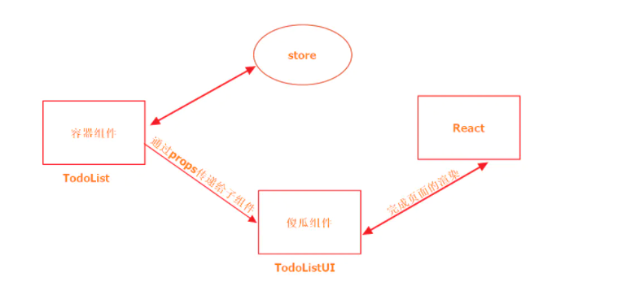
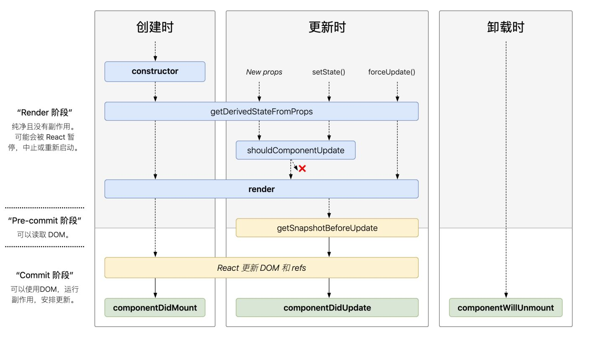

## 前端面试Vue部分总结
_____

本笔记由作者在复习前端Vue部分的相关的一些总结, 如果有什么错误的地方或者有什么相关的建议欢迎联系我

这份笔记借鉴了很多网上的文章, 如果有雷同或者相似的地方, 不用怀疑, 那就是搬得, 如果你是当中一些文章得作者,
如果觉得这种行为不恰当, 请与我联系, 收到消息后我会尽快处理

邮箱: zwn_fobj@foxmail.com

QQ: 1879154660  
QQ昵称: 只为你乱了浮生

感谢各位观看者的支持, 希望能对正在面临面试的你有所帮助,
____

## 目录 

- []
  - [] ()
  - [] ()
  - [] ()
  - [] ()
  - [] ()
  - [] ()
  - [] ()
  - [] ()
  - [] ()
  - [] ()
  - [] ()
  - [] ()
  - [] ()
  - [] ()
  - [] ()
  - [] ()
  - [] ()
  - [] ()
  - [] ()
  - [] ()
  - [] ()
  - [] ()
  - [] ()
  - [] ()
  - [] ()
  - [] ()
- []
- []
  
----


# <h1 id="one">react基础</h1>

## <h2 id="1">1. react 如何实现keep-alive?</h2>


> keep-alive是缓存路由使用的,保存之前路由的状态

实现方法:  

使用npm库:  
1. react-router-cache-router
2. React-activation

## <h2 id="2">2. react错误处理</h2>

主要的api(声明周期):  
- componentDidCatch(error,errorInfo): 同样可以将错误日志上报给服务器
- getDerivedStateFromError(error): 更新state使下一次渲染能够显示降级后的UI

注意事项: 
- 仅可捕获其子组件的错误,无法捕获其自身的错误

## <h2 id="3">3. 你有使用过suspense组件吗?</h2>

动态加载(异步组件)加载时会有延迟,在延迟期间可以将一些内容展示给用户, 比如: loading(react16.6新增的API)

```javascript
const resource = fetchProfileData();

function ProfilePage() {
  return (
    <Suspense fallback={<h1>Loading profile...</h1>}>
      <ProfileDetails />git pull
        
      <Suspense fallback={<h1>Loading posts...</h1>}>
        <ProfileTimeline />
      </Suspense>
    </Suspense>
  );
}

function ProfileDetails() {
  // 尝试读取用户信息，尽管该数据可能尚未加载
  const user = resource.user.read();
  return <h1>{user.name}</h1>;
}

function ProfileTimeline() {
  // 尝试读取博文信息，尽管该部分数据可能尚未加载
  const posts = resource.posts.read();
  return (
    <ul>
      {posts.map(post => (
        <li key={post.id}>{post.text}</li>
      ))}
    </ul>
  );
}
```

参考资料：

[何为Suspense](https://17.reactjs.org/docs/concurrent-mode-suspense.html)

## <h2 id="4">4. 怎么动态导入组件，按需加载，代码分割？</h2>
> 只有当组件被加载时,对应的资源才会导入

- react-loadable: npm 库 按需加载
- react.lazy: 原生支持(新版本16.6), 配合suspense一起使用, 还要webpack code splitting
- require(component): 在特定条件下, 动态引入


## <h2 id="5">react Context介绍？</h2>

要api:  

react.createContext :　创建store  
[store].Provider: 包裹组件，并通过value 字段传递参数  
[store].Consumer: 获取包裹组件内容  

创建过程：  

【创建store】：通过 React.createContext 创建 AppContext 实例

【包裹整个组件】：使用AppContext.Provider组件

【注入全局变量】，在AppContext.provider组件上

【引入全局变量】： 通过 AppContext.Consumer组件 ，子组件的回调，获取store中的内容和方法

一般配置redux使用

``` 
在一个典型的 React 应用中，数据是通过 props 属性自上而下（由父及子）进行传递的，
但此种用法对于某些类型的属性而言是极其繁琐的（例如：地区偏好，UI 主题），
这些属性是应用程序中许多组件都需要的。
Context 提供了一种在组件之间共享此类值的方式，而不必显式地通过组件树的逐层传递 props。
```

## <h2 id="6">6.为什么react并不推荐我们优先考虑使用context?</h2>

- 【实验性】context目前还处于实验阶段，可能会在后期有大改变，避免给未来升级带来麻烦  
- 【稳定性】context的更新需要通过 setState触发，但是这并不是可靠的。context劫持跨组件访问，但是，
  如果中间子组件通过一些方法不响应更新，比如 shouldComponentUpdate返回false，
  那么不能保证 context的更新一定达使用context的子组件。因此，context的可靠性需要关注 。
  不过是更新的问题，在新版的APP中得以解决

> 只要你能确保 context是可控的，合理使用，可以给react组件开发带来强大体验


## <h2 id="7">7. render函数中return如果没有使用()会用什么问题吗？ </h2>

结论：如果换行就有问题

原因：babel会将jsx语法编译成js，同时会在每行自动添加分号（;）, 如果 return 换行了，那么就变成了return; 就会导致报错

```jsx
 //这样会报错，react
  class App extends React.Component{
        render(){
            return 
            <div>111</div>
        }
    }
```

## <h2 id="8">8. 介绍下渲染属性render props？</h2>

> 功能：给纯函数组件加上state,响应react的生命周期

## <h2 id="9">9. React如何进行组件/逻辑复用？ </h2>

- HOC（高阶组件）
    - 属性代理
    - 反向继承
- 渲染属性(render props)
- react-hooks

## <h2 id="10">10. PureComponent组件介绍？ </h2>
> 当props/states改变时, PureComponent会对他们呢进行浅比较,起到性能优化的作用  
> 相当于在component组件的shouldComponentUpdate方法中进行了比较才渲染

特别说明:  
- 引用对象的数据建议不要使用PureComponent组件, 否则会有坑

## <h2 id="11">11. JSX本质是什么？</h2>

> JSX 使用js的形式来写html代码  

jsx本身是语法糖, 无法直接被浏览器解析, 需要通过babel或者typescript来转换成js

许多包含与配置的工具,例如: create-react app 和 next.js 在其内部也引了jsx转换

旧的JSX转换会把jsx转换为React.createElement调用

jsx调用js本身得特性来动态创建UI, 与传统模式下得模板语法不同

## <h2 id="12">12. react中组件通信的几种方式？</h2>

react组件之间通讯主要要四种方式: 

- 父子组件: **props**,props回调
- 兄弟组件: **共同父级**, 再由父节点转发props,props回调
- 跨级组件: **context对象**, 注入全局变量: getChildContext; 获取全局变量: this.context.color;
- 非嵌套组件: 使用**事件订阅**, 向事件对象添加监听器, 和触发事件来实现组件之间的通讯, 通过引入event模块实现
- 全局状态管理工具: Redux,Mobox 维护全局 store

## <h2 id="13"> 13. react UI组件和容器组件的区别与应用？</h2>

容器组件: 拥有自己的状态, 生命周期  
UI组件: 只负责页面UI渲染, 不具备任何逻辑, 功能单一, 通常是无状态组件, 没有自己的state, 生命周期



## <h2 id="14"> 14. react生命周期 </h2>

react生命周期主流的主要由2个大的版本: 

一个是v16.3之前的;

一个是v16.3之后的

v16.3之前 的生命周期主要分为4个阶段,8个生命周期：

- 初始化值阶段 initialization： getDefaultProps,getInitialState;
- 初始阶段 mount： componentWillMount,componentDidMount;
- 更新阶段 update：componentWillReceiveProps ,shouldComponentUpdate ,componentWillUpdate,
- 销毁阶段 unmount：componentWillUnmount;

v16.3之后的生命: 

新引入了两个生命周期:

- getDerivedStateFromProps
- getSnapshotBeforeUpdate

提示3个不安全的生命周期:
- componentWillMount
- componentWillReceiveProps
- componentWillUpdate


新的命令周期:




## <h2 id="15"> 15React的请求放在componentWillMount有什么问题？ </h2>
错误观念: componentWillMount中可以提前进行异步请求, 避免白屏问题;
分析：componentWillMount比 componentDidMount相差不了多少微秒；

问题

- 在SSR（服务端渲染）中，componentWillMount生命周期会执行两次，导致多余请求
- 在react16进行fiber重写后，componentWillMount 可能在一次渲染中多次调用
- react17版本后要删除componentWillMount生命周期
目前官方推荐异步请求在 componentDidMount中

## <h2 id="16">16. create-react-app有什么优点和缺点？ </h2>

优点:  
快速生成脚手架

缺点:  
1. 默认不引入polyfill,需要再入口引入babel-polyfill  
2. 默认只支持css热加载,不支持html,js热加载(推荐使用react-hot-loader)

## <h2 id="17">17. 介绍下Immutable?</h2>  
> Immutable是一种不可变的数据类型, 数据一旦备创建, 就不能更改的数据, 每当对它进行修改, 就会返回新的immutable对象,
> 在做对象比较时,能提升性能;

实现原理:  

immutable是心啊原理是持久化数据结构,结构共享, 避免对数据对象进行深拷贝;

## react, Vue由什么区别?

|区别|react|vue|
|:---|:---|:---|
|模板引擎| JSX,更多灵活,纯js语法(可以通过babel插件实现模板引擎)| vue template,指令，更加简单 （vue也可以使用jsx语法）|
|复用|


