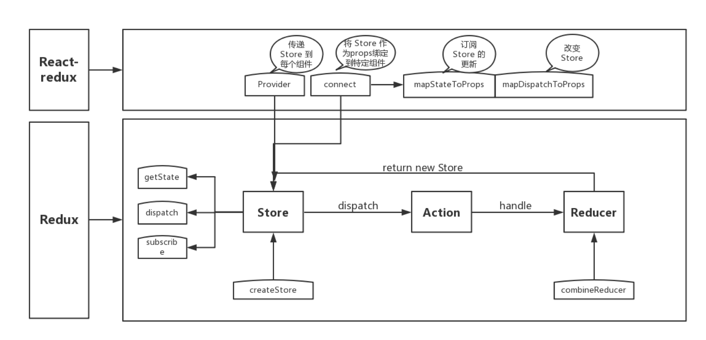

## 前端面试Redux部分总结
_____

本笔记由作者在复习前端Redux部分的相关的一些总结, 如果有什么错误的地方或者有什么相关的建议欢迎联系我

这份笔记借鉴了很多网上的文章, 如果有雷同或者相似的地方, 不用怀疑, 那就是搬得, 如果你是当中一些文章得作者,
如果觉得这种行为不恰当, 请与我联系, 收到消息后我会尽快处理

邮箱: zwn_fobj@foxmail.com

QQ: 1879154660  
QQ昵称: 只为你乱了浮生

感谢各位观看者的支持, 希望能对正在面临面试的你有所帮助,
____

## 目录 

- []()
  -[]()
  -[]()
  -[]()
  -[]()
  -[]()
  -[]()
- []()
- []()
- []()

----

# <h1 id="one"> redux </h1>

## <h2 id="1">1. Redux介绍</h2>

> redux是js状态容器, 提供可预测化的状态管理

他认为: 
- web有i你用是一种状态机,视图与状态是 一 一 对 应 的关系
- 搜友的状态, 保存在一个对象里面

设计思想:  
- 每个state变化可预测
- 动作与状态统一管理

## <h2 id="2">2. Redux与Mobox的区别</h2>

- [代码量] redux>mobx
    - redux: 需要定义一堆的action,dispatch,reducer
    - mobx: store和改变的方法
    
- [开发难度] redux>mobx
    - redux: 状态不可变, 返回一个新的状态,同时使用纯函数; redux提供时间回溯的开发工具
        同时纯函数以及更少的抽象,让调试变得更加容器
      
    - mobx: 中状态可变,可对其直接修改,mobx中有更多的抽象和封装,条时比较困难,同时结果难预测
    
- [store数]
    - redux: 单个store
    - mobx: 多个store
    
- [功能性] redux>mbox
    - redux: 可回溯状态,时间旅行, 适合: 画板应用,表格应用,很多时候需要撤销重做等
    - mobx: 直接修改源数据
    
适用场景总结:
- mobx: 简单项目, 适合数据不复杂的应用
- redux: 大型项目,有回溯需求

## <h2 id="3">3. redux的实现流程？</h2>

- 用户(通过view)发出Action,发出方式是调用dispatch方法;
- Store自动调用Reducer,传入两个参数,当前state,受到的Action,Reducer返回新的state
- state更新后,store就会调用监听函数,根据state触发重新渲染,更新view

> 整个流程中数据都是单向流动的,这种方式保证了流程的清晰 

几个核心概念: 
- Store: 数据中心,整个应用只能有一个store
- State: store对象包含的所有数据
- Action: 用户触发的行为名称(通过action再去触发state的改变,最终相应view的改变)
- Action Creator: 生成action的函数, 可生成多种action
- Reducer: store收到action后，处理state的函数，叫到reducer，接收两个参数：action ，和当前state；返回值： 新的state
- Dispatch: view发出action的唯一方法
## <h2 id="4">4. Redux与Vuex区别? </h2>

相同点：

- 都是做状态管理库
- 都是从Flux中衍生来的（单一数据源，单向数据流）  


不同点：

【适用范围】redux是一个泛用的实现，也可以用在vue中，但是契合度不如vuex
多个vuex中引入module可以把store划分成多个单元 ；

## <h2 id="5">5. redux常用的中间件？</h2>

- redux-logger ： 日志中间件，输出触发的action，和经过reducer处理前后的state值；
- redux-thunk：处理异步
    - 优点：
        - 体积小：实现方式简单，只有不到20行代码
        - 使用简单：没有引入像redux-sage 或者 redux-observable 额外范式，上手简单
    - 缺点：
        - 耦合严重：异步操作与redux的action 偶合在一起，不方便管理
    - 功能弱：常用的功能需要自己封装
- redux-saga：处理异步
    - 异步解耦：异步操作被转移到单独的saga.js中，不再掺杂在action.js 或 component.js中
    - 异常处理：受益于generator function的 saga实现，代码异常/请求失败 都可以直接通过 try/catch语法直接捕获处理
    - 功能强大：提供了大量的saga辅助函数和 Effect 创建器 供开发者使用
    - 灵活：可以将多个saga 串行/并行组合起来，形成一个非常实用的异步flow
    - 易测试：提供了各种case的测试方案，包括 mock task ,分支覆盖等

- redux-promise：处理异步
- redux-observable
    - 优点
        - 功能最强：背靠 rxjs这个强大的响应式编程库，几乎做任何你能想到的异步处理
    - 缺点
        - 学习成功奇高：如果不会rxjs，则需要额外学习两个复杂的库

## <h2 id="7">7. redux中间件是什么, 中间件的执行过程</h2>

> redux提供了类似后端experss中间件的概念，本质目地是提供第三方插件的模式

中间件的使用（改变数据流）：

- 未使用redux: action-> reducer
- 使用redux: 自定义拦截，变成 action->middlewares->reducer  

实现如异步action,action过滤，日志输出，异常报告等功能；

使用： redux提供的一个方法： applyMiddleware，可应用多个中间件；


## <h2 id="8">8. redux中的connect有什么作用？</h2>

redux中的connect有什么作用？

```js
import {connect} from "react-redux"

const VisibleTodoList=connet(

    mapStateToProps,   //参数

    mapDispatchToProps   //处理方法

)(TodoList)
```

## <h2 id="9">9. 解释一下 Flux思想？</h2>

Flux 是一种强制单向数据流的架构模式。它控制派生数据，并使用具有所有数据权限的中心 store 实现多个组件之间的通信。整个应用中的数据更新必须只能在此处进行。 Flux 为应用提供稳定性并减少运行时的错误。

## <h2 id="10">10. Redux遵循的特点？</h2>

- **单一数据来源**："整个数据存储在store当中，方便调试和检查应用程序
- **状态只读**：改变状态的唯一方法是云触发一个动作。
- **使用纯函数更改**：纯函数是那些返回值仅取决于其参数的函数

## <h2 id="11">11.Redux与flux有何不同？</h2>
> Redux是flux思想（单向数据流，store唯一数据源）的一种实现，同时在其基础上做了改进

区别：
- Store数
    - Redux: 单个
    - Flux： 多个
- 更新位置不同
    - Redux:
    - Flux:


## <h2 id="12">12. 在 React 中如何处理事件</h2>  

为了解决跨浏览器的兼容性问题，SyntheticEvent 实例将被传递给你的事件处理函数
，SyntheticEvent是 React 跨浏览器的浏览器原生事件包装器，
它还拥有和浏览器原生事件相同的接口，包括 stopPropagation() 和 preventDefault()。

比较有趣的是，React 实际上并不将事件附加到子节点本身。
React 使用单个事件侦听器侦听顶层的所有事件。这对性能有好处，
也意味着 React 在更新 DOM 时不需要跟踪事件监听器。

# <h1 id="two">react-redux</h1>

## <h2 id="13">13. react-redux的实现原理？</h2>

react-redux 提供两个api;

- Provider: 从最外部封装整个应用，并向connect模块传递store; (父子组件)
- connect: （高阶组件）负责连接react和redux
    - 包装原组件：将state,action通过props的方式传入到原组件内部
    - 监听store tree变化：使其包装的原组件可以响应state的变化
    


## <h2 id="14">14.react-redux的使用流程?</h2>

- 创建store：（定义state,reducer） （使用Redux中的createStore api创建）
- 封装应用：通过ReactRedux中的Provider方法把store传递给connect模块
- connect

