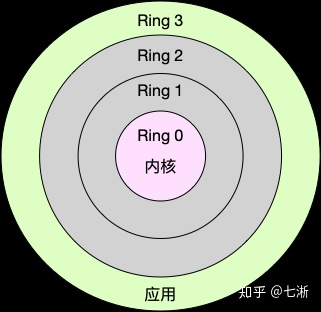
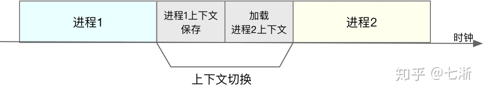

##  前端面试计算机网络部分总结
_____

本笔记由作者在复习八股文之计算机网络部分的相关的一些总结, 如果有什么错误的地方或者有什么相关的建议欢迎联系我

这份笔记借鉴了很多网上的文章, 如果有雷同或者相似的地方, 不用怀疑, 那就是搬得, 如果你是当中一些文章得作者,
如果觉得这种行为不恰当, 请与我联系, 收到消息后我会尽快处理

邮箱: zwn_fobj@foxmail.com

QQ: 1879154660  
QQ昵称: 只为你乱了浮生

感谢各位观看者的支持, 希望能对正在面临面试的你有所帮助,
____

- [前端面试计算机网络部分总结](#前端面试计算机网络部分总结)
- [1. CPU的上下文切换](#1-cpu的上下文切换)
- [2. cpu的常见调度算法](#2-cpu的常见调度算法)

## 1. CPU的上下文切换

Linux 是一个多任务操作系统，它支持远大于 CPU 数量的任务同时运行。当然，这些任务实际上并不是真的在同时运行，而是因为系统在很短的时间内，将 CPU 轮流分配给它们，造成多任务同时运行的错觉。

而在每个任务运行前, CPU都需要知道任务从哪里加载,又从哪里的开始运行, 也就是说, 需要系统实现帮它设置好**CPU寄存器和程序计数器**

**1. 什么是CPU上下文:**  

CPU寄存器和程序计数器就是CPU上下文, 因为他们都是CPU在运行任务前,必须的依赖环境

- CPU 寄存器是CPU内置的容量小,但速度极快的内存 
- 程序计数器则是用来存储CPU正在执行的指令位置,或者即将执行的下一条指令位置

**2. 什么是CPU上下文切换**  

就是把前一个任务的CPU上下文(也就是CPU寄存器和程序计数器)保存起来,然后加载任务的上下文到这些寄存器和程序计数器, 最后再跳转到程序计数器所指的新位置,运行新任务;  

而这些保存下来的上下文, 会存储再系统内核中,并在任务重新调度执行时
再次加载进来,这样就能保证任务原来的状态不受影响,让任务看起来还是连续运行

**3. 上下文切换的类型**

根据任务的不同, 可以分为以下三种类型: 进程上下文切换-线程上下文切换-中断上下文切换

**3.1 进程山下文切换**

Linux 按照特权等级, 把进程的运行空间分为内核空间和用户空间, 分为对应着下图中, CPU特权等级的Ring 0 和Ring 3

- 内核空间(Ring 0 ) 具有最高权限, 可以直接访问所有资源
- 用户空间(Ring 3 ) 只能访问受限资源,不能直接访问呢内存等硬件设备,必须通过系统调用陷入到内核中,才能访问这些特权资源

**3.2系统调用**  

从用户状态到内核的转变,需要通过**系统调用**来完成,比如,我们查看文件内容时,就需要多次系统调用来完成: 首先调用open()打开文件,然后调用read()读取文件内容,并调用write()讲内容写到标准输出,最后调用close()关闭文件

在这个过程中就发生了CPU上下文切换,整个过程就是这样的: 

  1. 保存CPU寄存器里原来用户态的指令  
  2. 为了执行内核态代码,CPU寄存器需要更新为内核态指令的新位置  
  3. 跳转到内核态运行内核任务  
  4. 当系统调用结束后,CPU寄存器需要恢复原来保存的用户态,然后再切换到用户空间,继续运行进程 

所以, 一次系统调用的过程,其实发生了两次CPU上下文切换(用户态-内核态-用户态)  

不过,需要注意的是,**系统调用过程中,并不会涉及到虚拟内存等进程用户态的资源,也不会切换进程**这跟我们通常所说的进程上下文切换是不一样的: **进程上下文切换,是指从一个进程切换到另一个进程运行: 而系统调用过程中一直是同一个进程在运行**

所以,**系统调用过程通常称为权限模式切换,而不是上下文切换,系统调用属于进程内的CPU上下文切换** 但实际上,系统调用过程中,CPU的上下文切换还是无法避免的

**进程上下文切换跟系统调用又有什么区别呢**  

首先, **进程是由内核管理和调度的,进程的切换只能发生在内核态**,所以,进程的上下文不仅包括了虚拟内存,栈,全局变量等用户空间的资源,还包括了内核堆栈,寄存器等内核空间的状态  

因此,**进程的上下文切换就比系统调用时多了一步:在保存内核态资源(当前进程的内核状态和CPU寄存器)之前,需要先把该基础内哼的用户资源(虚拟内存,栈等)保存下来;而加载了下一进程的内核状态后,还需要刷新进程的虚拟内存和用户栈**

如下图所示,保存上下文和恢复上下文的过程并不是"免费"的,需要内核在CPU上运行才能完成的

## 2. cpu的常见调度算法

再探索CPU调度原理之前,首先要对CPU的上下文切换有一个了解

