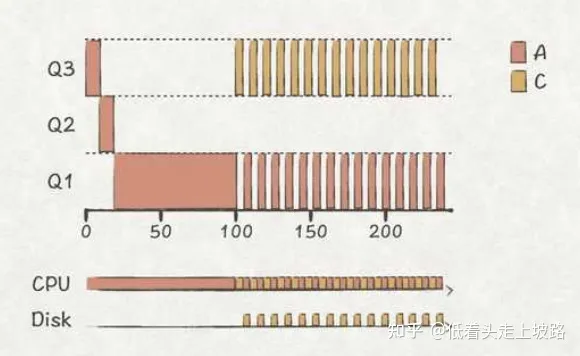

##  前端面试操作系统部分总结
_____

本笔记由作者在复习八股文之操作系统部分的相关的一些总结, 如果有什么错误的地方或者有什么相关的建议欢迎联系我

这份笔记借鉴了很多网上的文章, 如果有雷同或者相似的地方, 不用怀疑, 那就是搬得, 如果你是当中一些文章得作者,
如果觉得这种行为不恰当, 请与我联系, 收到消息后我会尽快处理

邮箱: zwn_fobj@foxmail.com

QQ: 1879154660  
QQ昵称: 只为你乱了浮生

感谢各位观看者的支持, 希望能对正在面临面试的你有所帮助,
____

- [前端面试操作系统部分总结](#前端面试操作系统部分总结)
- [1. CPU的上下文切换](#1-cpu的上下文切换)
- [2. cpu的常见调度算法](#2-cpu的常见调度算法)
- [3.](#3)

## 1. CPU的上下文切换

Linux 是一个多任务操作系统，它支持远大于 CPU 数量的任务同时运行。当然，这些任务实际上并不是真的在同时运行，而是因为系统在很短的时间内，将 CPU 轮流分配给它们，造成多任务同时运行的错觉。

而在每个任务运行前, CPU都需要知道任务从哪里加载,又从哪里的开始运行, 也就是说, 需要系统实现帮它设置好**CPU寄存器和程序计数器**

**1. 什么是CPU上下文:**  

CPU寄存器和程序计数器就是CPU上下文, 因为他们都是CPU在运行任务前,必须的依赖环境

- CPU 寄存器是CPU内置的容量小,但速度极快的内存 
- 程序计数器则是用来存储CPU正在执行的指令位置,或者即将执行的下一条指令位置

**2. 什么是CPU上下文切换**  

就是把前一个任务的CPU上下文(也就是CPU寄存器和程序计数器)保存起来,然后加载任务的上下文到这些寄存器和程序计数器, 最后再跳转到程序计数器所指的新位置,运行新任务;  

而这些保存下来的上下文, 会存储再系统内核中,并在任务重新调度执行时
再次加载进来,这样就能保证任务原来的状态不受影响,让任务看起来还是连续运行

**3. 上下文切换的类型**

根据任务的不同, 可以分为以下三种类型: 进程上下文切换-线程上下文切换-中断上下文切换

**3.1 进程山下文切换**

Linux 按照特权等级, 把进程的运行空间分为内核空间和用户空间, 分为对应着下图中, CPU特权等级的Ring 0 和Ring 3

- 内核空间(Ring 0 ) 具有最高权限, 可以直接访问所有资源
- 用户空间(Ring 3 ) 只能访问受限资源,不能直接访问呢内存等硬件设备,必须通过系统调用陷入到内核中,才能访问这些特权资源

**3.2系统调用**  

从用户状态到内核的转变,需要通过**系统调用**来完成,比如,我们查看文件内容时,就需要多次系统调用来完成: 首先调用open()打开文件,然后调用read()读取文件内容,并调用write()讲内容写到标准输出,最后调用close()关闭文件

在这个过程中就发生了CPU上下文切换,整个过程就是这样的: 

  1. 保存CPU寄存器里原来用户态的指令  
  2. 为了执行内核态代码,CPU寄存器需要更新为内核态指令的新位置  
  3. 跳转到内核态运行内核任务  
  4. 当系统调用结束后,CPU寄存器需要恢复原来保存的用户态,然后再切换到用户空间,继续运行进程 

所以, 一次系统调用的过程,其实发生了两次CPU上下文切换(用户态-内核态-用户态)  

不过,需要注意的是,**系统调用过程中,并不会涉及到虚拟内存等进程用户态的资源,也不会切换进程**这跟我们通常所说的进程上下文切换是不一样的: **进程上下文切换,是指从一个进程切换到另一个进程运行: 而系统调用过程中一直是同一个进程在运行**

所以,**系统调用过程通常称为权限模式切换,而不是上下文切换,系统调用属于进程内的CPU上下文切换** 但实际上,系统调用过程中,CPU的上下文切换还是无法避免的

**进程上下文切换跟系统调用又有什么区别呢**  

首先, **进程是由内核管理和调度的,进程的切换只能发生在内核态**,所以,进程的上下文不仅包括了虚拟内存,栈,全局变量等用户空间的资源,还包括了内核堆栈,寄存器等内核空间的状态  

因此,**进程的上下文切换就比系统调用时多了一步:在保存内核态资源(当前进程的内核状态和CPU寄存器)之前,需要先把该基础内哼的用户资源(虚拟内存,栈等)保存下来;而加载了下一进程的内核状态后,还需要刷新进程的虚拟内存和用户栈**

如下图所示,保存上下文和恢复上下文的过程并不是"免费"的,需要内核在CPU上运行才能完成的

**进程上下文切换潜在的性能问题:**  

  根据Tsuna的测试报告,没每次上下文切换都需要几十纳秒到微秒的CPU时间,这个时间还是相当可观的,特别是在进程上下文切换次数较多的情况下,很容易导致CPU讲大量时间耗费在寄存器,内核栈及虚拟内存等资源大额保存和恢复上,进而大大缩短了真正运行进程的时间,这也是导致平均负载升高的一个重要因素  
  另外我们知道,Linux通过TLB（Translation Lookaside Buffer）来管理虚拟内存到物理内存的映射关系,当虚拟内存更新后,TLB也需要刷新,内存的访问也会随之变慢,特别是在多处理器系统上,缓存是被多个处理器共享的, 刷新缓存不仅会影响当前处理器的进程,还会影响共享缓存的其他处理器的进程

**发生上下文切换的场景: **

  1. 为了保证所有进程可以得到公平调度,CPU时间被划分为一段段的时间片,这些时间片再不被轮流分配给各个进程,这样,当某个进程的时间片耗尽了,就会被系统挂起,切换到其他正在等待CPU的进程运行
  2. 进程再系统资源不足(比如内存不足)时, 要等到资源满足后才可以运行,这个时候进程也会被挂起,并由系统调度其他进程运行
  3. 当进程同通过睡眠函数sleep这样的方法讲自己主动挂起时,自然会重新调度
  4. 当由优先级更高的进程运行时,为了保证高优先级进程的运行,当前进程会被挂起,由高优先级进程来运行
  5. 发生硬件中断时,CPU上的进程会被中断挂起,转而执行讷河中的中断服务程序

**线程上下文切换:**  

  线程与进程最大的区别在于:**线程是调度的基本单位,而进程则是资源拥有的基本单位**,说白了,所谓内核中的任务调度,实际上的调度对象是线程;而进程只是给线程提供了虚拟内存,全局变量等资源

  所以,对于线程和进程,我们可以这么理解:  
     - 当进程只有一个线程时,可以认为进程就等于线程,
     - 当进程有多个时,那么线程会共享相同的虚拟内存和全局变量等资源,这些资源在上下文呢切换时是不需要修改的
     - 另外,线程也有自己的私有数据,比如栈和寄存器等,这些在上下文切换时也时需要保存的
  
**发生线程上下文切换的场景:**

  1. 前后两个线程属于不同进程,此时,因为资源不共享,所以切换过程就跟进程上下文是一样
  2. 前后两个线程属于同一个进程,此时,因为虚拟内存是共享的,所以在切换时,虚拟内存这些资源就保持不懂,只需要切换线程的私有数据,寄存器等不共享的数据

**中断上下文切换:**

  为了快速响应硬件的事件,**中断处理会打断进程的正常调度和执行,转而调用中断处理程序,响应设备事件**;而在打断其他进程时,就需要将进程当前的状态保存下来,这样在中断结束后,进程仍然可以从原来的状态恢复运行

  **跟进程上下文不同,中断上下文卡混并不涉及到进程的用户态**, 所以即便中断过程打断了一个正在处于用户态的进程,也不需要保存和恢复这个进程的虚拟内存,全局变量等用户态资源;中断上下文,其实只包括内核态中断服务程序执行锁必须的状态,包括CPU寄存器,内存堆栈,硬件中断参数等

  **对于一个CPU来说,中断处理比进程有更高的优先级**;所以上下文切换并不会与进程上下文切换同时发生;同样道理,由于中断会打断正常进程的调度和执行,所以大部分中带你处理程序都短小精悍,以便尽可能快的执行结束

  另外,跟进程上下文切换一样,中断上下文切换也需要消耗CPU,切换次数过多会耗费大量的CPU,甚至严重降低系统的整体的性能,所以,当你发现中断次数过多时,就需要注意去排查它是否会给你的系统带来严重的性能问题

**总结:**  
  **CPU上下文:**  
  CPU寄存器和程序计数器就是CPU上下文
      - CPU寄存器就是CPU内置的容量小,但速度快的内存
      - 程序计数器则是用来存储CPU正在执行的指令位置,或者即将执行的下一条指令  
  
  **CPU上下切换:**  
    把前一个任务的CPU上下文保存起来,然后加载新任务的上下文到寄存器和程序计数器,跳转到程序计数器所致的新位置,运行新任务;保存下来的上下文,会存储在系统内核中,在任务重新调度的时候再次加载进来,保证任务原来的状态不受影响

  **CPU上下文切换的类型:**  
    - 进程上下文切换
    - 线程上下文切换
    - 中断上下文切换
  

## 2. cpu的常见调度算法  

再探索CPU调度原理之前,首先要对CPU的上下文切换有一个了解;

**调度的衡量标准:**  

  通常通过周转事件和响应时间来判断
    - 周转时间(turnaround time): 从任务到达到任务完成时间的时间
    - 响应时间(response time): 从任务到达任务首次被响应的时间

  在开始描述下面的调度算法之前, 首先后有几个假设:

    1. 所有任务的到达时间都是相同的,执行的顺序会有区别
    2. 只用"一只"CPU在执行任务,不关注IO操作
    3. 执行任务具有"原子性", 在执行的时间段中不能被中断
    4. 只关系任务调度本身
    5. 预先知道所有任务的时长

**周转时间了解一下:**  
  周转时间 = 作业完成时间 - 作业到达时间

**几种调度算法:**  

  **1. FIFO: 先进先出**
    **先调度首先到达的任务直至结束,然后再调度下一个任务,以此类推**;如果有多个任务同时到达,则随机选一个  
    在所有任务需要的时间差不多的情况下,效果不错,  
    如果任务A的时间较长,会使周转时间和响应时间变长(周转时间变成100+110+120)  
      
    可以看出,FIFO**任务运行时间差异较大的场景下,容易出现任务饿死的问题**  
    如果需要时间短的任务先被执行,问题就可以得到解决  

  **2. SJF:短任务优先**  
    **从相同到达时间的多个任务中选取时长最短的一个人物进行调度,接着再调度第二个短的人物依次类推**  
      
    可以看出周转时间变成了 `10 + 20 + 120`, 相对于FIFO有了明显的提升  
    但是如果打破`假设1`,让B,C人物在t=10时到达,那么情况就会变成上述FIFO中一样  
      
    因为BC是在A人物执行时到达的,所以他们不得不一直等到A运行结束之后才有机会调度  

  **3. SJCF: 最短任务优先完成**  
    为了解决上述问题,我们需要继续打破`假设3`,如果允许BC在到达时立刻被调用,问题就解决了,  
    这属于**抢占式调度**,原理就是**CPU上下文切换**  
    原理:**当运行时长较短的任务到达时,中断当前的任务,优先调度运行时间较短的任务**  
    利用SJCF,上述周转时间优化为`120+(20-10)+(30-10))`  
      
    目前为止,我们只关心了`周转时间`这一指标,那么这三种算法的响应时间呢?  
      
    假设所有任务执行的时间是一样长的,可以看出,随着任务平均时长的增加,平均的响应时间也随之增加,且最后一个任务必须是在其他任务完成时才会开始执行,这对于用户体验 时灾难性的  
    为了优化响应时间,我们熟悉的基于时间片的调度算法就出现了  

  **4.基于时间片的轮询制度:**  
    Round Robin: 算法给每个任务分配一个时间片,当任务的时间片用完之后,调度器会中断当前的任务,切换到下一个任务,依次类推  
      
    不难发现,时间片设置得越小,平均响应时间也就越小,  
    但是,随着时间片的变小,任务切换的次数也随之上升,也就是**上下文切换的消耗会变大**,因此时间片大小的设置是一个trade-off(权衡)的过程,不能一味追求响应时间而忽略CPU上下文切换带来的消耗  
    对于上下文切换的消耗, 不单单时从保存和恢复寄存器所带来的,程序在运行的过程种,会主键在CPU各级缓存,TLB (Translation Lookaside Buffer：转移后备缓冲区，用于改进虚拟地址到物理地址的转译速度),分支预测器上简历属于自己的缓存数据,当任务被切换后,就意味着又得重新来一遍缓存预热,这回带来巨大得消耗,
    另外,在从周期时间得角度考虑得话,这种算法得周转是13 + 14 +15,相比于上面得`SJF/SJCF`要长了不少,应该根据具体情况选择不同得算法  

  **补: 以I/O操作为例对调度的影响**  
  在执行I/O  
  **5. MLFQ**(Multi-Level Feedback Queue)  
    MLFQ最大的特点就是新增加了优先级队列来存放不同的优先级任务  
    从前面分析我们知道:  
      - 要优化周转时间,可以优先调度运行时长短的任务(像SJF和STCF的做法)
      - 要优化响应时间,则采用类似RR的基于时间片的调度,然而这两个目标看起来是矛盾的,要降低响应时间,必然会增加周转时间  
    MLFQ主要用来解决一下的两个问题:  
      - 1. 在不用预先清楚任务的运行信息(包括运行时长,I/O操作等)的前提下,如何权衡周转时间和响应时间?  
      - 2. 如何从历史调度中学习,以便未来做出更好的决策  
    **划分任务的优先级**  
      - **规则1**: 如果Priority(A) > Priority(B)，则调度A
      - **规则2**: 如果Priority(A) = Priority(B)，则按照RR算法调度A和B  
    **优先级的变化**  
      为了平衡优先级在不同的任务的平均响应时间,需要考虑变化优先级  
      - **规则3:**：当一个新的任务到达时，将它放到最高优先级队列中  
      - **规则4**: 如果任务A运行了一个时间片都没有主动让出CPU（比如I/O操作），则**优先级降低一级**  
      - **规则5** : 如果任务A在时间片用完之前，有主动让出CPU，则优先级保持不变  
      当一个运行时间较长的任务 A 到达执行一段时间后，有运行时间较短的B任务到达，调度情况是这样的  
        
      从上述途中可以看出MLFQ兼具`STCF`的优点,可以缩短了周转时间  
      如果任务A运行到t=100时,交互类任务C到达,那么调度情况是这样的:  
        
      MLFQ会在任务处于阻塞时(C 任务阻塞)按照优先级选择其他任务(任务 A)运行，有效利用了资源  
      根据规则4b，C任务主动让出CPU，C优先级一直保持不变  
    **CPU密集型任务饿死问题**  
      假设交互类任务C和D同时到达,那么调度情况就会变成这样:  
        
      为了解决多交互任务的问题,有了规则5  
    - **规则5:** 系统运行S时长之后,将所有任务放到最高级优先队列上(Priority Boost)  
       
      加上该规则之后，假设设置S为50ms，那么调度情况是这样的，饿死问题得到解决！  
    **恶意任务问题**
      考虑如下一个恶意任务E，为了长时间占用CPU，任务E在时间片还剩1%时故意执行I/O操作，并很快返回。根据规则4b，E将会维持在原来的最高优先级队列上，因此下次调度时仍然获得调度优先权：  
        
      需要对规则4来附加  
      - 规则4：给每个优先级分配一个时间片，当任务用完该优先级的时间片后，优先级降一级  
    **总结如下**  
      - 规则1：如果Priority(A) > Priority(B)，则调度A
      - 规则2：如果Priority(A) = Priority(B)，则按照RR算法调度A和B
      - 规则3：当一个新的任务到达时，将它放到最高优先级队列中
      - 规则4：  
        - 如果任务A运行了一个时间片都没有主动让出CPU（比如I/O操作），则优先级降低一级
        - 如果任务A在时间片用完之前，有主动让出CPU，则优先级保持不变
        - 给每个优先级分配一个时间片，当任务用完该优先级的时间片后，优先级降一级
      - 规则5：系统运行S时长之后，将所有任务放到最高优先级队列上（Priority Boost） 
    **回到前面的问题**  
      1. 在不预先清楚任务的运行信息（包括运行时长、I/O操作等）的前提下，MLFQ 会将新任务视作 新任务优先执行，如果这个任务是短期的，那么会很快执行完。即使是需要长时间的任务，也能通过降低优先级得到和其他长时间任务之间的平衡；
      2. MLFQ主要根据任务是否有主动让出CPU的行为来判断其是否是交互类任务，如果是，则维持在当前的优先级，保证该任务的调度优先权，提升交互类任务的响应性。  
    MLFQ调度算法的总体评价:  
      MLFQ并非完美的调度算法，最让人头痛的就是各项参数的设置，例如Priority Boost时长的设置、优先级的时间片的长度等，没有完美的参考值，只能根据实践来判断 
      比如，我们可以将低优先级队列上任务的时间片设置长一些，因为低优先级的任务往往是CPU密集型任务，它们不太关心响应时间，较长的时间片长能够减少上下文切换带来的消耗  

  **6.Linux 下完全公平的调度——CFS**  
    和上面介绍的不同,CFS(Completely Fair Schedule)并非优化周期时间和响应时间为目标,而是希望将CPU公平地均分给每个任务  
    当然 CFS也提供了给进程设置优先级的功能,让用户/管理员决定哪些进程需要更多的调度时间  
    CFS采用基于计数的的调度方法,该技术被称为virtual runtime(虚拟进行时)  
    CFS在下次调度时,选择vruntime值最小的任务来调度,就好像向几只水位不同的水箱中同时注水一样(忽略相等时),比如:  
      
    那CFS应该什么时候进行任务切换呢？  
    切换得频繁些，任务的调度会更加的公平，但是上下文切换带来的消耗也越大。  
    因此，CFS给用户提供了个可配参数sched_latency(调度延迟)，让用户来决定切换的时机。CFS将每个任务分到的时间片设置为 time_slice(时间片) = sched_latency / n（n为当前的任务数） ，以确保在sched_latency周期内，各任务能够均分CPU，保证公平性。  
    比如将sched_latency设置为48ms，当前有4个任务A、B、C和D，那么每个任务分到的时间片为12ms；后面C和D结束之后，A和B分到的时间片也更新为24ms：  
      
    为了避免任务过多，分配时间较短而导致的上下文切换次数过多问题，同样提供了`min_granularity`来设置任务最小时间片  
    **给任务分配权重**  
      如果希望给主要业务多分配一些时间片的话，可以考虑多分配权重  
      vruntime 针对的是 `进程`  
      1. CFS 根据进程的权重分配给进程运行时间，权重越大，分配到的运行时间就越多  
        ` 实际运行时间 = 调度周期 * 当前进程权重 / 所有进程权重总和`  
      2. vruntime的计算公式为：  
       ` vruntime = 实际运行时间 * NICE_0_LOAD/ 当前进程权重`  
      将 1 中的公式带入，得到：调度周期 * NICE_0_LOAD/ 所有进程权重总和  
      就是说，虽然每个进程的权重不同，但是 vruntime 的增长速率都是相同的，这保证了所谓的“公平性”  
      但是因为优先级高的线程有着更长的运行时间，所以优先级才会有意义  
      ----  
      (以上针对的是分配给线程的时间 == 实际的时间的情况)
      ----  
      如果这两者不相等的时候，从 2 中的公式中可知，高优先级（权重较大）的进程的 vruntime 较小，这样也能保证其拥有更多的 CPU 的执行时间  
      **使用红黑树提升vruntime查找效率**  
      查询、插入、删除操作的复杂度变成了log(N)，不会随着任务数的增多而线性增长，极大提升了效率  
      **应对I/O与休眠**  
      每次都选取vruntime值最小的任务来调度这种策略，也会存在任务饿死的问题  
      考虑有A和B两个任务，时间片为1s，起初A和B均分CPU轮流运行，在某次调度后，B进入了休眠，假设休眠了10s。等B醒来后，vruntime_{B}vruntimeB就会比vruntime_{A}vruntimeA小10s，在接下来的10s中，B将会一直被调度，从而任务A出现了饿死现象。  
      为了解决该问题，CFS规定当任务从休眠或I/O中返回时，该任务的vruntime会被设置为当前红黑树中的最小vruntime值。上述例子，B从休眠中醒来后，vruntime_{B}vruntimeB会被设置为11，因此也就不会饿死任务A了。  
      这种做法其实也存在瑕疵，如果任务的休眠时间很短，那么它醒来后依旧是优先调度，这对于其他任务来说是不公平的

## 3. 

