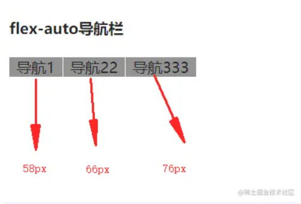

## 001 后端接口轮询

当我们需要做轮询的时候,自然就想到了定时器`setInterval`可以重复执行;
过了一段时间网路波动就会导致定时器不是那'准时',`setInterval`的一个弊端


setInterval的作用是每隔一段指定时间执行一个函数,但是这个执行并不是时间到了就立即执行,
它真正的作用是每隔一段时间`将时间加入时间队列中去`,只有当前的执行栈为空的时候,才能去从
事件队列中取出事件执行;所以可能出现这样的状况;,激素hi当前执行栈执行的时间很长,
`导致事件队列里边积累多个定时器加入的事件,当执行栈结束的时候,这些事件会短时间内连续触发`,
因此不能到间隔一段事件执行的效果,并且可能会造成性能问题,这就是`setIntervel`的`累积效应`

### setInterval的性能问题

1. 对自己调用的代码是否会报错会无视掉,即使调用的代码即使有错误也会继续执行下去
2. setInterval无视网络延迟  
我们在向服务器轮询的数据的时候,如果发生网络卡顿的情况,客户端接收到请求响应的时间大于interval循环的时间;
   而setInterval会无视任何情况下继续定时执行,这就会导致了用户的客户端里充斥着客户端的请求  
   
3. 如果你调用的函数需要花费较长是啊金才能完成,那某些调用会被直接忽略掉

**解决方案:**

使用`setTimeout`代替`setInterval`  
针对setInterval的这个缺点,我们可以使用setTimeout`递归调用`来模拟setInterval;
我们就可以确保只有一个事件结束了,我们看才会触发下一个定时器事件,这样就解决了setInterval问题
```js
var timer;
function func(args){
  //函数本身的逻辑
  // ...
  //函数执行完后，重置定时器
  timer = setTimeout(func, 100, args);
}
timer = setTimeout(func, 100, args);

// 异步请求接口情况
function poll() {
    setTimeout(function() {
        $.get("/path/to/server", function(data, status) {
            console.log(data);
            // 前端接收到后端返回的数据时发起下一次请求
            poll();
        });
    }, 10000);
}

```

实际上由于浏览器的一些机制(垃圾回收,js是到单线程)也无法做到很精确的执行;
浏览器会将最小的超时事件固定在4ms到15ms之间

### 延伸扩展 

**setTime轮询不足**  
- 因为客户端以固定的频率请求服务器是,当数据更新较快的时候,无法获取到最新的数据;
当数据更新较慢的时候,又会进行无意义的请求连接
  
- 因此每次连接都要建立新的`tcp握手挥手`,因此建立Tcp连接时非常消耗资源,网络负载比较大

#### webscoket实现

**websocket 简介**:  

WebSocket 连接本质上就是一个TCP连接; 和http协议同属于应用层;浏览器通过JAvaScript向服务器发送+*
建立WebSocket连接的请求,连接建立以后,客户端和服务端就可以通过TCP连接直接交换数据,
实现了浏览器和客户端双工通信,并且这个连接会持续存在直到客户端或服务器端的某一方
主动的关闭连接:只需要建立一次连接

**websocket特点**:  
1. 于HTTP协议有着良好的兼容性,莫尔尼端口也是80和443,并且握手采用HTTP协议,因此握手时不容易屏蔽,能通过各种HTTP代理服务器
2. 建立TCP协议基础上,和http协议同属于应用层
3. 数据格式比较轻量,性能开销小,通信高效
4. 可以发送文本,也可以发送二进制数据
5. 没有同源限制,客户端可以与任意服务器通信(实现跨域方法之一)
6. 协议表示符时ws(如果加密,则为wss),服务器网址就是URL,如`ws://localhost:8023`

### 002 flex 1 的使用场景有哪些 以及 flex 是哪几个属性的简写

flex 属性是 flex-grow,flex-shrink 和flex-basis属性的简写属性

默认值 0 1 auto

css语法:  
`flex: flex grow flex-shrink flex-basis | auto | initial | inherit`

|值|描述|
|:---|:---|
|flex-grow|一个数字,规定项目将相对于其他灵活的项目进行扩展的量|
|flex-shrink|一个数字,规定项目将相对于其灵活的项目进行缩小的量|
|flex-basis|项目的长度,合法值:'auto','inherit'或后面跟"%","px","em"或任何其他长度单位的数字|
|auto|与 1 1 auto 相同|
|none|与 0 0  auto 相同|
|initial|设置该属性位默认值 即 0 1 auto|
|inherit|从父元素继承该属性|

**flex-grow**  
`flex-grow`属性定义项目的放大比哦里,默认为为0 ,即如果存在剩余空间也不放大

如果所有项目的flex-grow属性都为1,则他们将等分剩余空间(如果有的话)

**flex-shrink**  
flex-shrink属性定义了项目的缩小比例,默认为1,即如果空间不足,该项目将缩小

如果所有项目的flex-shrink属性都为1,当空间不足是,都将等比例缩小

**flex-basis**

flex-basis属性定义了在分配多余空间之前,项目占据的主轴空间(main size)  

浏览器根据这个属性,计算主轴是否有多余空间,它的默认值为auto,即项目的本来大小  

它可以设为跟width或height属性一样的值,(比如350px),则项目将占据固定空间  

**flex缩写的等值**  

|语法|等值|
|:--|:--|
|flex:initial|flex:0 1 auto|
|flex:0|flex: 0 1 0%|
|flex:node|flex: 0 0 auto|
|flex:1|flex:1 1 0%|
|flex:auto|flex: 1 1 auto|


### flex:initial 使用场景

flex:initial等同于设置flex: 0 1 auto, 是flex属性的默认值

**适用场景**  

'initial'表示CSS属性的初始值,通常用来还原已经设置的CSS属性,因此日常开发不会专门色湖之`flex:initial`声明,
,一般父节点设置`display:flex`,字节点不设置属性,则css默认表现为`flex:initial` 
`flex:initial`声明适用于下图所示效果


上图所示的布局效果常见于按钮,标题,小图标等小左间的排版布局,因为这些小不加的宽度都不会很宽,
水平位置的控制多适用`justify-content`和`margin-left:auto/margin-right:auto`实现

除了上图所示的布局效果外,`flex:initial`声明还适用于一侧内容宽度固定,另外一侧内容宽度任意的两栏自适应布局场景,


此时无需任何其他flex布局相关的CSS设置,只需要容器元素设置`display:flex`即可

又或者是想要父节点下的所有子节点全部都并排排列,不去适用`float`属性,


总结下就是哪些希望元素尺寸收缩,同时元素内容万一较多又能自动换行的场景可以不做任何flex属性设置一

### flex:0 和flex:node 的适用场景

flex: 0 等同于设置 flex: 0 1 0%;  
flex:none 等同于设置 flex: 0 0 auto

`flex: none`只是把css中的flex属性设置为none,


对比看来可以看到flex-0时候会表现为最小内容宽度,会将高度撑高;

**适用场景 flex-0**  


其中上图左侧部分的矩形表示一个图像,图像下方会有文字内容不定的描述信息;
此时左侧内容就适合设置flex 0 ,这样文字内容如何设置,左侧呢日哦给你的宽度都是图像的宽度  


**适用场景 flex-none**  
`flex:none`比`flex:0`的适用场景多,如内容文字固定不换行,宽度为内容宽度就使用该属性  


### flex:1 和 flex:auto

`flex:1` 等同于设置 `flex: 1 1 0%`

`flex:auto`等同于设置`flex: 1 1 auto`


上面两图体现了`flex:1`和`flex:auto`的区别,虽然都是充分分配容器的尺寸,
但是`flex:1`的尺寸表现更为内联(优先牺牲自己的尺寸),`flex:auto`的尺寸表现更为霸道(优先扩展自己的尺寸)  

**适用于`flex:1`的场景**

当希望元素充分利用剩余空间,同时不会侵占其他元素应有的宽度的时候,适合使用`flex:1`,
这样的场景在Flex布局中非常的多  

例如所有的等分列表,或者等比例列表都适合使用`flex:1`或者其他的flex数值,
适合的布局效果如下图


**适合使用flex:auto的场景**  

当希望元素充分利用剩余空间,但是各子的尺寸按照各子内容进行分配的时候,适合使用`flex:auto`  
例如导航菜单,整体设置为200px,内部设置flex:auto,会自动按照内容比例进行分配宽度

  

### 总结

最后总结一下:

- `flex:initial`表示默认的flex转台,无需设置,适合小控件元素的分布布局,或者某一项内容动态变化的布局

- `flex:0`适用场景较少,适合设置在替换元素的父元素上,
- `flex:none`适用于不换行的呢绒固定或者较少的小控件元素上,如按钮
- `flex:1`适合等分布局
- `flex:auto`适合基于内容动态适配的布局


