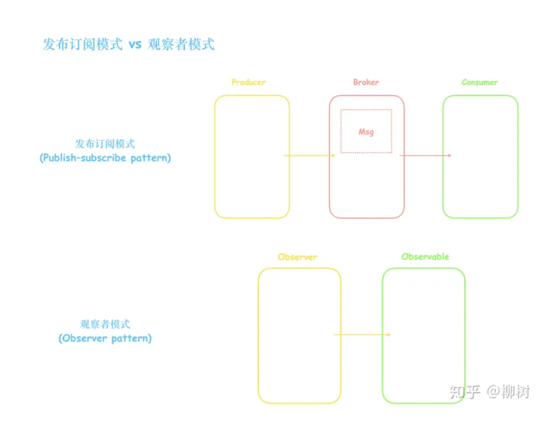

# 中科院自动化研究所一面

## v8引擎运行机制以及运行顺序

v8 引擎是一款高性能的JavaScript引擎,主要用于
解析何执行JavaScript代码,其运行机制何运行顺序如下:

1. 代码解析

```text
v8引擎需要对JavaScript代码进行解析,
将其转换成语法树(AST)和字节码,
解析主要过程主要包括词法分析,语法分析和AST构建等
```

2. 优化编译

```text
V8引擎采用即时编译(JIT)的方式来执行JavaScript代码,即时编译可以将JAvaScript代码转换
成本地机器代码,避免了解释执行的性能损失,V引擎使用了一种叫做"Crankshaft"的优化技术
进行即时编译,可以根据代码的执行情况进行动态优化,提高执行效率和性能
```

3. 执行代码

```text
V8引擎会将优化编译后的代码存储在代码缓存中,并且在需要执行代码缓存中取出,
直接执行机器代码,在执行代码的过程中,V8引擎会采用内联缓存(inline Cache)来
进行对象和方法的访问路径缓存,避免了重复对象解析和方法调用,从而提高了执行效率

```

4. 垃圾回收
```text
V8引擎采用了一种叫 "新生代" 和 "老生代"内存管理机制, 用于存储JavaScript代码,
新生代内存用于存储短期的对象,采用了一种叫做"Scavenge"的垃圾回收算法,
老生代内存用于存储长期的对象,采用了叫做"mark-sweep"和"mark-compact"的垃圾回收算法

v8引擎会自动管理内存的分配和回收,保证JavaScript代码的内存使用效率和性能
```
综上所属,V8引擎的运行机制和运行顺序包括代码解析,优化编译,执行代码,和垃圾回收等步骤

其中优化编译和执行代码是V8引擎的核心,采用了一系列优化技术,如即时编译,内联缓存和垃圾回收等,
提高JavaScript代码 的执行效率和性能


##  页面的优化策略:

页面的优化策略可以分为以下几点:  

1. 压缩图片和文件: 使用压缩工具来减小图片和文件的大小,从而加快页面的加载速度
2. 减少HTTP请求: 通过合并CSS和JavaScript文件,使用CSS Sprites(雪碧图)技术等方式来减少网页中的HTTP请求次数
3. 使用CDN: 使用CDN(内容分发网络)来加速页面的加载速度,让用户可以更快地访问页面
4. 延迟加载: 将页面中不必要的图片,视频等资源进行延迟加载,等到用户需要在进行加载
5. 取出无用代码: 去除页面中无用代码,如空格,注释等,可以减少文件大小,从而提高页面加载速度
6. 压缩HTML,CSS和JavaScript:使用压缩工具对HTML,CSS和JavaScript进行压缩可以减小文件大小,从而提高页面的加载速度


## 重排和重绘的区别

- 重排: 指当DOM的变化影响了元素的集几何属性(如 位置,大小等)时,浏览器需要重新计算元素的集合属性,,并重新排版整个文档树,然后再次绘制页面,整个过程是十分消耗性能的,因为需要进行多次计算和页面布局

- 重绘: 指当DOM的变化影响了元素的绘制属性(如颜色,背景)时,浏览器无需重新计算元素的集合属性,只需小虹心绘制受影响的部分即可

因此,重拍会比重绘更加消耗性能,尽量避免不必要的重拍操作,可以有效提高网页性能,常见的触发重排的操作包括改变元素的宽高,
位置, 字体大小等, 二触发重绘的操作包括改变元素的颜色,背景图片等


## webSocket

webSocket是一种在单个TCP连接上进行全双工通信协议,它通过在客户端和服务器之间建立持久连接
来实现实时通信,比传统的HTTP请求-响应模式更为高效


## 消息订阅与发布的设计模式

发布-订阅模式, 如vue中的`$on` 和 `$emit`方法,用到的就是 发布-帝国月模式

定义: 发布-订阅模式,是一种对象间一对多的依赖关系,当一个对象状态发生改变时,所有依赖于它的对象都将的到状态改变通知


订阅者(Subscriber)吧自己想订阅的事件注册(Subscribe)到调度中心(Event Channel),当发布者(Publisher)发布
该事件(Publish Event)到调度中心,也就是该事件触发时,有调度中心统一调度(Fire Event)订阅者注册到调度中心的处理代码




## TS的泛型

TS泛型可以奖类型作为参数传递到方法,属性,类中,从而实现更加灵活的数据处理,
我们可以使用泛型来定义一个函数或类,时器可以适用于不同类型的数据,
而不必重复编写相同的代码,泛型的语法使用 `<>` 来表示,气筒 `T` 可以是任何类型名称

```ts
function fun<T> (arg:T) :T{
    return  T
}
```

## vuex的原理以及设计模式

Vuex是一个专门为Vue.js应用程序开发的状态管理模式,它采用了集中式管理应用的所有租价的状态,并且以响应的规则保证
以一种可预测的方式发生变化,VueX的设计模式是Flux架构模式,其中包含了以下几个主要的概念

1. State: 状态存储数据的地方,所有组件都从状态中获取数据
2. Getters: 类似于计算属性,是从状态中牌证出一些状态, 一般用于多个组件都需要获取的状态
3. Mutations: 用于修改状态的唯一途径, 每个mutation都有一个字符串类型的事件类型和回调函数
4. Action: 用于提交mutation, 而不是直接更状态, 可以包含异步操作;
5. Modules: 将store分割册灰姑娘模块,每个模块都有自己的state,mutation,actions,getters


### vuex的原理

Vuex的原理是将应用程序的状态存储再中央存储器中,成功为Store,Store是一个对象,包含了应用程序和一些用于更新状态的方法
它的核心就是通过Store对象来管理应用程序的状态,并通过了一些特定的方法来修改状态

Vuex的设计模式是基于Flux架构的单向数据流模式,她的设计思想是将应用程序的状态抽象成一棵状态数,它是一个由多个子状态组成的对象;
每个子状态都由一个模块来管理,每个模块都可以包含自己的状态,getters,mutations和action  

状态数种的状态是只读的,这并不意味着不能直接更改状态树中的状态,只能通过提交一个mutation来更新状态树中的状态,Mutation是一个同步操作,
它接收一个状态作为参数,并对状态进行吸怪,Mutation必须是同步的,这是为了保证状态变化的可追踪性和可控性

除了Mutation, Vuex还提供了Action来处理异步操作,Action是一个可以包含任意异步操作的安徽拿书,它可以提交一个Mutation来改变状态,Action可以
包含多个Mutation的提交,也可以触发其他Action的执行


**设计模式**  

vuex的设计模式是基于Flux架构的单向数据流模式,它的核心概念包括: 

- state: 应用程序的状态存储再一个中央存储器中,称为Store, Store是一个对象,包含了应用程序和状态和一些用于更新状态的方法
- Mutation: Mutation是一个同步的操作,它接受一个状态作为参数,并对状态进行修改,Mutation必须是同步的,这是为了保证状态变化的可追踪行和可控性
- Action: Action是一个可以包含任意异步操作的函数,它可以提交一个Mutation来改变状态,Action可以包含多个Mutation的提交,也可以触发其他Action的执行
- Getter: Getter是一个计算属性,用于更具当前状态计算出一个直,可以通过多个Getter的组合计算出更复杂的值
- Module: Module是一个模块化的方式来组织应用程序的状态,每个模块都可以包含自己的状态, getters,mutations和actions

这个些概念共同构成了Vuex的设计模式,通过这种模式,我们可以将应用程序的状态由一课状态数,使得状态变化变得可追踪和可控,同时也使得状态变化的代码更加清晰和易于维护


## 深拷贝和浅拷贝和引用的区别

- 引用: 以哦你用是指在内中创建一个变量,并给这个变量起一个名字,然后再用另一个变量给他复制,这个变量的值就是被引用的变量的地址;
如果改变引用变量的值,被引用的变量也会受到影响

- 浅拷贝: 浅拷贝是指创建一个新的对象,但这个新的对象中的元素仍然是原对象的引用,所以改变新对象中的元素,仍然是原对象的引用,如果该百年浅拷贝对象中的元素,愿对象也会受到影响

- 深拷贝: 深拷贝是创建一个新的对象,并递归地复制源对象以及所有子对象所以不会对原对象造成影响


## vue中 computed 和 watch 的区别

vue.js中的 watch 和computed 都是用于监听数据变化并执行相应的操作的选择, 但是他们之间还是有区别的

> watch : 

watch 用于监听一个特定值的变化,并再数据变化时执行一些操作,这些操作可以是**异步**的,也可以是永不的;
 如果要监听多个数据, 可以再watch中定义多个属性, 使用watch需要再选项中使用一个函数来监听属性的柏纳胡,
这个函数中可以使用两个参数 newVal  和 oldVal 分别代表新值和旧值

> computed 

computed 用于再模板中使用计算属性 ,他会对所依赖的数据进行计算,返回一个新的值; 计算属性是基于它们的依赖进行缓存的;
只有依赖属性发生变化时才会重新计算, 使用计算属性可以避免再模板中编写复杂的逻辑和表达式;
 如果使用多个计算属性; 可以在选择中定义多个属性;

区别: 

- watch 选项用于监听数据的变化, computed 选项用于计算属性的值
- watch 中的函数可以执行异步操作, 而 computed 中的函数只能指向同步操作
- computed 选会对依赖属性进行缓存, 只有在依赖属性发生变化时才会重新计算; 而watch选项不会对数据进行缓存
- watch 选项中的函数会接收newVal 和oldVal两个参数, 而computed中的函数只有一个返回值

需要异步使用watch, 一对多产生影响用watch , 多对一使用computed

## vue2双向数据绑定原理

vue2数据双向数据绑定式通过 数据劫持 + 发布者-订阅者模式 的方式来是西安的;

首先式通过 ES5 提供的 object.defineProperty() 方法来劫持(监听)个属性的getter, setter,
并在当监听属性发生变动时通知订阅者是否需要更i性能, 若更新就会执行对应的更新函数

vue在实现双向数据绑定时, 会为每个响应式属性都创建一个watcher对象,
用于收集该属性的依赖进行更新;
同时,当通过v-model指向将表单元素创建一个watcher对象, 用于监听元素的变化, 当表单元素的值发生变化时,
watcher对象会自动更新响应式数据,从而实现双向数据绑定;


Vue的双向数据绑定是通过使用Object.defineProperty()方法和Watcher对象实现的。
这种机制可以让Vue自动追踪响应式数据的变化，并自动更新相关的依赖。
同时，通过v-model指令，Vue可以实现表单元素和响应式数据之间的双向绑定。

## cookie 存放在哪里电脑内存还是浏览器

浏览器, 换一个浏览器的话cookie不会存在

## 子域名之间可以共享cookie吗


子域名之间可以通过设置Cookie的域名属性来共享Cookie。
具体地说，如果一个Cookie被设置为顶级域名，那么所有子域名都可以访问该Cookie。
例如，对于顶级域名example.com，设置一个Cookie的域名为“.example.com”
而不是“www.example.com”或“blog.example.com”等特定子域名，那么所有子域名都可以访问该Cookie。

要设置Cookie的域名属性，需要在创建Cookie时，将其设置为所需的域名。
具体来说，浏览器的document.cookie对象提供了设置Cookie的方法。示例代码如下：

document.cookie = "name=value; domain=.example.com; path=/";
在上面的代码中，name和value是Cookie的名称和值，domain属性被设置为“.example.com”表示该Cookie可以被所有子域名访问。
path属性用于指定Cookie适用的路径，例如“/”表示Cookie适用于整个网站。

需要注意的是，如果您希望子域名之间共享Cookie，那么必须在设置Cookie时明确设置domain属性为顶级域名。
否则，不同子域名下的Cookie会被视为不同的Cookie，而无法进行共享。


## JS中的new关键字做了什么事情

1. 创建临时对象
2. 绑定this
3. 执行构造函数
4. 绑定原型
5. 返回（return）临时变量

## 堆和栈的数据结构分别是什么

在计算机科学中，栈（Stack）和堆（Heap）是两种常见的数据结构，用于内存管理和算法设计。它们有以下区别：

1. 栈是一种后进先出（Last In First Out，LIFO）的数据结构，堆是一种树形结构。

2. 栈通常是固定大小的，由操作系统自动分配和管理。堆的大小不是固定的，可以按需动态分配和管理。

3. 栈中存储的是局部变量、函数参数、返回地址和临时变量等短期数据。堆中存储的是长期存储的动态数据结构和对象，例如数组、链表和对象等。

4. 栈的访问速度较快，因为它使用的是指针操作。堆的访问速度较慢，因为需要使用指针寻址。

5. 栈的分配和回收都由操作系统自动完成，程序员不需要手动管理。而堆由程序员手动分配和回收，对内存管理的要求比较高。

需要注意的是，栈和堆并不是硬性的规定，不同的编程语言和开发环境有不同的实现和管理方式。一些高级编程语言，如Java和Python等，采用了垃圾回收机制来自动管理分配和回收堆中的内存。

## http2.0

HTTP/2（或HTTP2.0）是HTTP协议的更新版本，目的是提高Web性能。在HTTP/1.1中，每个请求都需要单独建立连接，这会导致性能瓶颈和延迟。HTTP/2通过在单个连接上支持多路复用，压缩头部，推送数据等技术来减少延迟，并提高性能。

HTTP/2的主要特点包括：

1. 多路复用：HTTP/2允许在同一个连接上同时发送多个请求和响应。这可以避免HTTP/1.x中的线头阻塞问题，提高了网络性能。

2. 二进制传输：HTTP/2使用二进制格式来传输数据，而HTTP/1.x使用的是文本格式。二进制格式可以更快地解析和传输，提高了网络速度。

3. 头部压缩：HTTP/2使用HPACK压缩算法来压缩头部，减少了头部大小，从而降低了网络延迟。

4. 服务器主动推送：HTTP/2允许服务器在客户端请求之前将多个资源主动推送到客户端缓存中。这可以提高页面加载速度并减少延迟时间。

总的来说，HTTP/2的出现使得网络请求更加高效快速，有助于提升Web应用的性能。


# TCP/IP 各个层分别有什么协议 选一个层说明一下具体协议

TCP/IP是互联网通信协议族，包含四个层次，每个层次都对应着一些具体的协议。具体如下：

1. 应用层（Application Layer）：应用层协议是用户应用程序和传输层之间的接口。常见的应用层协议有HTTP、FTP、SMTP、DNS等。

2. 传输层（Transport Layer）：传输层协议提供可靠的数据传输服务，例如TCP和UDP协议。

3. 网络层（Internet Layer）：网络层协议定义了数据在网络中的传输方式和路由策略，例如IP协议。

4. 数据链路层（Data Link Layer）：数据链路层协议指定了数据在物理介质上传输的方式。例如，以太网（Ethernet）协议。

以TCP协议为例，TCP属于传输层协议。TCP是一个面向连接的、可靠的、基于流的协议，它提供了可靠的数据传输机制和流量控制。TCP包括三个阶段：建立连接、传输数据、关闭连接。在TCP的建立连接阶段，客户端和服务器会通过三次握手的方式协商连接参数，并确认连接建立。在数据传输阶段，数据会被分割成多个数据包，并按顺序传输。如果有数据包丢失，TCP会重新发送该数据包直到接收到确认应答。在关闭连接阶段，客户端和服务器会通过四次挥手的方式关闭连接，并释放资源，以便下一次传输使用。相对于UDP协议，TCP协议提供了更加可靠和安全的数据传输方式，但是存在一些性能损失