# 第一次面试总结


- [第一次面试总结](#第一次面试总结)
  - [1. react和vue怎么创建虚拟dom?](#1-react和vue怎么创建虚拟dom)
  - [2. diff算法](#2-diff算法)

## 1. react和vue怎么创建虚拟dom?   

**什么是虚拟DOM?**  
Virtual DOM是一颗以JavaScript对象作为基础的树,每一个节点称为VNode,用对象属性来描述节点,实际上它是一层真实DOM的抽象,最终可以通过渲染操作使这棵树映射到真实环境上,简单来说Virtual DOM就是Js对象,用以描述整个文档

**什么是真实DOM?**  
Real DOM,真实DOM,意思为文档对象模型,是一个结构化文本对象的抽象,在页面渲染出来的每一个结点都是一个真实DOM结构,如下:


**怎么将虚拟DOM转换成真实DOM?**
react和vue一样,都通过createElement的方式将虚拟dom转换为真实dom

**虚拟DOM作用**  
虚拟DOM的最终目标是将虚拟节点渲染到视图上,但是如果直接使用虚拟节点覆盖旧节点的化,会有很多不必要的DOM操作  

```text
例如，一个ul标签下很多个li标签，其中只有一个li有变化，这种情况下如果使用新的ul去替代旧的ul,因为这些不必要的DOM操作而造成了性能上的浪费。
```
为了避免不必要的DOM操作,虚拟DOM在虚拟节点映射到视图的过程中,将虚拟节点与上一次渲染视图所使用的旧虚拟节点(oldVnode)做对比,找出真正需要更新的节点来进行DOM操作,从而避免操作其他无需改动的DOM

虚拟DOM在Vue.js主要做了两件事情:  

- 提供与真实DOM节点所对应的虚拟节点vnode
- 将虚拟节点vnode和旧虚拟节点oldVnode进行对比,然后更新视图

**真实DOM与虚拟DOM的区别**  

- 虚拟DOM不会进行排版与重绘操作,而真实DOM会频繁重拍与重绘  
- 虚拟DOM的总损耗是"虚拟DOM增删改+真实DOM差异增删改+排版与重绘",真实DOM的总损耗是"真实DOM完全增删改+排版与重绘"  
  
```text
传统的原生 api 或 jQuery 去操作 DOM 时，浏览器会从构建 DOM 树开始从头到尾执行一遍流程

当你在一次操作时，需要更新 10 个 DOM 节点，浏览器没这么智能，收到第一个更新 DOM 请求后，并不知道后续还有 9 次更新操作，因此会马上执行流程，最终执行 10 次流程

而通过 VNode，同样更新 10 个 DOM 节点，虚拟 DOM 不会立即操作 DOM，而是将这 10 次更新的 diff 内容保存到本地的一个 js 对象中，最终将这个 js 对象一次性 attach 到 DOM 树上，避免大量的无谓计算
```


**真实DOM与虚拟DOM优缺点**

真实DOM的优势:
- 易用
  

缺点:
- 效率低,解析速度慢,内存占用量过高
- 性能差: 频繁操作真实DOM,易于导致重绘与回流  
  

使用虚拟DOM的优势如下:

- 简单方便: 如果使用手动操作真实DOM来完成页面,繁琐又容易出错,在大规模应用下维护起来也很困难  
- 性能方面: 使用Virtual DOM能够有效避免真实DOM树频繁更新,减少多次引起重绘与回流, 提高性能
- 跨平台: React借助虚拟DOM,带来了跨平台的能力,一套代码多端运行  

缺点:  

- 在一些性能要求极高的应用中虚拟DOM无法进行针对性的极致优化
- 首次渲染大量DOM时,由于多了一层虚拟DOM的计算,速度比正常稍慢
  


## 2. diff算法

1. 是什么  

diff算法就是进行虚拟节点对比，并返回一个patch对象，用来存储两个节点不同的地方，最后用patch记录的消息去局部更新Dom。

简单来说Diff算法就是在虚拟DOM树从上至下进行同层比对，如果上层已经不同了，那么下面的DOM全部重新渲染。这样的好处是算法简单，减少比对次数，加快算法完成速度。


其有两个特点:  

- 比较只有会在同层级进行,不会跨层级比较
- 在diff比较的过程中,循环从两边向中间比较

diff算法在很多场景都有应用, 在vue中,作用域虚拟dom渲染成真实dom的新旧VNode节点比较


2. 从源码来分析diff算法

  vue在通过VNode节点渲染DOM时,并不是通过当前的VNode节点去暴力的更新DOM节点,

  而是对新旧两个VNode节点通过pathc算法进行比较,然后通过对比结果找出差异的节点进行按需更新;

  patch能够减少不必要的开销,提升性能

  

  patch的过程中主要完成以下几件事情:

  - 创建需要新增的节点,

  - 移除已经废弃的节点

  - 移动或修改需要更新的节点

  

  **及其重要的patch函数**

  

  

这就是源码中: `patch`做的工作,具体呢,里面又含有`sameVnode`函数

```javascript
export function isSameVNodeType(n1: VNode, n2: VNode): boolean {
  return n1.type === n2.type && n1.key === n2.key
}

```

> 即: `旧节点的key`要和`新节点的key`相同,且旧节点的选择器要和新节点的选择器相同


**Vue3 的 patch 优化 -- patchFlag**


>  pathcFlags是什么? 


```ts
export const enum PatchFlags {
  // 动态文字内容
  TEXT = 1,

  // 动态 class
  CLASS = 1 << 1,

  // 动态样式
  STYLE = 1 << 2,

  // 动态 props
  PROPS = 1 << 3,

  // 有动态的key，也就是说props对象的key不是确定的
  FULL_PROPS = 1 << 4,

  // 合并事件
  HYDRATE_EVENTS = 1 << 5,

  // children 顺序确定的 fragment
  STABLE_FRAGMENT = 1 << 6,

  // children中有带有key的节点的fragment
  KEYED_FRAGMENT = 1 << 7,

  // 没有key的children的fragment
  UNKEYED_FRAGMENT = 1 << 8,

  // 只有非props需要patch的，比如`ref`
  NEED_PATCH = 1 << 9,

  // 动态的插槽
  DYNAMIC_SLOTS = 1 << 10,

  // SPECIAL FLAGS -------------------------------------------------------------

  // 以下是特殊的flag，不会在优化中被用到，是内置的特殊flag

  // 表示他是静态节点，他的内容永远不会改变，对于hydrate的过程中，不会需要再对其子节点进行diff
  HOISTED = -1,

  // 用来表示一个节点的diff应该结束
  BAIL = -2,
}
```

以上就是所有的pathcFlags, 和它的名字含义一致, 他就是一系列的标志,来表示要给节点该如何进行更新的


使用 `class = 1 << 1`这样的方式来表示的好处:


1. 很容易进行符合, 可以通过`TEXT|CLASS`来得到`0000000011`这个可以表示他既有`TEXT`的特性,也有`CLASS`的特性

2. 方便进行对比,我们拿到一个值`FLAG`的时候,想要判断它有没有`TEXT`的属性,只需要`FLAG&TEXT>0`就可以了
3. 方便扩展, 子啊足够位数的情况下,我们新增一种特性就之哟啊让他左移的位数加一就不会重复

这种方式起始很常见,比如我们做一个系统的权限管理的时候也会考虑这么做,在REACT里面这种凡是也有很多应用

> patchFlags有什么用?

首先,在`creawteVnode`的时候,会把`patchFlags`相关的参数都放到`vnode`对象里面:

```typescript
const vnode: VNode = {
  // ... other vnode attrs
  patchFlag,
  dynamicProps,
  dynamicChildren: null,
};
```

那他们啥时候被用到呢,主要是在节点被更新的时候,比如 `patchElement`  

```typescript
const patchElement = (
  n1: VNode,
  n2: VNode,
  parentComponent: ComponentInternalInstance | null,
  parentSuspense: SuspenseBoundary | null,
  isSVG: boolean,
  optimized: boolean
) => {
  const el = (n2.el = n1.el!);
  let { patchFlag, dynamicChildren, dirs } = n2;
  // #1426 take the old vnode's patch flag into account since user may clone a
  // compiler-generated vnode, which de-opts to FULL_PROPS
  patchFlag |= n1.patchFlag & PatchFlags.FULL_PROPS;

  if (patchFlag > 0) {
    if (patchFlag & PatchFlags.FULL_PROPS) {
      // element props contain dynamic keys, full diff needed
      patchProps();
      // ...args
    } else {
      if (patchFlag & PatchFlags.CLASS) {
        if (oldProps.class !== newProps.class) {
          hostPatchProp(el, "class", null, newProps.class, isSVG);
        }
      }
      if (patchFlag & PatchFlags.STYLE) {
        hostPatchProp(el, "style", oldProps.style, newProps.style, isSVG);
      }

      if (patchFlag & PatchFlags.PROPS) {
        // if the flag is present then dynamicProps must be non-null
        const propsToUpdate = n2.dynamicProps!;
        // update props
      }
    }

    if (patchFlag & PatchFlags.TEXT) {
      if (n1.children !== n2.children) {
        hostSetElementText(el, n2.children as string);
      }
    }
  } else if (!optimized && dynamicChildren == null) {
    // unoptimized, full diff
    patchProps();
    // args
  }

  const areChildrenSVG = isSVG && n2.type !== "foreignObject";
  if (dynamicChildren) {
    patchBlockChildren();
    // ...args
    if (__DEV__ && parentComponent && parentComponent.type.__hmrId) {
      traverseStaticChildren(n1, n2);
    }
  } else if (!optimized) {
    // full diff
    patchChildren();
    // ...args
  }

  if ((vnodeHook = newProps.onVnodeUpdated) || dirs) {
    queuePostRenderEffect(() => {
      vnodeHook && invokeVNodeHook(vnodeHook, parentComponent, n2, n1);
      dirs && invokeDirectiveHook(n2, n1, parentComponent, "updated");
    }, parentSuspense);
  }
};

```


这里的核心思想就是: **会根据`vnode`的`patchFlag`上具有的属性来执行不同的patch方法**,如果没有`patchFlag`那么就执行`full diff`,也就是这里的`patchProps`,那么也就会知道, `patchProps`应该包含了下面大部分的单个`patch`即:

- patchClass
- patchStyle
- patchEvent
- 等等


> patchFlags的规则


这里我们就拿几个常见的规则来讲以下`patchFlags`到底是怎么用的

模板: 

```html
<template>
  <div>{{name}}</div>
</template>
```

编译: 

```js
createElement("div", null, [name], PatchFlags.TEXT);
```

模板:

```html
<template>
  <div :class="classNames">{{name}}</div>
</template>
```

编译:

```js
createElement(
  "div",
  { class: classNames },
  [name],
  PatchFlags.TEXT | PatchFlags.CLASS
);
```

模板:

```html
<template>
  <div :class="classNames" :id="id">{{name}}</div>
</template>
```

编译:

```js
createElement(
  "div",
  { class: classNames, id: id },
  [name],
  PatchFlags.TEXT | PatchFlags.CLASS | PatchFlags.PROPS,
  ["id"] // 标明具体那几个props是动态的
);
```

模板: 

```html
<template>
  <div :[foo]="bar">Hello</div>
</template>
```

编译:

```js
createElement("div", { [foo]: bar }, ["Hello"], PatchFlags.FULL_PROPS);
```


**patch 是怎么工作的**


patch源码: 

```typescript
const patch: PatchFn = (
  n1,
  n2,
  container,
  anchor = null,
  parentComponent = null,
  parentSuspense = null,
  isSVG = false,
  slotScopeIds = null,
  optimized = false
) => {
  // patching & 不是相同类型的 VNode，则从节点树中卸载
  if (n1 && !isSameVNodeType(n1, n2)) {
    anchor = getNextHostNode(n1)
    unmount(n1, parentComponent, parentSuspense, true)
    n1 = null
  }
	// PatchFlag 是 BAIL 类型，则跳出优化模式
  if (n2.patchFlag === PatchFlags.BAIL) {
    optimized = false
    n2.dynamicChildren = null
  }

  const { type, ref, shapeFlag } = n2
  switch (type) { // 根据 Vnode 类型判断
    case Text: // 文本类型
      processText(n1, n2, container, anchor)
      break
    case Comment: // 注释类型
      processCommentNode(n1, n2, container, anchor)
      break
    case Static: // 静态节点类型
      if (n1 == null) {
        mountStaticNode(n2, container, anchor, isSVG)
      }
      break
    case Fragment: // Fragment 类型
      processFragment(/* 忽略参数 */)
      break
    default:
      if (shapeFlag & ShapeFlags.ELEMENT) { // 元素类型
        processElement(
          n1,
          n2,
          container,
          anchor,
          parentComponent,
          parentSuspense,
          isSVG,
          slotScopeIds,
          optimized
        )
      } else if (shapeFlag & ShapeFlags.COMPONENT) { // 组件类型
        processComponent(/* 忽略参数 */)
      } else if (shapeFlag & ShapeFlags.TELEPORT) { // TELEPORT 类型
        ;(type as typeof TeleportImpl).process(/* 忽略参数 */)
      }
  }
}

```


解读: 

n1 与 n2 是待比较的两个节点, n1为旧几点, n2为新节点, container是新节点的一个容器,anchor是一个锚点, 用来表示我们对新旧系欸但做增删或移动操作时,以哪个节点为参照物, optimized参数是用来表示是否开启优化模式


第一个if条件,当旧节点存在,并且新旧节点不是同一类型时,则安静旧节点从节点数中卸载, 可以得到`patch`的**第一个逻辑: 当两个节点类型不同,则直接卸载旧节点**


第二个if分支,如果新节点的patchFlag为BAIL,优化模式会被关闭; 


接下来`pacht`函数会通过`switch case`来判断节点类型,并分别对不同类型节点类型执行不同的操作


> 元素的patch过过程 -- processElement


`processElement`这个函数本身的代码逻辑非常简单,总结起来就是:

如果存在旧节点则继续通过`patch`比较新旧两个节点;否则直接挂载新节点,

```typescript
const processElement = (
  n1: VNode | null,
  n2: VNode,
  container: RendererElement,
  anchor: RendererNode | null,
  parentComponent: ComponentInternalInstance | null,
  parentSuspense: SuspenseBoundary | null,
  isSVG: boolean,
  slotScopeIds: string[] | null,
  optimized: boolean
) => {
  // 如果旧节点不存在
  if (n1 == null) {
    mountElement(
      n2,
      container,
      anchor
      /* 后续参数省略 */
    )
  } else {
    patchElement(
      n1,
      n2,
      parentComponent,
      parentSuspense,
      isSVG,
      slotScopeIds,
      optimized
    )
  }
}
```


假设旧节点都是存在的,继续往下分析


>  比较子节点--patchElement


在元素类型的patch过程中,Vue3首先会将新旧节点的props声明提取出来,之后需要对props进行patch比较


在比较开始之前会触发一些钩子比如VNode自身的钩子`onVnodeBefroeUpdate`,以及元素上帮绑定的指令的钩子`beforeUpdate`

```typescript
    if ((vnodeHook = newProps.onVnodeBeforeUpdate)) {
      invokeVNodeHook(vnodeHook, parentComponent, n2, n1)
    }
    if (dirs) {
      invokeDirectiveHook(n2, n1, parentComponent, 'beforeUpdate')
    }
```


> 更新属性

之后开始比较props,如果此时元素被标记过`patchFlag`或,则会通过`patchFlag`进行按需比较,否则会全量的diff元素中的props

```typescript
if (patchFlag > 0) {
  if (patchFlag & PatchFlags.FULL_PROPS) {
    // 如果元素的 props 中含有动态的 key，则需要全量比较
    patchProps(
      el,
      n2,
      oldProps,
      newProps,
      parentComponent,
      parentSuspense,
      isSVG
    )
  } else {
    if (patchFlag & PatchFlags.CLASS) {
      if (oldProps.class !== newProps.class) {
        hostPatchProp(el, 'class', null, newProps.class, isSVG)
      }
    }

    if (patchFlag & PatchFlags.STYLE) {
      hostPatchProp(el, 'style', oldProps.style, newProps.style, isSVG)
    }

    if (patchFlag & PatchFlags.PROPS) {
      const propsToUpdate = n2.dynamicProps!
      for (let i = 0; i < propsToUpdate.length; i++) {
        const key = propsToUpdate[i]
        const prev = oldProps[key]
        const next = newProps[key]
        if (
          next !== prev ||
          (hostForcePatchProp && hostForcePatchProp(el, key))
        ) {
          hostPatchProp(
            el,
            key,
            prev,
            next,
            isSVG,
            n1.children as VNode[],
            parentComponent,
            parentSuspense,
            unmountChildren
          )
        }
      }
    }
  }

  if (patchFlag & PatchFlags.TEXT) {
    if (n1.children !== n2.children) {
      hostSetElementText(el, n2.children as string)
    }
  }
} else if (!optimized && dynamicChildren == null) {
  patchProps(
    el,
    n2,
    oldProps,
    newProps,
    parentComponent,
    parentSuspense,
    isSVG
  )
}

```

解读: 

- 当patchFlag 为 FULL_PROPS时,说明此时的元素中,可能包含了动态的key,需要进行全量的`props diff`
- 当patchFlag 为 CLASS 时, 当新旧节点的 class 不一致时,此时会对 class 进行patch,而当新旧节点的class属性完全一致时,不需要进行任何操作,这个Flag标记会在 元素有动态的class绑定时加如
- 当patchFlag为 STYLE 时, 会对 style 进行更新,这是每次patch都会进行的,这个FLAG会在有动态style绑定时被加如
- 当patchFlag为PROPS时,需要注意这个Flag会在元素拥有动态的属性或者attrs绑定时添加,不同于class和style,这些动态的prop或attrs的key会被保存下来以便于更快速的迭代
  - PROPS 的比较会讲新节点的动态属性提取出来,并遍历整个属性中所有的key,当新旧属性不一致,或者key需要强制更新时,则调用`hostPatchProp`对属性进行更新  
- 当patchFlag为TEXT时,如果新旧节点中的子节点时文本发生变化,则调用hostSetElementTest进行更新,这个flag会在元素的子节点只包含动态文本时被添加


此时当元素拥有patchFlag的分支判断就结束了,我们可以在这些分支判断中,体会到patchFlag为patch算法的速度提升所做出的努力


分支走到最后一个else, 若当前不存在优化标记并且动态子节点也不存在,则直接对props进行全量 diff 通过patchProps这个安徽拿书完成


> 更新子节点--patchChildren


在元素patch过程中,会判断是否存在动态子节点,如果是则调用patchBlockChildren仅仅更新动态的子节点,否则会调用patchChildren对子节点进行全量更新  


在更新子节点时,受下也是利用patchFlag的能力,对子节点进行分类做出不同的处理;


一般情况: patchChildren

在更新子节点时,首先也是利用 patchFlag 的能力, 对子节点进行分类做出

不同, patchChildren函数的逻辑


- 根据`patchFlag`进行判断
  - 如果`patchFlag`是存在key只得Fragment: KEYED_FRAGMENT,则调用 `patchKeyedChildren来继续处理子节点
  - 如果`patchFlag`是没有设置key值得 Fragment: UNKEYED_FRAGMENT 则 调用 `patchUnkeyedChildren`处理没有key值得子节点
- 根据shapFlag(元素类型标记)进行判断:
  - 如果新子节点是文本类型,而旧节点是数组类型,则直接卸载旧节点得子节点
    - 如果新旧节点类型一致,则直接更新子节点得文本
  - 如果旧子节点是数组类型
    - 如果新子节点也是数组类型,则调用 `patchKeyedChildren`进行完整得diff
    - 如果新子节点是数组类类型,而旧子节点不是,说明此时需要在树种挂载新子节点,进行mount操作


上面就是	patchChildren 的完整逻辑,  这里最复杂的就是当新旧节点都为数组类型的时候调用`patchKeyedCildren`对两个数组进行完全比较


**子节点的更新策略**

如何高效的做diff算法,最重要的性能瓶酒就是如何更快速的对树种的子节点进行比较,得出需要进行什么操作,如果按照正常思维去比较,那么这个时间复杂度至少为O(n^3),这个操作无疑是非常昂贵的;

而针对这种情况如何实现一个时间复杂度为O(n)的短发,就是前端框架必须考虑的问题, 与react一样,Vue种也有key来协助标识子节点,帮助框架进行高效的识别和比较子节点


> Vue2 的子节点优化策略

《深入浅出 Vue.js 》这本书中，作者刘博文将 Vue2 的子节点优化策略总结为四类：

- 新前与旧前
- 新后与旧后
- 新后与旧前
- 新前与旧后

需要注意的是新前指代新子节点索引在最前面的节点，而新后指代新子节点索引在末尾的节点，而旧则指代旧子节点的意思。


| Vue3 的子节点更新

```typescript
const patchKeyedChildren = (
  c1: VNode[],
  c2: VNodeArrayChildren,
  container: RendererElement,
  parentAnchor: RendererNode | null,
  parentComponent: ComponentInternalInstance | null,
  parentSuspense: SuspenseBoundary | null,
  isSVG: boolean,
  slotScopeIds: string[] | null,
  optimized: boolean
) => {
  let i = 0 //遍历子节点的索引
  const l2 = c2.length
  let e1 = c1.length - 1 // prev ending index
  let e2 = l2 - 1 // next ending index
  /* 忽略后续逻辑 */
}
```


首先来看patchKeyedChildren的函数签名部分, 该函数参乎中的c1,c2分别代表旧子节点


- 第一个比较策略 新前与旧前
  
  
  
  

先看这张图，同一行的 C1, C2 节点，就是待比较的两个新旧子节点，比较子节点会从两个子节点的起始索引开始：

当 i = 0 时，比较第 0 个索引，发现 C1 的 A 节点 与 C2 节点的 A 节点 是同一类型的元素，则会对新旧的 A 节点进行 patch 操作，在这里进行 patch 能够递归的去访问 A 节点下的所有子节点，patch 完成后递增索引 i 。

继续比较，发现 C1 的 B 节点与 C2 的 B 节点也是同一类型的元素，与之前一样对B 节点进行 patch 递归后递增 i 索引。

当比较第三个子节点时，会发现 C1 的 C 节点与 C2 的 D 节点并不是同一类型的节点，所以会 break 跳出新前与旧前的比较循环，于是新前与旧前的比较结束。

而此时已经完成了 C1 和 C2 的子节点的前两个节点的比较。这个比较的过程在源码中是这样的


```typescript
while (i <= e1 && i <= e2) {
  const n1 = c1[i]
  const n2 = (c2[i] = optimized
    ? cloneIfMounted(c2[i] as VNode)
    : normalizeVNode(c2[i]))
  // 比较 n1 与 n2 是否是同一类型的 VNode
  if (isSameVNodeType(n1, n2)) {
    patch(
      n1,
      n2,
      container,
      null,
      parentComponent,
      parentSuspense,
      isSVG,
      slotScopeIds,
      optimized
    )
  } else {
    // 如果 n1 与 n2 不是同一类型，则 break 出 while 循环
    break
  }
  // 递增 i
  i++
}
```

> 在新前与旧前的比较完成后，与 Vue2 中的优化策略一致，会开始新后与旧后的比较。


通过之前声明的e1与e2这两个新旧子节点的末尾索引, 从最末尾开始比较元素


图中的比较则是如下逻辑:

- 从末尾开始, C1是C节点, 而 C2也是C节点, 两者节点类型相同,开始机型patch比较,待patch完成后,新旧节点的末尾索引-1
- 进行第二次比较，C1 的末尾是 B 节点，C2 的末尾是 B 节点，类型相同，进行 patch，之后递减尾部索引。
- 进行第三次比较，C1 的末尾节点是 A，C2 的末尾节点是 E，类型不同，break 跳出新后与旧后的比较循环

```typescript
while (i <= e1 && i <= e2) {
  const n1 = c1[e1]
  const n2 = (c2[e2] = optimized
    ? cloneIfMounted(c2[e2] as VNode)
    : normalizeVNode(c2[e2]))
  // 比较 n1 与 n2 是否是同一类型的 VNode
  if (isSameVNodeType(n1, n2)) {
    patch(
      n1,
      n2,
      container,
      null,
      parentComponent,
      parentSuspense,
      isSVG,
      slotScopeIds,
      optimized
    )
  } else {
    // 如果 n1 与 n2 不是同一类型，则 break 出 while 循环
    break
  }
  // 完成 patch 操作后，尾部索引递减
  e1--
  e2--
}
```


> 常规顺序的新子节点挂载

当我们完成了前两轮比较后,此时往往能在常规的需要上发现一些新子节点中存在,而旧字节点中没有的元素,此时就需要将这些新增的子节点插入


如果当完成新前与旧前的比较完成后,此时索引 i 已经递增的超过C1子节点的长度, 此时 i=2,并且 i 还小于等于C2子节点的长度, 于是可以判定在新字节点钟还有节点没有被遍历到,此时旧子节点已经全部遍历完,所以井未被遍历的子节点全部插入即可

对于这张图,应该插入C节点


```typescript
// 当旧子节点被遍历完
if (i > e1) {
  // 新节点还有元素未被遍历完
  if (i <= e2) {
    const nextPos = e2 + 1
    // 确定好锚点元素
    const anchor = nextPos < l2 ? (c2[nextPos] as VNode).el : parentAnchor
    // 遍历剩余的新子节点
    while (i <= e2) {
    	// patch 时第一个参数传入 null，代表没有旧节点，直接将新节点插入即可
      patch(
        null,
        (c2[i] = optimized
          ? cloneIfMounted(c2[i] as VNode)
          : normalizeVNode(c2[i])),
        container,
        anchor,
        parentComponent,
        parentSuspense,
        isSVG,
        slotScopeIds,
        optimized
      )
      i++
    }
  }
}
```


> 常规顺序的移除多余节点

与上面的挂载逻辑相对应的是移除多余的旧子节点, 

当新子节点已经全部遍历完时时,如果此时旧子节点还有元素未被遍历,那么可以判定剩余的旧子节点已经不再需要了,所以直接将剩余旧子节点移除即可


从图中来看, C1 与 C2 在通过新后与旧后的比较完成后,此时旧节点C1中还剩余A节点, 新节点中已经没有需要比较的节点了,所以直接移除A节点即可

```typescript
// 如果新子节点已被遍历完
else if (i > e2) {
  // 就子节点未被遍历完
  while (i <= e1) {
    // 调用 unmount 卸载旧子节点
    unmount(c1[i], parentComponent, parentSuspense, true)
    // 递增索引
    i++
  }
}
```


> 未知顺序的子节点比较


可以看到新旧子节点中挂载了比较多的元素,当我们通过新前与旧前,新后与旧后的比较之后,还剩余中间部分的不确定顺序的节点了,旧子节点中的CDE, 新子节点中的EDCH


那么patch是如何完成这个任务的:

- 声明s1, s2 两个变量,并此时遍历前序索引i赋值给s1,s2; s1,s2分别代表新旧子节点的起始索引

- 以s2为起始结点, e2 为结束条件, 遍历新子节点,用新字节点钟子节点的key为键,索引i为值,生成一个map对象,存放原始索引

  - 如果此时发现有子节点钟有重复的键,就会发出一个所有Vue开发者都很熟悉的警告: Duplicate keys found during update xxx,Make sure keys are unique

  

```typescript
const s1 = i // 旧子节点的起始索引
const s2 = i // 新子节点的起始索引

// 对新子节点，创建一个索引的 map 对象
const keyToNewIndexMap: Map<string | number, number> = new Map()
for (i = s2; i <= e2; i++) {
  const nextChild = (c2[i] = optimized
    ? cloneIfMounted(c2[i] as VNode)
    : normalizeVNode(c2[i]))
  if (nextChild.key != null) {
    // 如果是 DEV 环境，且 keyToNewIndexMap 已经存在当前节点的 key 值，则警告。
    if (__DEV__ && keyToNewIndexMap.has(nextChild.key)) {
      warn(
        `Duplicate keys found during update:`,
        JSON.stringify(nextChild.key),
        `Make sure keys are unique.`
      )
    }
    // 以新子节点的 key 为键，索引为值，存入 map。
    keyToNewIndexMap.set(nextChild.key, i)
  }
}
```

- 声明变量 toBePatched，计算还有几个节点需要被 patch。声明变量 patched = 0，记录 patch 的节点数。
- 声明一个 newIndexToOldIndexMap 的数组，用于后续确定最长递增子序列，newIndexToOldIndexMap 数组大小为 toBePatched 的长度，并将数组内所有元素初始化为 0。
  - newIndexToOldIndexMap，形式是 Map<newIndex, oldIndex>
  - 需要注意的是里面存储的 oldIndex 是索引是偏移 +1 的。
  - oldIndex = 0 是一个特殊值，表示新子节点中没有对应的旧子节点。
- 遍历旧子节点，将当前被遍历的子节点标记为 prevChild。
  - 如果 patched 大于等于 toBePatched，说明需要被 patch 的节点已经全部比较完毕，则可以将剩余的 prevChild 移除。
  - 否则声明变量 newIndex。
  - 如果 prevChild 的 key 不为空，则从 keyToIndexMap 中取 prevChild.key 的值，将获取到的值赋值给 newIndex。
  - 如果 newIndex 没有值，则说明在新子节点中没有对应的旧子节点，直接移除 prevChild 旧子节点。
  - 否则在 newIndexToOldIndexMap 中存下新的索引，并标记当前索引移动的最远位置或增加移动标记，并对新旧子节点进行 patch 比较。
  - 在完成 patch 后，将 patched 计数递增。

以上逻辑的代码如下：

```typescript
/**
 * 遍历旧子节点，尝试 patch 比较需要被 patch 的节点，并且移除不会再出现的子节点
 */
let j
let patched = 0
const toBePatched = e2 - s2 + 1
let moved = false
// 用于跟踪是否有节点发生移动
let maxNewIndexSoFar = 0
// 用于确定最长递增子序列
const newIndexToOldIndexMap = new Array(toBePatched)
for (i = 0; i < toBePatched; i++) newIndexToOldIndexMap[i] = 0

for (i = s1; i <= e1; i++) {
  const prevChild = c1[i]
  if (patched >= toBePatched) {
    // 所有新节点都被 patch 了，所以剩下的只需要移除
    unmount(prevChild, parentComponent, parentSuspense, true)
    continue
  }
  let newIndex
  if (prevChild.key != null) {
    newIndex = keyToNewIndexMap.get(prevChild.key)
  } else {
    // 对于找不到 key 的节点，尝试去定位相同 type 的节点
		/* 忽略逻辑 */
  }
  // 如果旧子节点不能匹配到对应的新子节点，则移除该旧子节点
  if (newIndex === undefined) {
    unmount(prevChild, parentComponent, parentSuspense, true)
  } else {
    // 在 newIndexToOldIndexMap 记录下被 patch 的节点的索引
    newIndexToOldIndexMap[newIndex - s2] = i + 1
    // 如果 newIndex 的索引大于最远移动的索引，则更新
    if (newIndex >= maxNewIndexSoFar) {
      maxNewIndexSoFar = newIndex
    } else {
      // 否则标记 moved 为 true
      moved = true
    }
    // 对新旧子节点进行 patch
    patch(
      prevChild,
      c2[newIndex] as VNode,
      container,
      null,
      parentComponent,
      parentSuspense,
      isSVG,
      slotScopeIds,
      optimized
    )
    // patch 完毕后，递增 patched 计数。
    patched++
  }
}

```

在遍历完旧子节点后，我们已经移除了不必要的旧子节点，并且依旧存在于新节点中的对应的旧子节点都进行了 patch 比较，接下来我们需要遍历一下新子节点，仅仅只从后往前遍历需要被 patch 的部分，目的是对于新增的子节点进行插入，对于需要移动的子节点进行同级的移动。逻辑描述如下：

- 如果有 moved 标记，则从 newIndexToOldIndexMap 中找到最长递增子序列，并将 j 赋值为最长递增子序列数组的末尾索引。
- 从后往前的遍历新子节点，这样可以使我们确定锚点元素的位置。
- 声明 newIndex = s2 + i，即为最后一个需要被 patch 的节点。
- 获取锚点元素。
- 如果这个需要被 patch 的节点，i 索引在 newIndexToOldIndexMap 中的值为 0。还记得我之前提示的，0 是一个特殊值，代表该节点在旧子节点中没有对应的节点吧。那么对于没有对应节点的元素，我们就对它采用插入操作。
- 如果 newIndexToOldIndexMap 中有对应索引，但是存在 moved 标记，说明节点可能移动，应该继续判断。
  - 如果 j < 0，说明最长递增子序列中的所有节点都已经处理过。或者当索引 i 不等于最长增长子序列中索引 j 对应的值时，说明该节点并不处在一个相对稳定的位置，则需要进行移动操作。
  - 如果满足上述条件，j 索引递减，不用处理该节点。

```typescript
/**
 * 移动和挂载
 */
// 当节点被移动时，创建最长递增子序列
const increasingNewIndexSequence = moved
  ? getSequence(newIndexToOldIndexMap)
  : EMPTY_ARR
j = increasingNewIndexSequence.length - 1
// 为了能方便的获取锚点，选择从后向前遍历
for (i = toBePatched - 1; i >= 0; i--) {
  const nextIndex = s2 + i
  const nextChild = c2[nextIndex] as VNode
  const anchor =
    nextIndex + 1 < l2 ? (c2[nextIndex + 1] as VNode).el : parentAnchor
  if (newIndexToOldIndexMap[i] === 0) {
		// 如果在 newIndexToOldIndexMap 中找不到对应的索引，则新增节点
    patch(
      null,
      nextChild,
      container,
      anchor,
      parentComponent,
      parentSuspense,
      isSVG,
      slotScopeIds,
      optimized
    )
  } else if (moved) {
    // 如果不是一个稳定的子序列，或者当前节点不在递增子序列上时，需要移动
    if (j < 0 || i !== increasingNewIndexSequence[j]) {
      move(nextChild, container, anchor, MoveType.REORDER)
    } else {
      j--
    }
  }
}
```


**diff算法总结**

1. 从头对比找到有相同节点patch,发现不同,立即跳出

2. 如果第一步没有patch完,立即从后往前开始patch,如果发现不同立刻跳出循环

3. 如果新的节点未遍历完,老的节点全部遍历完, 对为访问的新的节点的节点全部以新的VNode处理(挂载)(这种情况说明已经完全patch完相同的vnode)

4. 对于老节点未遍历完,新的节点遍历完,对未访问到的老节点全部卸载(这种情况说明已经完全patch完相同的VNode)

5. 不确定的元素(老节点和新节点均有剩余)

   1. 把没有比较过的新节点通过map保存, 以新子节点的key为键,索引为值,存入map,

      变量patched 存放已经patch的数量, 

      变量toBePatched存放需要toBePatched的数量

      数组 newIndexToOldIndexMap 长度为未遍历的新节点长度 初值为0

     2. 遍历未访问的老节点

        		1. 如果toBePatched的节点数量未0, 那么卸载这些老节点
             		2. 如果老节点key有对应存在, 根据key在map中找到对应的index(新节点索引)
             		3. 如果未找到卸载老节点

        4. 如果找到与老节点对应的新节点，把老节点的索引，记录在存放新节点的数组中，
        5. 如果发生了逆序,就说明需要进行移动
        6. 对新老节点进行patch 并让patched++

     3. 遍历结束, 根据(新老节点索引列表,找到最长稳定子序列)

     4. 遍历未访问的新节点

        		1. 在newIndexToOldIndexMap中新节点对应索引的值为0,作为新NNode处理(挂载)
             		2. 不满足5.4.1 且 moved 为 true 根据生成的最长稳定子序列对节点进行处理


### 3. Node.js为什么可以解析js代码?

> nodejs是什么?

Node.js是一个JavaScript运行时环境?


> nodejs为什么可以解析js代码

Chrome 浏览器中的 JavaScript 和 Node.js 都在V8 引擎上运行, 该引擎将你的JavaScript代码转换为更块的机器代码,机器代码时低级代码,计算机可以直接运行而无需先解释它,


> 为什么选择Node.js

官方给出的定义: 

```text
Node.js®是基于 Chrome 的 V8 JavaScript 引擎构建的 JavaScript 运行时环境。Node.js 使用事件驱动的非阻塞 I/O模型，轻量且高效。
Node.js 的包生态系统 npm 是世界上最大的开源库生态系统。
```


I/O指的是输入/输出, 它可以从读取/写入本地文件向API发出HTTP的任何内容

I/O 需要hi见,因此会阻塞其他函数


考虑一下这种情况，我们需要通过请求后端[数据库](https://cloud.tencent.com/solution/database?from=10680)来获取 user1 和 user2 的详细信息，然后在屏幕或控制台上打印它们。对该请求的响应需要时间，但是两个用户数据的请求可以独立地同时执行


阻塞I/O(左) 非阻塞I/O(右)


**阻塞I/O**

在阻塞方法中，在 user1 的数据被输出到屏幕之前，不会启动 user2 的数据请求。

如果这是一个Web[服务器](https://cloud.tencent.com/product/cvm?from=10680)，我们必须为每个新用户启动一个新线程。但 JavaScript 是单线程的（实际上不是真的，但它有一个单线程的事件循环，我们稍后会讨论）。所以这会使 JavaScript 不太适合多线程任务。

这就是非阻塞的用武之地。


**非阻塞I/O**

另一方面，如果用非阻塞请求，可以在为 user2 发起数据请求时，无需先等待对 user1 请求的响应。你可以并行启动这两个请求。

这种非阻塞 I/O 消除了对多线程的需要，因为服务器可以同时处理多个请求。


**JavaScript 事件循环**

以下是 JavaScript 事件循环工作原理简要的逐步描述。


1. 将 `main()` 送入调用栈。
2. 将 `console.log()` 送入调用栈。然后立即运行并弹出。
3. 将 `setTimeout(2000)` 送入栈。 `setTimeout(2000)`是一个 Node API。在调用它时，先注册事件回调。事件将等待 2000 毫秒，然后回调这个函数。
4. 在 API 中注册后，`setTimeout(2000)` 从调用堆栈中弹出。
5. 现在第二个 `setTimeout(0)` 以相同的方式注册。我们现在有两个 Node API 等待执行。
6. 等待 0 秒后，`setTimeout(0)` 被移动到回调队列，同样的事情发生在 `setTimeout(2000)`。
7. 在回调队列中，函数等待调用栈为空，因为每个语句都执行一次。这由事件循环处理。
8. 最后一个 `console.log()` 运行，并且 `main()` 从调用栈中弹出。
9. 如果事件循环检测到到调用堆栈为空且回调队列不为空。它将回调（以先进先出顺序）移动到调用栈并执行。

**npm**

这些是由令人敬畏的社区所构建的库，它能解决你的大多数的常规问题。 npm（Node package manager)）中有很多可以用在你的程序中包，可以使你的开发更快更有效。


**V8 通过利用 C++ 来加速 JavaScript**

V8 是一个用 C++ 编写的开源运行时引擎。

JavaScript => V8（C ++）=> 机器码

V8 实现了 ECMA-262 中指定的名为 ECMAScript 的脚本。 ECMAScript 由 Ecma International 创建，用于标准化JavaScript。

V8 可以独立运行，也可以嵌入到任何 C++ 程序中。它有一些钩子，允许你编写自己的C++代码供 JavaScript 使用。

这实际上允许你通过将 V8 嵌入到 C++ 代码中来向 JavaScript 添加功能，以便使你的 C++ 代码实现比 ECMAScript 标准更多的功能。


**事件**

事件指的是我们可以对在程序中发生的事情作出回应。Node 中有两种类型的事件。

- 系统事件：来自用 C++ 实现的基于 libuv 库的内核。（例如，读取文件完毕）。
- 自定义事件：JavaScript 核心。


##  ajax 和 fetct 的区别? 

1. ajax 和 fetch的区别:

   （1）、ajax是理用XMLHttpRequest对象来请求数据的，而fetch是window的一个方法

   （2）、ajax基于原生的XHR开发，XHR本身的架构不清晰，已经有了fetch的替代方案

   （3）、fetch比较与ajax有着更好更方便的写法

   （4）、fetch只对网络请求报错，对400，500都当做成功的请求，需要封装去处理

   （5）、fetch没有办法原生监测请求的进度，而XHR可以

2. ajax用法

   

   

```javascript
   var Ajax = {
    get: function(url,fn){
        var xhr = new XMLHttpRequest();//新建XMLHttpRequest对象xhr
        // .open需要三个参数,请求方式, 请求地址, 是否异步
        //true是在等待服务器响应时执行其他脚本，当响应就绪后对响应进行处理；false是等待服务器响应再执行。
        xhr.open('GET', url, false);
        xhr.onreadystatechange= function () {
            if (xhr.readyState == 4){//readyState == 4 说明请求已经完成
                if (xhr.status==200 || xhr.status == 304){
                    console.log(xhr.responseText)
                    fn.call(xhr.responseText)
                }
            }
        }
        xhr.send();
    },//data因为'a=a1&b=b1',这种字符串格式,在jq力如果data为对象会自动将对象转换成这种形式
    post:function (url,data,fn){
        var xhr = new XMLHttpRequest()
        xhr.open('POST',url,false);//添加http头,发送信息至服务器内容编码类型
        xhr.setRequestHeader('Content-Type','application/x-www-form-urlencoded');
        xhr.onreadystatechange =  function () {
            if (xhr.readyState == 4){
                if(xhr.status == 200 || xhr.status == 304){
                    console.log(xhr.responseText)
                    fn.call(xhr.responseText)
                }
            }
        }
        xhr.send(data)
       
    }
    
   }
```

   

3.  fetch用法
   1. 第一个参数是URL
   2. 第二个参数是可选参数,可以控制不同init对象
   3. 使用了js中的promise对象


```javascript
fetch("url",{
    method:'post',
    headers:{
        //设置请求的头部信息
        "Content-Type":"application/json"//跨域可能要加上
    },
    body:JSON.stringify(arr)//传入的数据
    
}).then((resp)=>{
    resp.json()
    //可以有以下写法
/*    resp.json().then(data=>{
        
    })*/
}).then((data)=>{
    console.log(data)
})
```

## 4. TS如何引入js代码

typyScript中不能直接引入hs代码


1. 第一种方法: 使用`require`代替import传统引入
   
   
2. 第二种方法:在项目中新建一个xxx.ts文件
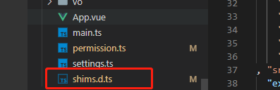

在我呢见中主动声明引入module:

```ts
shims.d.ts:
declare module '@/util/gio.js' // declare module 'xxx'路径或者模块
```
这样就可以引入了


# 5. git的分支管理


### # 5.1 git 的分支管理

>  git所有分支之间彼此互不干扰,各自完成各自的工作和内容,可以在分支使用后道总分支(原分支)上,安全,便捷,不影响其他分支工作


#### 5.2 查看当前工作在哪个分支

```text
git branck
# 返回
# * master
```


#### 5.3 master分支

从项目创建之初,有且唯一的分支就是主分支,如果之后再创建分支,就是一个一个的从分支,主分支叫做master


> Git的master分支并不是一个特殊分支,他就根其他分支完全没有区别;
>
> 之所以几乎每一个仓库都有master分支,是因为git init 命令默认创建它,并且大多数人都懒得去改动他


#### 5.4 HEAD

> 对于一个项目提交了很多个分支,如果有两个分支指向相同提交历史,Git又是怎么知道当前在哪一个分支上  

很简单,它有一个名为HEAD的特殊指针,请注意它和许多其他版本控制系统里的HEAD概念完全不同,它是一个指针, 指向当前所在的本地分支(将HEAD想像为当前分支的别名)

而HEAD所指向的直接关系是当前分支,再找到分支的版本,如下图


#### 5.5 创建分支

> 概念解释

git创建新分支,即再当前未知创建一个指针,比如起名为'从分支dev',然后将HEAD指向dev:

	1. 分支创建好后的提交未知都是再`dev`分支上提交,而之前的总提交`master`分支的提交未知停留在创建从分支`dev`的位置,而`HEAD`会跟随创建的分支,跟随每一次提交不同的先前移动,保持`HEAD指针`的在提交的最前沿
	1. 在`master`上创建的`dev分支`会继承`master分支`的所有提交,通过`git log`可以看出来


> 实际操作

```
# 创建并切换到`dev`分支
git checkout -b dev
```


此时就会又两个分支,并且指向`dev`分支


> 提交分支

当`dev分支`工作完成,需要合并到`master分支`的时候, 也就是**将master指针指向当前dev**位置,并将HEAD指向master,这时dev分支可以直接删除, 也可以不删除,删除的化也只是移除dev指针,只留下一个master指针,对工作去没有任何的影响,也就是曾经做的所有提交操作都不会有影响


> 切换回主分支

```
# 分支切换回主分支master
git checkout master
```


> 合并分支

当分支切换回主分支的时候,可以将dev的修改合并到master分支上,使用:

```
# 合并dev到master
git merge dev
```


> **重点**

这一次合并成之为夸苏合并`fast-forward`,只是将master的指针指向了dev最后一次提交的位置


当分支切换回主分支的master的时候,就可以删除dev分支使用

```
# 删除dev分支
git branch -d dev
```


#### 5.6 小结

查看分支: `git branch`

创建分支: `git branch <name>`

切换分支: `git checkout <name>`

创建+切换分支: `git checkout -b <name>`

合并某分支到当前分支: `git merge <name>`

删除分支: `git breach -d <name>`


#### 5.7 冲突的发生和解决

当同一个文件被两个分支都修改过,想要和并两个分支就会产生冲突,不饿能快速将dev合并到master上, 并且git回提醒"合并过程中产生了冲突, 请修改后再提交"


> 修正的过程

1, 将两个分支的文件,进行对比修改,满足两个分支的提交

2. 使用 git add 和git commit 进行一次新的提交(此时提交的是master分支)
3. 再次合并


> 查看带有冲突解决的日志

```
git log --graph -- pretty=oneline
```


> 分支管理策略

```
通常合并分支时,如果没有冲突,并且分支是单向一条线路继承下来,git回使用fast forword模式, 但是有些快速合并不能成功,但是又没有冲突时, 就回触发分支管理策略,git回自动做一次新的提交
```

当两个分支对工作区都进行了修改,但是修改的并不是同一个文件,而是两个不同的文件,也就是不会产生冲突; 此时合并的时候,不能使用**快速合并**,就会弹框需要你输入一段合并说明,使用快捷键 ctrl + x退出


> 合并时禁止夸苏合并模式

```
# 合并dev到master,禁止快速合并模式,同时添加说明
git merge --no--ff -m '' dev
```

> bug分支

> 描述和说明

使用场景: 当再某个分支上正在工作,突然有一个紧急的bug需要修复,此时可以使用`stash`功能,将当前正在工作的`现场存储起来`,等bug修复之后,在返回继续工作


操作顺序: 

1. 将工作的工作现场临时存储

```
# 对当前现场进行存储
git stash
```


2. 切换到bug出现的分支上,比如bug出现在`master`分支,如果bug就是在``当前分支,可以操作此步骤

```
git checkout master
```


3. 新添加一个bug临时分支

```
git checkout - b bug001
```


4.对代码进行修复


5. 切换回master分支

```
git checkout master
```


6. 合并bug分支到主master上

```git merge --no-ff -m '合并bug分支到master' bug001```

7. 删除bug001分支

```git branch -d bug001```

8. 回到之前的工作现场所在的分支

   ```git checkout dev```

9. 查看当前分支保存那些工作现场(之前封冻存储的工作现场)

```git stash list```


10. 恢复存储的现场

```git stash pop```

### 小结：

修复bug时，通过创建新的bug分支进行修复，然后合并，最后删除。

当手头工作没有做完时，先把工作现场git stash一下，然后去修复bug，修复后，再git stash pop，恢复工作现场。

## 6. 服务端如何识别客户端身份(cookie ,session , token)

### 1. HTTP Basic Auth(早期)

HTTP Basic Auth简单点说明就是每次请求API时都提供用户的Username 和password, 简言之, Basic Auth 时配合 **RESTful API**使用的最简单的认证方式,只提供用户名密码既可,但由于又把用户名密码暴露给第三方的客户端的风险,在生产环境下被使用的越来越少; 因此,在开发时对外开放的RESTful API时, 尽量避免使用HTTP Basic Auth


### 2. Cookie Auth 


Cookie认证机制就是为上一次请求认证服务端对象创建一个session对象匹配来实现状态管理的,默认的,我们关闭浏览器时,cookie回被删除,但可以通过修改cookie 的expire time 使cookie一定时间内有效


但也有不足之处,就是手机可能没有Cookie 跨域使可能发送多次请求使得Cookie不一样


Cookie的分类:

-  Session Cookie: key value形式, 过期时间可设置, 如不设置,则浏览器关掉就消失掉, 存储在内存中,否则就按设置的时间来存贮在硬盘上的,过期后自动清除
- Permennent Cookie: Cookie的主要内容包括: 名字, 值,过期时间,路径和域等


**Session Cookie:** 我们打开一个浏览器访问某个网站,该网站服务器就会返回一个Session Cookie,当我们访问该网站下其他页面时,用该cookie验证我们的身份;座椅我们不需要每个页面都登录,但是,当我们关闭浏览器重新访问该网站时,需要重新登录获取浏览器返回的Cookie,SessionCookie在访问一个网站的过程中,一般时不变化的,有时也会变化,切换不同的权限时,Cookie值回变化


如下, 是Session Cookie的生成和作用


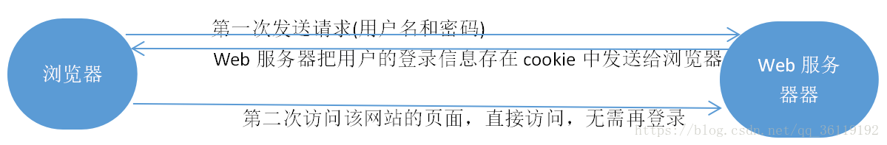


在整个会话过程中,Cookie主要的值是不变化的,某些值会变化;如图是DVWA不同等级之间用户的Session cookie

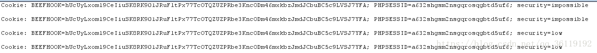

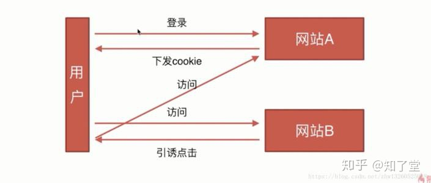


### 3. OAuth 


OAuth(开发授权) 是一个开放的授权标准, 允许用户让第三方应用访问该用户在某一个web服务上存储的私密的资源(如照片,视频,联系人列表),而无需将用户名和密码提供给第三方应用,OAuth允许用户提供一个令牌,而不是用户名和密码来访问他们存放在特定服务器提供者的数据,每一个令牌授权一个特定的第三方系统(例如,视频编辑网站)在特定的时段,(例如接下来的2小时内)访问特定的资源(例如仅仅是某一个相册中的视频)这样OAuth让用户可以授权第三方网站访问他们存储在另外服务提供者的某些特定信息,而非所有内容,譬如,优势登录一个APP可以选择微信登录,


这种基于OAuth的认知机制适用于个人消费类的互联网产品,如社交APP等应用,但是不适合拥有自由认证权限管理的企业应用

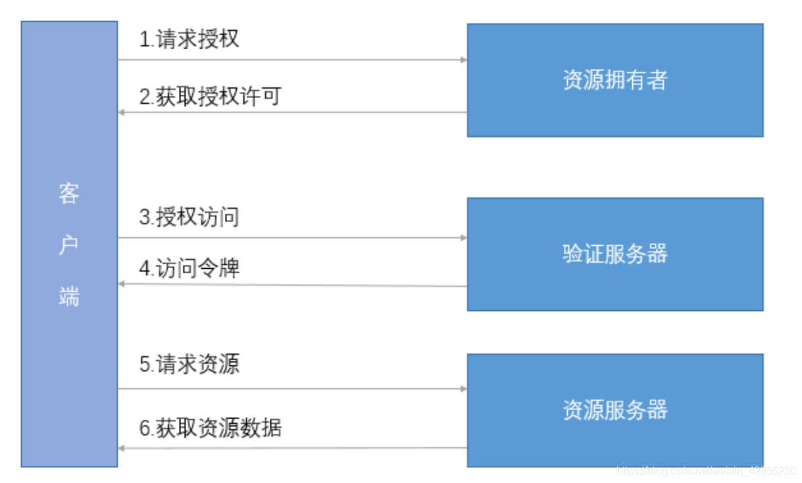


### 4 Token Auth

使用基于Token的身份验证方法,在服务器不需要存储用户的登录记录;

大概的流程是这样的: 

- 客户算使用用户名跟密码请求登录
- 服务算收到请求,去验证用户名面买
- 验证成功后,服务端回签发一个Token,在把这个Token发给客户端
- 客户端收到Token以后可以把它存储起来,比如放入Cookie力
- 客户端每次向服务端请求资源的时候需要带者服务端签发的Token
- 服务端收到请求,然后去验证客户端请求里面带者Token,如果验证成功,就向客户端返回请求的数据
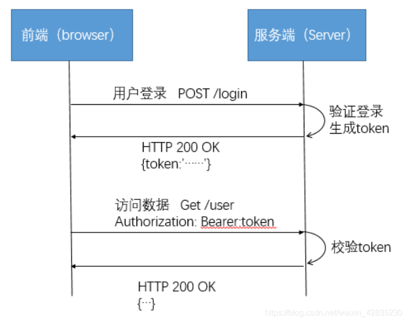


Token Auth的优点: 

- 支持跨域访问:Cookie是不允许跨域访问的,这一点对于Token机制是不存在的,前提是传输的用户认证信息通过HTTP头传输

- 无状态(也称: 服务端可扩展性): Token机制在服务端不需要存储session信息,因为Token自身包含了所有登录用户的信息,只需要在客户端的Cookie或本地介质存储状态信息
- 更适用CDN:可以通过内容分发网络请求你服务端的所有资料(如:JavaScript,HTML,图片等),而你的服务端只要提供API即可
- 去耦: 不需要绑定到一个特定的身份验证方案,Token可以在任何地方生成,只要你的API被调用的时候,你可以进行Token生成调用即可
- 更适用于移动应用: 当你的客户端是一个原生平台(IOS,Android,Windows 8 等)时, Cookie时不被支持的(你需要Cookie容器进行处理)这时采用Token认证机制就会简单得多
- CSRF: 因为不再依赖于Cookie, 所以你就不需要考虑对CSRF(跨站请求伪造)得防范
- 细嫩那个: 一次网络往返时间(通过数据库查询session信息),总比做一次HMACSHA256计算 的Token验证和解析要费时得多.
- 不需要为登录也买你做特殊处理:如果你使用Protractor做功能测试得时候,不再需要为登录页面做特殊处理
- 基于标准化:你的API可以采用标准化得JSON Web Token(JWT)这个标准应景存在多个后端库(.net,Ruby,java,python,php)和多家公司得支持


**Token预防CSRF**

上面利用了Token验证时间Token值放在Cookie中来验证用户登录状态,而我们现在要利用Token来预防CSRF的化,就不能将Token放在啊CSRF中,我们可以如下做: 


当我们访问的网页中含有需要修改数据的地方,后端服务器就会随机发送一个Token值给前端,然后我们修改完数据提交的请求报中,就会有该Token字段,后端提起Token验证登录状态,当我们每次访问该网页或者其他修改数据的网页是,服务端返回的Token值都是不同的,都是随机的,这样可以有效预防CSRF

## 7.  JWT (JsonWebToken)

### 1. 简介

- JWT(Json Web Token)是实现token技术得一种解决方案,JWT由三部分组成`header(头),payload(载体),signature(签名)`
- 头` `HS384 HS512 RS256 RS384 RS512 ES256 ES384 ES512 PS256 PS384``有这几种
- 载体

```
iss：Issuer，发行者
sub：Subject，主题
aud：Audience，观众
exp：Expiration time，过期时间
nbf：Not before
iat：Issued at，发行时间
jti：JWT ID
```


### 2. 利用Nodejs搭建简单得Token验证

```js
const express = require('express');
const jwt = require('jsonwebtoken');
let app = express();
app.listen(5000,()=>{console.log('Server start port 5000')});

app.get('/api' , (req,res) => {
    res.json({
        'status': 200,
        'msg' : '访问成功'
    });
});
app.post('/api/login', (req, res) => {
    /*
        iss:签发人
        iat:签发时间回溯30s
        exp:过期时间 这里可是使用秒数,也可以使用day
        "{"jti":1,"iss":"gumt.top","user":"goolge","iat":1555650413,"exp":1555657613}"
        "iat": ~~(Date.now() / 1000)-30,
        "exp": ~~(Date.now() / 1000)+(60*60),
    */
  const user = {
    "jti": 1,
        "iss": "gumt.top",
        "user": "goolge",
  }
    jwt.sign(user,"secretkey",{ expiresIn: '1day' },(err,token) => {
        res.json({
            token
        })
    })
});

app.post('/api/posts',verifyToken,(req,res) => {
  jwt.verify(req.token, 'secretkey', (err, authData) => {
    if(err) {
       res.sendStatus(403);
      } else {
        res.json({
          message: 'Post created...',
          authData
        });
     }
  });
});
function verifyToken(req, res, next) {
  const bearerHeader = req.headers['authorization'];
  if(typeof bearerHeader !== 'undefined') {
    const bearer = bearerHeader.split(' ');
    const bearerToken = bearer[1];
    req.token = bearerToken;
    next();
  } else {
    res.sendStatus(403);
  }
}
```


##  8. Session认证机制


Session: Session是保存在服务器端的经过加密的存储特定用户会话所需的属性及配置信息的数据,当我们打开浏览器访问某个网站时,session简历,只要浏览器不关闭(也没有时间限制,可以自己设置超时时间)这个网站就可以记录用户的状态, 当浏览器关闭时,session结束


- 浏览器第一次发送请求时,服务器自动生成Session(用户会话所需的属性及配置信息),并且生成了Session ID来唯一标识这个Session,并将其通过响应发送到浏览器,浏览器第二次发送请求会将前一次服务器响应的Session ID放在请求的Cookie中, 并发送到服务器上,服务器从请求中提取Session ID, 并和保存的所有Session ID 进行对比,找到这个用户所对应的Session,从而知道了用户的登录信息, 一般Session ID会有时间限制, 超时后毁掉这个值, 默认30分钟  
- 当用户在应用程序的web页面跳转时,也就是一次会话期间,浏览器不关闭时,Session ID是一直不变的


SessionID除了可以存在Cookie中外, 还可以保存在URL中,作为请求的一个参数(sid)


**Session的一些安全设置:**

- session应该设置时效性,比如半个消失,当用户在半个小时内未操作,即清除session
- 关闭浏览器,即清除session
- 如果应该为了用户体验,只要session一直在适用,则session不失效,这样,当用户cookie被盗后,可能导致session保持攻击,这样的作法是:
  1) 给session设置一个时间,无论该session活动与否,都强制清除session
  2) 和用户的IP,userAgenet等信息变化后,强制清除session


**Session认证和Token认证的区别**

现在大多数网站用户认证都是基于session,即在服务端生成用固话相关的session数据,而发给客户端session_id存放到Cookie中,这样用客户端请求时带上session_id就可以验证服务器端是否存在session数据,以此完成用户认证,可以更好的在服务端对话进行控制,安全性比较高(session_id随机),但是服务端需要存储session数据(如内存或数据库)这样无疑增加维护成本和减弱可扩展性(多台服务器),CSRF攻击一般基于cookie 

基于token的用户认证是一种服务端无状态的认证方式,服务端不用存放token数据,用户验证后,服务端生成一个token(hash或encrypt)发给客户端,客户端可以放到cookie或localStorage中,每次请求在Header中带上token,服务端收到token通过验证后即可确认用户身份,这种方式相对cookie的认证方式就简单一些,服务端不用存储认证数据,易维护扩展性强,token存在localStorage可避免CSRF,不过这中方式在加密或解密的时候可能会有一些性能上的开销(好像也不是很大),有些对称加密存在安全隐患(aes cbc字节翻转攻击)


## 9. 什么是CSRF

### 1 什么是CSRF

CSRF(Cross-Site Request Forgery)也被称为 one-click attack 或者 session tiding即跨站请求伪造攻击


那么CSRF嫩巩固干什么? CSRF是一种挟制用户在当前已登录的web应用程序上执行非本意的操作的攻击方法,可以简单理解为:攻击者可以盗用你的登录信息,以你的身份模拟发送各种请求对服务器按理说这个请求是完全合法的,但是却完成了攻击者所期望的一个操作,比如以你的名义发送邮件,发消息,盗取你的账号,太你家系统管理员,甚至于购买商品,虚拟货币转账等;攻击者只要借助少许的社会工程学的轨迹,例如通过QQ等聊天软件发送的链接(有些还伪装称短域名,用户无法分辨),攻击者就能迫使web应用的用户去执行攻击者预设的操作


所以遇到CSRF攻击时,将对中断用户的数据和操作指令构成严重的威胁; 当受攻击的终端用户具有管理员账户的时候,CSRF攻击危机整个web应用程序

### 2 CSRF原理

1. 用户C打开浏览器,访问受信任网站A,输入用户名和密码请求登录网站A

2. 在用户信息通过验证之后,网站A长生Cookie信息并返回给浏览器,此时用户登录网站A成功,可以正常发送请求到网站A
3. 用户未退出网站A之前,在同一个浏览器中,打开一个TAB页访问网站B
4. 网站B接受到用户请求后,返回一些攻击代码,并发送一个请求要求访问呢第三方站点A
5. 浏览器在接收到这些攻击性代码后,根据网站B的请求,在用户不知情的情况下携带Cookie信息,向网站A发出请求,网站A并不知道该请求其实是由B发起的,所以会根据用户C的cookie信息以C的权限处理该请求,导致来自网站B的恶意代码被执行


**CSRF 攻击的三个条件**

1. 用户已经登录了站点A,并在本地记录了Cookie

2. 在yoghurt没有退出站点A的情况下,(也就是cookie生效的情况下),访问了恶意攻击者提供的引用危险站点B(B站要求访问站点A)

3. 站点A没有做任何CSRF防御

   

   

   ### 3 CSRF的防御方法

   1. **CSRF漏洞检测:**

      检测CSRF漏洞最简单的方法就是抓取一个正常请求的数据包,去掉Referer字段后再重新提交,如果该提交还有效,那么基本上可以确定存在CSRF漏洞

   

   ​	对着对CSRF漏洞研究的不断深入,不断涌现出一些专门针对CSRF漏洞进行检测的工具，如CSRFTester，CSRF Request Builder等。

   

   以CSRFTester工具,CSRF漏洞检测工具的测试原理如下：使用CSRFTester进行测试时，首先需要抓取我们在浏览器中访问过的所有链接以及所有的表单等信息，然后通过在CSRFTester中修改相应的表单等信息，重新提交，这相当于一次伪造客户端请求。如果修改后的测试请求成功被网站服务器接受，则说明存在CSRF漏洞，当然此款工具也可以被用来进行CSRF攻击。


2. **防御CSRF攻击**

​		CSRF的防御可以从**客户端**和**服务端**两方面着手,防御效果是从服务端着手效果比较好,现在一般的CSRF的防御也都在服务端进行;


CSRF工具防御主要分为3中方法:

1. 验证HTTP Referer字段
2. 在请求地址中添加 token 并验证
3. 在HTTP头中自定义属性并验证(


#### 1. 服务端防御

服务端的预防CSRF攻击的方式有多种,但思路上都是差不多的,主要从以下两个方面入手: 1) 正确使用GET,POST请求和cookie 2),在非GET请求种添加token并验证


1.**遵循标准的get动作**

只允许GET请求检索数据,但是不允许它修改服务器上的任何数据,整个修改可以防止利用``标签或者其他的类型的GET请求的CSRF攻击;另外这个建议遵循RFC 2616(HTTP/1.1)：具体说来，按照约定，GET和HEAD方法不应该进行检索之外的动作。这些方法应该被认为是“安全的”。虽然这个保护措施无法阻止CSRF本身，因 为攻击者可以使用POST请求，但是它却可以与(2)结合来全面防止CSRF漏洞。这里，我们假定对手无法修改用户的cookie。

2. **为页面增加随机数**

   当用户访问站点时，该站点应该生成一个（密码上很强壮的）伪随机值，并在用户的计算机上将其设为cookie。站点应该要求每个表单都包含该伪随机 值（作为表单值和cookie值）。当一个POST请求被发给站点时，只有表单值和cookie值相同时，该请求才会被认为是有效的。当攻击者以一个用户的名义提交表单时，他只能修改该表单的值。攻击者不能读取任何发自该服务器的数据或者修改cookie值，这是同源策略的缘故。这意味着，虽然攻击者可以用表单发送任何他想要的值，但是他却不能修改或者读取存储在该cookie中的值。因为cookie值和表单值必须是相同的，所以除非攻击者能猜出该伪随机值，否则他就无法成功地提交表单。

3. **在非GET请求种增加Token并验证**

   CSRF 攻击能够成功，是因为黑客可以完全伪造用户的请求，该请求中所有的用户验证信息都是存在于 cookie 中，因此黑客可以在不知道这些验证信息的情况下直接利用用户自己的 cookie 来通过安全验证。要抵御 CSRF，关键在于在请求中放入黑客所不能伪造的信息，并且该信息不存在于 cookie 之中。可以在 HTTP 请求中以参数的形式加入一个随机产生的 token，并在服务器端建立一个拦截器来验证这个 token，如果请求中没有 token 或者 token 内容不正确，则认为可能是 CSRF 攻击而拒绝该请求。

   这种方法要比检查 Referer 要安全一些，token 可以在用户登陆后产生并放于 session 之中，然后在每次请求时把 token 从 session 中拿出，与请求中的 token 进行比对，但这种方法的难点在于如何把 token 以参数的形式加入请求。对于 GET 请求，token 将附在请求地址之后，这样 URL 就变成` url?csrftoken=tokenvalue`。 而对于 POST 请求来说，要在 form 的最后加上 ，这样就把 token 以参数的形式加入请求了。但是，在一个网站中，可以接受请求的地方非常多，要对于每一个请求都加上 token 是很麻烦的，并且很容易漏掉，通常使用的方法就是在每次页面加载时，使用 javascript 遍历整个 dom 树，对于 dom 中所有的 a 和 form 标签后加入 token。这样可以解决大部分的请求，但是对于在页面加载之后动态生成的 html 代码，这种方法就没有作用，还需要程序员在编码时手动添加 token。

   该方法还有一个缺点是难以保证 token 本身的安全。特别是在一些论坛之类支持用户自己发表内容的网站，黑客可以在上面发布自己个人网站的地址。由于系统也会在这个地址后面加上 token，黑客可以在自己的网站上得到这个 token，并马上就可以发动 CSRF 攻击。为了避免这一点，系统可以在添加 token 的时候增加一个判断，如果这个链接是链到自己本站的，就在后面添加 token，如果是通向外网则不加。不过，即使这个 csrftoken 不以参数的形式附加在请求之中，黑客的网站也同样可以通过 Referer 来得到这个 token 值以发动 CSRF 攻击。这也是一些用户喜欢手动关闭浏览器 Referer 功能的原因。

   一般而言，普通的 Web 应用都是以 GET、POST 请求为主，还有一种请求是 cookie 方式。我们一般都是按照如下规则设计应用的请求：

   1、 GET 请求常用在查看，列举，展示等不需要改变资源属性的时候（数据库 query 查询的时候）

   2、 POST 请求常用在 From 表单提交，改变一个资源的属性或者做其他一些事情的时候（数据库有 insert、update、delete 的时候）

4. **检查 HTTP Referer 字段**

HTTP头中有一个Referer字段，这个字段用以标明请求来源于哪个地址。在处理敏感数据请求时，在通常情况下，Referer字段应和请求的地址位于同一域名下，比如需要访问 [http://bank.example/withdraw?account=bob&amount=1000000&for=Mallory](https://link.zhihu.com/?target=http%3A//bank.example/withdraw%3Faccount%3Dbob%26amount%3D1000000%26for%3DMallory)，用户必须先登陆 bank.example，然后通过点击页面上的按钮来触发转账事件。这时，该转帐请求的 Referer 值就会是转账按钮所在的页面的 URL，通常是以 bank.example 域名开头的地址。而如果黑客要对银行网站实施 CSRF 攻击，他只能在他自己的网站构造请求，当用户通过黑客的网站发送请求到银行时，该请求的 Referer 是指向黑客自己的网站。因此，要防御 CSRF 攻击，银行网站只需要对于每一个转账请求验证其 Referer 值，如果是以 bank.example 开头的域名，则说明该请求是来自银行网站自己的请求，是合法的。如果 Referer 是其他网站的话，则有可能是黑客的 CSRF 攻击，拒绝该请求。

这种方法的显而易见的好处就是简单易行，网站的普通开发人员不需要操心 CSRF 的漏洞，只需要在最后给所有安全敏感的请求统一增加一个拦截器来检查 Referer 的值就可以。特别是对于当前现有的系统，不需要改变当前系统的任何已有代码和逻辑，没有风险，非常便捷。

然而，这种方法并非万无一失。Referer 的值是由浏览器提供的，虽然 HTTP 协议上有明确的要求，但是每个浏览器对于 Referer 的具体实现可能有差别，并不能保证浏览器自身没有安全漏洞。使用验证 Referer 值的方法，就是把安全性都依赖于第三方（即浏览器）来保障，从理论上来讲，这样并不安全。事实上，对于某些浏览器，比如 IE6 或 FF2，目前已经有一些方法可以篡改 Referer 值。如果 bank.example 网站支持 IE6 浏览器，黑客完全可以把用户浏览器的 Referer 值设为以 bank.example 域名开头的地址，这样就可以通过验证，从而进行 CSRF 攻击。

即便是使用最新的浏览器，黑客无法篡改 Referer 值，这种方法仍然有问题。因为 Referer 值会记录下用户的访问来源，有些用户认为这样会侵犯到他们自己的隐私权，特别是有些组织担心 Referer 值会把组织内网中的某些信息泄露到外网中。因此，用户自己可以设置浏览器使其在发送请求时不再提供 Referer。当他们正常访问银行网站时，网站会因为请求没有 Referer 值而认为是 CSRF 攻击，拒绝合法用户的访问。


5. **在HTTP头种自定义属性并验证**

   这种方法也是使用token并进行验证,和上一个方法不同的是,这里并不是把token以参数置于HTTP请求之中,而是把它放到HTTP头种自定义的属性力,通过XMLHttpRequest这个类,可以一次性给所有该类请求加上csrftoken这个这个HTTP头属性,并把token值放入其中,这样解决了上中方法在请求种加如token的不便,同时通过XMLHttpRequest请求的地址不会被记录到浏览器的地址栏,也不用担心token会透过Referer泄露到其他网站种去

   然而这种方法的局限性非常大,XMLHttpRequest请求通常用于Ajax犯法种对于也买你局部的异步刷新,并非所有的请求都适用这个类来发起请求,而且通过该类请求得到的页面不能被浏览器所记录下,从而进行前进后退刷新收藏等操作,给用户带来不变,另外对于没有进行CSRF防护的遗留系统来说,要采用这种方法来进行防护,要把所有请求都改为XMLHttpRequest请求,这样几乎是要重写整个网站,这代价无疑是不能接受的


### 2. 客户端防御


由于是攻击者成功地执行SCRF攻击的请求是由浏览器发起的,所以可以创建客户端攻击来保护用户不受此种攻击,现有的RequestRodeo通过在客户端和浏览器之间来充当代理来防止CSRF攻击.如果RequestRodeo发现了一个它认为是非法的请求，它会从该请求剥离验证信息。虽然这种方 式在很多情况下都能有效，但是它具有一些局限性。具体地说，当客户端使用了SSL认证或者使用JavaScript生成部分页面（因为 RequestRodeo分析的是在浏览器显示之前的流经代理的那些数据）时，它就不起作用了。

人们已经开发了一个浏览器插件，不仅可以使用户可以免受某些类型的CSRF攻击，并且还能克服以上所述的局限性，这个工具是作为Firefox浏览器的扩 展实现的，其地址是[http://www.cs.princeton.edu/](https://link.zhihu.com/?target=http%3A//www.cs.princeton.edu/)˜wzeller/csrf/protector/。 为了有效地防范CSRF攻击，用户需要下载安装这个扩展。该扩展会拦截所有的HTTP请求，并判断是否允许该HTTP请求。这个判断要用到下列规则。

首先，POST请求之外的任何要求都是允许的。第二，如果发出请求的站点和目标站点符合同源策略的要求，那么该请求被允许。第三，如果发出请求的站点被允许 使用Adobe的跨域政策来建立一个请求的话，那么该请求也会被允许。如果我们的扩展拒绝一个请求，该扩展会通过一个常见的界面来提示用户（即 Firefox所使用的popup blocker）该请求已经被阻止，并且让用户选择是否将站点添加到一个白名单中。

该扩展仅仅拦截POST请求。这意味着，它无法保护用户免受使用GET请求的CSRF攻击 阻止这种类型的攻击的唯一方法是不允许任何跨域GET请求，或只允许用户一次只能登录到一个站点，但是这两个限制可能是用户无法忍受的。


## Vite VS Webpack?


### Webpack


Webpack是一个基于打包器的构建工具,同一个入口文件的diamagnetic回打包成一个Bundle文件,Webpack长期依赖的一个痛点是对于大规模应用的穷的那个和热更新速度很慢

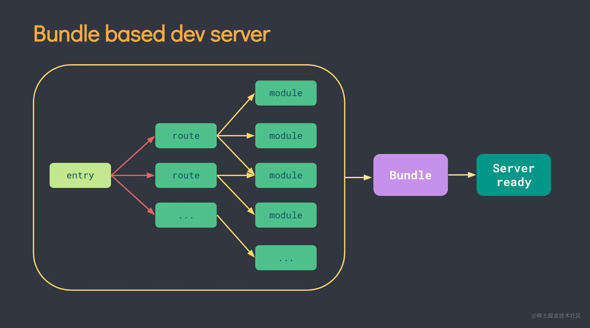


当文件发生改动时,整个JavaScript Bundle文件回被Webpack重新构建,这也是为什么使用Webpack的大规模应用在应用启动和热更新速度很慢的原因,这给他进行大规模JavaScript应用的开发者造成和差的开发体验


**Webpack如何工作?**


Webpack打包过程:


- 从一个入口文件开始,基于代码文件中的所有`import`,`export`,`require`构建依赖树;
- 编译JS/CSS等模块
- 使用算法排序,重写,连接代码;
- 优化


开发环境的Webpack;

- 打包所有代码;
- 启动`webpack-dev-server`托管打包好的代码;
- 启动`websocket`处理热更新HMR


应用规模越大,启动和热更新代码越慢, 即时启动了热更新, 每次代码变更也需要重新生产Bundle文件


### Vite

Vite 是旨在在提高开发者体验的下一代JavaScript构建工具,核心借助了浏览器的原生ES Modules 和想esbuild这样的将代码编译称native code的打包工具


Vite主要有两方面组成:


- 一个开发服务器,基于ESM提供丰富的内建能力,比如速度快到惊人的模块热更新(HMR)

- 一套构建指令,使用rollup进行代码打包,且零配置即可输出用于生产环境的高度优化的静态代码;


Vite的核心和`webpack` + `webpack-dev-server` 相似,但是在开发者体验上有一些提升:

- 无论项目大小有多大,启动应用都只需要更少时间
- 无论项目大小有多大, `HMR(Hot Module Replacing)`热更i性能都可以做到及时响应;
- 按需编译;
- 零配置,开箱即用
- Esbuild能力带来的Typescript/jsx的原生支持


大型的JavaScript项目在开发和生产环境有比较差的性能表现,往往是因为我们使用的构建工具没有充分做到并行处理,内存优化和缓存


**核心理念: Bundless开发环境构建**

浏览器的原生ES Modules能力允许在不讲代码打包到一起得情况下运行JavaScript应用,为浏览器按需提供ES Module文件,浏览器获取ES Model文件会直接执行


**应用启动**

Vite将应用中得模块分为依赖和源码两类,分别进行服务器启动时间得优化


- 依赖模块,开发过程中基本不会变化,Vite对依赖采用了esbuild预构建得方式,esBuild使用Go编写,并且比JacaScript编写得打包器预构建依赖快10-100倍
- 源码模块,是开发的代码,会经常变动


Vite在浏览器请求时按需转换并以原生ESM方式提供源码,让浏览器接管了打包程序的部分工作


#### Vite如何工作

Vite通过原生ES Modules托管原代码,本质上是让浏览器来接管部分打包器的工作,Vite只会在浏览器请求发生时,按需将源码转成ES Modules 格式返回给浏览器,由浏览器加载并ES Modules文件

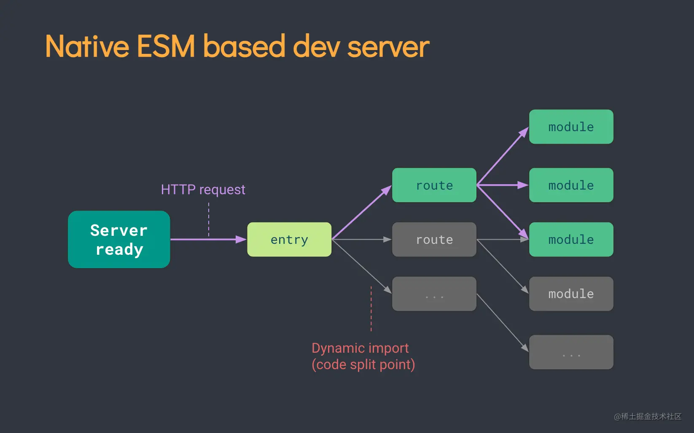


**热更新**  

在基于Bundle构建的构建器中,当一个文件变动时,重新狗i按整个Bundle文件是非常低效的,且随着应用规模的上升,构建速度会直线下降;


传统的构建器虽然提供了热更新的能力,但是也会存在随着应用规模上升,热更新速度显著下降的问题,


Vite基于ESM按需提供源码文件,当一个文件被编辑后,Vite重新编译并提供该文件,因此,无论项目规模多大,Vite的热更新都可以保持快速更新;


此外,Vite合理利用浏览器缓存来加速页面加载,源码模块请求 `304 not modified`进行协商;依赖模块请求通过 `Cache-Control: max-age=31536000,immutable `进行强缓存，因此一旦缓存，不会再次请求。


**生产环境仍需打包**  

在生产环境使用 ESM 会存在大量额外网络请求问题，因此生产环境不太试用 ESM，最好的方式还是代码进行 tree-shaking、懒加载、和 chunk 分隔等。

那么生产环境的构建为什么不直接使用 esbuild，而是使用 rollup 呢？这是因为 esbuild 在代码分隔、css 处理等方面的功能仍在开发中，rollup 在应用打包方面更加的成熟且灵活。


**性能提升**

Vite 依托支持原生 ESM 模块的现代浏览器，极大的降低了应用的启动和重新构建时间。Vite 本质上是一个在开发环境为浏览器按需提供文件的 Web Server，这些文件包含源码模块和在第一次运行时使用 esbuild 预构建的依赖模块。

Vite 和 Webpack 的主要不同在于开发环境下对于源码如何被托管以及支持哪种模块规范。


**依赖预构建**

Vite 在首次启动时，会进行依赖预构建。依赖预构建有两个目的：

- CommonJs 和 UMD 的兼容性：开发阶段，Vite 的 Dev Server 将所有代码视为原生 ES 模块。因此，Vite 必须将 CommonJS 或 UMD 发布的依赖项转为 ESM。
- 性能：Vite 将有很多内部模块的依赖视为单个模块，以提升页面加载性能。比如，`lodash-es` 拥有超过 600 个内部模块，当 `import {debounce} from 'lodash-es';` 时，浏览器会同时发起超过 600 个请求，并行请求过多将会显著影响页面加载性能。因此预构建将 `lodash-es` 视为一个模块，浏览器只需要发起一个请求。


#### **缓存**


**文件系统缓存**

Vite 会将预构建的依赖缓存到 `node_modules/.vite` ，它根据几个源决定是否需要重新运行预构建步骤：

- `package.json` 中的 `dependencies` 列表；
- 包管理的 `lockfile`，例如 `package-lock.json`，`yarn.lock` 或者 `pnpm-lock.yaml`
- 可能在 `vite.config.js` 相关字段中配置过的。

只有在上述其中一项发生更改时，才需要重新运行预构建。

如果处于某些原因，你想要强制 Vite 重新构建依赖，你可以用 `--force` 命令选项启动开发服务器，或者手动删除 `node_modules/.vite` 目录。

**浏览器缓存**

解析后的依赖请求会以 HTTP 头 `max-age=31536000,immutable` 强缓存，以提高开发时的页面重载性能。如果你想通过本地编辑来调试依赖项，可以：

- 通过浏览器调试工具的 Network 选项卡暂时禁用缓存；
- 重启 `Vite Dev Server`，并添加 `--force` 命令以重新构建依赖；
- 重新载入页面


**TypeScript原生支持**

Vite 天然支持引入 .ts 文件，单仅支持 .ts 文件的转译工作，并不执行任何类型检查。

Vite 使用 esbuild 将 TypeScript 转译到 JavaScript，约是 tsc 速度的 20-30 倍，同时 HMR 更新到浏览器的时间小于 50 ms。


#### 对比

> **WebPack**
>
> - 支持的模块规范：ES Modules，CommonJS 和 AMD Modules；
> - Dev Server：通过 `webpack-dev-server` 托管打包好的模块；
> - 生产环境构建：webpack
>
> **Vite**
>
> - 支持的模块规范：ES Modules；
> - Dev Server：原生 ES Modules；
> - 生产环境构建：Rollup


总结: 

由于浏览器原生ES Modules的支持,当浏览器发出请求时，Vite 可以在不将源码打包为一个 Bundle 文件的情况下，将源码文件转化为 ES Modules 文件之后返回给浏览器。这样 Vite 的应用启动和热更新 HMR 时的速度都不会随着应用规模的增加而变慢。


##  RESTful接口规范

### 1 什么是API(应用程序接口)

1. 概念

   API, 因为全称Application Programming Interface, 翻译位"应用程序编程接口";就是将一些功能(逻辑)封装称组件,目的是提供一个应用接口给其他程序开发人员访问,而这些人员不需要访问源码以及理解内部工作原理就可以直接使用

2. **举例**

   在WEB项目中A应用暴露了一个请求映射方法,B应用通过调用这个请求映射方法从而得到对应功能(请求映射方法赋予的功能)


### 2 传统模式和前后端分离模式对比

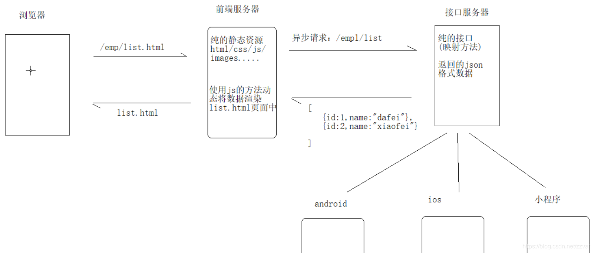


1. **传统开发模式**

   在传统开发模式中,前端写好静态的HTML也米娜交给后端开发,后端把html宣称或重定向到前端页面;这样前端页面看到的效果都是由后端控制的,也就是后端需要控制前端的展示,这样会出现很多问题

**弊端**

	1. 前后端耦合严重,前端会嵌入后端代码,导致代码混乱,可维护性差
	1. 开发出的软件响应速度慢,质量差,用户体验差
	1. 开发人员需要前后端兼顾,开发效率地下,开发周期变长
	1. 与前端开发人员之间沟通成本高,前后端开发进度互相影响,从而大大降低开发效率


2. **前后端分离模式**

​	前后端分离并不只是开发模式,也是web应用的一种架构模式,在开发阶段,前后端人员约定好数据交互接口,即可并行开发与测试


前端开发完成可以肚子进行mack测试,后端也可以使用postman灯接口测试工具进行测试,最后可进行多功能联调测试


说通俗点就是后端项目里面看不到页面(JSP/HTML),后端给前端提供接口,前端调用后端提供的REST风格接口就行,前端专注写页面(html|JSP)和渲染(JS|CSS|各种前端框架);后端专注写代码就行,**前后端分离的核心:后台提供数据,前端负责显示**


- 优点
  - 可以实现真正的前后端解耦,前后端可以并行开发与测试,提高开发效率
  - 见到好后端服务的并发/负载压力,提高系统的性能
  - 异步加载的方式,可以很好的应对复杂多变的前端需求
  - 前后端代码不再混乱,增强了代码的可维护性


### 3 RESTful风格

1. **概念**

RESTful是一种网络应用程序的设计风格和开发方式,**基于HTTP,可以使用XML格式定义或JSON格式定义**,最常用的数据格式是JSON,由于JSON能直接被JavaScript读取,所以使用JSON格式的REST风格的API具有简单,易读,易用的特点


2. **资源**

   **REST面向资源的**,每个资源都有一个唯一的资源定位符(URI),每个URI代表一种资源(resource);所以URL中不能有动词,只能有名词,而且所有的名词往往与数据库的表名对应;一般来说,数据库中的表都是同种记录的"集合(collection)",所以URI种的名词也应该使用复数

**例如**

```java
//查询所有员工
@RequestMapping(value='/employees', method = RequestMethod.GET)
@ResponseBody
public List<Employee> list(){
    ...
        
}
```


3. **请求方式**

| 请求方式       | 含义                               |
| -------------- | ---------------------------------- |
| GET(SELECT)    | 从服务器取出资源(一项或多项)       |
| POST(CREATE)   | 在服务器新建一个资源               |
| PUT(UPDATE)    | 在服务器更新资源(更新完整资源)     |
| PATCH(UPDATE)  | 在服务器更新资源,PATCH更新个别属性 |
| DELETE(DELETE) | 从服务器删除资源                   |


4. **传统模式URI  和 RESTful 风格对比**


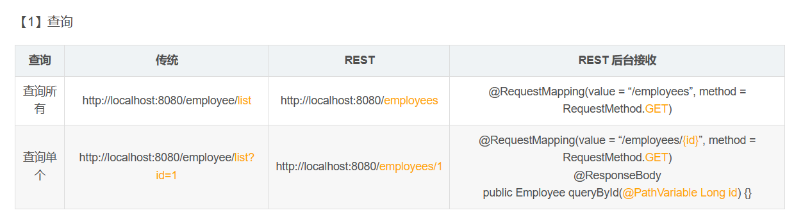

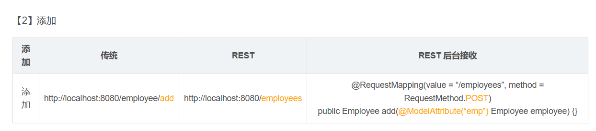

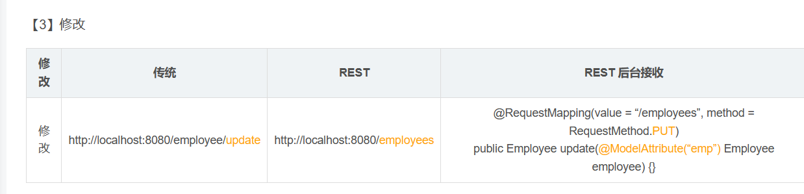

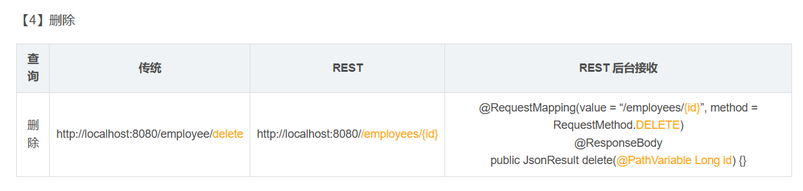


**注意**

> 当参数非常多的时候,不建议使用参数路径方法
>
> 如果参数名非常民反,建议使用参数路径方式,可以隐藏参数名


5. **返回值-按需决定**

   GET /collection：返回资源对象的列表（数组）
   GET /collection/resource：返回单个资源对象
   POST /collection：返回新生成的资源对象
   PUT /collection/resource：返回完整的资源对象
   PATCH /collection/resource：返回完整的资源对象
   DELETE /collection/resource：返回一个空文档

6. HTTP响应状态码

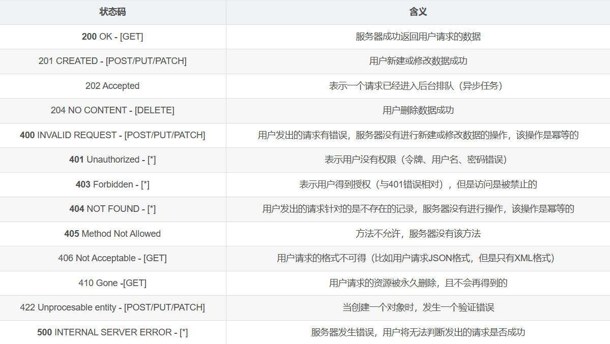


7. 同一资源具有多种表现形式(xml,json等)

   比如,文本可以用txt格式表现,也可以使用HTML格式,XML格式,JSON格式表现,甚至可以采用二进制格式;图片可以用JPG格式表现,也可以使用JSP格式表现


​	它的具体表形式,应该在HTTP请求的同信息中Accept和Content-Type字段决定,这两个字段才是对"表现"的描述


accept: application/json

content-type:application/json


- Accept与Content-Type的区别

> 
>
> 
>
> 1. Accept属于请求投,Content-Type属于实体头
>
> Http报头分为通用报头,请求报头,响应报头和实体报头
>
> 
>
> 请求方的http报头结构: 通用报头|请求报头|实体报头
>
> 响应方的http报头结构: 请求报头|响应报头|实体报头
>
> 
>
> 2. accept代表发送端(客户端)希望结构的数据类型
>
>    比如:Accept:application/json
>
>    **代表客户端希望接受的数据类型是JSON类型,后台返回JSON数据**
>
> 3. Content-Type代表发送端(客户端|服务器)发送的实体数的数据类型,
>
>    比如:Content-Type:application/json
>
>    **代表发送端发送的数格式是JSON,后台就要以这种格式来接受前端发送过来的数据**


8.**使用Ajax来发送各种请求方法的请求**

```js
$.get('/employees',function(){})

$.post('/employees',params,function(){})

$.ajax({
	url:"/employees/1",
    type:"put",
    data:params
	success:function(){}
})

$.ajax({
	url:"/employees/1",
    type:"DELETE",
	success:function(){}
})

```


## GraphQL?

**简介**: 

`GraphQL`来自Facebook,`GraphQL`是一门查询语言(Query Language)

,同样和`SQL`一样的是,`GraphQL`也是一套规范 与`SQL`不同的是,`SQL`1的数据源是数据库,而`GraphQL`的数据源可以是各种各样的`REST API`可以是各种服务/微服务,甚至可以是数据库

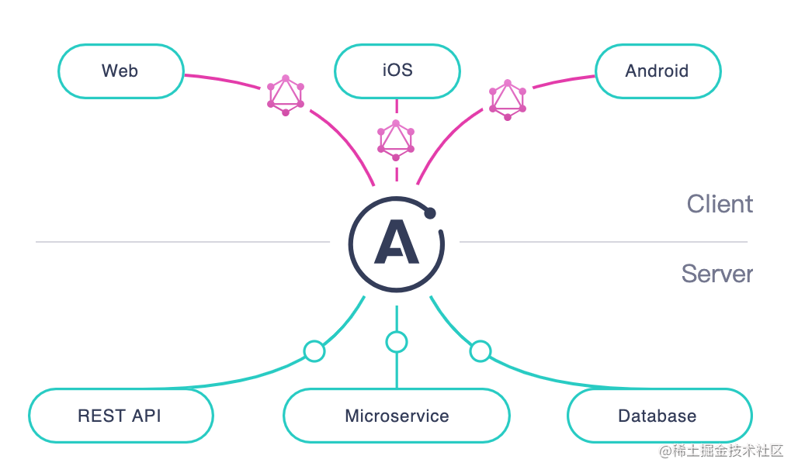


## 面试时候项目架构? 

项目分几个模块，
每个模块的功能，
需求是什么，
有什么难题。

## ci/cd流 ?


