# 第一次面试总结


- [第一次面试总结](#第一次面试总结)
  - [1. react和vue怎么创建虚拟dom?](#1-react和vue怎么创建虚拟dom)
  - [2. diff算法](#2-diff算法)

## 1. react和vue怎么创建虚拟dom?   

**什么是虚拟DOM?**  
Virtual DOM是一颗以JavaScript对象作为基础的树,每一个节点称为VNode,用对象属性来描述节点,实际上它是一层真实DOM的抽象,最终可以通过渲染操作使这棵树映射到真实环境上,简单来说Virtual DOM就是Js对象,用以描述整个文档

**什么是真实DOM?**  
Real DOM,真实DOM,意思为文档对象模型,是一个结构化文本对象的抽象,在页面渲染出来的每一个结点都是一个真实DOM结构,如下:
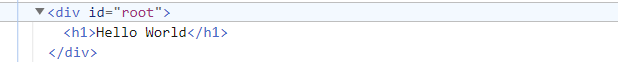

**怎么将虚拟DOM转换成真实DOM?**
react和vue一样,都通过createElement的方式将虚拟dom转换为真实dom

**虚拟DOM作用**  
虚拟DOM的最终目标是将虚拟节点渲染到视图上,但是如果直接使用虚拟节点覆盖旧节点的化,会有很多不必要的DOM操作  

```text
例如，一个ul标签下很多个li标签，其中只有一个li有变化，这种情况下如果使用新的ul去替代旧的ul,因为这些不必要的DOM操作而造成了性能上的浪费。
```
为了避免不必要的DOM操作,虚拟DOM在虚拟节点映射到视图的过程中,将虚拟节点与上一次渲染视图所使用的旧虚拟节点(oldVnode)做对比,找出真正需要更新的节点来进行DOM操作,从而避免操作其他无需改动的DOM

虚拟DOM在Vue.js主要做了两件事情:  

- 提供与真实DOM节点所对应的虚拟节点vnode
- 将虚拟节点vnode和旧虚拟节点oldVnode进行对比,然后更新视图

**真实DOM与虚拟DOM的区别**  

- 虚拟DOM不会进行排版与重绘操作,而真实DOM会频繁重拍与重绘  
- 虚拟DOM的总损耗是"虚拟DOM增删改+真实DOM差异增删改+排版与重绘",真实DOM的总损耗是"真实DOM完全增删改+排版与重绘"  
  
```text
  传统的原生 api 或 jQuery 去操作 DOM 时，浏览器会从构建 DOM 树开始从头到尾执行一遍流程

当你在一次操作时，需要更新 10 个 DOM 节点，浏览器没这么智能，收到第一个更新 DOM 请求后，并不知道后续还有 9 次更新操作，因此会马上执行流程，最终执行 10 次流程

而通过 VNode，同样更新 10 个 DOM 节点，虚拟 DOM 不会立即操作 DOM，而是将这 10 次更新的 diff 内容保存到本地的一个 js 对象中，最终将这个 js 对象一次性 attach 到 DOM 树上，避免大量的无谓计算
```


**真实DOM与虚拟DOM优缺点**

真实DOM的优势:
- 易用
  

缺点:
- 效率低,解析速度慢,内存占用量过高
- 性能差: 频繁操作真实DOM,易于导致重绘与回流  
  

使用虚拟DOM的优势如下:

- 简单方便: 如果使用手动操作真实DOM来完成页面,繁琐又容易出错,在大规模应用下维护起来也很困难  
- 性能方面: 使用Virtual DOM能够有效避免真实DOM树频繁更新,减少多次引起重绘与回流, 提高性能
- 跨平台: React借助虚拟DOM,带来了跨平台的能力,一套代码多端运行  

缺点:  

- 在一些性能要求极高的应用中虚拟DOM无法进行针对性的极致优化
- 首次渲染大量DOM时,由于多了一层虚拟DOM的计算,速度比正常稍慢
  


## 2. diff算法

1. 是什么  

diff算法就是进行虚拟节点对比，并返回一个patch对象，用来存储两个节点不同的地方，最后用patch记录的消息去局部更新Dom。

简单来说Diff算法就是在虚拟DOM树从上至下进行同层比对，如果上层已经不同了，那么下面的DOM全部重新渲染。这样的好处是算法简单，减少比对次数，加快算法完成速度。


其有两个特点:  

- 比较只有会在同层级进行,不会跨层级比较
- 在diff比较的过程中,循环从两边向中间比较

diff算法在很多场景都有应用, 在vue中,作用域虚拟dom渲染成真实dom的新旧VNode节点比较


2. 从源码来分析diff算法

  

  vue在通过VNode节点渲染DOM时,并不是通过当前的VNode节点去暴力的更新DOM节点,

  而是对新旧两个VNode节点通过pathc算法进行比较,然后通过对比结果找出差异的节点进行按需更新;

  patch能够减少不必要的开销,提升性能

  

  patch的过程中主要完成以下几件事情:

  - 创建需要新增的节点,

  - 移除已经废弃的节点

  - 移动或修改需要更新的节点

  

  **及其重要的pathc函数**

  

  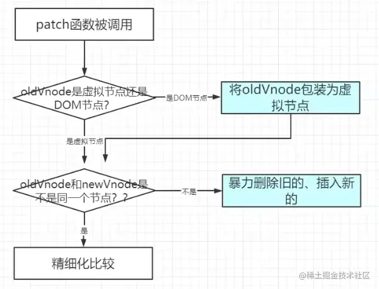

这就是源码中: `patch`做的工作,具体呢,里面又含有`sameVnode`函数

```javascript
export function isSameVNodeType(n1: VNode, n2: VNode): boolean {
  return n1.type === n2.type && n1.key === n2.key
}

```

> 即: `旧节点的key`要和`新节点的key`相同,且旧节点的选择器要和新节点的选择器相同


**Vue3 的 patch 优化 -- patchFlag**


>  pathcFlags是什么? 


```ts
export const enum PatchFlags {
  // 动态文字内容
  TEXT = 1,

  // 动态 class
  CLASS = 1 << 1,

  // 动态样式
  STYLE = 1 << 2,

  // 动态 props
  PROPS = 1 << 3,

  // 有动态的key，也就是说props对象的key不是确定的
  FULL_PROPS = 1 << 4,

  // 合并事件
  HYDRATE_EVENTS = 1 << 5,

  // children 顺序确定的 fragment
  STABLE_FRAGMENT = 1 << 6,

  // children中有带有key的节点的fragment
  KEYED_FRAGMENT = 1 << 7,

  // 没有key的children的fragment
  UNKEYED_FRAGMENT = 1 << 8,

  // 只有非props需要patch的，比如`ref`
  NEED_PATCH = 1 << 9,

  // 动态的插槽
  DYNAMIC_SLOTS = 1 << 10,

  // SPECIAL FLAGS -------------------------------------------------------------

  // 以下是特殊的flag，不会在优化中被用到，是内置的特殊flag

  // 表示他是静态节点，他的内容永远不会改变，对于hydrate的过程中，不会需要再对其子节点进行diff
  HOISTED = -1,

  // 用来表示一个节点的diff应该结束
  BAIL = -2,
}
```

以上就是所有的pathcFlags, 和它的名字含义一致, 他就是一系列的标志,来表示要给节点该如何进行更新的


使用 `class = 1 << 1`这样的方式来表示的好处:


1. 很容易进行符合, 可以通过`TEXT|CLASS`来得到`0000000011`这个可以表示他既有`TEXT`的特性,也有`CLASS`的特性

2. 方便进行对比,我们拿到一个值`FLAG`的时候,想要判断它有没有`TEXT`的属性,只需要`FLAG&TEXT>0`就可以了
3. 方便扩展, 子啊足够位数的情况下,我们新增一种特性就之哟啊让他左移的位数加一就不会重复

这种方式起始很常见,比如我们做一个系统的权限管理的时候也会考虑这么做,在REACT里面这种凡是也有很多应用

> patchFlags有什么用?

首先,在`creawteVnode`的时候,会把`patchFlags`相关的参数都放到`vnode`对象里面:

```typescript
const vnode: VNode = {
  // ... other vnode attrs
  patchFlag,
  dynamicProps,
  dynamicChildren: null,
};
```

那他们啥时候被用到呢,主要是在节点被更新的时候,比如 `patchElement`  

```typescript
const patchElement = (
  n1: VNode,
  n2: VNode,
  parentComponent: ComponentInternalInstance | null,
  parentSuspense: SuspenseBoundary | null,
  isSVG: boolean,
  optimized: boolean
) => {
  const el = (n2.el = n1.el!);
  let { patchFlag, dynamicChildren, dirs } = n2;
  // #1426 take the old vnode's patch flag into account since user may clone a
  // compiler-generated vnode, which de-opts to FULL_PROPS
  patchFlag |= n1.patchFlag & PatchFlags.FULL_PROPS;

  if (patchFlag > 0) {
    if (patchFlag & PatchFlags.FULL_PROPS) {
      // element props contain dynamic keys, full diff needed
      patchProps();
      // ...args
    } else {
      if (patchFlag & PatchFlags.CLASS) {
        if (oldProps.class !== newProps.class) {
          hostPatchProp(el, "class", null, newProps.class, isSVG);
        }
      }
      if (patchFlag & PatchFlags.STYLE) {
        hostPatchProp(el, "style", oldProps.style, newProps.style, isSVG);
      }

      if (patchFlag & PatchFlags.PROPS) {
        // if the flag is present then dynamicProps must be non-null
        const propsToUpdate = n2.dynamicProps!;
        // update props
      }
    }

    if (patchFlag & PatchFlags.TEXT) {
      if (n1.children !== n2.children) {
        hostSetElementText(el, n2.children as string);
      }
    }
  } else if (!optimized && dynamicChildren == null) {
    // unoptimized, full diff
    patchProps();
    // args
  }

  const areChildrenSVG = isSVG && n2.type !== "foreignObject";
  if (dynamicChildren) {
    patchBlockChildren();
    // ...args
    if (__DEV__ && parentComponent && parentComponent.type.__hmrId) {
      traverseStaticChildren(n1, n2);
    }
  } else if (!optimized) {
    // full diff
    patchChildren();
    // ...args
  }

  if ((vnodeHook = newProps.onVnodeUpdated) || dirs) {
    queuePostRenderEffect(() => {
      vnodeHook && invokeVNodeHook(vnodeHook, parentComponent, n2, n1);
      dirs && invokeDirectiveHook(n2, n1, parentComponent, "updated");
    }, parentSuspense);
  }
};

```


这里的核心思想就是: **会根据`vnode`的`patchFlag`上具有的属性来执行不同的patch方法**,如果没有`patchFlag`那么就执行`full diff`,也就是这里的`patchProps`,那么也就会知道, `patchProps`应该包含了下面大部分的单个`patch`即:

- patchClass
- patchStyle
- patchEvent
- 等等


> patchFlags的规则


这里我们就拿几个常见的规则来讲以下`patchFlags`到底是怎么用的

模板: 

```html
<template>
  <div>{{name}}</div>
</template>
```

编译: 

```js
createElement("div", null, [name], PatchFlags.TEXT);
```

模板:

```html
<template>
  <div :class="classNames">{{name}}</div>
</template>
```

编译:

```js
createElement(
  "div",
  { class: classNames },
  [name],
  PatchFlags.TEXT | PatchFlags.CLASS
);
```

模板:

```html
<template>
  <div :class="classNames" :id="id">{{name}}</div>
</template>
```

编译:

```js
createElement(
  "div",
  { class: classNames, id: id },
  [name],
  PatchFlags.TEXT | PatchFlags.CLASS | PatchFlags.PROPS,
  ["id"] // 标明具体那几个props是动态的
);
```

模板: 

```html
<template>
  <div :[foo]="bar">Hello</div>
</template>
```

编译:

```js
createElement("div", { [foo]: bar }, ["Hello"], PatchFlags.FULL_PROPS);
```


**patch 是怎么工作的**


patch源码: 

```typescript
const patch: PatchFn = (
  n1,
  n2,
  container,
  anchor = null,
  parentComponent = null,
  parentSuspense = null,
  isSVG = false,
  slotScopeIds = null,
  optimized = false
) => {
  // patching & 不是相同类型的 VNode，则从节点树中卸载
  if (n1 && !isSameVNodeType(n1, n2)) {
    anchor = getNextHostNode(n1)
    unmount(n1, parentComponent, parentSuspense, true)
    n1 = null
  }
	// PatchFlag 是 BAIL 类型，则跳出优化模式
  if (n2.patchFlag === PatchFlags.BAIL) {
    optimized = false
    n2.dynamicChildren = null
  }

  const { type, ref, shapeFlag } = n2
  switch (type) { // 根据 Vnode 类型判断
    case Text: // 文本类型
      processText(n1, n2, container, anchor)
      break
    case Comment: // 注释类型
      processCommentNode(n1, n2, container, anchor)
      break
    case Static: // 静态节点类型
      if (n1 == null) {
        mountStaticNode(n2, container, anchor, isSVG)
      }
      break
    case Fragment: // Fragment 类型
      processFragment(/* 忽略参数 */)
      break
    default:
      if (shapeFlag & ShapeFlags.ELEMENT) { // 元素类型
        processElement(
          n1,
          n2,
          container,
          anchor,
          parentComponent,
          parentSuspense,
          isSVG,
          slotScopeIds,
          optimized
        )
      } else if (shapeFlag & ShapeFlags.COMPONENT) { // 组件类型
        processComponent(/* 忽略参数 */)
      } else if (shapeFlag & ShapeFlags.TELEPORT) { // TELEPORT 类型
        ;(type as typeof TeleportImpl).process(/* 忽略参数 */)
      }
  }
}

```


解读: 

n1 与 n2 是待比较的两个节点, n1为旧几点, n2为新节点, container是新节点的一个容器,anchor是一个锚点, 用来表示我们对新旧系欸但做增删或移动操作时,以哪个节点为参照物, optimized参数是用来表示是否开启优化模式


第一个if条件,当旧节点存在,并且新旧节点不是同一类型时,则安静旧节点从节点数中卸载, 可以得到`patch`的**第一个逻辑: 当两个节点类型不同,则直接卸载旧节点**


第二个if分支,如果新节点的patchFlag为BAIL,优化模式会被关闭; 


接下来`pacht`函数会通过`switch case`来判断节点类型,并分别对不同类型节点类型执行不同的操作


> 元素的patch过过程 -- processElement


`processElement`这个函数本身的代码逻辑非常简单,总结起来就是:

如果存在旧节点则继续通过`patch`比较新旧两个节点;否则直接挂载新节点,

```typescript
const processElement = (
  n1: VNode | null,
  n2: VNode,
  container: RendererElement,
  anchor: RendererNode | null,
  parentComponent: ComponentInternalInstance | null,
  parentSuspense: SuspenseBoundary | null,
  isSVG: boolean,
  slotScopeIds: string[] | null,
  optimized: boolean
) => {
  // 如果旧节点不存在
  if (n1 == null) {
    mountElement(
      n2,
      container,
      anchor
      /* 后续参数省略 */
    )
  } else {
    patchElement(
      n1,
      n2,
      parentComponent,
      parentSuspense,
      isSVG,
      slotScopeIds,
      optimized
    )
  }
}
```


假设旧节点都是存在的,继续往下分析


>  比较子节点--patchElement


在元素类型的patch过程中,Vue3首先会将新旧节点的props声明提取出来,之后需要对props进行patch比较


在比较开始之前会触发一些钩子比如VNode自身的钩子`onVnodeBefroeUpdate`,以及元素上帮绑定的指令的钩子`beforeUpdate`

```typescript
    if ((vnodeHook = newProps.onVnodeBeforeUpdate)) {
      invokeVNodeHook(vnodeHook, parentComponent, n2, n1)
    }
    if (dirs) {
      invokeDirectiveHook(n2, n1, parentComponent, 'beforeUpdate')
    }
```


> 更新属性

之后开始比较props,如果此时元素被标记过`patchFlag`或,则会通过`patchFlag`进行按需比较,否则会全量的diff元素中的props

```typescript
if (patchFlag > 0) {
  if (patchFlag & PatchFlags.FULL_PROPS) {
    // 如果元素的 props 中含有动态的 key，则需要全量比较
    patchProps(
      el,
      n2,
      oldProps,
      newProps,
      parentComponent,
      parentSuspense,
      isSVG
    )
  } else {
    if (patchFlag & PatchFlags.CLASS) {
      if (oldProps.class !== newProps.class) {
        hostPatchProp(el, 'class', null, newProps.class, isSVG)
      }
    }

    if (patchFlag & PatchFlags.STYLE) {
      hostPatchProp(el, 'style', oldProps.style, newProps.style, isSVG)
    }

    if (patchFlag & PatchFlags.PROPS) {
      const propsToUpdate = n2.dynamicProps!
      for (let i = 0; i < propsToUpdate.length; i++) {
        const key = propsToUpdate[i]
        const prev = oldProps[key]
        const next = newProps[key]
        if (
          next !== prev ||
          (hostForcePatchProp && hostForcePatchProp(el, key))
        ) {
          hostPatchProp(
            el,
            key,
            prev,
            next,
            isSVG,
            n1.children as VNode[],
            parentComponent,
            parentSuspense,
            unmountChildren
          )
        }
      }
    }
  }

  if (patchFlag & PatchFlags.TEXT) {
    if (n1.children !== n2.children) {
      hostSetElementText(el, n2.children as string)
    }
  }
} else if (!optimized && dynamicChildren == null) {
  patchProps(
    el,
    n2,
    oldProps,
    newProps,
    parentComponent,
    parentSuspense,
    isSVG
  )
}

```

解读: 

- 当patchFlag 为 FULL_PROPS时,说明此时的元素中,可能包含了动态的key,需要进行全量的`props diff`
- 当patchFlag 为 CLASS 时, 当新旧节点的 class 不一致时,此时会对 class 进行patch,而当新旧节点的class属性完全一致时,不需要进行任何操作,这个Flag标记会在 元素有动态的class绑定时加如
- 当patchFlag为 STYLE 时, 会对 style 进行更新,这是每次patch都会进行的,这个FLAG会在有动态style绑定时被加如
- 当patchFlag为PROPS时,需要注意这个Flag会在元素拥有动态的属性或者attrs绑定时添加,不同于class和style,这些动态的prop或attrs的key会被保存下来以便于更快速的迭代
  - PROPS 的比较会讲新节点的动态属性提取出来,并遍历整个属性中所有的key,当新旧属性不一致,或者key需要强制更新时,则调用`hostPatchProp`对属性进行更新  
- 当patchFlag为TEXT时,如果新旧节点中的子节点时文本发生变化,则调用hostSetElementTest进行更新,这个flag会在元素的子节点只包含动态文本时被添加


此时当元素拥有patchFlag的分支判断就结束了,我们可以在这些分支判断中,体会到patchFlag为patch算法的速度提升所做出的努力


分支走到最后一个else, 若当前不存在优化标记并且动态子节点也不存在,则直接对props进行全量 diff 通过patchProps这个安徽拿书完成


> 更新子节点--patchChildren


在元素patch过程中,会判断是否存在动态子节点,如果是则调用patchBlockChildren仅仅更新动态的子节点,否则会调用patchChildren对子节点进行全量更新  


在更新子节点时,受下也是利用patchFlag的能力,对子节点进行分类做出不同的处理;


一般情况: patchChildren

在更新子节点时,首先也是利用 patchFlag 的能力, 对子节点进行分类做出

不同, patchChildren函数的逻辑


- 根据`patchFlag`进行判断
  - 如果`patchFlag`是存在key只得Fragment: KEYED_FRAGMENT,则调用 `patchKeyedChildren来继续处理子节点
  - 如果`patchFlag`是没有设置key值得 Fragment: UNKEYED_FRAGMENT 则 调用 `patchUnkeyedChildren`处理没有key值得子节点
- 根据shapFlag(元素类型标记)进行判断:
  - 如果新子节点是文本类型,而旧节点是数组类型,则直接卸载旧节点得子节点
    - 如果新旧节点类型一致,则直接更新子节点得文本
  - 如果旧子节点是数组类型
    - 如果新子节点也是数组类型,则调用 `patchKeyedChildren`进行完整得diff
    - 如果新子节点是数组类类型,而旧子节点不是,说明此时需要在树种挂载新子节点,进行mount操作


上面就是	patchChildren 的完整逻辑,  这里最复杂的就是当新旧节点都为数组类型的时候调用`patchKeyedCildren`对两个数组进行完全比较


**子节点的更新策略**

如何高效的做diff算法,最重要的性能瓶酒就是如何更快速的对树种的子节点进行比较,得出需要进行什么操作,如果按照正常思维去比较,那么这个时间复杂度至少为O(n^3),这个操作无疑是非常昂贵的;

而针对这种情况如何实现一个时间复杂度为O(n)的短发,就是前端框架必须考虑的问题, 与react一样,Vue种也有key来协助标识子节点,帮助框架进行高效的识别和比较子节点


> Vue2 的子节点优化策略

《深入浅出 Vue.js 》这本书中，作者刘博文将 Vue2 的子节点优化策略总结为四类：

- 新前与旧前
- 新后与旧后
- 新后与旧前
- 新前与旧后

需要注意的是新前指代新子节点索引在最前面的节点，而新后指代新子节点索引在末尾的节点，而旧则指代旧子节点的意思。


| Vue3 的子节点更新

```typescript
const patchKeyedChildren = (
  c1: VNode[],
  c2: VNodeArrayChildren,
  container: RendererElement,
  parentAnchor: RendererNode | null,
  parentComponent: ComponentInternalInstance | null,
  parentSuspense: SuspenseBoundary | null,
  isSVG: boolean,
  slotScopeIds: string[] | null,
  optimized: boolean
) => {
  let i = 0 //遍历子节点的索引
  const l2 = c2.length
  let e1 = c1.length - 1 // prev ending index
  let e2 = l2 - 1 // next ending index
  /* 忽略后续逻辑 */
}
```


首先来看patchKeyedChildren的函数签名部分, 该函数参乎中的c1,c2分别代表旧子节点


- 第一个比较策略 新前与旧前
  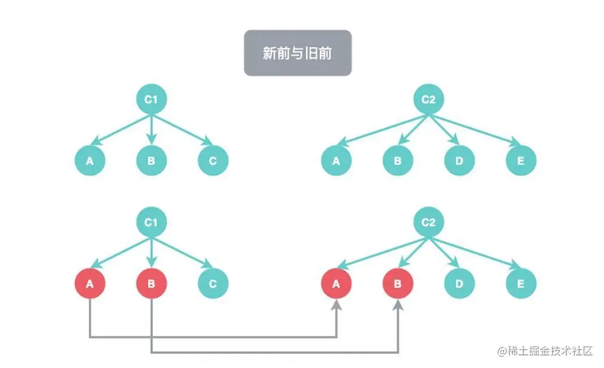
  
  
  

先看这张图，同一行的 C1, C2 节点，就是待比较的两个新旧子节点，比较子节点会从两个子节点的起始索引开始：

当 i = 0 时，比较第 0 个索引，发现 C1 的 A 节点 与 C2 节点的 A 节点 是同一类型的元素，则会对新旧的 A 节点进行 patch 操作，在这里进行 patch 能够递归的去访问 A 节点下的所有子节点，patch 完成后递增索引 i 。

继续比较，发现 C1 的 B 节点与 C2 的 B 节点也是同一类型的元素，与之前一样对B 节点进行 patch 递归后递增 i 索引。

当比较第三个子节点时，会发现 C1 的 C 节点与 C2 的 D 节点并不是同一类型的节点，所以会 break 跳出新前与旧前的比较循环，于是新前与旧前的比较结束。

而此时已经完成了 C1 和 C2 的子节点的前两个节点的比较。这个比较的过程在源码中是这样的


```typescript
while (i <= e1 && i <= e2) {
  const n1 = c1[i]
  const n2 = (c2[i] = optimized
    ? cloneIfMounted(c2[i] as VNode)
    : normalizeVNode(c2[i]))
  // 比较 n1 与 n2 是否是同一类型的 VNode
  if (isSameVNodeType(n1, n2)) {
    patch(
      n1,
      n2,
      container,
      null,
      parentComponent,
      parentSuspense,
      isSVG,
      slotScopeIds,
      optimized
    )
  } else {
    // 如果 n1 与 n2 不是同一类型，则 break 出 while 循环
    break
  }
  // 递增 i
  i++
}
```

> 在新前与旧前的比较完成后，与 Vue2 中的优化策略一致，会开始新后与旧后的比较。


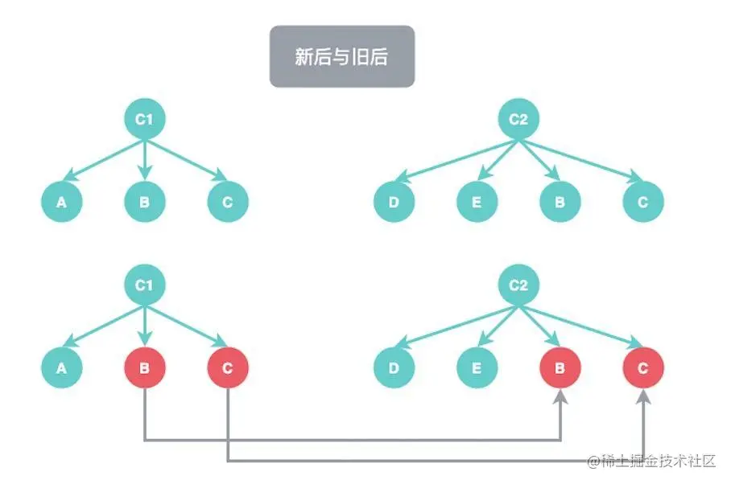


通过之前声明的e1与e2这两个新旧子节点的末尾索引, 从最末尾开始比较元素


图中的比较则是如下逻辑:

- 从末尾开始, C1是C节点, 而 C2也是C节点, 两者节点类型相同,开始机型patch比较,待patch完成后,新旧节点的末尾索引-1
- 进行第二次比较，C1 的末尾是 B 节点，C2 的末尾是 B 节点，类型相同，进行 patch，之后递减尾部索引。
- 进行第三次比较，C1 的末尾节点是 A，C2 的末尾节点是 E，类型不同，break 跳出新后与旧后的比较循环

```typescript
while (i <= e1 && i <= e2) {
  const n1 = c1[e1]
  const n2 = (c2[e2] = optimized
    ? cloneIfMounted(c2[e2] as VNode)
    : normalizeVNode(c2[e2]))
  // 比较 n1 与 n2 是否是同一类型的 VNode
  if (isSameVNodeType(n1, n2)) {
    patch(
      n1,
      n2,
      container,
      null,
      parentComponent,
      parentSuspense,
      isSVG,
      slotScopeIds,
      optimized
    )
  } else {
    // 如果 n1 与 n2 不是同一类型，则 break 出 while 循环
    break
  }
  // 完成 patch 操作后，尾部索引递减
  e1--
  e2--
}
```


> 常规顺序的新子节点挂载

当我们完成了前两轮比较后,此时往往能在常规的需要上发现一些新子节点中存在,而旧字节点中没有的元素,此时就需要将这些新增的子节点插入

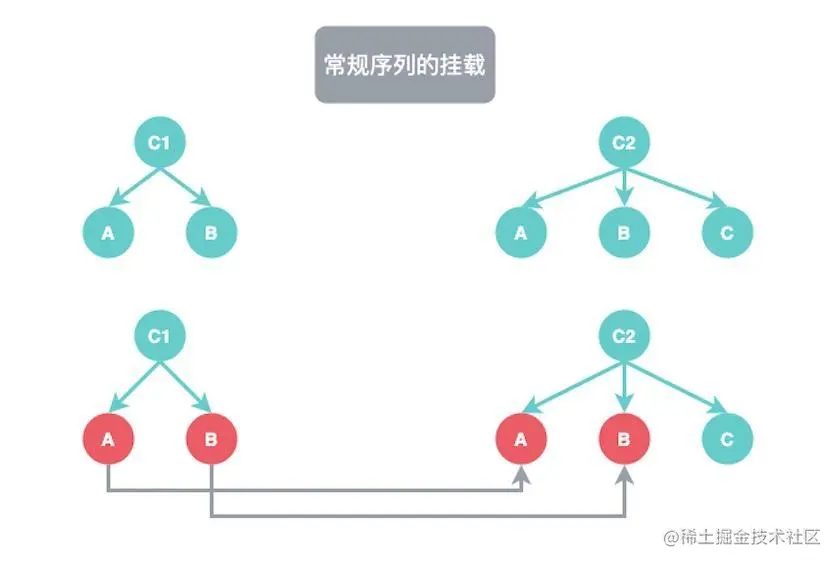


如果当完成新前与旧前的比较完成后,此时索引 i 已经递增的超过C1子节点的长度, 此时 i=2,并且 i 还小于等于C2子节点的长度, 于是可以判定在新字节点钟还有节点没有被遍历到,此时旧子节点已经全部遍历完,所以井未被遍历的子节点全部插入即可

对于这张图,应该插入C节点


```typescript
// 当旧子节点被遍历完
if (i > e1) {
  // 新节点还有元素未被遍历完
  if (i <= e2) {
    const nextPos = e2 + 1
    // 确定好锚点元素
    const anchor = nextPos < l2 ? (c2[nextPos] as VNode).el : parentAnchor
    // 遍历剩余的新子节点
    while (i <= e2) {
    	// patch 时第一个参数传入 null，代表没有旧节点，直接将新节点插入即可
      patch(
        null,
        (c2[i] = optimized
          ? cloneIfMounted(c2[i] as VNode)
          : normalizeVNode(c2[i])),
        container,
        anchor,
        parentComponent,
        parentSuspense,
        isSVG,
        slotScopeIds,
        optimized
      )
      i++
    }
  }
}
```


> 常规顺序的移除多余节点

与上面的挂载逻辑相对应的是移除多余的旧子节点, 

当新子节点已经全部遍历完时时,如果此时旧子节点还有元素未被遍历,那么可以判定剩余的旧子节点已经不再需要了,所以直接将剩余旧子节点移除即可

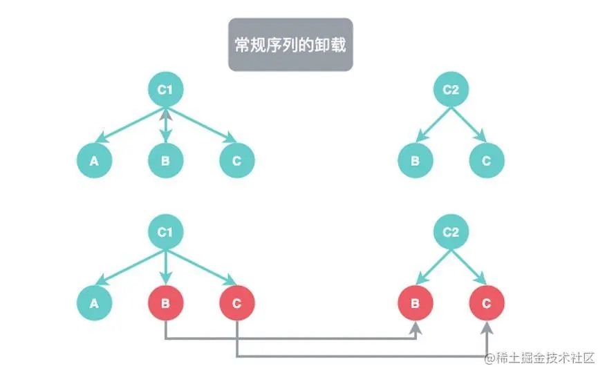


从图中来看, C1 与 C2 在通过新后与旧后的比较完成后,此时旧节点C1中还剩余A节点, 新节点中已经没有需要比较的节点了,所以直接移除A节点即可

```typescript
// 如果新子节点已被遍历完
else if (i > e2) {
  // 就子节点未被遍历完
  while (i <= e1) {
    // 调用 unmount 卸载旧子节点
    unmount(c1[i], parentComponent, parentSuspense, true)
    // 递增索引
    i++
  }
}
```


> 未知顺序的子节点比较

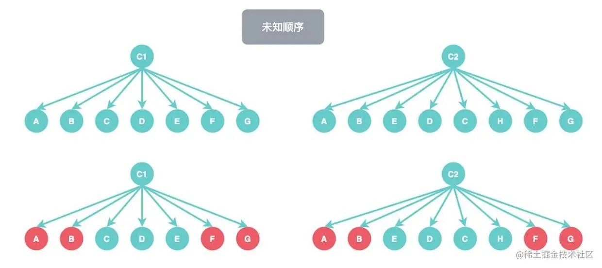

可以看到新旧子节点中挂载了比较多的元素,当我们通过新前与旧前,新后与旧后的比较之后,还剩余中间部分的不确定顺序的节点了,旧子节点中的CDE, 新子节点中的EDCH


那么patch是如何完成这个任务的:

- 声明s1, s2 两个变量,并此时遍历前序索引i赋值给s1,s2; s1,s2分别代表新旧子节点的起始索引

- 以s2为起始结点, e2 为结束条件, 遍历新子节点,用新字节点钟子节点的key为键,索引i为值,生成一个map对象,存放原始索引

  - 如果此时发现有子节点钟有重复的键,就会发出一个所有Vue开发者都很熟悉的警告: Duplicate keys found during update xxx,Make sure keys are unique

  

```typescript
const s1 = i // 旧子节点的起始索引
const s2 = i // 新子节点的起始索引

// 对新子节点，创建一个索引的 map 对象
const keyToNewIndexMap: Map<string | number, number> = new Map()
for (i = s2; i <= e2; i++) {
  const nextChild = (c2[i] = optimized
    ? cloneIfMounted(c2[i] as VNode)
    : normalizeVNode(c2[i]))
  if (nextChild.key != null) {
    // 如果是 DEV 环境，且 keyToNewIndexMap 已经存在当前节点的 key 值，则警告。
    if (__DEV__ && keyToNewIndexMap.has(nextChild.key)) {
      warn(
        `Duplicate keys found during update:`,
        JSON.stringify(nextChild.key),
        `Make sure keys are unique.`
      )
    }
    // 以新子节点的 key 为键，索引为值，存入 map。
    keyToNewIndexMap.set(nextChild.key, i)
  }
}
```

- 声明变量 toBePatched，计算还有几个节点需要被 patch。声明变量 patched = 0，记录 patch 的节点数。
- 声明一个 newIndexToOldIndexMap 的数组，用于后续确定最长递增子序列，newIndexToOldIndexMap 数组大小为 toBePatched 的长度，并将数组内所有元素初始化为 0。
  - newIndexToOldIndexMap，形式是 Map<newIndex, oldIndex>
  - 需要注意的是里面存储的 oldIndex 是索引是偏移 +1 的。
  - oldIndex = 0 是一个特殊值，表示新子节点中没有对应的旧子节点。
- 遍历旧子节点，将当前被遍历的子节点标记为 prevChild。
  - 如果 patched 大于等于 toBePatched，说明需要被 patch 的节点已经全部比较完毕，则可以将剩余的 prevChild 移除。
  - 否则声明变量 newIndex。
  - 如果 prevChild 的 key 不为空，则从 keyToIndexMap 中取 prevChild.key 的值，将获取到的值赋值给 newIndex。
  - 如果 newIndex 没有值，则说明在新子节点中没有对应的旧子节点，直接移除 prevChild 旧子节点。
  - 否则在 newIndexToOldIndexMap 中存下新的索引，并标记当前索引移动的最远位置或增加移动标记，并对新旧子节点进行 patch 比较。
  - 在完成 patch 后，将 patched 计数递增。

以上逻辑的代码如下：

```typescript
/**
 * 遍历旧子节点，尝试 patch 比较需要被 patch 的节点，并且移除不会再出现的子节点
 */
let j
let patched = 0
const toBePatched = e2 - s2 + 1
let moved = false
// 用于跟踪是否有节点发生移动
let maxNewIndexSoFar = 0
// 用于确定最长递增子序列
const newIndexToOldIndexMap = new Array(toBePatched)
for (i = 0; i < toBePatched; i++) newIndexToOldIndexMap[i] = 0

for (i = s1; i <= e1; i++) {
  const prevChild = c1[i]
  if (patched >= toBePatched) {
    // 所有新节点都被 patch 了，所以剩下的只需要移除
    unmount(prevChild, parentComponent, parentSuspense, true)
    continue
  }
  let newIndex
  if (prevChild.key != null) {
    newIndex = keyToNewIndexMap.get(prevChild.key)
  } else {
    // 对于找不到 key 的节点，尝试去定位相同 type 的节点
		/* 忽略逻辑 */
  }
  // 如果旧子节点不能匹配到对应的新子节点，则移除该旧子节点
  if (newIndex === undefined) {
    unmount(prevChild, parentComponent, parentSuspense, true)
  } else {
    // 在 newIndexToOldIndexMap 记录下被 patch 的节点的索引
    newIndexToOldIndexMap[newIndex - s2] = i + 1
    // 如果 newIndex 的索引大于最远移动的索引，则更新
    if (newIndex >= maxNewIndexSoFar) {
      maxNewIndexSoFar = newIndex
    } else {
      // 否则标记 moved 为 true
      moved = true
    }
    // 对新旧子节点进行 patch
    patch(
      prevChild,
      c2[newIndex] as VNode,
      container,
      null,
      parentComponent,
      parentSuspense,
      isSVG,
      slotScopeIds,
      optimized
    )
    // patch 完毕后，递增 patched 计数。
    patched++
  }
}

```

在遍历完旧子节点后，我们已经移除了不必要的旧子节点，并且依旧存在于新节点中的对应的旧子节点都进行了 patch 比较，接下来我们需要遍历一下新子节点，仅仅只从后往前遍历需要被 patch 的部分，目的是对于新增的子节点进行插入，对于需要移动的子节点进行同级的移动。逻辑描述如下：

- 如果有 moved 标记，则从 newIndexToOldIndexMap 中找到最长递增子序列，并将 j 赋值为最长递增子序列数组的末尾索引。
- 从后往前的遍历新子节点，这样可以使我们确定锚点元素的位置。
- 声明 newIndex = s2 + i，即为最后一个需要被 patch 的节点。
- 获取锚点元素。
- 如果这个需要被 patch 的节点，i 索引在 newIndexToOldIndexMap 中的值为 0。还记得我之前提示的，0 是一个特殊值，代表该节点在旧子节点中没有对应的节点吧。那么对于没有对应节点的元素，我们就对它采用插入操作。
- 如果 newIndexToOldIndexMap 中有对应索引，但是存在 moved 标记，说明节点可能移动，应该继续判断。
  - 如果 j < 0，说明最长递增子序列中的所有节点都已经处理过。或者当索引 i 不等于最长增长子序列中索引 j 对应的值时，说明该节点并不处在一个相对稳定的位置，则需要进行移动操作。
  - 如果满足上述条件，j 索引递减，不用处理该节点。

```typescript
/**
 * 移动和挂载
 */
// 当节点被移动时，创建最长递增子序列
const increasingNewIndexSequence = moved
  ? getSequence(newIndexToOldIndexMap)
  : EMPTY_ARR
j = increasingNewIndexSequence.length - 1
// 为了能方便的获取锚点，选择从后向前遍历
for (i = toBePatched - 1; i >= 0; i--) {
  const nextIndex = s2 + i
  const nextChild = c2[nextIndex] as VNode
  const anchor =
    nextIndex + 1 < l2 ? (c2[nextIndex + 1] as VNode).el : parentAnchor
  if (newIndexToOldIndexMap[i] === 0) {
		// 如果在 newIndexToOldIndexMap 中找不到对应的索引，则新增节点
    patch(
      null,
      nextChild,
      container,
      anchor,
      parentComponent,
      parentSuspense,
      isSVG,
      slotScopeIds,
      optimized
    )
  } else if (moved) {
    // 如果不是一个稳定的子序列，或者当前节点不在递增子序列上时，需要移动
    if (j < 0 || i !== increasingNewIndexSequence[j]) {
      move(nextChild, container, anchor, MoveType.REORDER)
    } else {
      j--
    }
  }
}
```


**diff算法总结**

1. 从头对比找到有相同节点patch,发现不同,立即跳出

2. 如果第一步没有patch完,立即从后往前开始patch,如果发现不同立刻跳出循环

3. 如果新的节点未遍历完,老的节点全部遍历完, 对为访问的新的节点的节点全部以新的VNode处理(挂载)(这种情况说明已经完全patch完相同的vnode)

4. 对于老节点未遍历完,新的节点遍历完,对未访问到的老节点全部卸载(这种情况说明已经完全patch完相同的VNode)

5. 不确定的元素(老节点和新节点均有剩余)

   1. 把没有比较过的新节点通过map保存, 以新子节点的key为键,索引为值,存入map,

      变量patched 存放已经patch的数量, 

      变量toBePatched存放需要toBePatched的数量

      数组 newIndexToOldIndexMap 长度为未遍历的新节点长度 初值为0

     2. 遍历未访问的老节点

        		1. 如果toBePatched的节点数量未0, 那么卸载这些老节点
             		2. 如果老节点key有对应存在, 根据key在map中找到对应的index(新节点索引)
             		3. 如果未找到卸载老节点

        4. 如果找到与老节点对应的新节点，把老节点的索引，记录在存放新节点的数组中，
        5. 如果发生了逆序,就说明需要进行移动
        6. 对新老节点进行patch 并让patched++

     3. 遍历结束, 根据(新老节点索引列表,找到最长稳定子序列)

     4. 遍历未访问的新节点

        		1. 在newIndexToOldIndexMap中新节点对应索引的值为0,作为新NNode处理(挂载)
             		2. 不满足5.4.1 且 moved 为 true 根据生成的最长稳定子序列对节点进行处理


### 3. Node.js为什么可以解析js代码?

> nodejs是什么?

Node.js是一个JavaScript运行时环境?


> nodejs为什么可以解析js代码

Chrome 浏览器中的 JavaScript 和 Node.js 都在V8 引擎上运行, 该引擎将你的JavaScript代码转换为更块的机器代码,机器代码时低级代码,计算机可以直接运行而无需先解释它,


> 为什么选择Node.js

官方给出的定义: 

```text
Node.js®是基于 Chrome 的 V8 JavaScript 引擎构建的 JavaScript 运行时环境。Node.js 使用事件驱动的非阻塞 I/O模型，轻量且高效。
Node.js 的包生态系统 npm 是世界上最大的开源库生态系统。
```


I/O指的是输入/输出, 它可以从读取/写入本地文件向API发出HTTP的任何内容

I/O 需要hi见,因此会阻塞其他函数


考虑一下这种情况，我们需要通过请求后端[数据库](https://cloud.tencent.com/solution/database?from=10680)来获取 user1 和 user2 的详细信息，然后在屏幕或控制台上打印它们。对该请求的响应需要时间，但是两个用户数据的请求可以独立地同时执行


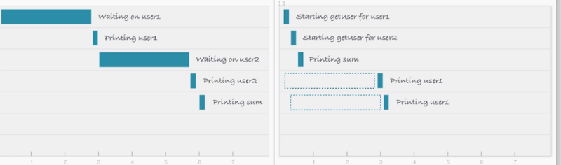


阻塞I/O(左) 非阻塞I/O(右)


**阻塞I/O**

在阻塞方法中，在 user1 的数据被输出到屏幕之前，不会启动 user2 的数据请求。

如果这是一个Web[服务器](https://cloud.tencent.com/product/cvm?from=10680)，我们必须为每个新用户启动一个新线程。但 JavaScript 是单线程的（实际上不是真的，但它有一个单线程的事件循环，我们稍后会讨论）。所以这会使 JavaScript 不太适合多线程任务。

这就是非阻塞的用武之地。


**非阻塞I/O**

另一方面，如果用非阻塞请求，可以在为 user2 发起数据请求时，无需先等待对 user1 请求的响应。你可以并行启动这两个请求。

这种非阻塞 I/O 消除了对多线程的需要，因为服务器可以同时处理多个请求。


**JavaScript 事件循环**

以下是 JavaScript 事件循环工作原理简要的逐步描述。

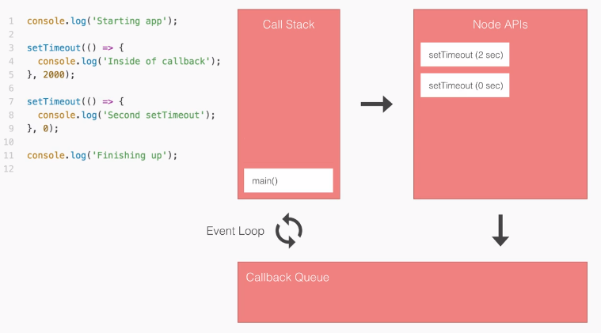


1. 将 `main()` 送入调用栈。
2. 将 `console.log()` 送入调用栈。然后立即运行并弹出。
3. 将 `setTimeout(2000)` 送入栈。 `setTimeout(2000)`是一个 Node API。在调用它时，先注册事件回调。事件将等待 2000 毫秒，然后回调这个函数。
4. 在 API 中注册后，`setTimeout(2000)` 从调用堆栈中弹出。
5. 现在第二个 `setTimeout(0)` 以相同的方式注册。我们现在有两个 Node API 等待执行。
6. 等待 0 秒后，`setTimeout(0)` 被移动到回调队列，同样的事情发生在 `setTimeout(2000)`。
7. 在回调队列中，函数等待调用栈为空，因为每个语句都执行一次。这由事件循环处理。
8. 最后一个 `console.log()` 运行，并且 `main()` 从调用栈中弹出。
9. 如果事件循环检测到到调用堆栈为空且回调队列不为空。它将回调（以先进先出顺序）移动到调用栈并执行。

**npm**

这些是由令人敬畏的社区所构建的库，它能解决你的大多数的常规问题。 npm（Node package manager)）中有很多可以用在你的程序中包，可以使你的开发更快更有效。


**V8 通过利用 C++ 来加速 JavaScript**

V8 是一个用 C++ 编写的开源运行时引擎。

JavaScript => V8（C ++）=> 机器码

V8 实现了 ECMA-262 中指定的名为 ECMAScript 的脚本。 ECMAScript 由 Ecma International 创建，用于标准化JavaScript。

V8 可以独立运行，也可以嵌入到任何 C++ 程序中。它有一些钩子，允许你编写自己的C++代码供 JavaScript 使用。

这实际上允许你通过将 V8 嵌入到 C++ 代码中来向 JavaScript 添加功能，以便使你的 C++ 代码实现比 ECMAScript 标准更多的功能。


**事件**

事件指的是我们可以对在程序中发生的事情作出回应。Node 中有两种类型的事件。

- 系统事件：来自用 C++ 实现的基于 libuv 库的内核。（例如，读取文件完毕）。
- 自定义事件：JavaScript 核心。


##  ajax 和 fetct 的区别? 

1. ajax 和 fetch的区别:

   （1）、ajax是理用XMLHttpRequest对象来请求数据的，而fetch是window的一个方法

   （2）、ajax基于原生的XHR开发，XHR本身的架构不清晰，已经有了fetch的替代方案

   （3）、fetch比较与ajax有着更好更方便的写法

   （4）、fetch只对网络请求报错，对400，500都当做成功的请求，需要封装去处理

   （5）、fetch没有办法原生监测请求的进度，而XHR可以

2. ajax用法

   

   

```javascript
   var Ajax = {
    get: function(url,fn){
        var xhr = new XMLHttpRequest();//新建XMLHttpRequest对象xhr
        // .open需要三个参数,请求方式, 请求地址, 是否异步
        //true是在等待服务器响应时执行其他脚本，当响应就绪后对响应进行处理；false是等待服务器响应再执行。
        xhr.open('GET', url, false);
        xhr.onreadystatechange= function () {
            if (xhr.readyState == 4){//readyState == 4 说明请求已经完成
                if (xhr.status==200 || xhr.status == 304){
                    console.log(xhr.responseText)
                    fn.call(xhr.responseText)
                }
            }
        }
        xhr.send();
    },//data因为'a=a1&b=b1',这种字符串格式,在jq力如果data为对象会自动将对象转换成这种形式
    post:function (url,data,fn){
        var xhr = new XMLHttpRequest()
        xhr.open('POST',url,false);//添加http头,发送信息至服务器内容编码类型
        xhr.setRequestHeader('Content-Type','application/x-www-form-urlencoded');
        xhr.onreadystatechange =  function () {
            if (xhr.readyState == 4){
                if(xhr.status == 200 || xhr.status == 304){
                    console.log(xhr.responseText)
                    fn.call(xhr.responseText)
                }
            }
        }
        xhr.send(data)
       
    }
    
   }
```

   

3.  fetch用法
   1. 第一个参数是URL
   2. 第二个参数是可选参数,可以控制不同init对象
   3. 使用了js中的promise对象


```javascript
fetch("url",{
    method:'post',
    headers:{
        //设置请求的头部信息
        "Content-Type":"application/json"//跨域可能要加上
    },
    body:JSON.stringify(arr)//传入的数据
    
}).then((resp)=>{
    resp.json()
    //可以有以下写法
/*    resp.json().then(data=>{
        
    })*/
}).then((data)=>{
    console.log(data)
})
```

## 4. TS如何引入js代码

typyScript中不能直接引入hs代码
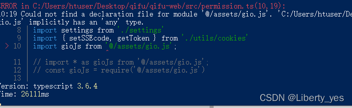

1. 第一种方法: 使用`require`代替import传统引入
   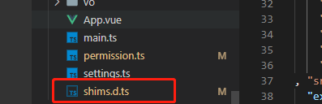
   
2. 第二种方法:在项目中新建一个xxx.ts文件


在我呢见中主动声明引入module:

```ts
shims.d.ts:
declare module '@/util/gio.js' // declare module 'xxx'路径或者模块
```
这样就可以引入了


# 5. git的分支管理


### # 5.1 git 的分支管理

>  git所有分支之间彼此互不干扰,各自完成各自的工作和内容,可以在分支使用后道总分支(原分支)上,安全,便捷,不影响其他分支工作


#### 5.2 查看当前工作在哪个分支

```text
git branck
# 返回
# * master
```


#### 5.3 master分支

从项目创建之初,有且唯一的分支就是主分支,如果之后再创建分支,就是一个一个的从分支,主分支叫做master


> Git的master分支并不是一个特殊分支,他就根其他分支完全没有区别;
>
> 之所以几乎每一个仓库都有master分支,是因为git init 命令默认创建它,并且大多数人都懒得去改动他


#### 5.4 HEAD

> 对于一个项目提交了很多个分支,如果有两个分支指向相同提交历史,Git又是怎么知道当前在哪一个分支上  

很简单,它有一个名为HEAD的特殊指针,请注意它和许多其他版本控制系统里的HEAD概念完全不同,它是一个指针, 指向当前所在的本地分支(将HEAD想像为当前分支的别名)

而HEAD所指向的直接关系是当前分支,再找到分支的版本,如下图

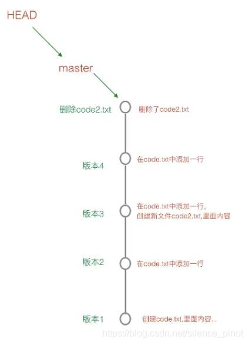


#### 5.5 创建分支

> 概念解释

git创建新分支,即再当前未知创建一个指针,比如起名为'从分支dev',然后将HEAD指向dev:

	1. 分支创建好后的提交未知都是再`dev`分支上提交,而之前的总提交`master`分支的提交未知停留在创建从分支`dev`的位置,而`HEAD`会跟随创建的分支,跟随每一次提交不同的先前移动,保持`HEAD指针`的在提交的最前沿
	1. 在`master`上创建的`dev分支`会继承`master分支`的所有提交,通过`git log`可以看出来

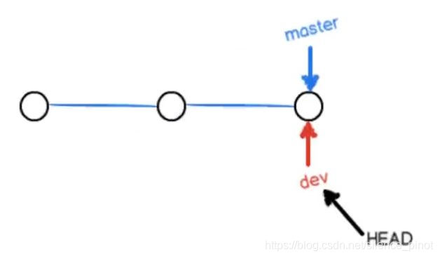

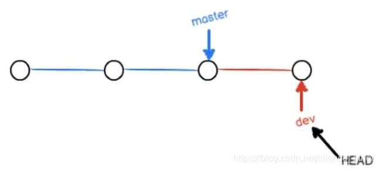

> 实际操作

```
# 创建并切换到`dev`分支
git checkout -b dev
```
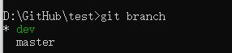

此时就会又两个分支,并且指向`dev`分支


> 提交分支

当`dev分支`工作完成,需要合并到`master分支`的时候, 也就是**将master指针指向当前dev**位置,并将HEAD指向master,这时dev分支可以直接删除, 也可以不删除,删除的化也只是移除dev指针,只留下一个master指针,对工作去没有任何的影响,也就是曾经做的所有提交操作都不会有影响

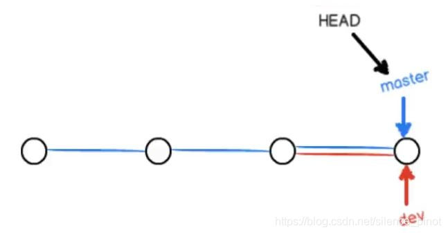


> 切换回主分支

```
# 分支切换回主分支master
git checkout master
```


> 合并分支

当分支切换回主分支的时候,可以将dev的修改合并到master分支上,使用:

```
# 合并dev到master
git merge dev
```


> **重点**

这一次合并成之为夸苏合并`fast-forward`,只是将master的指针指向了dev最后一次提交的位置


当分支切换回主分支的master的时候,就可以删除dev分支使用

```
# 删除dev分支
git branch -d dev
```


#### 5.6 小结

查看分支: `git branch`

创建分支: `git branch <name>`

切换分支: `git checkout <name>`

创建+切换分支: `git checkout -b <name>`

合并某分支到当前分支: `git merge <name>`

删除分支: `git breach -d <name>`


#### 5.7 冲突的发生和解决

当同一个文件被两个分支都修改过,想要和并两个分支就会产生冲突,不饿能快速将dev合并到master上, 并且git回提醒"合并过程中产生了冲突, 请修改后再提交"

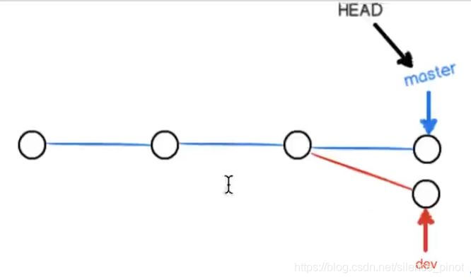


> 修正的过程

1, 将两个分支的文件,进行对比修改,满足两个分支的提交

2. 使用 git add 和git commit 进行一次新的提交(此时提交的是master分支)
3. 再次合并

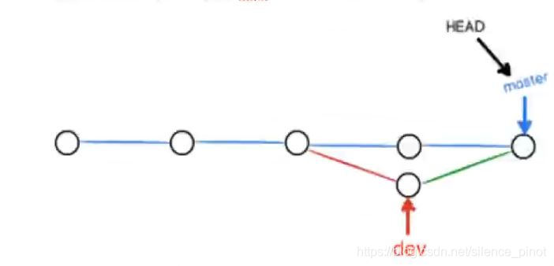

> 查看带有冲突解决的日志

```
git log --graph -- pretty=oneline
```


> 分支管理策略

```
通常合并分支时,如果没有冲突,并且分支是单向一条线路继承下来,git回使用fast forword模式, 但是有些快速合并不能成功,但是又没有冲突时, 就回触发分支管理策略,git回自动做一次新的提交
```

当两个分支对工作区都进行了修改,但是修改的并不是同一个文件,而是两个不同的文件,也就是不会产生冲突; 此时合并的时候,不能使用**快速合并**,就会弹框需要你输入一段合并说明,使用快捷键 ctrl + x退出


> 合并时禁止夸苏合并模式

```
# 合并dev到master,禁止快速合并模式,同时添加说明
git merge --no--ff -m '' dev
```

> bug分支

> 描述和说明

使用场景: 当再某个分支上正在工作,突然有一个紧急的bug需要修复,此时可以使用`stash`功能,将当前正在工作的`现场存储起来`,等bug修复之后,在返回继续工作


操作顺序: 

1. 将工作的工作现场临时存储

```
# 对当前现场进行存储
git stash
```


2. 切换到bug出现的分支上,比如bug出现在`master`分支,如果bug就是在``当前分支,可以操作此步骤

```
git checkout master
```


3. 新添加一个bug临时分支

```
git checkout - b bug001
```


4.对代码进行修复


5. 切换回master分支

```
git checkout master
```


6. 合并bug分支到主master上

```git merge --no-ff -m '合并bug分支到master' bug001```

7. 删除bug001分支

```git branch -d bug001```

8. 回到之前的工作现场所在的分支

   ```git checkout dev```

9. 查看当前分支保存那些工作现场(之前封冻存储的工作现场)

```git stash list```


10. 恢复存储的现场

```git stash pop```

### 小结：

修复bug时，通过创建新的bug分支进行修复，然后合并，最后删除。

当手头工作没有做完时，先把工作现场git stash一下，然后去修复bug，修复后，再git stash pop，恢复工作现场。


## ci/cd流 ?
