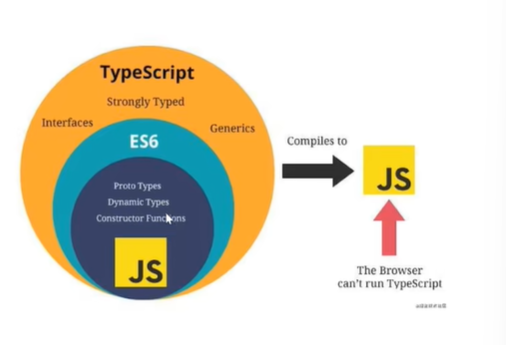

# 温故而知新之TypeScript

## TS介绍




TS代码是不能直接使用的, 需要使用TS编译成js代码再使用


TS的特点可以编译出纯净,简介的JavaScript代码,并且可以运行再任何浏览器上

### TypeScript的特点

- 始于JavaScript 归于JavaScript

TypeScript可以百年一处纯净,简洁的JavaScript代码,并且可以运行再任何浏览器上,Node.js环境
中和任何支持ECMAScript3(或者更高版本)的JAvaScript引擎中

- 强大的类型系统

类型系统允许JavaScript开发者在开发JavaScript应用程序时使用高效的开发工具
和常用操作比如静态检查和代码重构

- 先进的JavaScript

TypeScript提供最新的和不断发展的JavaScript特性,包括哪些来自2015年的ECMAScript
和未来题案中的特性,比如异步功能和Decorators,以帮助建立健壮的组件


> ts的文件中如果直接书写JS语法的代码,那么在html中直接引入ts文件
> 在谷歌的浏览器中时可以直接使用的

> 如果ts文件中有了ts文件中有了ts的代码,那么就需要把这个ts文件编译成js文件
> 在html文件中引入js的文件来来使用

> ts文件中的函数中的形参,如果使用了某个类型进行修饰,那么在编译成js文件中时没有这个类型的'


> ts文件中的变量使用的时let 进行修饰,编译的js文件中的修饰符就编程var了


### ts的自动编译

> 命令`tsc --init`会生成一个json文件

### 接口

接口: 是一种能力,一种约束而已
```ts
interface IPerson{
    firstName:string //姓氏
    lastname:string //名字
}
//输出姓名
function showFullName(person:IPerson){
    return person.firstName + '_' + person.lastname
}

//定义一个对象
const person:IPerson = {
    firstName:'东方',
    lastname:'不败'
}

//使用函数
showFullName(person)
```
     
### 类

```ts
//ts中书写js中的类

//定义一个接口
interface IPerson {
    firstName: string,
    lastNmae: string //名字
}

//定义一个类型
class Person {
    //定义公共的字段
    firstName: string;
    lastName: string;
    fullName: string;

    //定义一个构造器函数
    constructor(firstName: string,lastName: string){
        this.firstName = firstName;
        this.lastName = lastName;
        this.fullName = this.firstName + this.lastName
    } 
    
}

```

### 基础类型

#### 布尔值

true/false

```ts
//let 变量名:数据类型 = 值
let flag:boolean = true;
console.log(flag)
```

#### 数字   

二进制: 0b  
八进制: 0o  
十六进制: 0x

```ts
let a1: number = 10 //十进制
let a2: number = 0b100 //二进制
let a3: number = 0o132 //八进制
let a4:number = 0xa //十六进制
```


#### 字符串

```ts
let str1: string = '费德勒开始'

//字符串和数字之间嫩巩固一起拼接
let str2: string = 'kakaxi'
let num: number = 333
console.log(str2 + num)
```


#### 总结

ts中变量一开始是什么类型,那么后期赋值的时候,只能用这个类型的数据,是不允许其他类型的数据赋值给这个变量

#### undefined 和 null  

```ts
let und: undefined = undefined
let nul: null = null

// undefined 和 null 都可以作为其他类型的子类型, 
//可以把 undefined 和 null 赋值给其他类型的变量, 如: number, string
```
#### 数组 
// 数组定义方式1
```ts
// let 变量密过: 数据类型[] = [值1,值2,....]
let arr1 : number[] = [1,2,3,4,5]
```
// 数组定义方式2: 泛型方法

```ts
let arr2: Array<number> = [100,200,300]
```

注意问题: 数组定义后, 里面的数据的类型必须和定义数组时候的类型是一致的,否则会有错误提示信息,也不会编译通过的


#### 元组类型

```ts
//元组类型: 在定义数组的时候,类型和数据的个数一开始就已经限定了
let arr3: [string, number, boolean] = ['小菜菜', 100, true]
```

注意问题: 元素类型在使用的时候,数据的类型和数据的个数应该在定义元组的时候的数据类型和位置应该是一致的

#### 枚举

```ts

// 枚举类面的每一个数据值都可以叫元素,每个元素都有自己的变化,编号是从0开始的,一次递增加1
// 默认从0 开始, 可以手动变化,
// 可以根据枚举类型得到名字
enum Color{
    red,
    green,
    blue
}

enum  Gender{
    // 枚举中的值可以是中文的,但是不推荐
    男,
    女
}

console.log(Gender.男)

```

#### any类型

有时候,我们会想要为哪些在编程阶段还不清楚类型的变量指定一个类型,这些值可能来自于动态的内容,比如来自用户输入或第三方库,
这种情况下我们不希望类型检查器对这些值进行检查,而是直接让它们通过编程阶段的见擦汗,那么我们可以使用any类型来表接这些变量


```ts
let notSure: any = 4
notSure = '卡卡可'
notSure = true

let arr: any[] = [100, '年少不知xx好,错吧yy当成宝', true]
// 这种情况下没有提示信息,也没有编译错误,但是运行的时候会报错
console.log(ar[0].split(''))
```

#### void 类型


```ts
// 在函数声明的时候,小括号后面:void,代表的是该函数没有任何返回值
function showMsg():void{
    console.log('只要xx把握住,连夜住进大别墅')
}

console.log(showMsg())

// 定义void类型的变量
let vd: void = showMsg
console.log(vd)
```
#### object类型

```ts
定义一个函数,参数是object类型,返回值也是object类型
function getObj(obj: object): object{
    return {
        name: '卡卡西',
        age: 14
    }
}


console.log({name:'佐助', age: 34})
```

#### 联合类型

联合类型: (Union Type) 表示取值可以为多种类型种的一种  
//需求1: 定义一个函数, 得到一个数字或者字符串形式的值
```ts
function getString(str:string|number): string{
    return str.toString
}

console.log(getString(123))

```
#### 类型断言

通过类型断言的方式可以告诉编译器,`相信我,我知道自己在干什么` 类型断言好比其他怨言力的类型转换,但是不进行特殊的数据检查和结构,
他没有运行时的影响,只是在编译阶段起作用,TypeScript会假设你已经做了检查

```ts
function getString(str:string|number): number{
    //类型断言的语法方式1
    if ((<string>str).length){
        //类型断言的语法方式2
        return (str as string).length
    }
}

console.log(getString(123))
```

#### 类型推断

类型推断: 会在没有指定类型的时候,自动推测出类型

```ts
let txt = 100;
// text = '卡卡西'
console.log(100)


let arr; //当没有定义类型的时候为any类型

arr = 123;
arr = '附近的萨拉开发';person对象的类型是哟个,限定或是约束对象


```

## 接口

接口时对象状态和行为的抽象

接口: 是一种类型, 一种规范, 一种规则, 一个能力, 一种约束

```ts
//定义一个接口,接口为
interface Iperson{
    //readonly是只读的
    //id是只读的,number类型
    readonly id: number;
    name: string;
    age: number;
    // ? 表示非必须, 可有可无的
    sex?: string;
}

//定义一个对象,该对象的类型就是我定义的接口
const person: Iperson = {
    // id: 1,
    name: '小同台',
    age: 18,
    sex: 'nv'
}

```

### 函数类型  

//函数类型: 同各国接口的方式作为函数的类型使用
//为了接口使用接口表示函数类型,我们需要给接口定义一个调用签名
// 它就像是一个只有参数列表和返回值类型的函数定义,参数列表里每个参数都需要名字和类型

```ts
interface ISearchFunc{
    定义一个函数签名
    (source:string,subString:string):boolean
}
//定义一个函数,该类型就是上面定义的接口
const search :  ISearchFunc = function (source:string,subString:string):number{
    return source.search(subString) > -1
}

//调用安徽拿书
console.log(search('哈哈哈帅','帅'))
```

### 类类型

类 类型: 类的类型, 类的类型可以同故宫接口来实现
```ts
//定义一个接口

interface IFly{
    //该方法没有任何的实现(方法种什么都没有)
    fly();
}

//定义一个类,这个类的类型就是上面定义的接口
//实际上也可以理解为IFly接口约束了当前这个Person类
class Person implements IFly{
    //实现接口种的方法
    fly(){
        
    }
}

//实例化对象
const person = new Person();
person.fly()

// 定义一个接口

interface ISwim{
    swim()
}

//定义一个类,这个类的类型就是IFly和ISwim,
// 当前这个类可以实现多个接口

class Person2 implements IFly,ISwim{
    fly() {
    }
    swim() {
    }
}

const person2 = new Person2();

person2.fly()
person2.swim()

//总结: 类可以通过接口的方式,来定义这个类的类型
// 类可以实现一个接口,类可以实现多个接口,
//要注意接口中的内容都要真正的实现


// 接口恶意继承其他的多个接口

interface IMyFlyAndSwim extends IFly,ISwim{}

    //定义一个类,直接实现
class Person3 implements IMyFlyAndSwim{
    fly() {
    }
    swim() {
    }
}

//总结 接口和接口之间叫继承, 使用的是extends
// 类和接口之间叫实现:使用的是implements

```
### 类: 

//类: 可以理解为模板,通过模板可以实例化队形  
// 面向对象的编程思想

//ts中类的定义以及使用

```ts
class Person {
    //定义属性
    name: string;
    age: number;
    gender: string
    //定义构造函数: 为了将来实例化对象的时候,
    //可以直接对属性的值进行初始化

    constructor(name: string='小tt',age: number=14, gender: string='nan') {
        this.name = name;
        this.age = age;
        this.gender = gender
    }
    //定义实例方法
    sayHi(str: string){
        console.log(this.gender,this.name,this.age)
    }
}


//ts中使用类, 实例化对象,可以直接进行实例化操作
const  person = new Person('佐助',18)
person.sayHi('你叫什么名字')
```

#### 类的继承  

继承:类与类之间的关系  
继承后类与类之间的叫法:  
A类继承了B这个类, 那么此时A类叫子类, B类叫基类  
字类--->派生类  
基类 ---> 超类(父类)  
一旦发生了继承的关系,就出现了父子类的关系(叫法)

```ts
// 定义一个类
class Person {
    name: string
    age: number
    gender: string

    //定义构造函数
    constructor(name: string, age: number, gender: string) {
        //更新属性数据
        this.name = name;
        this.age = age
        this.gender = gender
    }

    //定义实例方法
    sayHi(str: string) {
        console.log('年后')
    }
}

//定义一个类,继承Person
class Student extends Person {
    id: string;

    constructor(name: string, age: number, gender: string,id: string) {
        //调用的是父类中的构造函数,使用的是super
        super(name,age,gender);
        this.id = id
    }
    
}

// 总结: 类和类之间如果要有继承关系,需要使用extend关键字,
// 字类中可以调用父类中的构造安徽拿书,使用的是super关键字(包括调用父类中的实例方法,也可以使用super)
// 字类中可以重写父类中的方法

```

#### 多态

多态: 父类型的引用指向子类型的对象,不同类型的对象指向相同的方法,产生了不同的行为

```ts

// 定义一个父类
class Animal {
    name: string

    //定义一个构造函数
    constructor(name:string) {
        //更新属性值
        this.name = name
    }
    
    //实例方法
    run(distance:number){
        console.log(`跑了${distance}米源的距离`)
    }
}
// 定义一个子类
class Dog extends Animal{
    //构造函数
    constructor(name:string) {
        super(name);
    }
    
    //实例方法
    run(distance: number = 5){
        console.log(`跑了${distance}米源的距离`)
    }

}


//实例化父类对象
const ani:Animal = new Dog('大黄');

// 父类型的引用可以指向字类对象
ani.run() // 跑了5米

```

### 类中的成员修饰符

//修饰符(类中的成员的修饰符):主要是描述类中的成员(属性,构造函数,方法)的可访问性

```ts
//定义一个类

// public修饰符,类中的成员默认的修饰符,代表的是公共的,任何位置都可以访问类中的成员
// private所修饰符.类中的成员如果使用private来修饰,那么外部是无法访问这个成员数据的
//  字类中也是无法访问该成员数据的
// protected修饰符, 类中的成员如果使用protected来修饰,那么外部是无法访问这个成员数据的
//  子类是可以访问该成员的


class Person {
    //属性 private 修饰了属性成员
    private name: string
    protected eag: number
    // 构造函数
    public constructor(name: string) {
        //更新属性
        this.name = name
    }
    //方法
    public eat(){
        console.log('这个好吃')
    }
}
```

#### readOnly修饰符

```ts
// readonly修饰符: 首先是一个关键字,对类中的属性成员进行修饰,修饰符后,
//该属性成员,就不能再外部被随意修改了

//构造函数中,可以对只读的属成员的数据进行修改
// 如果构造函数中没有任何参数,类中的属性成员已经使用readonly进行修饰了,那么外部也是不能对这个属性值进行更改的
// 构造函数中参数一旦使用public, readonly, private, property等修饰符修饰
// 类就有一个修饰符修饰的属性成员

class Person{
    //属性
    readonly name:string
    
    //构造函数中的参数一旦使用了readonly进行修饰后,那么该name参数可以叫参数属性
    //构造函数中的name参数,一旦使用readonly进行修饰后,那么Person中就有了一个name的属性成员
    // 构造函数中参数一旦使用public, readonly, private, property等修饰符修饰
    // 类就有一个修饰符修饰的属性成员
    constructor(name:string, readonly age: number) {
        this.name = name
        this.age = age
    }
    
    sayHi(){
        console.log(this.name)
    }
}

const person:Person = new Person(;小小怪)


```
#### 存取器

存取器: 让我们可以有😀的控制 对象中的成的访问,通过getters和setters来进行操作

```ts
//外部可以传入姓氏和名字数据,同时使用set和get控制姓名的数据,外部也可以进行修改操作
class Person{
    firstName: string//姓氏
    lastName: string //名字
    
    //读取器--负责读取数据的
    get fullName(){
        return this.firstName +'_' + this.lastName
    }
    
    //存取器
    set fullName(val){
        let name = val.split('_')
        this.firstName = name[0]
        this.lastName = name[1]
    }
}
const person = new Person()
person.fullName = '诸葛孔明'
console.log(person.fullName)
```

#### 静态属性

// 静态成员: 在类中通过static修饰的属性或者方法,那么就是静态的属性及静态的方法,  
// 也成之为静态成员

```ts
class Person{
    name: string
    static age:number = 10
    //构造安徽拿书是不能通过static来进行修饰的
    constructor(name) {
        this.name = name
    }
    static sayHi(){
        console.log('sawadika')
    }
}

const person = new Person('xiaott')
console.log(Person.age)
// console.log(person.age)
Person.say
```


#### 抽象类

抽象类作为其他派生类的基类使用,他们不能被实例化,不同于接口,抽象类可以包含成员的实现细节  
`abstract`关键字是用于定义抽象类的关键字

```ts
//抽象类: 包含抽象方法(抽象方法一般没有任何的具体内容的实现,)也可以包含实例方法
//抽象类是不能被实例化的,为了让字类进行实例化以及实现
abstract class Animal {
    abstract eat()
    
    run(){
        console.log('润了')
    }
}

class Cat extends Animal{
    eat(){
        console.log('buchi')
    }
}

const cat:Animal = new Cat();

```

### 函数
//函数: 封装了一些重复的操作
```ts
function add(x:string,y:string):string{
    return x + y
}

// 函数的完整的写法
// add3 ==> 变量名 ==> 函数add3
// (x: number, y: number)=> number 当前这个函数的类型
// function(x: number, y: number): number{return x + y} 就相当于符合上面的这个函数类型的值
const add3: (x: number, y:number)=> number = function (x:number, y:number){
    return x + y
}

```

#### 可选参数和默认参数

// 可选参数:函数在声明的时候,内部的参数的时候使用 ? 进行修饰,那么就表示该参数可以传入也可以不用传入,叫可选参数    
// 默认参数: 函数在声明的时候,内部测参数有自己的默认值,此时的这个参数就可以叫默认参数

```ts
//定义一个还能输: 传入姓氏和名字,可以得到姓名(姓氏+名字=姓名)

const getFullName = function (firName:string='东方', lastName?: string):string{
    //判断名字是否传入
    if(lastName){
        return firName + '_' + lastName;
    }else{
        return firName
    }
}

console.log(getFullName());

```

#### 剩余参数


```ts
// ...args:string[] ---> 剩余参数,放在了一个字符串的数组中, args里面
function showMsg(str,...args: string[]){
    console.log(str) //a
    console.log(args) // b, c 
}

showMsg('a','b','c')
```
#### 函数重载

// 函数重载: 函数名字相同, 函数的参数及个数不同

```ts
//函数重载声明

function add(x:string,y:string):string
function add(x:number, y:number):number

function add(x:string|number, y:string|number): string|number{
    if (typeof x === 'string' && typeof y === 'string'){
        return x + y //字符串拼接
    }else if (typeof x === 'number' && typeof y === 'number'){
        return x + y // 数字相加
    }
    
}
```
### 泛型

泛型: 在定义函数,接口,类的时候不能预先去顶要使用的数据类型,
而是在使用函数,接口,类的时候才能确定数据的类型

```ts

function getArr<T>(num:T, count:number):T[]{
    //根据数据和数量产生一个数组
    const arr : T[] = []
    for (let i=0;i<count;i++){
        arr.push(num);
        return arr
    }
}

console.log(getArr<number>(100,12)[0].toFixed(2))
console.log(getArr<string>('卡,卡西',12)[1].split(','))

```

#### 多个泛型参数的函数

多个泛型参数的函数: 函数中有多个泛型的参数

```ts
function getMas<K,V>(value: K, value2: V):[K,V]{
    return [value, value2]
}

console.log(getMas(['卡卡',123]))
```


#### 声明文件

当使用第三方库时,我们需要引用它的声明文件,才能获取对应的代码补全,接口提示等功能

比如jQuery
```ts
import JQuery from 'jquery'
declare var jQuery:(selector: string)=>any
```
一般会写到一个文件中, 如'jQuery.d.ts'


