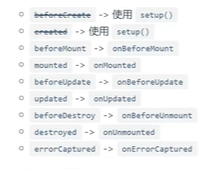

# 温故而知新 - Vue3

## 1 Vue3简介

### 1.1 性能的提升

- 打包快
- 内存占用减少
- 渲染更快

### 1.2 源码升级

- 使用Proxy代替defineProperty
- 重写虚拟DOM实现和Tree-shaking(术语表)

### 1.3 拥抱TypeScript

- Vue3可以更好的支持TypeScript

### 1.4 新的特性

1. Composition API(组合API)
    - setup配置
    - ref与reactive

## 2. 比较Vue2与Vue3的响应式(重要)

### 2.1 vue2的响应式

- 核心
    - 对象: 难过defineProperty将队形的已有属性的读取和修改进行劫持(监视/拦截)
    - 数组: 通过重写数组更新数组一些列更新元素的方法来实现元素修改的劫持
    
```js
Object.defineProperties(data, 'count', {
    get() {
    },
    set() {
    }
})
```

如果vue中对象有很多熟悉, 需要循环遍历每个属性,通过`object.defineProperties`定义每个属性的set和get,
效率较低  

vue3中只要调用相关方法就可以了,而且是深层次的建是


- 问题
    - 对象直接新添加的属性或删除已有属性,界面不会自动更新
    - 直接通过**下标替换元素或更新length**,页面不会自动更新arr[1]={}


### 2.2 Vue3的响应式

- 核心
    - 通过Proxy(代理): 拦截对data任意属性的任意(13种)操作,包括属性值的读写,属性值的添加,属性的删除等...
    - 通过Reflect(反射): 动态对被代理对象的响应属性进行特定的操作

```js
new Proxy(data,{
    //拦截数据属性值
    get(target,prop){
        return Reflect.get(target,prop);
    },
    //拦截设置属性值或添加新属性
    set(target,prop,value){
        return Reflect.set(target,prop,value)
    },
    //拦截删除属性
    deleteProperty(target,prop){
        return Reflect.deleteProperty(target, prop)
    }
})
```

//可以通过Proxy实现响应式得操作

// `handler` 包含捕获器(trap)得占位符对象,可以翻译为处理器对象

`traps` 提供属性访问得方法,这类似于操作系统种捕获器得概念

`target` 被Proxy代理虚拟化得对象,它常被作为代理得存储后端根据目标验证关于对象不可扩展性
或不可配置属性得不变量(保持不变得语义)


语法

```js
const p = new Promise(target, handler)
// taarget: 要使用Proxy包装得目标对象(可以是任何类型得对象包括原生数组,函数甚至另一个代理)
// handler: 一个通常函数作为属性得对象,各属性分别定义了各种操作时得代理p得行为
```

// Reflect是一个内置对象,它提供拦截JAvaScript得操作得方法,这些方法于`proxy handlers`得方法相同,
`Reflect`不是一个函数对象,因此它是不可构造的  
它不能通过**new运算符**对其进行调用,或者将`Reflect`对象作为一个函数调用,`Reflect`的所有属性都是**静态的**(就像`math`对象)


## console.log()的一个有意思的小坑, 

在输出对象的时候,控制台会在显示你第一次展开时候对象的数据,而不是你的书写位置


## 3 vite创建Vue3项目

//普通创建
```
npm init vite-app <project.name>
cd <project-name>
npm install    
npm run dev
```
//创建Vue3的ts项目

```text
npm create vite@latest
输入项目名称
选择Vue
选择TS
```

//安装less依赖
```text
npm add -D less
```
//安装Scss and sass 依赖
```text
npm add -D sass
```
// 自动导入
```text
npm install -D unplugin-vue-components unplugin-auto-import
```
```js
import { defineConfig } from 'vite'
import vue from '@vitejs/plugin-vue'
import { resolve } from "path";
// 自动导入vue中hook reactive ref等
import AutoImport from "unplugin-auto-import/vite"
//自动导入ui-组件 比如说ant-design-vue  element-plus等
import Components from 'unplugin-vue-components/vite';
 
// https://vitejs.dev/config/
export default defineConfig({
	plugins: [
		vue(),
		AutoImport({
			//安装两行后你会发现在组件中不用再导入ref，reactive等
			imports: ['vue', 'vue-router'],
            //存放的位置
			dts: "src/auto-import.d.ts",
		}),
		Components({
			// 引入组件的,包括自定义组件
            // 存放的位置
            dts: "src/components.d.ts",
		}),
	],
})
```
// 安装router

```
npm install vue-router@4 
```
main.ts引入
```js
import { createApp } from 'vue'
import App from './App.vue'
 
 //routes
 import router from "./routes/index"; 
 
const app= createApp(App)
 
 //routes 
 app.use(router)  
app.mount('#app')
```

在src下创建一个routes文件夹,再创建一个index.ts文件

```js
 import { createRouter, createWebHistory } from "vue-router";
 
 
let routes= [
    {
        path: '/',
        name: 'home',
        //使用import可以路由懒加载，如果不使用，太多组件一起加载会造成白屏
        component: () => import('../view/homeView.vue')
    },
    //{
        //配置404页面
        //path: '/:catchAll(.*)',
        //name: '404',
        //component: () => import(''),
    //}
]
// 路由
const router = createRouter({
    history: createWebHistory(),
    routes
})
// 导出
export default router 
```
// 安装pinia  
> 因为vue3+ts,安装pinia更好,vuex拥抱ts没有pinia好

```text
npm install pinia
```

main.ts引入

```js
import { createApp } from 'vue'
import App from './App.vue'
//pinia
import { createPinia } from 'pinia' 
const pinia = createPinia()
 
const app = createApp(App)
 
//pinia
app.use(pinia)
 
app.mount('#app')
```

### vue组合API

#### setup 与 ref  

setup是组合API的入口  

ref定义的一个响应式的数据,ref()返回的是一个ref对象,
对象中有一个value属性,如果要使用Ref对象,需要调用.value属性
html模板中是不需要使用.value写法的,  
一般用来定义一个基本类型的响应式数据

```js

import {defineComponent,ref} from 'vue'

defineComponent({
    setup(){
        //变量
        let count = ref(0)
        function updateCount(){
            count.value++
        }
        return {
            count,
            updateCount
        }
    }
})

```

**reactive的使用方式**

```html
<script setup lang="ts">
import {ref, reactive} from 'vue'
/*
* reactive 顶i有多个数据的响应式,
* const proxy = reactive(obj):接受一个普通对象然后返回改对象的响应式处理对象
* 响应式转换时"深层的":会影响对象内部所有嵌套的属性
* 内部基于ES6的Proxy实现,通过代理对象操作源对象内部数据都是响应式的
* */

//把数据变成响应式数据
//返回的是一个Proxy的代理对象,被代理者就是reactive中的传入的对象

const obj = {
  name:'小明',
  age:20,
  wife:{
    name:'小甜甜',
    age:18,
    cars:['奔驰','宝马','奥迪']
  }
}
const user = reactive(obj)

const updateUser = ()=>{
  //直接使用目标对象的方式来更新目标对象中的成员的值，是不可能的
  //只能使用代理对象的方式来更新数据（响应式数据）
  // obj.name = '++++'
  user.name= '小红'
  user.age += 2
  user.wife.name+='大'
}

</script>
```

```html
<script setup lang="ts">
import {ref, reactive} from 'vue'
/*
* reactive 顶i有多个数据的响应式,
* const proxy = reactive(obj):接受一个普通对象然后返回改对象的响应式处理对象
* 响应式转换时"深层的":会影响对象内部所有嵌套的属性
* 内部基于ES6的Proxy实现,通过代理对象操作源对象内部数据都是响应式的
* */

//把数据变成响应式数据
//返回的是一个Proxy的代理对象,被代理者就是reactive中的传入的对象

const obj:any = {
  name:'小明',
  age:20,
  wife:{
    name:'小甜甜',
    age:18,
    cars:['奔驰','宝马','奥迪']
  }
}
const user = reactive(obj)
// user ---> 代理对象
// obj ----> 目标对象

//user对象或者obj对象添加一个新的属性,哪一种方式会影响页面的更新

// user对象或者obj对象移除一个移除一个属性,哪一种方式会影响页面的更新

const updateUser = ()=>{
    
  //这种方式不会引起页面的更新
  // obj.gender = '男'

  //通过这种方式会引起页面的更新,而且这个数据也添加到obj的对象上了
  // user.gender = '男'

  //delete obj.age //界面没有了更新渲染,obj中确实没有了age这个属性

  // delete user.age ///界面更新渲染了,obj中确实没有了age这个属性

  //如果操作代理对象,目标对象中的数据也会随之变化,同时如果想要再操作数据的时候,
  //界面也要跟着渲染,也是操作代理对象
}

</script>

```
### setup在beforeCreate生命周期回调之前执行,而且就执行一次

**setup细节问题:**  

- setup执行的时机

setup是在beforeCreate生命周期回调之前就执行了,而且就执行一次  
数据初始化的生命周期回调  
由此可以推断出:setup在执行的时候,档期那的组件还没有创建出来,也就意味着,组件实例对象this根本就不能用  
this是undefined,说明,就不能通过this再去调用data/computed/methods/props中的相关内容  
其实所有的composition API(组合式API)相关回调函数中也都不可以  

- setup的返回值

set中的返回值是一个对象,内部的属性和方法是给html模板使用的  
返回对象中的属性会与data函数返回对象的属性合并成为组件对象的属性,都可以在html模板中使用  
在Vue3中尽量不要使用data和setup及methods和setup(不要混合使用):methods可以访问setup体哦那个的属性和方法,但在setup方法中不能访问data和methods(因为他比data先执行)    
setup不能是一个async函数:因为返回值不再是return的对象,而是promise,模板看不到return对象中的属性数据


- setup的参数  
setup(props,context)/setup(props,)

```js
import {defineComponent} from 'vue'
export default defineComponent({
    name:'Child',
    props:['msg'],//接收父组件传递过来的参数
    beforeCreate(){
        console.log('beforeCreate执行了')
    },
    //界面渲染完毕,
    mounted(){
        console.log(this) //这里的this是一个代理对象
    },
    setup(){
        console.log('setup执行了',this)//这里的this为undefined
        
        const showMsg1 = ()=>{
            console.log('setup中的showMsg1方法')
        }
        return {
            showMsg1,
            //setup中一般返回一个对象,对象中的属性和方法搜可以在html模板直接使用
        }
    },
    data(){
        count:10
    },
    methods:{
        showMsg(){
            console.log('methods中的showMsg方法')
        }
    }
})
```


## 4. Vue2的生命周期和Vue3的生命周期

Vue2的生命周期钩子


Vue3的生命周期  





