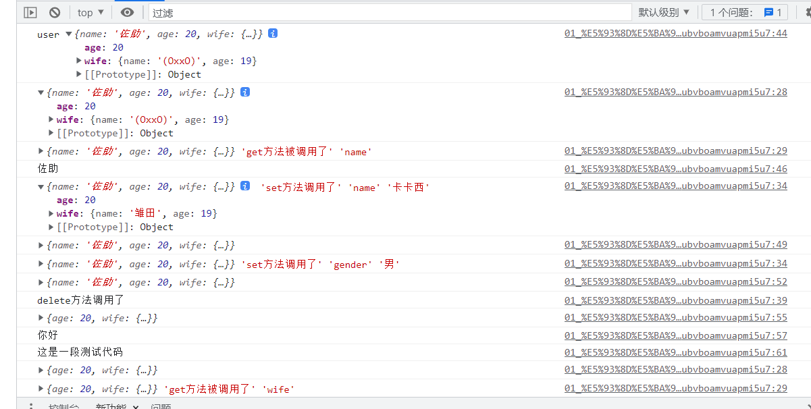

# 温故而知新 - Vue3

## 1 Vue3简介

### 1.1 性能的提升

- 打包快
- 内存占用减少
- 渲染更快

### 1.2 源码升级

- 使用Proxy代替defineProperty
- 重写虚拟DOM实现和Tree-shaking(术语表)

### 1.3 拥抱TypeScript

- Vue3可以更好的支持TypeScript

### 1.4 新的特性

1. Composition API(组合API)
    - setup配置
    - ref与reactive

## 2. 比较Vue2与Vue3的响应式(重要)

### 2.1 vue2的响应式

- 核心
    - 对象: 难过defineProperty将队形的已有属性的读取和修改进行劫持(监视/拦截)
    - 数组: 通过重写数组更新数组一些列更新元素的方法来实现元素修改的劫持
    
```js
Object.defineProperties(data, 'count', {
    get() {
    },
    set() {
    }
})
```

如果vue中对象有很多熟悉, 需要循环遍历每个属性,通过`object.defineProperties`定义每个属性的set和get,
效率较低  

vue3中只要调用相关方法就可以了,而且是深层次的建是


- 问题
    - 对象直接新添加的属性或删除已有属性,界面不会自动更新
    - 直接通过**下标替换元素或更新length**,页面不会自动更新arr[1]={}


### 2.2 Vue3的响应式

- 核心
    - 通过Proxy(代理): 拦截对data任意属性的任意(13种)操作,包括属性值的读写,属性值的添加,属性的删除等...
    - 通过Reflect(反射): 动态对被代理对象的响应属性进行特定的操作

```js
new Proxy(data,{
    //拦截数据属性值
    get(target,prop){
        return Reflect.get(target,prop);
    },
    //拦截设置属性值或添加新属性
    set(target,prop,value){
        return Reflect.set(target,prop,value)
    },
    //拦截删除属性
    deleteProperty(target,prop){
        return Reflect.deleteProperty(target, prop)
    }
})
```

//可以通过Proxy实现响应式得操作

// `handler` 包含捕获器(trap)得占位符对象,可以翻译为处理器对象

`traps` 提供属性访问得方法,这类似于操作系统种捕获器得概念

`target` 被Proxy代理虚拟化得对象,它常被作为代理得存储后端根据目标验证关于对象不可扩展性
或不可配置属性得不变量(保持不变得语义)


语法

```js
const p = new Promise(target, handler)
// taarget: 要使用Proxy包装得目标对象(可以是任何类型得对象包括原生数组,函数甚至另一个代理)
// handler: 一个通常函数作为属性得对象,各属性分别定义了各种操作时得代理p得行为
```

// Reflect是一个内置对象,它提供拦截JAvaScript得操作得方法,这些方法于`proxy handlers`得方法相同,
`Reflect`不是一个函数对象,因此它是不可构造的  
它不能通过**new运算符**对其进行调用,或者将`Reflect`对象作为一个函数调用,`Reflect`的所有属性都是**静态的**(就像`math`对象)


## console.log()的一个有意思的小坑, 

在输出对象的时候,控制台会在显示你第一次展开时候对象的数据,而不是你的书写位置



## 3 vite创建Vue3项目

//普通创建
```
npm init vite-app <project.name>
cd <project-name>
npm install    
npm run dev
```
//创建Vue3的ts项目

```text
npm create vite@latest
输入项目名称
选择Vue
选择TS
```

//安装less依赖
```text
npm add -D less
```
//安装Scss and sass 依赖
```text
npm add -D sass
```
// 自动导入
```text
npm install -D unplugin-vue-components unplugin-auto-import
```
```js
import { defineConfig } from 'vite'
import vue from '@vitejs/plugin-vue'
import { resolve } from "path";
// 自动导入vue中hook reactive ref等
import AutoImport from "unplugin-auto-import/vite"
//自动导入ui-组件 比如说ant-design-vue  element-plus等
import Components from 'unplugin-vue-components/vite';
 
// https://vitejs.dev/config/
export default defineConfig({
	plugins: [
		vue(),
		AutoImport({
			//安装两行后你会发现在组件中不用再导入ref，reactive等
			imports: ['vue', 'vue-router'],
            //存放的位置
			dts: "src/auto-import.d.ts",
		}),
		Components({
			// 引入组件的,包括自定义组件
            // 存放的位置
            dts: "src/components.d.ts",
		}),
	],
})
```
// 安装router

```
npm install vue-router@4 
```
main.ts引入
```js
import { createApp } from 'vue'
import App from './App.vue'
 
 //routes
 import router from "./routes/index"; 
 
const app= createApp(App)
 
 //routes 
 app.use(router)  
app.mount('#app')
```

在src下创建一个routes文件夹,再创建一个index.ts文件

```js
 import { createRouter, createWebHistory } from "vue-router";
 
 
let routes= [
    {
        path: '/',
        name: 'home',
        //使用import可以路由懒加载，如果不使用，太多组件一起加载会造成白屏
        component: () => import('../view/homeView.vue')
    },
    //{
        //配置404页面
        //path: '/:catchAll(.*)',
        //name: '404',
        //component: () => import(''),
    //}
]
// 路由
const router = createRouter({
    history: createWebHistory(),
    routes
})
// 导出
export default router 
```
// 安装pinia  
> 因为vue3+ts,安装pinia更好,vuex拥抱ts没有pinia好

```text
npm install pinia
```

main.ts引入

```js
import { createApp } from 'vue'
import App from './App.vue'
//pinia
import { createPinia } from 'pinia' 
const pinia = createPinia()
 
const app = createApp(App)
 
//pinia
app.use(pinia)
 
app.mount('#app')
```

### vue组合API

#### setup 与 ref  

setup是组合API的入口  

ref定义的一个响应式的数据,ref()返回的是一个ref对象,
对象中有一个value属性,如果要使用Ref对象,需要调用.value属性
html模板中是不需要使用.value写法的,  
一般用来定义一个基本类型的响应式数据

```js

import {defineComponent,ref} from 'vue'

defineComponent({
    setup(){
        //变量
        let count = ref(0)
        function updateCount(){
            count.value++
        }
        return {
            count,
            updateCount
        }
    }
})

```

**reactive的使用方式**

```html
<script setup lang="ts">
import {ref, reactive} from 'vue'
/*
* reactive 顶i有多个数据的响应式,
* const proxy = reactive(obj):接受一个普通对象然后返回改对象的响应式处理对象
* 响应式转换时"深层的":会影响对象内部所有嵌套的属性
* 内部基于ES6的Proxy实现,通过代理对象操作源对象内部数据都是响应式的
* */

//把数据变成响应式数据
//返回的是一个Proxy的代理对象,被代理者就是reactive中的传入的对象

const obj = {
  name:'小明',
  age:20,
  wife:{
    name:'小甜甜',
    age:18,
    cars:['奔驰','宝马','奥迪']
  }
}
const user = reactive(obj)

const updateUser = ()=>{
  //直接使用目标对象的方式来更新目标对象中的成员的值，是不可能的
  //只能使用代理对象的方式来更新数据（响应式数据）
  // obj.name = '++++'
  user.name= '小红'
  user.age += 2
  user.wife.name+='大'
}

</script>
```

```html
<script setup lang="ts">
import {ref, reactive} from 'vue'
/*
* reactive 顶i有多个数据的响应式,
* const proxy = reactive(obj):接受一个普通对象然后返回改对象的响应式处理对象
* 响应式转换时"深层的":会影响对象内部所有嵌套的属性
* 内部基于ES6的Proxy实现,通过代理对象操作源对象内部数据都是响应式的
* */

//把数据变成响应式数据
//返回的是一个Proxy的代理对象,被代理者就是reactive中的传入的对象

const obj:any = {
  name:'小明',
  age:20,
  wife:{
    name:'小甜甜',
    age:18,
    cars:['奔驰','宝马','奥迪']
  }
}
const user = reactive(obj)
// user ---> 代理对象
// obj ----> 目标对象

//user对象或者obj对象添加一个新的属性,哪一种方式会影响页面的更新

// user对象或者obj对象移除一个移除一个属性,哪一种方式会影响页面的更新

const updateUser = ()=>{
    
  //这种方式不会引起页面的更新
  // obj.gender = '男'

  //通过这种方式会引起页面的更新,而且这个数据也添加到obj的对象上了
  // user.gender = '男'

  //delete obj.age //界面没有了更新渲染,obj中确实没有了age这个属性

  // delete user.age ///界面更新渲染了,obj中确实没有了age这个属性

  //如果操作代理对象,目标对象中的数据也会随之变化,同时如果想要再操作数据的时候,
  //界面也要跟着渲染,也是操作代理对象
}

</script>

```
### setup在beforeCreate生命周期回调之前执行,而且就执行一次

**setup细节问题:**  

- setup执行的时机

setup是在beforeCreate生命周期回调之前就执行了,而且就执行一次  
数据初始化的生命周期回调  
由此可以推断出:setup在执行的时候,档期那的组件还没有创建出来,也就意味着,组件实例对象this根本就不能用  
this是undefined,说明,就不能通过this再去调用data/computed/methods/props中的相关内容  
其实所有的composition API(组合式API)相关回调函数中也都不可以  

- setup的返回值

set中的返回值是一个对象,内部的属性和方法是给html模板使用的  
返回对象中的属性会与data函数返回对象的属性合并成为组件对象的属性,都可以在html模板中使用  
在Vue3中尽量不要使用data和setup及methods和setup(不要混合使用):methods可以访问setup体哦那个的属性和方法,但在setup方法中不能访问data和methods(因为他比data先执行)    
setup不能是一个async函数:因为返回值不再是return的对象,而是promise,模板看不到return对象中的属性数据


- setup的参数  
setup(props,context)/setup(props,{attrs,slots,emit})  
  props:包含props配置生命且传入了所有属性的对象
  attrs: 包含没有在props配置中声明的属性的对象,相当于this.$attrs  
  slots:包含所有传入的插槽内容的对象,相当于this.$slots  
  emit: 用啊来分发自定义事件的函数,相当于this.$emit
  

```js
import {defineComponent} from 'vue'
export default defineComponent({
    name:'Child',
    props:['msg'],//接收父组件传递过来的参数
    beforeCreate(){
        console.log('beforeCreate执行了')
    },
    //界面渲染完毕,
    mounted(){
        console.log(this) //这里的this是一个代理对象
    },
    setup(props,context){
        //props参数,是一个对象,里面有父级组件向子级组件传递的数据,
        // 并且是在子级组件中使用props接受到所有的属性
        // 不包含props配置声明且传入了所有属性的对象
        console.log(props)
        //context参数,是一个对象,里面有attrs对象(获取当前组件标签上所有的属性,但是该属性是在props没有声明接受的所有),emit方法(分发事件的),slots对象(插槽)
        console.log(context.attrs)
        console.log(context.emit)
        console.log('setup执行了',this)//这里的this为undefined
        
        const showMsg1 = ()=>{
            console.log('setup中的showMsg1方法')
        }
        return {
            showMsg1,
            //setup中一般返回一个对象,对象中的属性和方法搜可以在html模板直接使用
        }
    },
    data(){
        count:10
    },
    methods:{
        showMsg(){
            console.log('methods中的showMsg方法')
        }
    }
})
```

### reactive 和 ref 的细节问题

- reactive 与 ref 是Vue3的composition中2各最重要的响应式API
- ref用来处理基本数据类型,reactive用来处理对象(递归深度响应式)
- 如果用ref对象/数组,内部会自动将对象/数组转换成reactive代理对象
- ref内部:通过给value属性添加getter/setter来实现对数据的劫持
- reactive内部: 通过使用Proxy来实现对象内部所有数据的劫持,并通过Reflect操作对象内部数据
- ref是的数据操作: 子啊js中要.value.在模板中不需要(内部解析模板是会自动添加.value)

```ts
  import {defineComponent,ref,reactive} from "vue";
  export default defineComponent({
    name:'App',
    setup(){
      //通过ref的方式设置的数据
      const m1 = ref('abc')
      const m2 = reactive({
        name:'小明',
        wife:{
          name:'小红',
          age:'34'
        }
      })
      //r
      const m3 = ref({
        name:'小明',
        wife:{
          name:'小红',
          age:'34'
        }
      })
      const update=()=>{
        m1.value += '==='
        m2.wife.name +='1'
        m3.value.name += '==='
        m3.value.wife.name += 'k'
      }
      return{
        m1,m2,m3,update
      }

    }
  })
```


## 计算属性与监视

- compute函数
  - 与computed配置功能一致
  - 只有getter
  - 有getter和setter
  
- watch函数
  - 与watch配置功能一致
  - 监视指定的一个或多个响应式数据, 一旦数据变化,就自动执行监视回调
  - 默认初始时不执行回调,但可以通过immediate为true,来指定初始时立即执行第一次
  - 通过deep为true,来指定深度监视
  
- watchEffect函数
  - 不用直接指定要监视的数据,回调函数中是哟个的哪些响应式数据就监视哪些响应式数据
  - 某人初始时会执行第一次,从而可以手机需要监视的数据
  - 监视数据发生时回调
  


## 4. Vue2的生命周期和Vue3的生命周期

Vue2的生命周期钩子


Vue3的生命周期  


不同之处: 

vue2的生命周期到vue3中仍然可以使用,  

vue中的生命周期函数 过渡到 Vue3 都变成`onXXX`  
vue3去掉了vue2中的`beforeCreate和created`新增了`setup`  
vue3中使用生命周期都是使用组合API的形式去使用  
而vue2中是对象中函数的方式去使用  

vue2中的`destory`和`beforeDestory`在vue3中更名为`unMounted`和`beforeUnmounte`  

vue3中`setup`取代的是`beforeCreate`和`Created`

vue2和vue3生命周期同时使用的时候, vue3会比vue2早执行

## 自定义Hook函数

## toRefs

toRefs可以把一个响应式对象转换成为普通对象  
该属性对象的属性都是ref

应用:当从合成函数返回响应式对象时,toRefs非常有用,这样消费组件就可以在不丢失响应式的情况下对然会的对象进行分解使用


问题: reactive对象取出的所有属性值都是非响应式的  
解决: 利用`toRefs`可以将一个响应式的`reactive`对象的所有原始属性转换为响应式的`ref`属性
```html
<template>
  <h2>toRefs的使用</h2>
  <h3>name:{{name}}</h3>
  <h3>age:{{age}}</h3>
</template>
<script lang="ts">

import {defineComponent, reactive,toRefs} from "vue";

export default defineComponent({
  name:'App',
  setup(){
    const state = reactive({
      name:'自来也',
      age:47
    })

    //toRefs可以把一个响应式对象转换成为普通对象
    // 该普通对象的每个属性都是ref
    // const state2 = toRefs(state)
    const {name,age} = toRefs(state)

    setInterval(()=>{
      // state2.age.value ++
      age.value++
      console.log('玛瑞奥')
    },2000)
    return{
      // ...state2 //不是响应式的数据了 ---> {name:'自来也',age:'47'}
      name,
      age
    }
  }
})

</script>

```

## ref获取元素

利用ref函数获取组件中的标签元素  
功能需求:让输入框自动获取焦点  
```html
<template>
  <h2>ref的另一个作用</h2>
  <input type="text" ref="inputRef">
</template>
<script lang="ts">
import {defineComponent, onMounted, ref} from "vue";

export default defineComponent({
  name: 'App',
  setup(){
    //默认是空的,页面加载完毕,说明组件已经存在,获取文本框元素
    const  inputRef = ref<HTMLElement | null>(null)

    onMounted(()=>{
      inputRef.value && inputRef.value.focus()
    })

    return {
      inputRef
    }
  }


})

</script>
```

## Composition API (其他部分)

### shallowRef 和 shallowReactive

shallowRef 和 shallowReactive 只是做了浅的劫持,对象里面的参数并没有使用proxy进行代理

一般情况下使用ref 和 reactive 就能解决大部分情况  

如果有一个对象结构比较深,但变化是只是外层数据变化 ===> shallowReactive  
如果有一个对象数据,后面会产生新的对象来替换 ===> shallowRef

```html
<template>
  <h2>shallowRef和shallowReactive的使用 </h2>
  <div>{{m1}}</div>
  <div>{{m2}}</div>
  <div>{{m3}}</div>
  <div>{{m4}}</div>
  <hr>
  <button @click="update">更新数据</button>
</template>
<script lang="ts">
import {defineComponent, reactive, shallowReactive, shallowRef,ref} from "vue";

export default defineComponent({
  name:'App',
  setup(){
    //深度劫持(深监视) --- 深度响应式
    const m1 = reactive({
      name:'名人',
      age:20,
      car:{
        name:'本',
        color:'red'
      }
    })
    // 浅劫持(浅监视) --- 浅响应式
    const m2 = shallowReactive({
      name:'名人',
      age:20,
      car:{
        name:'本',
        color:'red'
      }
    })
    //深劫持 --- 做了reactive的处理
    const m3 = ref({      name:'名人',
      age:20,
      car:{
        name:'本',
        color:'red'
      }})
    //浅劫持 --- 没有做代理
    const m4 = shallowRef({      name:'名人',
      age:20,
      car:{
        name:'本',
        color:'red'
      }})
    const update = ()=>{
      // 更改m1的数据
      // m1.name += '+++'
      // m1.car.name += '=='
      // 更改m2的数据
      // m2.name += '+++'
      // m2.car.name += '=='
      // 更改m3的数据
      // m3.value.car.name += '--'
      // 更改m4的数据
      m4.value.car.name += '***'
    }
    return {
      m1,
      m2,
      m3,
      m4,
      update
    }
  }
})


</script>
```


### readonly  和 shallowReadonly

readonly 是深度只读数据,获取一个对象(响应式对象或纯对象)或ref(并返回原始代理的只读代理)  
只读代理是深层的: 访问任何嵌套 property 也是只读的

shallowReadonly  浅只读数据  
创建一个代理,使其自身的property为只读,但不执行任何嵌套对象的深度只读转换

应用场景  
在某些特定情况下,我们可能不希望对数据进行更新操作,那就可以包装生成一个只读的对象来读取数据,而不能修改或删除
```html
<template>

  <h2>readonly 和 shallowReadonly</h2>
  <h3>state:{{state2}}</h3>
  <hr>
  <button @click="update">更新数据</button>

</template>
<script lang="ts">
import {defineComponent, reactive,readonly,shallowReadonly} from "vue";

export default defineComponent({
  name: 'App',
  setup(){

    const state = reactive({
      name:'佐助',
      age:20,
      car:{
        name:'bem',
        color:'red'
      }
    })

    //只读的数据 -- 深度的只读
    // const state2 = readonly(state)

    //只读的只读  -- 浅只读
    const state2 = shallowReadonly(state)
    const update = ()=>{
        // state2.name = 'kakaxi';

        state2.car.name = 'kakaxi';
    }
    return {
      state2,
      update
    }
  }
})


</script>
```

### toRaw 与 markRaw 

- toRaw 
  - 返回有`reactive`或`readonly`方法转换成响应式代理的普通对象
  - 这是一个还原方法,可以用于临时读取,访问不会被代理/跟踪,写入时也不会触发界面更新
  
- markRaw
  - 标记一个对象,使其永远不会转换为代理对象,返回对象本身
  - 应用场景:
    - 有些值不应该设置为响应式的,, 例如复杂的第三方类实例或Vue组件对象
    - 当渲染具有不可变数据的大列表时,跳过代理转换可以提高性能
  

```html
<template>

  <h2>toRaw 和 markRaw </h2>
  <h3>state:{{state}}</h3>
  <hr>
  <button @click="testToRaw">测试toRaw</button>
  <button @click="testMarkRaw">测试markRaw</button>
</template>
<script lang="ts">
import {defineComponent,toRaw,markRaw, reactive} from "vue";
import ts from "typescript/lib/tsserverlibrary";
import LogLevel = ts.server.LogLevel;

export default defineComponent({
  name: 'App',
  setup(){
    const state = reactive({
      name:'佐助',
      age:20,
      car:{
        name:'bem',
        color:'red'
      }
    })

    const testToRaw = ()=>{
      //把代理对象变成普通对象
      const user = toRaw(state)
      user.name += '=='
      // state.age = 32
      console.log('nihao')
    }

    const testMarkRaw = ()=>{
      console.log('buhao')
      const likes = ['不想学了', '回家']
      state.likes = markRaw(likes)
      setInterval(
          ()=>{
            state.likes[0] += '1'
            console.log(state.car)
          },1000
      )
    }

    return {
      state,
      testToRaw,
      testMarkRaw
    }
  }
})


</script>
```

### toRef的使用及特点

toRef()  
基于响应式对象的一个属性,创建一个对应的ref,这样创建的ref与其源属性保持同步:改变源属性的值将更新ref的值,
反之亦然
```html
<script setup>
import { toRef } from 'vue'

const props = defineProps(/* ... */)

// 将 `props.foo` 转换为 ref，然后传入
// 一个组合式函数
useSomeFeature(toRef(props, 'foo'))
</script>

```

```html
<template>
  <h2>toRef的使用及特点</h2>
  <h3>{{age}}</h3>
  <h3>{{money}}</h3>
  <button @click="update">更新数据</button>
</template>
<script lang="ts">
import {defineComponent,reactive,toRef,ref} from "vue";

export default defineComponent({
  name:'App',
  setup(){
    const state = reactive({
      name:'佐助',
      age: 45,
      money:100
    })

    //把响应式的state对象中的某个属性age变成了ref对象了
    const age = toRef(state,'age')
    // 把响应式对象的某个属性使用ref进行包装
    const money = ref(state.money)

    const update = ()=>{
      //更新数据的
      // state.age += 2;
      // age.value += 2;
      // money.value += 10
    }
    return {
      state,
      age,
      money,
      update
    }

  }
})


</script>
<style scoped>
</style>
```


当 toRef 与组件 props 结合使用时，关于禁止对 props 做出更改的限制依然有效。
尝试将新的值传递给 ref 等效于尝试直接更改 props，这是不允许的。
在这种场景下，你可能可以考虑使用带有 get 和 set 的 computed 替代


toRef  和 toRefs 和 ref的区别  

ref():接受一个内部值，返回一个响应式的、可更改的 ref 对象，此对象只有一个指向其内部值的属性 `.value`。
这个API相当于把源数据复制一份,对源数据操作不会产生影响

toRef(): 接受两个值, 一个是对象的值,另一个是需要做响应式的属性,如 `const ak = toRef(prop, key)`,
当对源数据操作会对`ak`产生影响, 反之亦然

roRefs(): 将一个响应式对象转换为一个普通对象，这个普通对象的每个属性都是指向源对象相应属性的 ref。每个单独的 ref 都是使用 `toRef()` 创建的。

### customRef (用户自定义的ref)

`customRef` 创建一个自定义的ref,显示声明对其依赖追踪和更新触发的控制方式

类型:
```ts
function customRef<T>(factory: CustomRefFactory<T>): Ref<T>

type CustomRefFactory<T> = (
  track: () => void, // 追踪数据变化
  trigger: () => void // 通知Vue去重新解析模板
) => {
  get: () => T
  set: (value: T) => void
}
```
`customRef()`预期接收一个工厂函数作为参数,这个工厂函数接受`track`和`trigger`两个参数作为参数,并返回一个带有`get`和`set`方法的对象

一般来说，track() 应该在 get() 方法中调用，而 trigger() 应该在 set() 中调用。然而事实上，你对何时调用、是否应该调用他们有完全的控制权。


### provide 与 inject

- provide 和 inject 提供依赖注入,功能类似于 2.x的provide/inject
- 实现跨层级组件(祖孙)间通信

```ts 
//祖宗组件

import {defineComponent, provide, ref} from "vue";
import Son from "./components/Son.vue";
export default defineComponent({
  name: 'App',
  components:{
    Son
  },
  setup() {
    //响应式的树
    const color = ref('red')
    //提供数据
    provide('color',color)
    return {
      color
    }
  }

})

```

```ts
//孙子组件, 接受数据
import {defineComponent, inject} from "vue";

export default defineComponent({
  name:'GrandSon',
  setup(){
    //注入数据
    const color = inject('color')

    return {
      color
    }
  }
})
```

### 响应式数据判断

- `isRef`: 检查一个值是否是一个ref对象
- `isReactive`: 检查一个对象是否由`reactive`创建的响应式代理
- `isReadonly`: 检查一个对象是否由`readonly`创间的只读代理
- `isProxy`: 检查一个对象是否由`reactive`或者`readonly`方法创建的代理
